# OpenClaw Robotic Arm Precision Placement
**OpenClaw Robotic Arm Precision Placement**

1. Course Content

Course Overview

Learning Objectives

2. Preparation

3. Robotic Arm Precise Placement Use Case

4. Source Code Analysis


5. Parameter Debugging

6. Functionality Q&A

### 6.1 How do I adjust the distance between the robot chassis and the target placement point?

### 6.2 How do I adjust the placement position if it is inaccurate? **Checklist (in order):**

## 1. Course Content
**Course Overview**


This course explains the complete technical process of using OpenClaw to control an M3Pro robot to

achieve precise placement of the robotic arm. The course covers all aspects from natural language

understanding, visual point recognition, 3D coordinate transformation to precise robotic arm

placement, including Dify visual agent invocation and inverse kinematics (IK) solving.


**Learning Objectives**


Master the technical workflow for using OpenClaw to control a robotic arm for precise object placement

via natural language instructions.


Understand the role of the Dify Vision Agent in identifying target locations and how to invoke it.


verify if it falls within the robotic arm's reachable workspace.
## 2. Preparation
Start the MicroROS chassis agent (skip this step if it is already running).


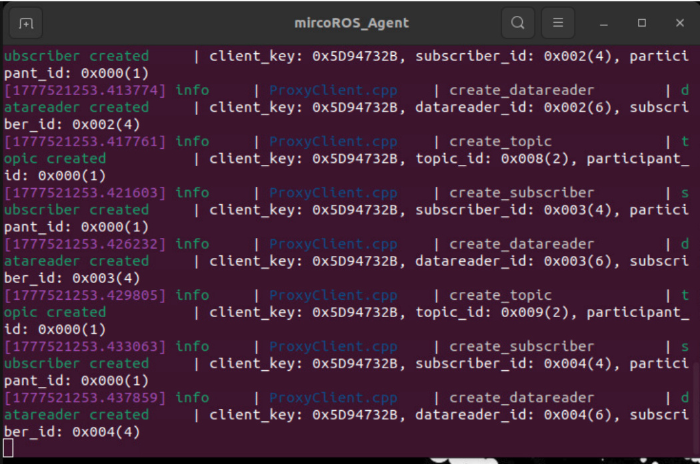

Launch the odometry, TF, robotic arm auxiliary, camera, and other relevant nodes.

```
ros2 launch m3pro_bringup car_base.launch.py

```

Start the MCP service.


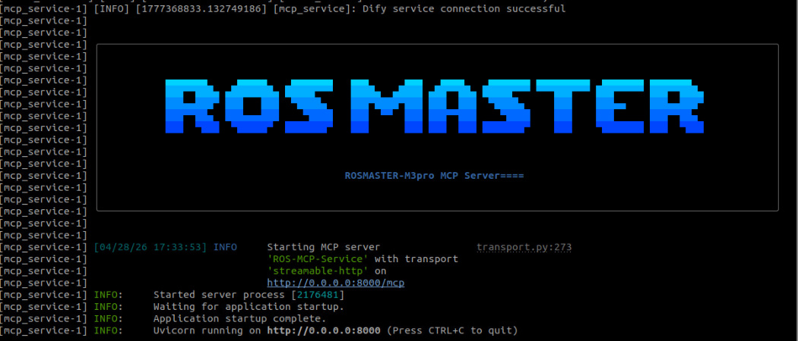

can be skipped.


## 3. Robotic Arm Precise Placement Use Case
**Tip**


You may formulate commands according to your specific needs; the following serves as a

demonstration. You may choose any interaction method you prefer; this example uses the

WebChat interface for the demonstration.


|Command|Parameters|Function|
|---|---|---|
|GetPlacePoint|`--query`|Locates the coordinates of a placement target and checks<br>if it lies within the robotic arm's reachable workspace.|
|Place|`--place-x`,`--place-`<br>`y`,`--place-z`|Places an object at the specified coordinate position.|


field of view, based on a natural language description. For example: Place the grasped orange block

between the red and blue blocks located in front of you.


When obtaining a placement point, a verification image is automatically generated to facilitate

debugging and to verify the accuracy of the placement coordinates. The image path is:


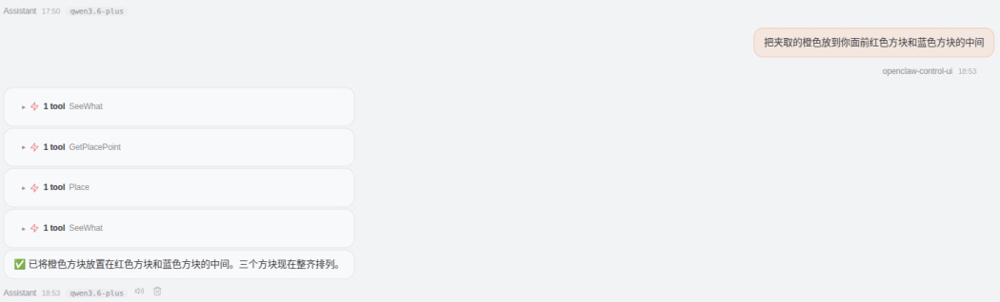


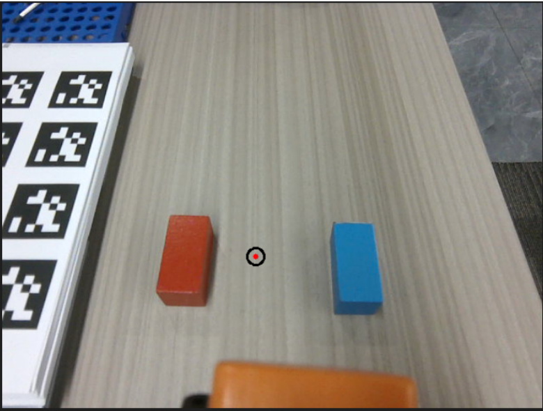
## 4. Source Code Analysis
Source Code Path


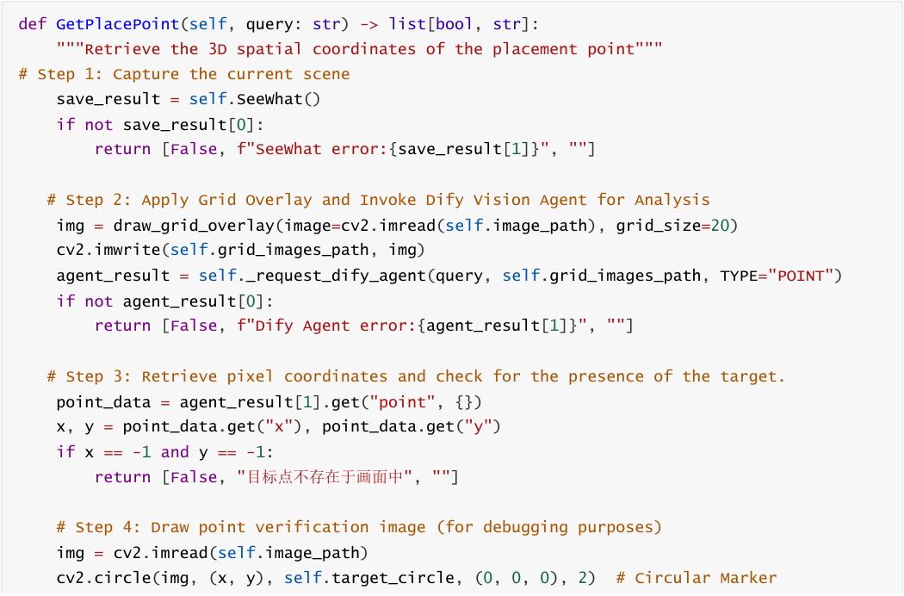
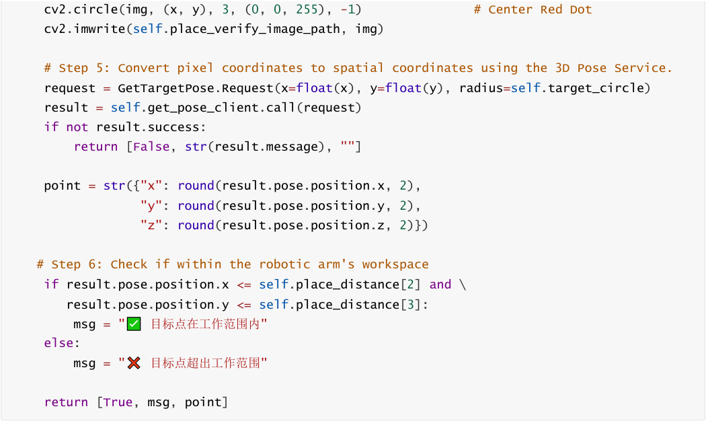


**Process Description:**


1. First, capture the current scene and overlay a 20px grid reference (to facilitate positioning by the Dify

Vision Model).


2. Invoke the Dify Vision Agent to parse natural language instructions and return the pixel coordinates (x,

y) for the placement location.


3. If `(-1, -1)` is returned, it indicates that the target is not present in the scene; an error is returned

immediately.


target area and a red dot to mark its center, to aid in debugging.


whether the target point lies within the robotic arm's workspace.


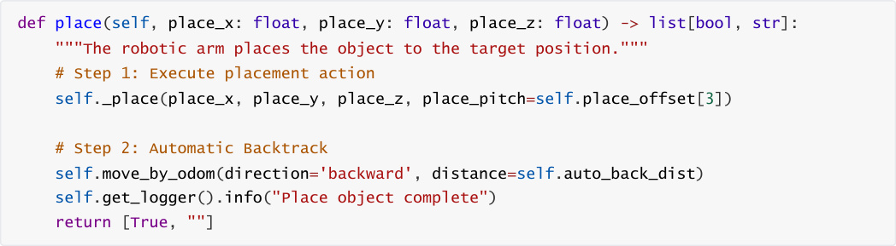


**Process Description:**


1. **Invoke Internal Placement Method:** Pass the target placement coordinates ( `place_x`, `place_y`,


(pitch angle).


prevent collisions between the robotic arm and the placement platform.

### 4.3 _place()  — Execute Placement Action (Internal Method)


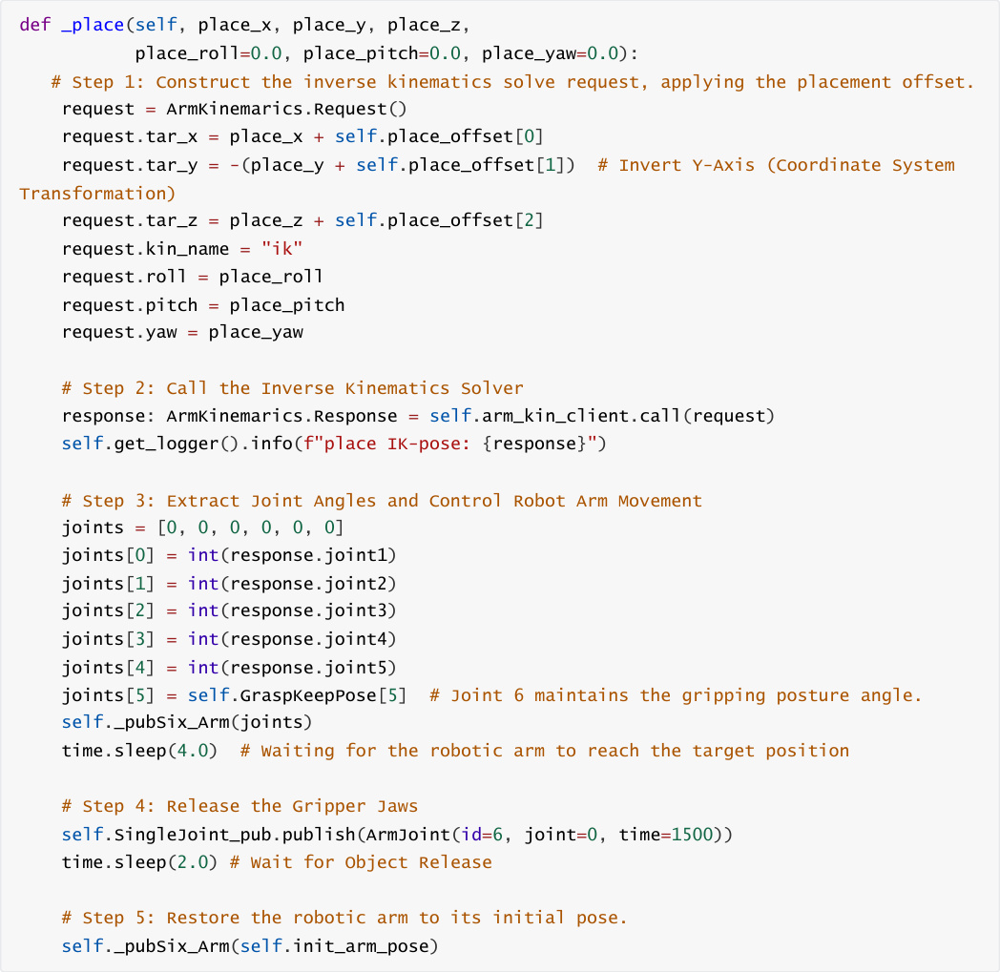


**Code Explanation:**


1. **Offset Superposition:** The `place_offset` (x/y/z) is superimposed onto the target placement

coordinates to fine-tune the exact placement position.


the six joint angles required to achieve the target pose.


robotic arm to move to the designated placement location.


4. **Object Release:** Controls the 6th joint (the gripper) to open (joint=0), thereby releasing the grasped

object.


to restore the robotic arm to its initial pose, preventing interference with subsequent operations.


**Key Parameter Descriptions:**


released slightly above the target surface during placement.


(default: 1.3 rad).

## 5. Parameter Debugging
Parameter File Path:


The following table outlines the correspondence between the parameters and the code:


|Parameter|Location in Code|Function Description|
|---|---|---|
|`place_distance`|`GetPlacePoint()` →<br>`self.place_distance[2]/[3]`|XYZ coordinates for the placement<br>position, and tolerance check for<br>the robot arm's workspace (` [2]`  is<br>the X upper limit;`[3]`  is the Y<br>upper limit).|
|`place_offset`|`_place()` →<br>`self.place_offset[0]/[1]/[2]/[3]`|Placement position offset, used for<br>fine-tuning the placement<br>coordinates.|
|`auto_back_dist`|`pick()` ,`place()` →<br>`self.auto_back_dist`|Automatic retreat distance after<br>completing a pick/place operation,<br>to avoid collisions and prevent<br>entry into restricted zones within<br>the costmap.|
|`target_circle`|`GetPlacePoint()`  /<br>`_get_pick_target_pose()` →<br>`self.target_circle`|The sampling radius (in pixels) of<br>the circular region used to calculate<br>the 3D pose when determining<br>target point coordinates.|


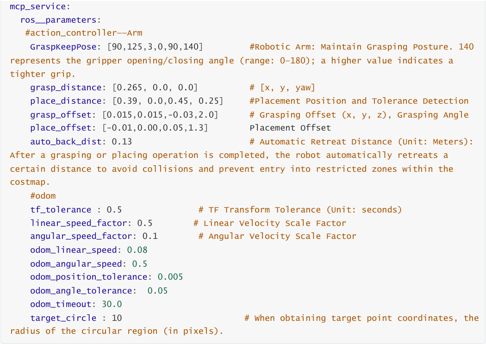


## 6. Functionality Q&A
### 6.1 How do I adjust the distance between the robot chassis and the
**target placement point?**


If the target point falls outside the robotic arm's working range, OpenClaw will call

`AdjustChassisFitArmRange` to adjust the chassis position, thereby bringing the target point within the arm's

reachable range:


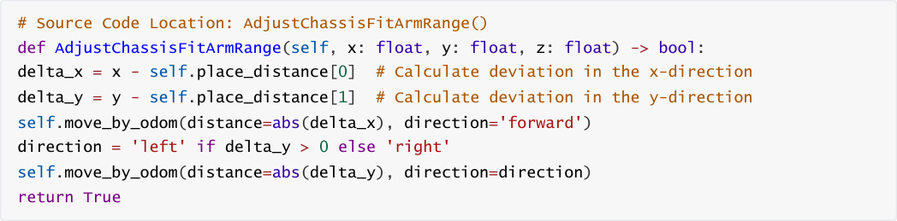


**Adjustment Method** :


working range.

### 6.2 How do I adjust the placement position if it is inaccurate?
**Checklist (in order):**


1. **Is the Dify model recognition accurate?**


are located at the expected positions.


If the recognition is inaccurate, refine the natural language description or switch to a different Dify

vision model.


2. **Is the placement offset appropriate?**


parameters.


X/Y-axis offsets follow the robot's right-hand coordinate system; for the Z-axis, it is recommended to

maintain a positive value.


3. **Is ambient lighting interfering with the depth camera?**


Missing depth data will result in inaccurate 3D coordinate transformations.


Improve the ambient lighting conditions or adjust the position of the object.


Parameter Configuration Example


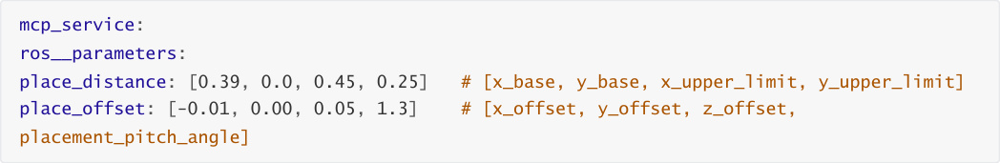


**Important Notes:**


⚠️ When adjusting offsets, adhere to the principle of **small increments and iterative testing** to avoid large,

sudden adjustments that could lead to collisions.

⚠️ Adjust parameters for only one axis/direction at a time to accurately assess the impact of each adjustment.

⚠️ Record the parameter values and test results for every adjustment to build a comprehensive parameter **​**

tuning log.
