# OpenClaw Garbage Sorting
**OpenClaw Garbage Sorting**

1. Course Content

Learning Objectives

2. Preparation

3. Robotic Arm Garbage Sorting Case

4. yolov26-OBB Garbage Recognition Node

5. Source Code Analysis

### 5.1 GetWasteRecognitionResults — Get Waste Recognition Results

### 5.2 GraspWaste — Grasp Target Waste

### 5.3 PlaceWaste — Place Waste

### 5.6 waste_classify Detection Node — YOLO Inference Thread

6. Parameter Tuning

### 6.1 Garbage Sorting Grasp Parameters

### 6.2 YOLO Model Detection Parameters

## 1. Course Content
**Learning Objectives**


Understand the application and configuration of the yolov26-OBB model in garbage

detection

Learn to use GetWasteRecognitionResults, GraspWaste, PlaceWaste tools to complete

garbage sorting tasks

Master the adjustment of key parameters such as waste_grasp_offset and

waste_grasp_distance to optimize grasping accuracy
## 2. Preparation
Start the MicroROS chassis agent (no need to restart if already started)


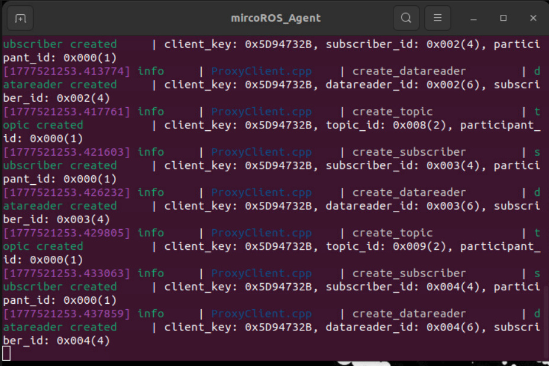

Start odometry, tf, robotic arm assistance, camera nodes, etc.


Start the MCP service


If you need voice reply, you need to start openclaw_bridge additionally, otherwise it can be

omitted


## 3. Robotic Arm Garbage Sorting Case
[!TIP]


You can write commands according to your own needs. The following is a case

demonstration. Choose any interaction method. Here we take the web-based WebChat

as an example.


|Tool|Parameters|Function|
|---|---|---|
|GetWasteRecognitionResults|None|Get YOLO model garbage recognition<br>results|
|GraspWaste|--`waste`-<br>`name`|Grasp waste object|
|PlaceWaste|None|Place waste object|


Grasp the recyclable waste in front of you (you can also directly specify a specific waste)


Garbage recognition here is performed using the yolov26-OBB model. The first startup has a

cold start delay, requiring the yolo model to be loaded first.

After loading, the model automatically unloads after 240 seconds to save memory and

CPU resources (configurable duration)


After the model is loaded, the garbage detection window automatically starts, displaying the

recognition results


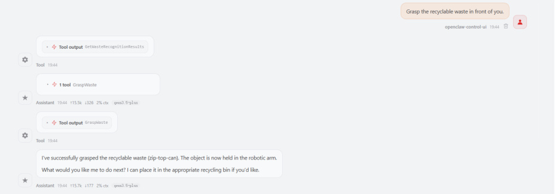

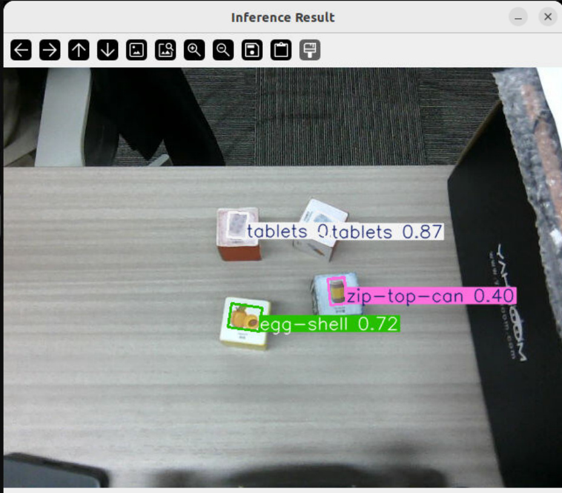
OpenClaw first obtains the yolo garbage recognition results through

GetWasteRecognitionResults. When obtaining the results, the recognition frame image is

automatically saved to the path:


We can also directly view the garbage detection results through the robot-control CLI

(suitable for debugging)


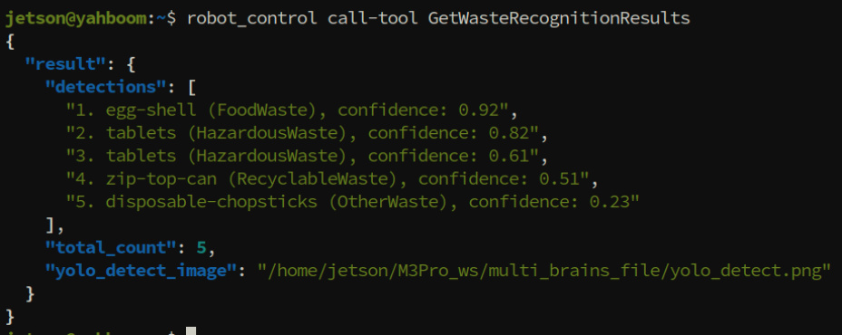

Then OpenClaw calls the GraspWaste tool to grasp the target waste block


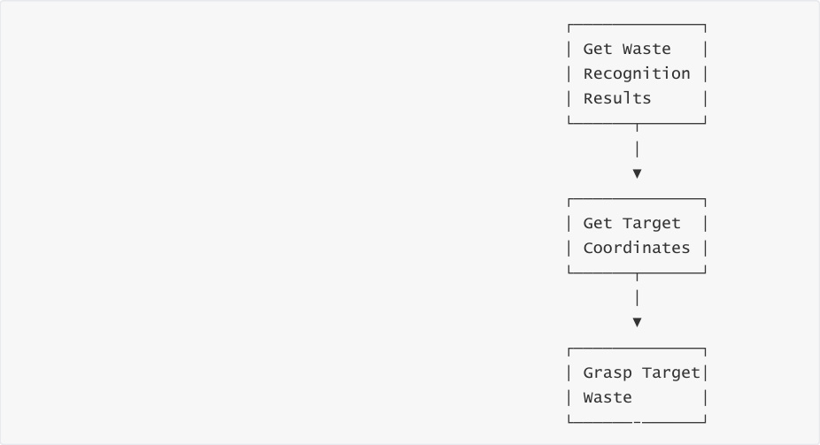


Target grasping skills

OpenClaw controls the robot to grasp the target object by first reading the robotic arm

grasping and garbage sorting skills, following the SOP workflow

Skill reference: [08-openclaw skills development]


Waste placement: to adapt to different trash bins, the placement tool uses action groups to

complete the placement action (can be customized through configuration parameters)

## 4. yolov26-OBB Garbage Recognition Node
Garbage detection is an independent program node. When starting the MCP service, the

garbage detection node starts automatically. To reduce CPU and memory usage, detection is

disabled by default at startup


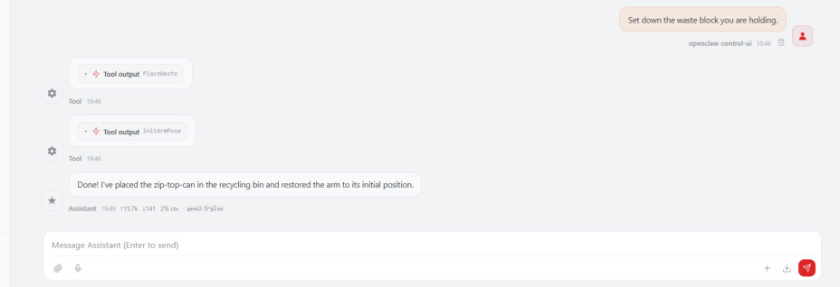

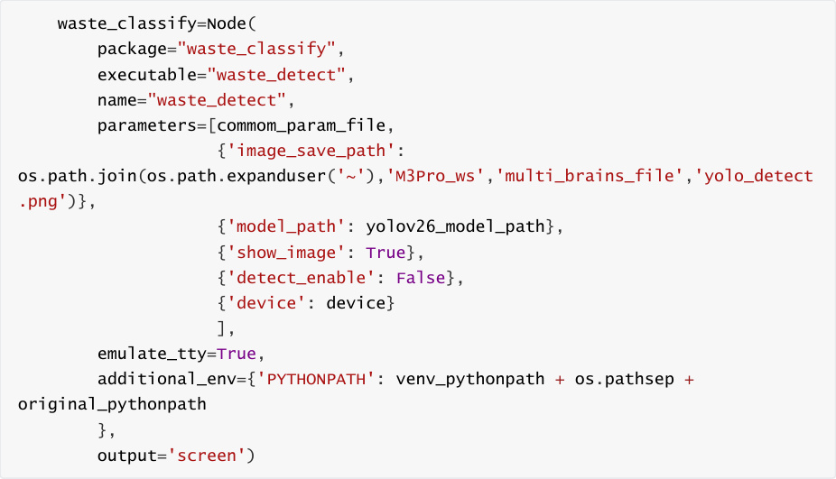


After the MCP service node starts, we can manually control the start/stop of the detection

function through ROS services (suitable for debugging). The waste_classify node provides the

following three services

Query current status (operation=0)


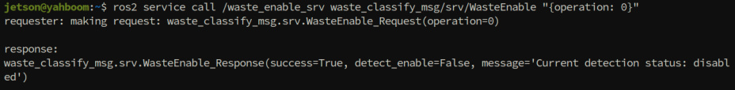
Enable garbage detection (operation=1)


The waste_classify node publishes detection results to the /waste_detecttions topic during

detection. You can view topic data with the following command


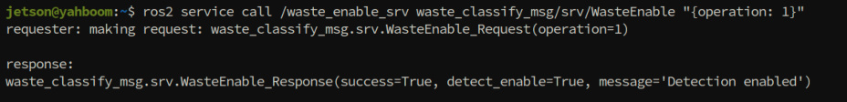


Reference topic data


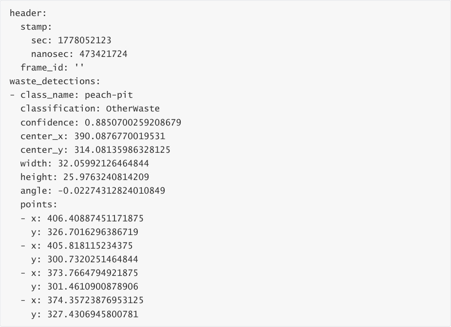


**Topic Data Field Descriptions** :


|Field|Type|Description|
|---|---|---|
|`header.stamp`|time|Timestamp of detection result (sec: seconds,<br>nanosec: nanoseconds)|
|`waste_detections`|WasteItem[]|List of detected waste objects (may contain multiple<br>targets)|
|`class_name`|string|Specific category name of the waste (e.g., peach-pit,<br>banana-peel, etc.)|
|`classification`|string|Waste classification type (Recyclable, KitchenWaste,<br>OtherWaste, HazardousWaste)|
|`confidence`|float|Detection confidence (0.0~1.0), higher values<br>indicate the model is more certain|
|`center_x`|float|X coordinate of detection box center (pixel units,<br>relative to image top-left)|
|`center_y`|float|Y coordinate of detection box center (pixel units,<br>relative to image top-left)|
|`width`|float|Width of detection box (pixel units)|
|`height`|float|Height of detection box (pixel units)|
|`angle`|float|Rotation angle of detection box (radians), OBB<br>model specific parameter indicating object<br>orientation|
|`points`|Point2D[]|4 vertex coordinates of the rotated box (clockwise or<br>counter-clockwise), used for precise object<br>boundary description|


**Key Concept Descriptions** :


1. **OBB (Oriented Bounding Box)** : Unlike traditional rectangular boxes, OBB can rotate to

better fit the actual shape of objects, especially suitable for irregular objects

2. **Angle** : Indicates the rotation angle of the object relative to the horizontal direction. **The**

**robotic arm adjusts the gripper direction based on this angle during grasping** to ensure

optimal grasping

3. **Points (Vertex Coordinates)** : The 4 vertices precisely describe the boundary of the rotated

box, which can be used to calculate the actual size and position of the object


Disable detection (operation=2)


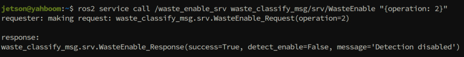
## 5. Source Code Analysis
Source path


### 5.1 GetWasteRecognitionResults — Get Waste Recognition
**Results**


**Function Description** : Calls the YOLO model for garbage detection, obtaining recognition results

for all waste in the current view, including category, confidence, position, and other information.

```
 def GetWasteRecognitionResults(self) -> list:

    '''Get YOLO waste recognition results'''

    from multi_brains_pre.message.mcp_message import waste_recognition_result

    if not self.waste_enable_client.wait_for_service(timeout_sec=8.0) or not

 self.get_waste_client.wait_for_service(timeout_sec=8.0):

      msg = "GetWaste service not available"

      self.get_logger().error(Fore.YELLOW + msg + Fore.RESET)

      return [False, msg]

    self._pubSix_Arm([90,90,50,-30,90,0])

    time.sleep(3.0)

    #TODO: waste detection causes high CPU usage; enable detection only when

 needed, and disable after getting results

    response:WasteEnable.Response =

 self.waste_enable_client.call(WasteEnable.Request(operation=0))

    if not response.detect_enable:

      response:WasteEnable.Response =

 self.waste_enable_client.call(WasteEnable.Request(operation=1)) #enable waste

 detection

      if not response.success:

        msg = "Failed to enable waste detection"

        self.get_logger().error(Fore.RED + msg + Fore.RESET)

        return [False, msg]

      time.sleep(10.0)#wait for first waste detect

    response:GetWaste.Response=self.get_waste_client.call(GetWaste.Request())

    if not response.success:

      msg = response.message

      self.get_logger().error(Fore.RED + msg + Fore.RESET)

      return [False, msg]

    if len(response.waste_detections) == 0:

      msg = "No waste detected"

      self.get_logger().warn(Fore.YELLOW + msg + Fore.RESET)

      return [False, msg]

    result_lines = []

    for i, item in enumerate(response.waste_detections, 1):

      result_lines.append(

        f"{i}. {item.class_name} ({item.classification}), "

        f"confidence: {item.confidence:.2f}")

```

```
    result = waste_recognition_result(

      detections=result_lines,

      total_count=len(response.waste_detections),

      yolo_detect_image=response.image_path)

    return [True, result]

```

**Process Description** :


second timeout)


to the predefined detection pose, wait 3 seconds for stabilization

3. **Start/Stop Detection** :


Query current detection status (operation=0)

If not started, enable detection (operation=1), wait 10 seconds for first detection to

complete


5. **Result Processing** : Iterate through all detected waste, format output (category,

classification, confidence)


6. **Return Results** : Return structured results containing detection list, total count, and

recognition image path


**Notes** :


⚠ Garbage detection causes high CPU usage, so an "on-demand start/stop" strategy is adopted.

YOLO detection automatically shuts down after a period of time after being enabled

⚠ After enabling detection, wait sufficient time (10 seconds) to ensure the model completes its

first inference

⚠ The robotic arm must move to the detection pose first to obtain accurate recognition results

### 5.2 GraspWaste — Grasp Target Waste
```
 def GraspWaste(self, waste_name: str) -> list[bool, str]:

    '''Grasp waste object by name'''

    self._pubSix_Arm(self.waste_detect_pose)

    time.sleep(3.0)

    result = self._get_target_pose(waste_name, max_attempts=5)

    if not result[0]:

      return [False, result[1]]

    target_pose: Pose = result[1]

    target_item: WasteItem = result[2]

    # Adjust robot position if needed

    adjusted_flag = False

    if target_pose.position.x > self.waste_grasp_distance[0]:

      adjusted_flag = True

      delta_x = target_pose.position.x - self.waste_grasp_distance[0]

      self.move_by_odom(distance=abs(delta_x), direction='forward')

      self.get_logger().info("adjust x position finish")

      time.sleep(4.0) #wait for camera to stabilize after movement

```

```
    if abs(target_pose.position.y) > self.waste_grasp_distance[1]:

      adjusted_flag = True

      delta_y = target_pose.position.y

      direction = 'left' if delta_y > 0 else 'right'

      self.move_by_odom(distance=abs(delta_y), direction=direction)

      self.get_logger().info("adjust y position finish")

      time.sleep(4.0) #wait for camera to stabilize after movement

    # Re-acquire target pose after adjustment

    if adjusted_flag:

      result = self._get_target_pose(waste_name, max_attempts=5)

      if not result[0]:

        return [False, result[1]]

      target_pose = result[1]

      target_item: WasteItem = result[2]

    item_rotation_angle=math.degrees(target_item.angle)

    self.get_logger().debug(f"target_item_angle: {item_rotation_angle}")

    if abs(item_rotation_angle) > 5:

      #TODO: 90 degrees is the neutral position of the end effector.

      arm_joint5_angle = 90+math.degrees(target_item.angle)

    else:

      arm_joint5_angle=90

    self._waste_grasp(grasp_x=target_pose.position.x,

              grasp_y=target_pose.position.y,

              grasp_z=target_pose.position.z,

              joint_5_angle=arm_joint5_angle,

              grasp_pitch=self.waste_grasp_offset[3])

    self.move_by_odom(direction='backward', distance=self.auto_back_dist)

    return [True, "Grasp waste successfully"]

```

**Process Description** :


arm to the predefined detection pose, wait 3 seconds


retry up to 5 times

3. **Chassis Position Adjustment** :


forward/backward


left/right

Wait 4 seconds after each movement to ensure camera stability


coordinates

5. **Calculate Gripper Rotation Angle** :


If absolute angle > 5°, then `arm_joint5_angle = 90 + angle` (90° is neutral position)

Otherwise, maintain neutral position (90°)


coordinates and joint angles


**Key Technical Points** :


**Angle Compensation** : Adjust gripper direction based on the OBB detection box rotation

angle to ensure optimal grasping of irregular objects

**Chassis Coordination** : Automatically adjust chassis position when the target is out of

working range, ensuring the robotic arm can reach it

**Multiple Retries** : Retry up to 5 times when acquiring pose to improve success rate

### 5.3 PlaceWaste — Place Waste
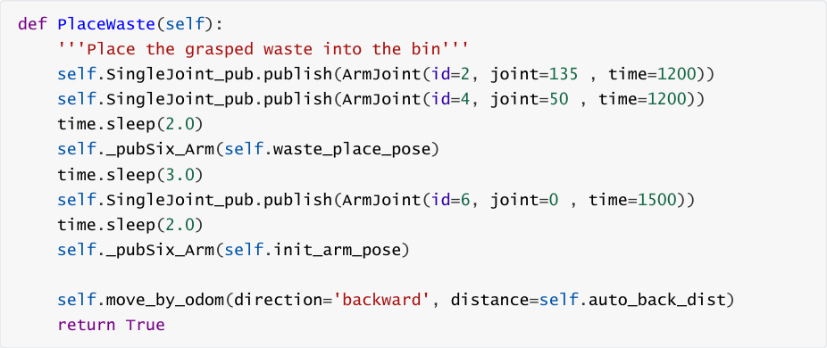

**Process Description** :


1. **Adjust Shoulder Joint** : joint2 moves to 135°, raise the robotic arm, wait 1.2 seconds

2. **Adjust Elbow Joint** : joint4 moves to 50°, prepare placing pose, wait 1.2 seconds


placing pose, wait 3 seconds

4. **Release Object** : joint6 (gripper) opens to 0°, release the waste, wait 1.5 seconds


to a safe position


**Action Group Design** :


The placing process uses step-by-step action groups to avoid objects falling or collision due

to rapid robotic arm movement

Waiting time is set after each joint movement to ensure smooth completion

### 5.6 waste_classify Detection Node — YOLO Inference Thread
Source path:


Waste recognition detection thread inference_worker


```
def inference_worker(model_config:Model_Configure,

             frame_shm_name,

             control_queue,

             result_queue,

             frame_shape,

             ready_event,

             show_image=False):

  """Inference subprocess"""

  from ultralytics import YOLO

  from ultralytics.engine.results import Results

  try:

     yolo_model = YOLO(model_config.model_path,task="obb")

  except Exception as e:

     print(Fore.RED+f"YOLO Model initialization error :{e} "+Fore.RESET)

     return False

  frame_shm = shared_memory.SharedMemory(name=frame_shm_name)

  frame_array = np.ndarray(frame_shape, dtype=np.uint8, buffer=frame_shm.buf)

  print(Fore.GREEN+'Subprocess: model loaded, waiting for inference

commands...'+Fore.RESET)

  ready_event.set()

  while True:

     try:

       cmd = control_queue.get(timeout=0.1)

       if cmd == 'exit':

          print(Fore.YELLOW+'Subprocess: exit command

received'+Fore.RESET)

          break

       elif cmd == 'infer':

          frame = frame_array.copy()

          results:list[Results] = yolo_model(frame,

                      conf=model_config.conf,

                      rect=model_config.rect,

                      vid_stride=model_config.vid_stride,

                      max_det=model_config.max_det,

                      half=model_config.half,

                      augment=model_config.augment,

                      verbose=model_config.verbose,

                      classes=model_config.classes,

                      device=model_config.device

)

          waste_items = []

          annotated_frame = frame

          for result in results:

            if result.obb is None or len(result.obb) == 0:

              continue

            annotated_frame = result.plot()

            xywhr = result.obb.xywhr

            xyxyxyxy = result.obb.xyxyxyxy

            names = [result.names[cls.item()] for cls in

result.obb.cls.int()]

            confs = result.obb.conf

            for i in range(len(names)):

              item = {

                 'class_name': names[i],

```

```
                  'confidence': float(confs[i]),

                  'center_x': float(xywhr[i][0]),

                  'center_y': float(xywhr[i][1]),

                  'width': float(xywhr[i][2]),

                  'height': float(xywhr[i][3]),

                  'angle': float(xywhr[i][4]),

                  'points': xyxyxyxy[i].tolist()

 }

                waste_items.append(item)

           if show_image:

             cv2.imshow('Inference Result', annotated_frame)

             cv2.waitKey(1)

           # Always put result to queue, even if empty

           result_queue.put((waste_items, annotated_frame))

      except:

        pass

    cv2.destroyAllWindows()

    frame_shm.close()

```

**Code Description** :


data copying

3. **Inference Loop** :


Upon receiving 'infer' command, perform inference on the current frame

4. **Result Parsing** :


Extract 4 vertex coordinates `xyxyxyxy`

Extract category names and confidence


**YOLO Inference Parameters** :


|Parameter|Description|Default|
|---|---|---|
|`conf`|Confidence threshold, results below this value are filtered|0.1|
|`rect`|Whether to use rectangular input (improves speed)|True|
|`vid_stride`|Video frame skip stride (1 means detect every frame)|1|
|`max_det`|Maximum number of detection targets|20|
|`half`|Whether to use half-precision FP16 inference (improves<br>speed)|True|
|`augment`|Whether to use test-time augmentation (improves accuracy)|True|
|`classes`|Detection category list (0-15 corresponds to 16 garbage<br>types)|[0,1,2,...,15]|
|`device`|Inference device (cuda:0 for GPU)|"cuda:0"|

## 6. Parameter Tuning
Parameter file path:


### 6.1 Garbage Sorting Grasp Parameters
**Detailed Parameter Description** :


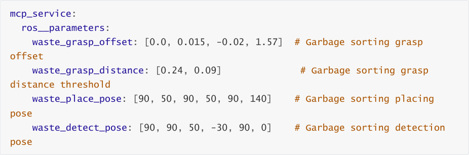
|Parameter|Type|Description|Default|Adjustment<br>Suggestion|
|---|---|---|---|---|
|`waste_grasp_offset`|[x, y,<br>z,<br>angle]|Grasp position offset,<br>used for fine-tuning<br>grasp coordinates<br>and gripper angle|[0.0,<br>0.015,<br>-0.02,<br>1.57]|Adjust<br>based on<br>actual grasp<br>偏差,<br>±0.005m<br>each time|
|`waste_grasp_distance[0]`|float|X-direction grasp<br>distance threshold<br>(meters), triggers<br>chassis<br>forward/backward<br>adjustment|0.24|Increase to<br>reduce<br>chassis<br>movement<br>frequency|
|`waste_grasp_distance[1]`|float|Y-direction grasp<br>distance threshold<br>(meters), triggers<br>chassis left/right<br>adjustment|0.09|Increase to<br>reduce<br>chassis<br>movement<br>frequency|
|`waste_place_pose`|[j1, j2,<br>j3, j4,<br>j5, j6]|6-joint target angles<br>for waste placement<br>(degrees)|[90, 50,<br>90, 50,<br>90, 140]|Adjust<br>according to<br>trash bin<br>height and<br>position|
|`waste_detect_pose`|[j1, j2,<br>j3, j4,<br>j5, j6]|6-joint target angles<br>for waste detection<br>(degrees)|[90, 90,<br>50, -30,<br>90, 0]|Ensure the<br>camera can<br>fully capture<br>the desktop|


**waste_grasp_offset Adjustment Principles** :


Unlike normal grasping logic, garbage sorting grasping needs to consider the object's rotation

angle:


1. **X-axis Offset (forward/backward)** : Usually 0.0, distance is ensured by chassis adjustment

2. **Y-axis Offset (left/right)** : Default 0.015m, compensates for lateral offset between camera

and gripper

3. **Z-axis Offset (up/down)** : Default -0.02m, slightly lowers grasp height to ensure gripping the

object

4. **Grasp Angle (4th parameter)** : Default 1.57 radians (90°), indicates the gripper is

perpendicular to the desktop

### 6.2 YOLO Model Detection Parameters
```
 waste_detect:

 ros__parameters:

 detect_enable: False       # Detection disabled by default at startup

 model_path: '' # YOLO model path

 conf: 0.1             # Confidence threshold

 vid_stride: 1           # Frame skip stride

```

```
 max_det: 20            # Maximum detection count

 rect: True            # Rectangular input

 half: True            # Half-precision inference

 augment: True           # Test-time augmentation

 verbose: False          # Detailed logging

 classes: [0,1,2,...,15] # Detection categories (16 garbage types)

 device: "cuda:0" # Inference device

 show_image: True         # Show detection window

 image_save_path: '' # Recognition image save path

 auto_shutdown_time: 240.0     # Auto shutdown time (seconds)

 always_on: False         # Whether to keep always on

```

**Detailed Parameter Description** :


|Parameter|Type|Description|Default|Adjustment<br>Suggestion|
|---|---|---|---|---|
|`detect_enable`|bool|Enable detection<br>at startup|False|Suggested False,<br>enable on demand<br>to save resources|
|`conf`|float|Confidence<br>threshold<br>(0.0~1.0)|0.1|Increase to reduce<br>false positives, but<br>may miss detections|
|`max_det`|int|Maximum targets<br>per detection|20|Adjust based on<br>actual scenario|
|`half`|bool|Use FP16 half-<br>precision|True|Recommended for<br>GPU inference to<br>improve speed|
|`augment`|bool|Test-time data<br>augmentation|True|Improves accuracy<br>but reduces speed,<br>can disable for faster<br>performance|
|`classes`|list|Detection<br>category ID list|[0-15]|Can narrow scope to<br>improve speed|
|`device`|string|Inference device|"cuda:0"|Change to "cpu"<br>when no GPU is<br>available|
|`auto_shutdown_time`|float|Auto shutdown<br>time after no<br>operation<br>(seconds)|240.0|Adjust based on<br>usage frequency|
|`show_image`|bool|Show detection<br>window|True|Can disable for<br>remote debugging|


**Performance Optimization Suggestions** :
