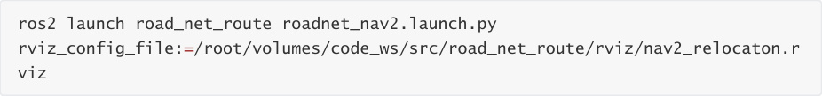
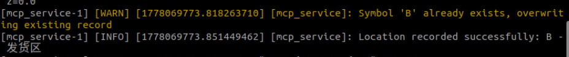
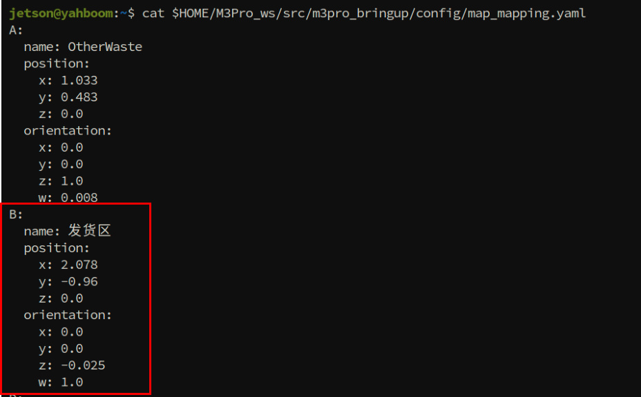
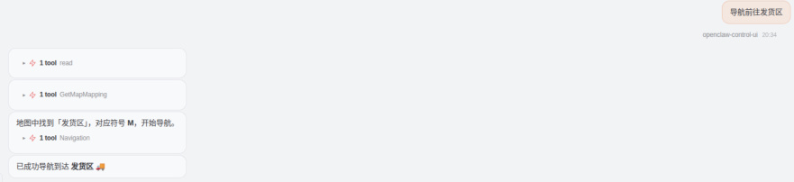
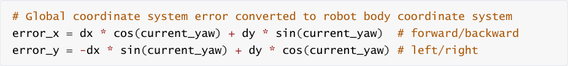
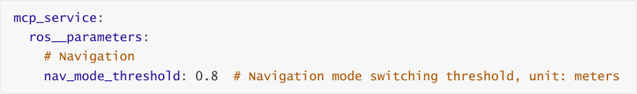
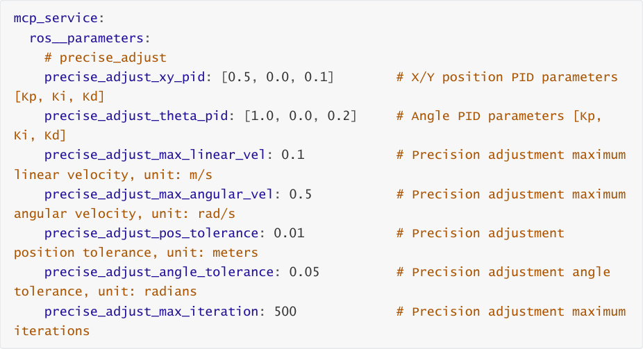

# OpenClaw Slam Mapping And Navigation
**OpenClaw Slam Mapping And Navigation**

1. Course Content

Learning Objectives

2. Preparation

3. Record Map Mapping File

4. OpenClaw Intelligent Navigation

5. Source Code Analysis

### 5.1 Navigation — Navigation Function

### 5.2 PreciseAdjustPosition — Precise Position Adjustment

6. Parameter Tuning

### 6.1 Navigation Mode Switching Parameters

### 6.2 Precision Adjustment PID Parameters

## 1. Course Content
**Learning Objectives**


Learn to use the RecordMapLocation tool to record map mapping files and establish the

correspondence between place names and coordinates

Understand the switching logic between Road Network Navigation and normal navigation

(Nav2)

Master the PID control principle and parameter tuning method of PreciseAdjustPosition

Understand the application of visual relocalization (ArUco Tag) in improving navigation

accuracy
## 2. Preparation
[!IMPORTANT]


OpenClaw controlled navigation requires building a grid map, pose map, and

annotated road network file first. For details, refer to the tutorial [Road Network

Planning Navigation - Building Pose Maps and Road Network Annotation]

If you need to use the visual relocalization function, you also need to annotate the

global position of ArUco markers on the map. For detailed operations, refer to the

tutorial [Lidar - Pose Constraint Combined with Visual Relocalization Navigation] or

[OpenClaw Open Transfer Sandbox Map - Visual Relocalization Markers]


Start the road network container


Start the MicroROS chassis agent (no need to restart if already started)


Start odometry, tf, robotic arm assistance, camera nodes, etc. If you need to enable visual

relocalization, add the startup parameter relocation:=True

Start with relocalization (start from host)


Start road network navigation (start inside roadnet container)





Start the MCP service


If you need voice reply, you need to start openclaw_bridge additionally, otherwise it can be

omitted


## 3. Record Map Mapping File
[!TIP]


You can use the robot_control CLI tool or directly ask OpenClaw to record positions and

symbols during interaction. The demonstration below uses the CLI tool to record the


map mapping file as an example.

|Tool|Parameters|Function|
|---|---|---|
|RecordMapLocation|--`name`,--`symbol`|Save current position to map mapping file|


You can use the robot_control CLI tool to record the position of the vehicle's **base_link** in the

**map** frame


--name specifies the name of the recorded point

--symbol specifies the symbol of the recorded point, making it easier for OpenClaw to

identify and distinguish


If recording is successful, the above content is displayed. If the map mapping file already

contains a symbol with the same name, the previous symbol content is automatically

overwritten.


View the map mapping file map_mapping.yaml, file path:





View map_mapping.yaml to see the just-recorded location



## 4. OpenClaw Intelligent Navigation
[!TIP]


You can write commands according to your own needs. The following is a case

demonstration. Choose any interaction method. Here we take the web-based WebChat

as an example.


Navigation function tools

|Tool|Parameters|Function|
|---|---|---|
|GetMapMapping|None|Get the mapping relationship of all place names and<br>their corresponding identifiers|
|Navigation|--`location`|Navigate to the target location by target point<br>identifier|


Navigate to the Shipping Area.

## 5. Source Code Analysis
Source path



### 5.1 Navigation — Navigation Function
**Function Description** : Looks up the corresponding coordinates from the map mapping file based

on the target location name, then selects the appropriate navigation mode (normal navigation or

road network navigation) to execute the navigation task, and performs precise position

adjustment after arrival.

```
 def Navigation(self, location: str) -> list[bool,str]:

    '''Use road network navigation'''

    location = location.strip("'\"")

    try:

      with open(self.map_mapping_file, 'r', encoding='utf-8') as file:

        map_data = yaml.safe_load(file) or {}

      target_data = None

      for symbol, data in map_data.items():

        if symbol == location or (isinstance(data, dict) and

 data.get('name') == location):

           target_data = data

           break

      if target_data is None:

        error_info = f"The map mapping file has no coordinate record for

 '{location}'."

        self.get_logger().error(error_info)

        return [False,error_info]

    except Exception as e:

      self.get_logger().error(str(e))

      return [False,str(e)]

    goal_msg = PoseStamped()

    goal_msg.header.frame_id = "map"

    goal_msg.header.stamp = self.get_clock().now().to_msg()

    position = target_data.get('position', {})

    goal_msg.pose.position.x = float(position.get('x', 0.0))

    goal_msg.pose.position.y = float(position.get('y', 0.0))

    goal_msg.pose.position.z = float(position.get('z', 0.0))

    orientation = target_data.get('orientation', {})

    goal_msg.pose.orientation.x = float(orientation.get('x', 0.0))

    goal_msg.pose.orientation.y = float(orientation.get('y', 0.0))

    goal_msg.pose.orientation.z = float(orientation.get('z', 0.0))

    goal_msg.pose.orientation.w = float(orientation.get('w', 1.0))

    #calculate distance to target

    current_pose = self._get_current_map_pose()

    if current_pose is None:

      self.get_logger().error(Fore.RED + "Failed to get current pose" +

 Fore.RESET)

      return [False, "Failed to get current pose"]

    distance=math.sqrt((current_pose.transform.translation.x
 goal_msg.pose.position.x) ** 2 +

 (current_pose.transform.translation.y
 goal_msg.pose.position.y) ** 2)

```

```
  if distance < self.nav_mode_threshold:

     #use common navigation

     if not self.nav_to_pose_client.wait_for_server(timeout_sec=10.0):

       return [False, "Nav2 action server not available"]

     goal = NavigateToPose.Goal()

     goal.pose.header.frame_id = "map"

     goal.pose.header.stamp = self.get_clock().now().to_msg()

     goal.pose.pose.position.x = float(position.get('x', 0.0))

     goal.pose.pose.position.y = float(position.get('y', 0.0))

     goal.pose.pose.position.z = float(position.get('z', 0.0))

     goal.pose.pose.orientation.x = float(orientation.get('x', 0.0))

     goal.pose.pose.orientation.y = float(orientation.get('y', 0.0))

     goal.pose.pose.orientation.z = float(orientation.get('z', 0.0))

     goal.pose.pose.orientation.w = float(orientation.get('w', 1.0))

     send_goal_future = self.nav_to_pose_client.send_goal_async(goal)

     while rclpy.ok() and not send_goal_future.done():

       time.sleep(0.1)

     if not send_goal_future.done():

       return [False, "Failed to send navigation goal"]

     goal_handle = send_goal_future.result()

     if not goal_handle.accepted:

       return [False, "Navigation goal rejected"]

     result_future = goal_handle.get_result_async()

     while rclpy.ok() and not result_future.done():

       time.sleep(0.1)

     if result_future.done():

       result = result_future.result().result

       time.sleep(3.0)#TODO: why do this? wait for camera to stabilize

after navigation

       self._control_aritag_detect(sign='enable')

       time.sleep(3.0)

       self.PreciseAdjustPosition(goal_msg)

       self._control_aritag_detect(sign='disable')# disable aritag

detection,decrease CPU usage

       return [True, "Navigation succeeded"]

     else:

       self._control_aritag_detect(sign='disable')# disable aritag

detection

       return [False, "Navigation failed"]

  else:

     #use road network navigation

     self.road_net_nav_future = Future()

     self.road_net_nav_pub.publish(goal_msg)

     while not self.road_net_nav_future.done() and rclpy.ok():

       time.sleep(0.1)

     result= self.road_net_nav_future.result()

     if result.data == "road_net_nav_succeeded":

       time.sleep(3.0)#TODO: why do this? wait for camera to stabilize

after navigation

```

```
        self._control_aritag_detect(sign='enable')#TODO: why do this?

 aritag detection causes high CPU usage; enable detection only during

 PreciseAdjustPosition

        time.sleep(5.0)

        self.PreciseAdjustPosition(goal_msg)

        self._control_aritag_detect(sign='disable')# disable aritag

 detection,decrease CPU usage

        return [True, result.data]

      else:

        self.get_logger().warn(Fore.YELLOW+f"Navigation to '{location}'

 failed "+Fore.RESET)

        self._control_aritag_detect(sign='disable')# disable aritag

 detection

        return [False, result.data]

```

**Process Description** :


1. **Parse Target Location** : Clean the input location string, remove quotes


2. **Read Map Mapping File** : Look up target location coordinate data from `map_mapping.yaml`


Supports lookup by symbol or name

3. **Build Target Pose** : Convert the found coordinate data into `PoseStamped` message format


4. **Calculate Distance** : Get current pose, calculate Euclidean distance to target point

5. **Navigation Mode Switching** :


6. **Execute Navigation** :


completion

**Road Network Navigation** : Publish target pose to road network navigation topic, wait

for navigation result

7. **Precise Position Adjustment** : After navigation completes, enable ArUco detection, call


8. **Disable Detection** : After fine adjustment, disable ArUco detection to reduce CPU usage


**Key Technical Points** :


**Dual-mode Navigation** : Short distances use Nav2 normal navigation, long distances use

road network navigation, improving efficiency and reliability

**Visual Relocalization** : After arriving near the target, use ArUco code visual recognition for

global relocalization to calibrate errors caused by odometry, etc.

**CPU Optimization** : ArUco detection is only enabled during the fine adjustment phase,

avoiding continuous CPU resource usage

### 5.2 PreciseAdjustPosition — Precise Position Adjustment
**Function Description** : Uses a PID controller to achieve centimeter-level precise position

adjustment, ensuring the robot accurately reaches the target position and angle.

```
 def PreciseAdjustPosition(self,precise_pose:PoseStamped):

    '''Precise position adjustment'''

    target_x = precise_pose.pose.position.x

```

```
  target_y = precise_pose.pose.position.y

  target_yaw = get_yaw_from_quaternion(precise_pose.pose.orientation)

  # init PID controller

  xy_kp, xy_ki, xy_kd = self.precise_adjust_xy_pid

  theta_kp, theta_ki, theta_kd = self.precise_adjust_theta_pid

  xy_integral = 0.0

  theta_integral = 0.0

  xy_prev_error = 0.0

  theta_prev_error = 0.0

  start_time = time.time()

  last_time = start_time

  consecutive_success = 0

  required_success = 5

  for attempt in range(self.precise_adjust_max_iteration):

     current_time = time.time()

     dt = current_time - last_time

     last_time = current_time

     transform=self._get_current_map_pose()

     if transform is None:

       self.get_logger().error(self.log.get_text("no_tf"))

       return False

     current_x = transform.transform.translation.x

     current_y = transform.transform.translation.y

     current_yaw = get_yaw_from_quaternion(transform.transform.rotation)

     dx = target_x - current_x

     dy = target_y - current_y

     error_x = dx * math.cos(current_yaw) + dy * math.sin(current_yaw)

     error_y = -dx * math.sin(current_yaw) + dy * math.cos(current_yaw)

     error_theta = normalize_angle(target_yaw - current_yaw)

     pos_error = math.sqrt(dx * dx + dy * dy)

     # Check whether the target has been reached

     pos_reached = pos_error < self.precise_adjust_pos_tolerance

     angle_reached = abs(error_theta) < self.precise_adjust_angle_tolerance

     if pos_reached and angle_reached:

       consecutive_success += 1

       if consecutive_success >= required_success:

          self.cmd_pub.publish(Twist())

          msg_info=self.log.get_text("sys_log_2",

pos_error=round(pos_error, 3), error_theta=round(math.degrees(error_theta)))

          self.get_logger().info(Fore.GREEN + msg_info + Fore.RESET)

          return

     else:

       consecutive_success = 0

     # PID Calculation - X Direction

     if dt > 0:

       xy_integral += error_x * dt

       xy_integral = max(-1.0, min(1.0, xy_integral))

```

```
        xy_derivative = (error_x - xy_prev_error) / dt

      else:

        xy_derivative = 0.0

      vx = xy_kp * error_x + xy_ki * xy_integral + xy_kd * xy_derivative

      vx = max(-self.precise_adjust_max_linear_vel,

 min(self.precise_adjust_max_linear_vel, vx))

      # PID Calculation - Y Direction

      # Separate integral term is used for Y direction

      if dt > 0:

        vy_integral = error_y * dt

        vy_integral = max(-1.0, min(1.0, vy_integral))

        vy_derivative = (error_y - (xy_prev_error if abs(error_x) >

 abs(error_y) else 0)) / dt

      else:

        vy_derivative = 0.0

      vy = xy_kp * error_y + xy_ki * vy_integral + xy_kd * vy_derivative

      vy = max(-self.precise_adjust_max_linear_vel,

 min(self.precise_adjust_max_linear_vel, vy))

      # PID Calculation - Angular Direction

      if dt > 0:

        theta_integral += error_theta * dt

        theta_integral = max(-1.0, min(1.0, theta_integral))

        theta_derivative = (error_theta - theta_prev_error) / dt

      else:

        theta_derivative = 0.0

      omega = theta_kp * error_theta + theta_ki * theta_integral + theta_kd *

 theta_derivative

      omega = max(-self.precise_adjust_max_angular_vel,

 min(self.precise_adjust_max_angular_vel, omega))

      # When the position error is small, reduce the rotation speed to improve

 stability

      if pos_error < self.precise_adjust_pos_tolerance * 2:

        omega *= 0.5

      #----------------publish twist---------
      twist = Twist()

      twist.linear.x = vx

      twist.linear.y = vy

      twist.angular.z = omega

      self.cmd_pub.publish(twist)

      # ----------update PID error------------
      xy_prev_error = error_x

      theta_prev_error = error_theta

      time.sleep(0.1) # 10Hz

    self.cmd_pub.publish(Twist())

    self.get_logger().warn(Fore.YELLOW +

 self.log.get_text("sys_log_3")+Fore.RESET)

```

**Process Description** :


1. **Initialize PID Controller** :


Read X/Y position PID and angle PID Kp, Ki, Kd parameters from configuration

Initialize integral and derivative terms to 0

2. **Loop Adjustment** (up to `precise_adjust_max_iteration` times):


Get current pose (via TF transform)

Calculate position error (dx, dy) and angle error (error_theta)

Convert global coordinate system error to robot body coordinate system (error_x,

error_y)

3. **Arrival Check** :


If position error < `precise_adjust_pos_tolerance` and angle error <


Satisfied for 5 consecutive times, consider target reached, stop adjustment

4. **PID Calculation** :

**X Direction** : Calculate proportional, integral, derivative terms, output linear velocity vx

**Y Direction** : Independent integral term, output lateral velocity vy (for omnidirectional

chassis)

**Angular Direction** : Calculate angular velocity omega

All outputs are limited to the maximum speed range


**Coordinate System Transformation** :





## 6. Parameter Tuning
Parameter file path:


### 6.1 Navigation Mode Switching Parameters



**Parameter Description** :


|Parameter|Type|Description|Default|Adjustment<br>Suggestion|
|---|---|---|---|---|
|`nav_mode_threshold`|float|Navigation mode<br>switching<br>distance<br>threshold<br>(meters)|0.8|Distances below<br>threshold use normal<br>navigation, above use<br>road network<br>navigation|


### 6.2 Precision Adjustment PID Parameters



**Detailed Parameter Description** :


|Parameter|Type|Description|Default|Adjustment<br>Suggestion|
|---|---|---|---|---|
|`precise_adjust_xy_pid[0]`  (Kp)|float|Position<br>proportional<br>gain|0.5|Increase for<br>faster response,<br>but may cause<br>overshoot<br>oscillation|
|`precise_adjust_xy_pid[1]`  (Ki)|float|Position<br>integral gain|0.0|Used to<br>eliminate<br>steady-state<br>error, generally<br>keep at 0|
|`precise_adjust_xy_pid[2]`  (Kd)|float|Position<br>derivative<br>gain|0.1|Increase to<br>suppress<br>overshoot and<br>improve stability|
|`precise_adjust_theta_pid[0]`<br>(Kp)|float|Angle<br>proportional<br>gain|1.0|Angle control<br>requires faster<br>response,<br>usually larger<br>than position Kp|
|`precise_adjust_theta_pid[1]`<br>(Ki)|float|Angle<br>integral gain|0.0|Generally keep<br>at 0|
|`precise_adjust_theta_pid[2]`<br>(Kd)|float|Angle<br>derivative<br>gain|0.2|Suppress angle<br>oscillation|
|`precise_adjust_max_linear_vel`|float|Maximum<br>linear<br>velocity<br>(m/s)|0.1|Speed should be<br>slow during fine<br>adjustment to<br>ensure precision|
|`precise_adjust_max_angular_vel`|float|Maximum<br>angular<br>velocity<br>(rad/s)|0.5|Control rotation<br>speed|
|`precise_adjust_pos_tolerance`|float|Position<br>tolerance<br>(meters)|0.01|Position<br>considered<br>reached at this<br>precision (1 cm)|
|`precise_adjust_angle_tolerance`|float|Angle<br>tolerance<br>(radians)|0.05|Angle<br>considered<br>reached at this<br>precision<br>(approx. 2.86<br>degrees)|


|Parameter|Type|Description|Default|Adjustment<br>Suggestion|
|---|---|---|---|---|
|`precise_adjust_max_iteration`|int|Maximum<br>iterations|500|Prevents infinite<br>loops, 500<br>iterations is<br>about 50<br>seconds|


**PID Parameter Tuning Steps** :


1. **Initial Setup** : Use default parameters, set Ki to 0

2. **Adjust Kp** :


Gradually increase Kp until the system responds quickly with slight overshoot

If oscillating, decrease Kp

3. **Adjust Kd** :

Gradually increase Kd to suppress overshoot and oscillation

If response becomes slow, decrease Kd

4. **Adjust Ki** (optional):


If steady-state error exists (always off by a few millimeters), appropriately increase Ki


**Common Problems and Solutions** :


|Problem|Possible Cause|Solution|
|---|---|---|
|Continuous oscillation after<br>reaching target|Kp too large or Kd too small|Decrease Kp or increase<br>Kd|
|Adjustment speed too slow|Kp too small|Appropriately increase Kp|
|Fixed offset always present|Ki=0 or too small|Appropriately increase Ki<br>(e.g., 0.01~0.05)|
|Unstable angle adjustment|Unreasonable theta_pid<br>parameters|Increase theta_kp or<br>theta_kd|
|Fine adjustment timeout<br>failure|Tolerance too small or<br>insufficient iterations|Increase tolerance or<br>max_iteration|
