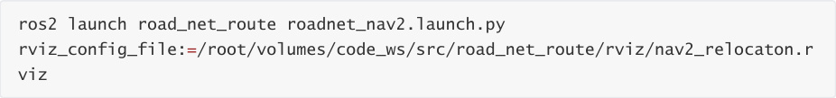
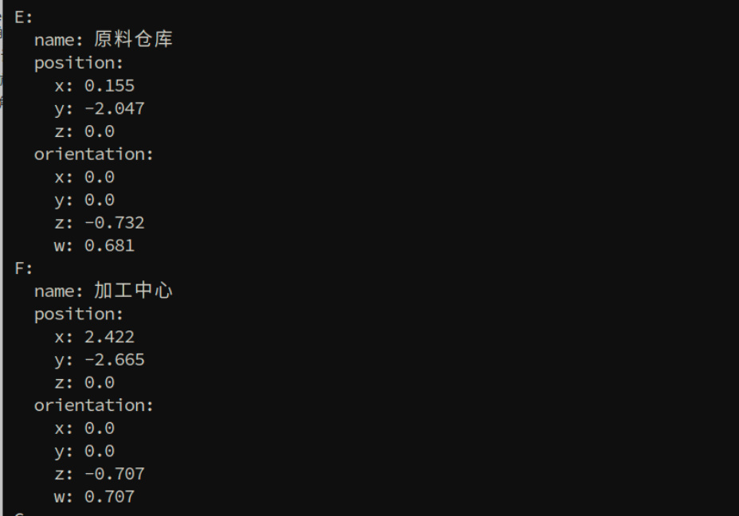
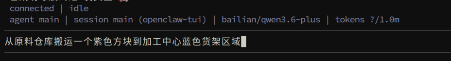
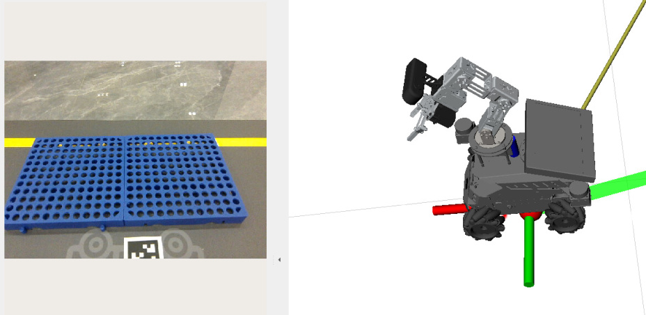

# OpenClaw Navigation Transfer
**OpenClaw Navigation Transfer**

1. Course Content

Learning Objectives

2. Preparation

3. Demonstration Case

4. Parameter Tuning and Source Code Analysis

## 1. Course Content
**Learning Objectives**

This section is a comprehensive course that combines robotic arm visual grasping and

intelligent navigation functions for complex long-flow tasks. Please complete the basic

courses [02-OpenClaw Robotic Arm Tracking Grasp], [05-OpenClaw Slam Mapping and

Navigation], and [Road Network Planning Navigation] first.
## 2. Preparation
Complete grid map construction, pose map construction, and road network file annotation.

For details, refer to the tutorial [Road Network Planning Navigation - Building Pose Maps and

Road Network Annotation]

Complete the prerequisite tutorials, mastering map construction, road network annotation,

and map mapping marking functions in advance.

Start the MicroROS chassis agent (no need to restart if already started)

Start odometry, tf, robotic arm assistance, camera nodes, etc. If you need to enable visual

relocalization, add the startup parameter relocation:=True

Start with relocalization (start from host)

Start road network navigation (start inside roadnet container)

Start the MCP service

If you need voice reply, you need to start openclaw_bridge additionally, otherwise it can be

omitted

## 3. Demonstration Case
[!TIP]

You can freely edit commands based on actual conditions. The following is a reference

case.

**Transport a purple block from the raw material**
**warehouse to the blue shelf area of the processing center**

Use the robot_control CLI to pre-mark the map mapping for "raw material warehouse" and

"processing center"

Then assign a specific task to OpenClaw, choose any interaction method

Transport a purple cube from the raw material warehouse to the blue shelf area of the

processing center.

OpenClaw will call tools to first grasp the color block and then navigate to the location for

placement

## 4. Parameter Tuning and Source Code Analysis
This section is a comprehensive course. Debugging parameters and functional source code

are detailed in [02-OpenClaw Robotic Arm Tracking Grasp] and [05-OpenClaw Slam Mapping

and Navigation].

