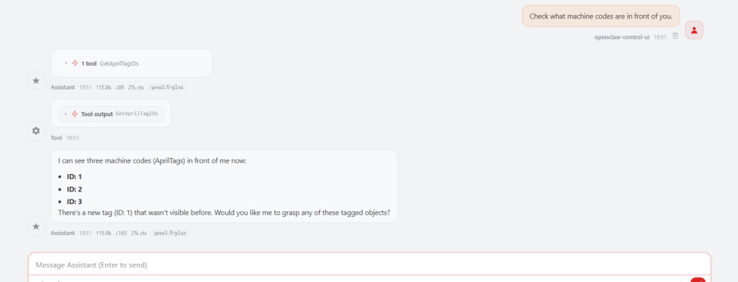
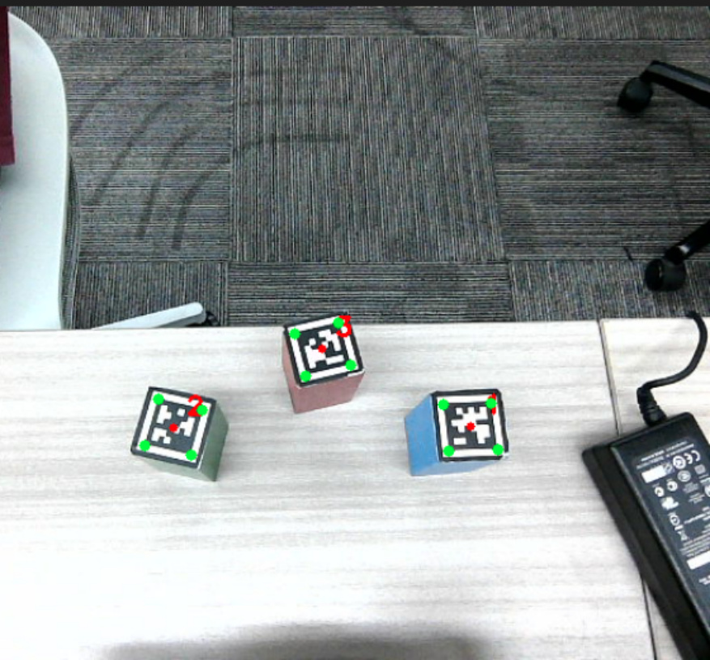
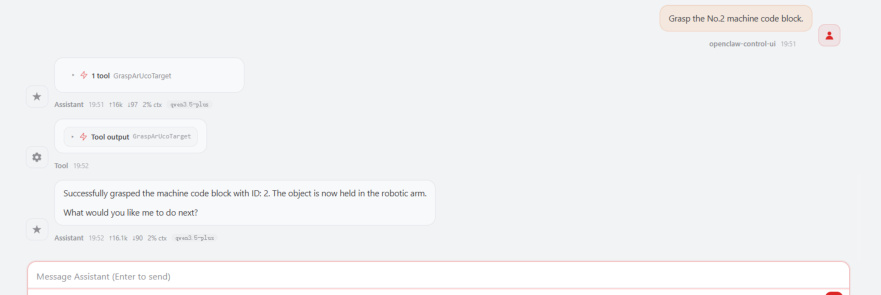
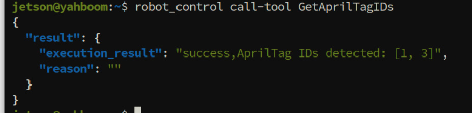
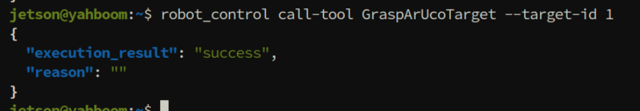
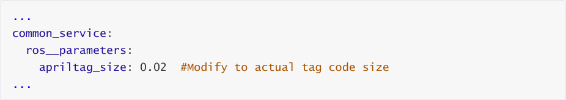
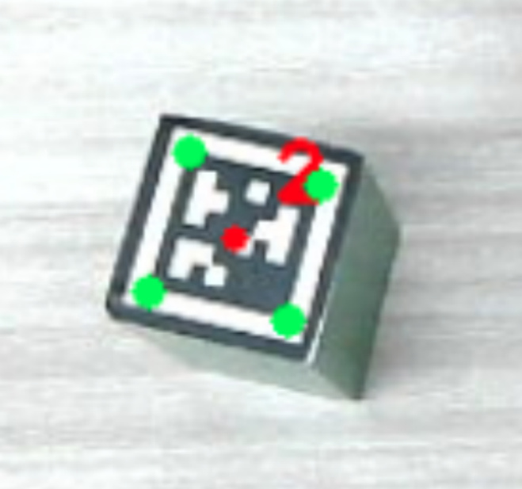
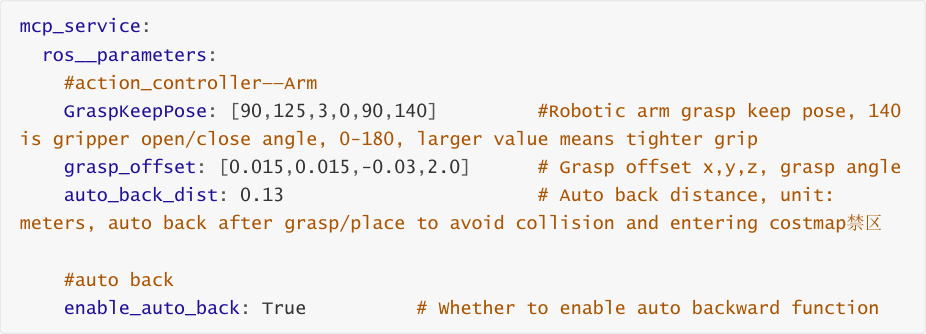
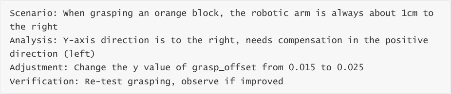

# OpenClaw Machine Code Clip
**OpenClaw Machine Code Clip**

1. Course Content

Learning Objectives

2. Preparation

3. Demonstration Case

4. Source Code Analysis

GetAprilTagIDs

GraspArUcoTarget

5. Parameter Tuning

### 5.1 Aritag Code Size Adjustment

### 5.2 Detection Pose and Grasp Offset Adjustment

## 1. Course Content
**Learning Objectives**


Through this chapter, you will master the following skills:


`GraspArUcoTarget` two core MCP tools for machine code detection and grasping

**Gain Parameter Debugging Ability** : Be able to adjust detection parameters based on actual

tag sizes used, optimizing recognition results

**Achieve Autonomous Grasping Tasks** : Be able to independently configure and deploy the

OpenClaw system to complete automatic recognition and grasping of specified machine

code blocks
## 2. Preparation
Start the MicroROS chassis agent (no need to restart if already started)


Start odometry, tf, robotic arm assistance, camera nodes, etc.


Start the MCP service


If you need voice reply, you need to start openclaw_bridge additionally, otherwise it can be

omitted


## 3. Demonstration Case
[!TIP]


You can write commands according to your own needs. The following is a case

demonstration. Choose any interaction method. Here we take the web-based WebChat

as an example.


OpenClaw can get all machine code IDs in the frame through GetAprilTagIDs, and grasp the

block with the corresponding ID through GraspArUcoTarget (the demonstration case uses

the included 3x3x6cm blocks. Actually, any size machine code block can be grasped. The

gripper grasping angle, height, etc. can be adjusted through parameters.)

|Command|Parameters|Function|
|---|---|---|
|GraspArUcoTarget|--`target`-`id`|Grasp the AprilTag target with the specified ID|
|GetAprilTagIDs|None|Get the AprilTag tag IDs in the field of view|


Take a look at what machine codes are in front of you


When OpenClaw calls the `GraspArUcoTarget` tool, a verification image is automatically

generated, image path:







Grasp the machine code with the specified ID


Similarly, when you need to manually debug and test MCP tools, you can also call them via

CLI in the terminal







## 4. Source Code Analysis
Source path


**GetAprilTagIDs**


This function retrieves the ID, pose, and angle information of all AprilTag machine codes in the

current field of view.

```
    def GetAprilTagIDs(self)->list[bool, str | list[AritagDetectionResult]]:

      '''Get the detections of ArUco tags in the current scene'''

      # 1. Adjust the robotic arm to the detection pose, ensuring the camera

 can clearly capture the target in front

      self._pubSix_Arm(self.waste_detect_pose)

      time.sleep(2.0)

      # 2. Call the underlying vision service to get detection results

      if not self.get_aritag_client.wait_for_service(timeout_sec=8.0):

        msg = "GetArUcoTagPose service not available"

        self.get_logger().error(Fore.YELLOW + msg + Fore.RESET)

        return [False, msg, []]

      aritags:GetAprilTag.Response =

 self.get_aritag_client.call(GetAprilTag.Request())

      if not aritags.success:

        error_msg=aritags.message

        self.get_logger().error(error_msg)

        return [False, error_msg, []]

      # 3. Save the current image for subsequent visual annotation

      save_result=self.SeeWhat()

      if not save_result[0]:

        return [False, f"SeeWhat error:{save_result[1]}", []]

      detect_result:list[AritagDetectionResult] = []

      img=cv2.imread(self.image_path)

```

```
      # 4. Iterate through each detected tag, calculate its spatial pose and

 rotation angle

      for tag in aritags.detections:

        # Reverse calculate the 3D pose in the real-world coordinate system

 from pixel coordinates (x, y)

        tagpose:GetTargetPose.Response

 =self.get_pose_client.call(GetTargetPose.Request(x=tag.centre.x, y=tag.centre.y,

 radius=self.target_circle))

        if not tagpose.success:

           self.get_logger().warn(f"Failed to get pose for tag ID:

 {tag.id}, GetArUcoTagPose error: {tagpose.message}")

           continue

        cx, cy = int(tag.centre.x), int(tag.centre.y)

        cv2.circle(img, (cx, cy), 3, (0, 0, 255), -1)

        cv2.putText(img, f"{tag.id}", (cx + 10, cy
 10),cv2.FONT_HERSHEY_SIMPLEX, 0.6, (0, 0, 255), 2)

        for j in range(4):

           px, py = int(tag.corners[j].x), int(tag.corners[j].y)

           cv2.circle(img, (px, py), 4, (0, 255, 0), -1)

        # Calculate the rotation angle of the tag relative to the bottom

 edge of the image (used for pose alignment during robotic arm grasping)

        dx = tag.corners[1].x - tag.corners[0].x

        dy = tag.corners[1].y - tag.corners[0].y

        angle_deg = math.degrees(math.atan2(dy, dx))

        # Package detection result: contains ID, 3D coordinates [x, y, z],

 and rotation angle

        detect_result.append(AritagDetectionResult(tag.id,

 [tagpose.pose.position.x, tagpose.pose.position.y, tagpose.pose.position.z],

 angle_deg))

        self.get_logger().info(f"Tag ID: {tag.id}, Tag Pose: x=

 {tagpose.pose.position.x:.4f}, y={tagpose.pose.position.y:.4f}, z=

 {tagpose.pose.position.z:.4f}")

      # 5. Save the image with annotation information for user to review

 recognition results

      cv2.imwrite(self.atitag_detect_path, img)

      return [True, "", detect_result]

```

**Core Logic Description:**


1. **Adjust Detection Pose** : First move the robotic arm to the preset detection position


height of the tag in the robot coordinate system based on the pixel center point of the tag in

the image, combined with camera intrinsic and extrinsic parameters.

3. **Angle Calculation** : Calculate the yaw angle of the tag using the pixel coordinates of the tag's

four corner points. This is crucial for the robotic arm to accurately grasp the block.


**GraspArUcoTarget**


This function implements the complete closed-loop control flow from recognition to grasping.

```
    def GraspArUcoTarget(self, target_id:int):

      '''Grasp the ArUco tag with the specified ID'''

      # 1. Perform a global scan to get all currently visible machine code

 information

      aritags_result=self.GetAprilTagIDs()

      if not aritags_result[0]:

        return [False, f"Failed to get ArUco tag detections:

 {aritags_result[1]}"]

      aritags:list[AritagDetectionResult] = aritags_result[2]

      if len(aritags) == 0:

        return [False, "No ArUco tags detected in the scene"]

      # 2. Find the specified target ID in the detection results

      for tag in aritags:

        if tag.id == target_id:

           break

      else:

        return [False, f"ArUco tag with ID {target_id} not found in current

 detections,available tags: {[tag.id for tag in aritags]}"]

      # 3. Coarse adjustment: adjust chassis position based on visual feedback

 to bring the target into the optimal grasping range of the robotic arm

      adjusted_flag = False

      # Check if X-axis distance (forward/backward) is too far

      if tag.pose[0] > self.waste_grasp_distance[0]:

        adjusted_flag = True

        delta_x = tag.pose[0] - self.waste_grasp_distance[0]

        self.move_by_odom(distance=abs(delta_x), direction='forward')

        self.get_logger().info("adjust x position finish")

        time.sleep(3.0) #wait for camera to stabilize after movement

      # Check if Y-axis offset (left/right deviation) is too large

      if abs(tag.pose[1]) > self.waste_grasp_distance[1]:

        adjusted_flag = True

        delta_y = tag.pose[1]

        direction = 'left' if delta_y > 0 else 'right'

        self.move_by_odom(distance=abs(delta_y), direction=direction)

        self.get_logger().info("adjust y position finish")

        time.sleep(3.0) #wait for camera to stabilize after movement

      # 4. Fine adjustment: after moving the chassis, re-call visual detection

 to get more accurate target pose

      if adjusted_flag:

        aritags_result=self.GetAprilTagIDs()

        if not aritags_result[0]:

           return [False, f"Failed to get ArUco tag detections after

 adjustment: {aritags_result[1]}"]

        aritags:list[AritagDetectionResult] = aritags_result[2]

        for tag in aritags:

           if tag.id == target_id:

             break

        else:

```

```
           return [False, f"ArUco tag with ID {target_id} not found after

 adjustment, available tags: {[tag.id for tag in aritags]}"]

      # 5. Angle normalization to ensure the robotic arm approaches the target

 at the correct angle

      angle_normalized = self._normalize_angle_to_0_45(tag.angle_deg)

      self.get_logger().info(f"Tag ID: {tag.id}, Tag Angle:

 {tag.angle_deg:.2f} -> Normalized Angle: {angle_normalized:.2f}")

      # 6. Execute grasping action

      self._grasp(tag.pose[0],

             tag.pose[1],

             tag.pose[2],

             grasp_pitch=self.grasp_offset[3],

             joint5_angle=int(angle_normalized))

      # 7. Optional: automatically back up a distance after grasping

      if self.enable_auto_back:

        self.move_by_odom(direction='backward',

 distance=self.auto_back_dist)

      return [True, f"Grasped ArUco tag with ID {target_id} successfully"]

```

**Core Logic Description:**


1. **Closed-loop Control** : Adopts an "observe-move-reobserve" strategy. First, visually

determine if the target is within the grasping range; if out of range, control the chassis to

move, then re-photograph to confirm the pose, eliminating accumulated errors.

2. **Coordinate Alignment** : `waste_grasp_distance` defines the relative coordinate range

within which the robotic arm can comfortably grasp. The program automatically calculates

the difference and drives the chassis to compensate.

3. **Pose Matching** : Process the tag's rotation angle through `_normalize_angle_to_0_45` to

ensure the robotic arm is parallel to the block's edge during grasping, improving success

rate.


Aritag code detection service


```
from dt_apriltags import Detector

self.aritag_detector = Detector(searchpath=['apriltags'],

            families='tag36h11',

            nthreads=2,

            quad_decimate=2.0,

            quad_sigma=0.0,

            refine_edges=1,

            decode_sharpening=self.apriltag_size,

            debug=0)

     # AprilTag detection service

     self.apriltag_service =

self.create_service(GetAprilTag,'/get_apriltag_detections',self.detect_apriltags

_callback)

  def detect_apriltags_callback(self, request:GetAprilTag.Request,

response:GetAprilTag.Response):

```

```
      from apriltag_localization.msg import AprilTagDetection

      if self.latest_image is None:

        error_msg = 'No images are currently available. Please check if your

 camera is working properly.'

        response.success = False

        response.message = error_msg

        self.get_logger().warn(error_msg)

        return response

      try:

        gray_image = cv2.cvtColor(self.latest_image, cv2.COLOR_BGR2GRAY)

        tags: list = self.aritag_detector.detect(gray_image,

 estimate_tag_pose=False, camera_params=None, tag_size=self.apriltag_size)

        response.success = True

        response.message = f'Detected {len(tags)} tags'

        for tag in tags:

           tag_info = AprilTagDetection()

           tag_info.id = tag.tag_id

           tag_info.centre.x = float(tag.center[0])

           tag_info.centre.y = float(tag.center[1])

           for j in range(4):

             tag_info.corners[j].x = float(tag.corners[j][0])

             tag_info.corners[j].y = float(tag.corners[j][1])

           response.detections.append(tag_info)

      except Exception as e:

        response.success = False

        response.message = f'AprilTag detection failed: {str(e)}'

        self.get_logger().error(f'AprilTag detection failed: {str(e)}')

      return response

## 5. Parameter Tuning
### 5.1 Aritag Code Size Adjustment
```

Parameter file path:


The Aritag code detection service node defaults to detecting tag codes with a side length of

### 0.02 meters. If you are using a different tag code size, you need to modify the parameter in

the configuration file.



### 5.2 Detection Pose and Grasp Offset Adjustment
When detecting tag codes, the robotic arm is adjusted to the "detection pose", sharing the


case. For adjustments to detection pose and grasping distance, refer to the tutorial

[OpenClaw Garbage Sorting].


Grasp offset adjustment

The grasp point calculation for machine code grasping uses the center point of the

machine code plane and shares the offset parameters with **OpenClaw Robotic Arm**

**Tracking Grasp** .







[!IMPORTANT]


The enable_auto_back auto backward function after grasping is designed to avoid

collision with map edges when combined with navigation. If you need to disable auto

backward, set enable_auto_back to False in the parameter file.


**grasp_offset Parameter Description:**


`grasp_offset` parameter format is `[x offset, y offset, z offset, grasp angle]`, default


**Adjustment Principles:**


1. **X-axis Offset (forward/backward)**

Positive value: grasp point forward (away from robot body)

Negative value: grasp point backward (toward robot body)

2. **Y-axis Offset (left/right)**


Positive value: grasp point to the left (left side of robot's forward direction)

Negative value: grasp point to the right (right side of robot's forward direction)

3. **Z-axis Offset (up/down)**

Positive value: grasp point upward

Negative value: grasp point downward

Adjustment scenario: used when grasping too high or too low, commonly to

compensate for height difference between gripper and object surface

4. **Grasp Angle (gripper rotation angle)**


Unit: radians (rad)

Adjustment scenario: adjust when needing to grasp an object from a specific angle, not

recommended to change


**Adjustment Steps:**


1. Execute a grasping operation, record the deviation direction between the actual grasp

position and the ideal position

2. Determine the direction and sign to adjust based on the right-hand coordinate system

principle

3. Modify the corresponding offset parameter in `common.yaml`, changes take effect

immediately upon saving

4. Restart the MCP service to apply parameters: `ros2 launch m3pro_bringup`

```
   mcp_service.launch.py

```

**Example Scenario:**





Right-hand coordinate system


Vehicle coordinate system orientation


