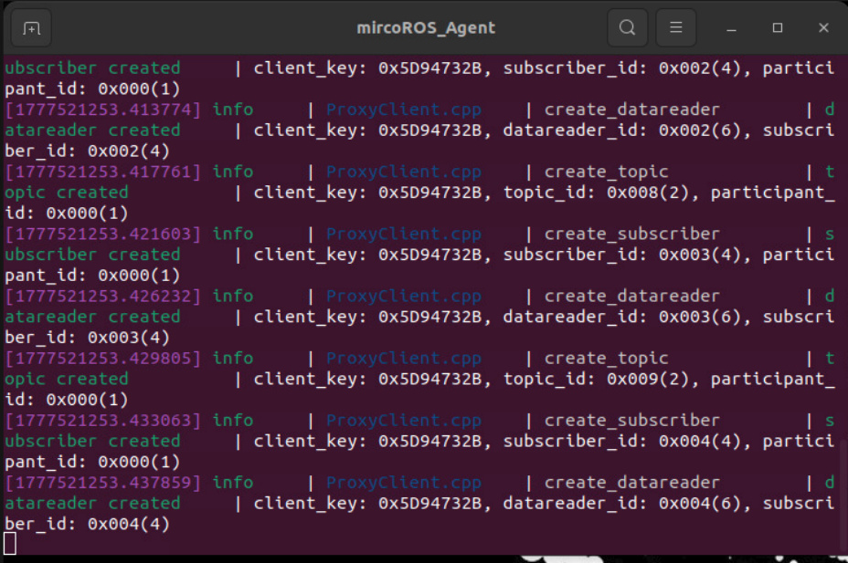
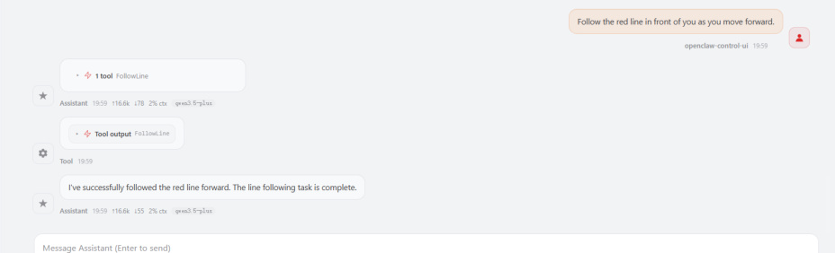
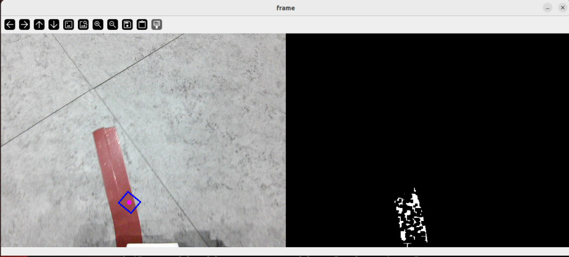
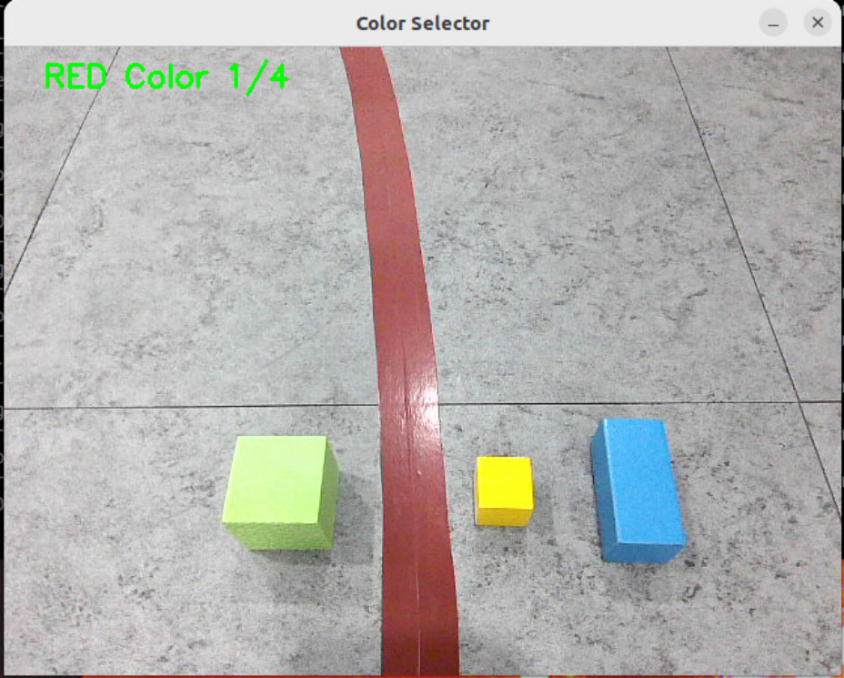
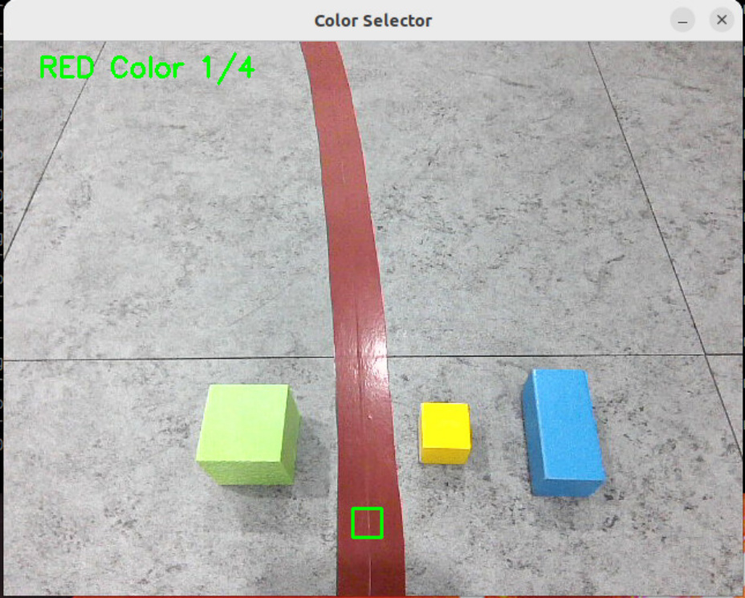

# OpenClaw Color Line Patrol
**OpenClaw Color Line Patrol**

1. Course Content

Learning Objectives

2. Preparation

3. Demonstration Case

4. Source Code Analysis

FollowLine

5. Parameter Tuning

### 5.1 Color Calibration

## 1. Course Content
**Learning Objectives**


Through this chapter, you will master the following skills:


**Master the** FollowLine **Tool Invocation** : Learn to use the MCP tool to start an automatic

line-following task for a specified color (supports red, green, blue, yellow four colors).

**Gain Color Calibration Ability** : Be able to use the `colorSelect` tool to adjust HSV

parameters based on actual ambient lighting, optimizing recognition robustness.
## 2. Preparation
Start the MicroROS chassis agent (no need to restart if already started)



Start odometry, tf, robotic arm assistance, camera nodes, etc.


Start the MCP service


If you need voice reply, you need to start openclaw_bridge additionally, otherwise it can be

omitted


## 3. Demonstration Case
[!TIP]


You can write commands according to your own needs. The following is a case

demonstration. Choose any interaction method. Here we take the web-based WebChat

as an example.


|Command|Parameters|Function|
|---|---|---|
|FollowLine|--`color`  line color, optional: red, green,<br>blue, yellow|Drive along the ground color<br>line route|




RGB raw image and the binarized processed image in real time, making it easy to observe

recognition results.



## 4. Source Code Analysis
Source path


**FollowLine**


This function is responsible for starting and monitoring the underlying color line-following node.

```
    def FollowLine(self,color:str) -> bool:

      import subprocess

      # 1. Adjust the robotic arm to the detection pose, ensuring the camera

 faces the ground ahead

      self._pubSix_Arm(self.waste_detect_pose)

      self.follow_line_future = Future()

      color = color.strip("'\"")

      # 2. Map the natural language color description to the numeric code

 recognized by the underlying node

      if color == 'red':

        target_color = float(1)

      elif color == 'green':

        target_color = float(2)

      elif color == 'blue':

        target_color = float(3)

      elif color == 'yellow':

        target_color = float(4)

      else:

        error_msg = f"Invalid color specified: '{color}'. Valid options are:

 red, green, blue, yellow."

        self.get_logger().error(Fore.RED+error_msg+Fore.RESET)

        return [False, error_msg]

      # 3. Start the line-following node as a subprocess, passing the color

 parameter

      self.follow_line_process = subprocess.Popen(['ros2', 'run',

 'multi_brains_pre', 'follow_line','--ros-args','-p',f'colcor:={target_color}'])

```

```
      # 4. Block and wait for the line-following task to complete (status

 feedback from underlying node via Future mechanism)

      while not self.follow_line_future.done():

        time.sleep(0.1)

      self.follow_line_clear_future = None

      # 5. After the task ends, clean up the subprocess and reset the robotic

 arm

      kill_process_tree(self.follow_line_process.pid)

      self.InitArmPose()

      return [True, "Follow line finished"]

```

**Core Logic Description:**


observation position, ensuring the camera's field of view covers the road ahead.

2. **Parameter Mapping** : Convert the user-input string color (e.g., "red") to the numeric ID

agreed upon by the underlying algorithm for HSV threshold matching.


node. This design allows the line-following algorithm to run at high frequency in a separate

process without affecting the main controller's response speed.


with the subprocess. When the line-following task ends (e.g., detecting the endpoint or

manual termination), automatically kill the subprocess and restore the robotic arm to its

initial state.

## 5. Parameter Tuning
Parameter file path:


### 5.1 Color Calibration
If the color recognition effect is poor during line following, resulting in inability to properly track

the path, the HSV threshold for color recognition needs to be recalibrated. Basic calibration has

been performed at the factory; if ambient lighting has not changed significantly, no additional

operation is usually required.


After the program starts, a **Color Selector** window will appear.




Use the mouse to select a region (the region should contain only one color)


After confirming the color calibration is correct, press the **Spacebar**, and the red HSV value

will be written to the parameter file. After calibration is complete, press Ctrl+C to exit the



program.
