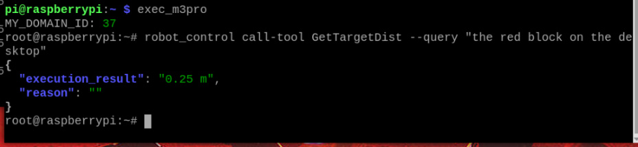

# OpenClaw Visual Distance Measurement
**OpenClaw Visual Distance Measurement**

1. Course Content

Learning Objectives

2. Preparation

3. Demonstration Case

4. Source Code Analysis

GetTargetDist

## 1. Course Content
**Learning Objectives**


natural language and obtain its relative distance to the robot body through the MCP tool.

**Familiarize with Pose Calculation Flow** : Understand the complete logic from extracting the


Euclidean distance.

**Gain Debugging and Verification Ability** : Be able to confirm the accuracy of the detected

target through the generated verification image ( `verify_image.png` ) and optimize the query

description based on the actual environment.
## 2. Preparation
Start the MicroROS chassis agent (no need to restart if already started)


Start odometry, tf, robotic arm assistance, camera nodes, etc.


Start the MCP service


If you need voice reply, you need to start openclaw_bridge additionally, otherwise it can be

omitted


## 3. Demonstration Case
[!TIP]


You can write commands according to your own needs. The following is a case

demonstration. Choose any interaction method. Here we take the web-based WebChat

as an example.


based on the user's natural language description (e.g., "the red cup in front") and calculate its

distance to the robot.

|Command|Parameters|Function|
|---|---|---|
|GetTargetDist|--`query`|Calculate the distance between the target and the robot<br>body based on object description|


image and marks the distance-measured target object in the image. The image save path is:


Similarly, when you need to debug and test the MCP tool, you can also call it via CLI:



## 4. Source Code Analysis
Source path


**GetTargetDist**


This function implements the visual distance measurement function based on natural language

description.

```
    def GetTargetDist(self, query:str):

      '''Get the distance to the target object'''

      # 1. Call the target detection service to get the bounding box of the

 specified object

      res=self.GetBbox(query)

      if not res[0]:

        return [False, res[1]]

      # 2. Parse the bounding box string and calculate the center pixel

 coordinates of the target in the image

      import ast

      bounding_box = ast.literal_eval(res[1])

      target_center_x = (bounding_box['x2'] + bounding_box['x1']) / 2

      target_center_y = (bounding_box['y2'] + bounding_box['y1']) / 2

      # 3. Check if the pose calculation service is available

      if not self.get_pose_client.wait_for_service(timeout_sec=8.0) :

        msg = "GetTargetPose service not available"

        self.get_logger().error(Fore.YELLOW + msg + Fore.RESET)

        return [False, msg]

      # 4. Call the GetTargetPose service to convert pixel coordinates to 3D

 pose in the robot coordinate system

      request = GetTargetPose.Request(x=float(target_center_x),

 y=float(target_center_y), radius=self.target_circle)

      result:GetTargetPose.Response = self.get_pose_client.call(request)

      if not result.success:

        error_msg=result.message

        self.get_logger().error(error_msg)

        return [False, error_msg]

      # 5. Calculate the horizontal Euclidean distance from the target point

 to the robot origin

      import math

```

```
      distance = round(math.sqrt((result.pose.position.x ** 2) +

 (result.pose.position.y ** 2)), 2)

      return [True, distance]

```

**Core Logic Description:**


1. **Semantic Localization** : First, use the `GetBbox` interface to locate the target in the image


2. **Coordinate Transformation** : Extract the center point `(center_x, center_y)` of the

Bounding Box as the reference point for visual distance measurement.


and extrinsic calibration information, back-project the 2D pixel point into 3D space to obtain

the target's displacement relative to the camera.

4. **Distance Calculation** : Finally, use the Pythagorean theorem to calculate the straight-line

distance of the target on the horizontal plane, providing data support for navigation or

approach tasks.
