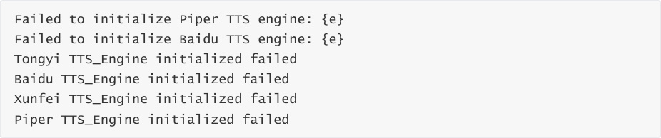
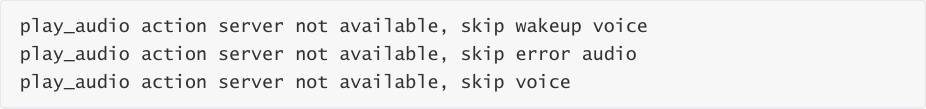
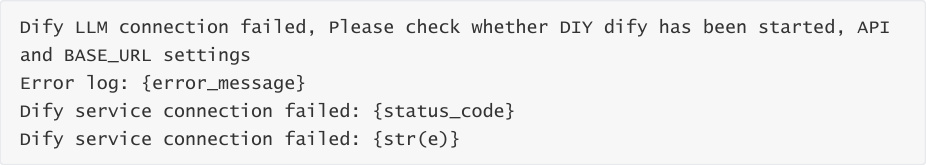
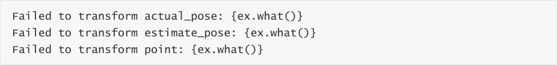
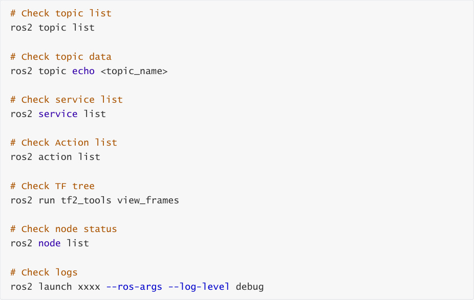

# Summary Of Common Errors And Solutions
**Summary Of Common Errors And Solutions**

1. Multi_Brains_Pre Package

### 1.1 Configuration File Related Errors

Error 1.1.1: Configuration File Not Found

Error 1.1.2: YAML Parsing Failed

### 1.2 ASR Speech Recognition Related Errors

Error 1.2.1: ASR Engine Initialization Failed

Error 1.2.2: Speech Recognition Failed

Error 1.2.3: VAD Engine Initialization Failed

Error 1.2.4: Audio Stream Open Failed

Error 1.2.5: No Speech Detected

Error 1.2.6: Unsupported Language

### 1.3 TTS Speech Synthesis Related Errors

Error 1.3.1: TTS Engine Initialization Failed

Error 1.3.2: Speech Synthesis Failed

### 1.4 Voice Wakeup Module Serial Communication Related Errors

Error 1.4.1: Serial Port Open Failed

Error 1.4.2: Serial Port Reconnection Failed

Error 1.4.3: Serial Port Send Failed

### 1.5 ROS Communication Related Errors

Error 1.5.1: Action Server Unavailable

Error 1.5.2: Action Goal Rejected

### 1.6 Large Model Service Related Errors

Error 1.6.1: Dify Connection Failed

Error 1.6.2: Model Request Failed

### 1.7 Motion Control Related Errors

Error 1.7.1: TF Transform Acquisition Failed

Error 1.7.2: TF Timestamp Too Old

Error 1.7.3: Joint Values Not Initialized

### 1.8 Audio Playback Related Errors

Error 1.8.1: Wakeup Audio Loading Failed

2. Waste_Classify Module

### 2.1 Model Loading Related Errors

Error 2.1.1: Model File Not Found

Error 2.1.2: YOLO Model Initialization Error

Error 2.1.3: Model Inference Startup Failed

### 2.2 Image Detection Related Errors

Error 2.2.1: Image Shape Not Initialized

Error 2.2.2: Image Save Failed

3. Pcl_Seg Point Cloud Segmentation Module

### 3.1 Depth Image Processing Errors

Error 3.1.1: Invalid ROI Region (Common)

Error 3.1.2: No Depth Image

Error 3.1.3: No Valid Depth Points In Circular Region

Error 3.1.4: Target Point Outside Image Boundary

Error 3.1.5: Invalid Radius Value

### 3.2 TF Transform Related Errors

Error 3.2.1: TF Transform Not Available

Error 3.2.2: TF Transform Failed

### 3.3 Point Cloud Processing Related Warnings


Error 3.3.1: ROI Point Cloud Empty

Error 3.3.2: No Cluster Found

Error 3.3.3: No Valid Center Data

4. Super_Tracker Target Tracking Module

### 4.1 Tracker Initialization Errors

Error 4.1.1: Tracker Creation Failed

Error 4.1.2: Display Window Configuration Conflict

### 4.2 Image Frame Processing Warnings

Error 4.2.1: Received Empty Or Invalid Frame

### 4.3 ROI Selection Errors

Error 4.3.1: Cannot Select ROI On Empty Frame

Error 4.3.2: Invalid ROI Selected

Error 4.3.3: Set Track ROI Failed

Error 4.3.4: Tracking Start Failed

5. General Troubleshooting Suggestions

### 5.1 Log Level Adjustment

### 5.2 Common Diagnostic Commands

## 1. Multi_Brains_Pre Package
### 1.1 Configuration File Related Errors
**Error 1.1.1: Configuration File Not Found**


**Error Log:**


**Cause:**


The multi_brains_pre_setting.yaml configuration file path does not exist

The file has been deleted or moved


**Solution:**


1. Copy multi_brains_pre_setting.yaml from the attached source code to the specified directory


**Error 1.1.2: YAML Parsing Failed**


**Error Log:**


**Cause:**


YAML file format error (incorrect indentation, unescaped special characters, etc.)


**Solution:**


1. Modify multi_brains_pre_setting.yaml, refer to the factory file format in the attached source

code


### 1.2 ASR Speech Recognition Related Errors
**Error 1.2.1: ASR Engine Initialization Failed**


**Error Log:**


**Cause:**


API Key configuration error or invalid

Model name not supported

Network issue (online ASR)

Key file decryption failed (Xunfei ASR)


**Solution:**


2. Confirm the model name used is in the supported list:

paraformer-realtime-v2/v1

paraformer-realtime-8k-v2/v1

gummy-realtime-v1/gummy-chat-v1

3. For Xunfei ASR, check the key file path and decryption


4. Test network connection


**Error 1.2.2: Speech Recognition Failed**


**Error Log:**


**Cause:**


API invalid

Online speech recognition service unavailable


**Solution:**


1. Check network connection stability

2. Check if API quota has been exhausted


**Error 1.2.3: VAD Engine Initialization Failed**


**Error Log:**


**Cause:**


VAD model file does not exist

Model path configuration error


voice_toolbox library not properly installed


**Solution:**


1. Check if the `silero_vad.int8.onnx` model file has been deleted

2. Download the VAD model file from the attached source code


**Error 1.2.4: Audio Stream Open Failed**


**Error Log:**


**Cause:**


Microphone device not connected

Audio device occupied by another program


**Solution:**


1. Check if the microphone device is properly connected


3. Close other programs occupying the audio device


**Error 1.2.5: No Speech Detected**


**Warning Log:**


**Cause:**


Microphone volume too low

Ambient noise too high


**Solution:**


1. Increase the microphone input volume

2. Reduce ambient noise

3. Speak closer to the microphone


**Error 1.2.6: Unsupported Language**


**Warning Log:**


**Cause:**


Configured unsupported language code

LANGUAGE parameter set incorrectly


**Solution:**


1. Change the LANGUAGE parameter to 'zh' (Chinese) or 'en' (English)


2. Check the language setting in the configuration file

**$HOME/M3Pro_ws/src/m3pro_bringup/config/multi_brains_pre_setting.yaml**

### 1.3 TTS Speech Synthesis Related Errors
**Error 1.3.1: TTS Engine Initialization Failed**


**Error Log:**


**Cause:**


TTS model file missing

API Key configuration error

Configuration file read failure

Key file decryption failed (Xunfei TTS)


**Solution:**


1. **Piper TTS** :


2. **Online TTS (Alibaba Cloud/Baidu/Xunfei)** :

Check if the corresponding API Key is correctly configured

Verify network connection

3. Check if the configuration file format is correct


**Error 1.3.2: Speech Synthesis Failed**


**Error Log:**





**Cause:**


TTS engine not properly initialized?

Online speech service unavailable?


**Solution:**


1. Confirm the TTS engine has been properly initialized

2. Check the specific error message for targeted handling


### 1.4 Voice Wakeup Module Serial Communication Related
**Errors**


**Error 1.4.1: Serial Port Open Failed**


**Error Log:**


**Cause:**


Voice wakeup serial device does not exist

Hardware connection issue


**Solution:**


2. Check if the hardware connection is secure


**Error 1.4.2: Serial Port Reconnection Failed**


**Warning Log:**


**Cause:**


Hardware device disconnected


**Solution:**


1. Replug the USB device


**Error 1.4.3: Serial Port Send Failed**


**Error Log:**


**Cause:**


Serial connection disconnected

Buffer overflow

Voice wakeup device not responding


**Solution:**


1. Check serial connection status

2. Restart the program

3. Check if the hardware device is working properly


### 1.5 ROS Communication Related Errors
**Error 1.5.1: Action Server Unavailable**


**Warning Log:**





**Cause:**


common_service node not started


**Solution:**


1. Confirm the common_service node has started

2. Use `ros2 action list` to check available actions


**Error 1.5.2: Action Goal Rejected**


**Warning Log:**


**Cause:**


Audio file path does not exist


**Solution:**


1. Check if the audio file exists

2. Check the specific rejection reason in the logs

### 1.6 Large Model Service Related Errors
**Error 1.6.1: Dify Connection Failed**


**Error Log:**





**Cause:**


Dify service not started

BASE_URL configuration error

**API Key invalid** (most common issue, the Dify app API does not match DIFY_API_KEY in the

configuration file)


**Solution:**


1. Confirm the Dify service has started and is running properly

2. Check the DIFY_BASE_URL configuration (e.g., [http://localhost/v1)](http://localhost/v1)

3. Verify the DIFY_API_KEY is correct

4. Use curl to test the connection: `curl`  - `H "Authorization: Bearer {API_KEY}"`

```
   {BASE_URL}/meta

```

**Error 1.6.2: Model Request Failed**


**Error Log:**


**Cause:**


Dify service异常

Model service down

Model API has no quota

Timeout


**Solution:**


1. Check Dify service status

2. Check Dify service logs

3. Check API account

4. Restart the Dify service

### 1.7 Motion Control Related Errors
**Error 1.7.1: TF Transform Acquisition Failed**


**Error Log:**


**Cause:**


TF tree incomplete

pcl_segment node not publishing TF

Target tracking lost the target


**Solution:**


2. Confirm the pcl_segment node is running properly

3. Ensure the node is tracking the target


**Error 1.7.2: TF Timestamp Too Old**


**Warning Log:**


**Cause:**


TF publish frequency too low

System latency too high, CPU load too high

Target tracking lost the target


**Solution:**


1. Increase TF publish frequency

2. Optimize system performance


4. Disable unnecessary nodes


**Error 1.7.3: Joint Values Not Initialized**


**Warning Log:**


**Cause:**


Robotic arm query service call failed

Initialization process not completed


**Solution:**


1. Check if the robotic arm service is normal

2. Verify if the arm_util node has started

3. Check the service call logs

### 1.8 Audio Playback Related Errors
**Error 1.8.1: Wakeup Audio Loading Failed**


**Error Log:**


**Cause:**


Audio file directory does not exist

File format not supported


**Solution:**


2. Confirm the WAV file exists and the format is correct

3. Check file read permissions

4. Reinstall the multi_brains_pre package


## 2. Waste_Classify Module
### 2.1 Model Loading Related Errors
**Error 2.1.1: Model File Not Found**


**Error Log:**


**Cause:**


YOLO model path configuration error

File deleted or moved


**Solution:**


2. Confirm the model file exists

3. Re-download the YOLO model file from the attached source code


**Error 2.1.2: YOLO Model Initialization Error**


**Error Log:**


**Cause:**


Factory system Python environment corrupted

Model file format error

Insufficient memory


**Solution:**


1. Check if the model file is in a valid ONNX format


3. Check if system memory is sufficient


**Error 2.1.3: Model Inference Startup Failed**


**Error Log:**


**Cause:**


Shared memory creation failed

Multi-process startup failed

Insufficient resources


**Solution:**


1. Check system shared memory limit: `sysctl kernel.shmmax`


2. Check system logs for detailed error information

### 2.2 Image Detection Related Errors
**Error 2.2.1: Image Shape Not Initialized**


**Error Log:**


**Cause:**


Camera not started

Image topic not published


**Solution:**


1. Confirm the camera node has started

```
   /camera/color/image_raw
```

3. Restart the carbase launch file


**Error 2.2.2: Image Save Failed**


**Error Log:**


**Cause:**


Output directory does not exist

Insufficient disk space

Camera node not started


**Solution:**


1. Check the file path configuration

## 3. Pcl_Seg Point Cloud Segmentation Module
### 3.1 Depth Image Processing Errors
**Error 3.1.1: Invalid ROI Region (Common)**


**Warning Log:**


**Cause:**


Track box coordinates exceed image boundaries

Track box dimensions are zero or negative


No depth information in the target region


**Solution:**


1. Check if the track box coordinates are reasonable

2. Check in rviz if the target has depth information


**Error 3.1.2: No Depth Image**


**Warning Log:**


**Cause:**


Depth camera not started

Topic subscription failed

Depth image not published


**Solution:**


1. Confirm the depth camera driver has started


3. Verify camera hardware connection

4. Restart the camera node


**Error 3.1.3: No Valid Depth Points In Circular Region**


**Warning Log:**


**Cause:**


Target point too far or too close, no depth information near the target point

Depth value invalid (0 or超出阈值)


**Solution:**


1. Adjust the camera viewing angle and target point position

2. Check if the depth camera is working properly

3. Check in rviz if the target has depth information

4. Reduce ambient lighting


**Error 3.1.4: Target Point Outside Image Boundary**


**Warning Log:**


**Cause:**


Requested coordinates exceed image range


Coordinate calculation error

Image resolution change


**Solution:**


1. Verify the coordinate calculation logic

2. Check the image resolution configuration

3. Add boundary checking

4. Use valid coordinate values


**Error 3.1.5: Invalid Radius Value**


**Warning Log:**


**Cause:**


Radius parameter is negative or zero

Parameter passing error


**Solution:**


1. Ensure the radius value is positive

2. Check the service call parameters

3. Use a reasonable radius value (recommended 5-50 pixels)

### 3.2 TF Transform Related Errors
**Error 3.2.1: TF Transform Not Available**


**Warning Log:**


**Error Log:**


**Cause:**


Missing necessary transform in the TF tree

Camera coordinate system not configured

TF publish node not started


**Solution:**


2. Ensure the camera driver publishes the correct TF

3. Check if the transform from base_link to camera is correctly defined


**Error 3.2.2: TF Transform Failed**


**Error Log:**





**Cause:**


Coordinate system does not exist

Transform data异常

Timestamp issue


**Solution:**


1. Check if the coordinate system name is correct

2. Verify TF data validity

3. Check timestamp synchronization

### 3.3 Point Cloud Processing Related Warnings
**Error 3.3.1: ROI Point Cloud Empty**


**Debug Log:**


**Cause:**


No valid depth values within the ROI region

Distance threshold set too small

Target超出 distance range


**Solution:**


2. Adjust the ROI region size

3. Ensure the target is within valid distance

4. Check depth image quality


**Error 3.3.2: No Cluster Found**


**Debug Log:**


**Cause:**


Insufficient point cloud density

Clustering parameters set improperly

Target too small or too far


**Solution:**


1. Decrease the `cluster_min_size` parameter

2. Increase the `cluster_max_size` parameter

3. Adjust the `ClusterTolerance` parameter

4. Ensure the target is close enough and clear


**Error 3.3.3: No Valid Center Data**


**Warning Log:**


**Cause:**


Depth image not yet processed

Clustering failed


**Solution:**


1. Ensure depth image is being processed properly

2. Check if point cloud segmentation was successful

## 4. Super_Tracker Target Tracking Module
### 4.1 Tracker Initialization Errors
**Error 4.1.1: Tracker Creation Failed**


**Error Log:**


**Cause:**


Model file does not exist


**Solution:**


1. Check the model file path: `$HOME/MODELS/tracker/mixformer_v2_sim.onnx`

2. Adjust the `num_threads` parameter


**Error 4.1.2: Display Window Configuration Conflict**


**Error Log:**


**Cause:**


Both display parameters set to true simultaneously


Configuration logic conflict


**Solution:**


1. Enable only one of the parameters:


2. Modify the configuration file to ensure both are not true at the same time

### 4.2 Image Frame Processing Warnings
**Error 4.2.1: Received Empty Or Invalid Frame**


**Warning Log:**


**Cause:**


Camera not publishing images properly


**Solution:**


1. Check the camera node running status


2. Use `ros2 topic hz /camera/color/image_raw` to check publish frequency

### 4.3 ROI Selection Errors
**Error 4.3.1: Cannot Select ROI On Empty Frame**


**Error Log:**


**Cause:**


No image frame received yet

Image frame is empty


**Solution:**


1. Wait for the camera to publish images normally before selecting ROI

2. Check camera connection

3. Confirm the image topic has data


**Error 4.3.2: Invalid ROI Selected**


**Warning Log:**


**Cause:**


User cancelled ROI selection

Selected ROI width or height is zero or negative


**Solution:**


1. Re-select a valid ROI region

2. Ensure the ROI region has sufficient size (recommended at least 20x20 pixels)

3. Fully框选 the target in the image


**Error 4.3.3: Set Track ROI Failed**


**Error Log:**


**Cause:**


Image frame is empty

Tracker initialization异常

ROI coordinates invalid


**Solution:**


1. Ensure a valid image frame is passed

2. Check if ROI coordinates are within the image range

3. Verify tracker status

4. Re-initialize the tracker


**Error 4.3.4: Tracking Start Failed**


**Error Log:**


**Cause:**


Current camera frame invalid

ROI setting failed

Tracker异常


**Solution:**


1. Confirm camera image is normal

2. Check ROI coordinate validity

3. Check the specific error log

## 5. General Troubleshooting Suggestions
### 5.1 Log Level Adjustment
If you encounter issues, enable debug log mode and send the complete error output to

technical support

ROS log level: `ros2 launch xxxx` -- `ros`   - `args` -- `log`   - `level debug`

### 5.2 Common Diagnostic Commands

