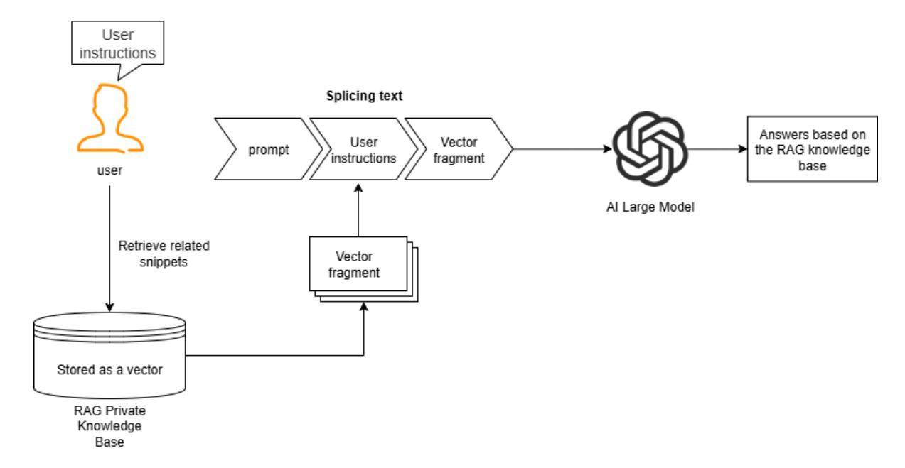

# **RAG Retrieval Enhancement and Model Training Samples**

### **1. Course Content**

1. This course introduces the concepts of large model hallucination, RAG retrieval enhancement, and model training samples, laying the theoretical foundation for subsequent practical application and facilitating subsequent understanding and operation.

### **2. What is large model hallucination? Why do large models experience hallucinations?**

RAG retrieval enhancement and model training samples are primarily designed to reduce large model hallucinations. Let's first understand large model hallucinations.

Large model hallucinations refer to situations where the model outputs content that is inconsistent with real-world facts and logic when understanding the environment, generating instructions, or planning actions, resulting in incorrect robot behavior or significant deviations from user expectations.

Why do large model hallucinations occur? **Large models are essentially probabilistic prediction systems trained on massive amounts of text**. In certain domains or scenarios, the training data may lack sufficient samples, causing the model to "fabricate" content to fill gaps.

### **3. RAG Retrieval Enhancement and Training Examples**

#### **3.1 RAG Retrieval Enhancement**

RAG is an architecture that combines a retrieval system with a generation model. It aims to address the limitations of traditional generation models in scenarios such as open-domain knowledge question answering and real-time information querying (e.g., knowledge obsolescence, factual hallucinations, and dependencies on long text). Its core logic is to retrieve relevant knowledge through retrieval and incorporate it into prompts, allowing the large model to reference this knowledge, achieving a "retrieval first, generation later" approach.

#### **3.2 Training Examples**

Training examples are contained in the RAG knowledge base. The robot comes pre-installed with two knowledge bases: the action function library and the training example library. The training examples include training samples from the course case scenarios, providing insights for the Large model's decision-making and planning in specific scenarios. The subsequent sections [2. AI Large Model Basics - 5. Configuring the AI Large Model] will explain how to configure and extend the proprietary knowledge base and training examples.

## **4. RAG Retrieval Enhancement and the Role of Training Examples in Robots**

### **4.1 Reducing Large Model Illusions**

When a Large model encounters a completely new domain or unique user requirements, it will generate possible results based on the existing training data. However, these results may differ from the user's expectations or not meet the requirements of a specific scenario.

### **4.2 Improving the Robot's Scenario Generalization**

The robot is pre-installed with training examples related to the course cases (detailed in the "Configuring the Large Model" section). These training examples provide reference information for the Large model in specific scenarios. Users can also add their own training examples to customize the robot for different application areas.

### **4.3 Reducing Model Prompts**

If the number of training examples and knowledge base is small, they can be placed directly in the Large model prompt. Prompts are information that users need to provide to the Large model, such as roles and requirements, in advance. If you need to add your own training scenarios and robot action function libraries, as the knowledge base grows, longer prompts will consume more tokens. Therefore, we have introduced RAG search enhancements to centrally manage the robot action function library and training examples.

### **4.4 Easily Expand and Manage Robot Capabilities**

The Alibaba Bailian Large Model Platform (Tongyi Qianwen Platform) provides online management of knowledge bases and training examples, allowing users to conveniently manage and expand data. Domestic users use the Alibaba Bailian Large Model Platform by default to manage action function libraries and training examples. International users use the locally deployed Dify to manage knowledge base content.