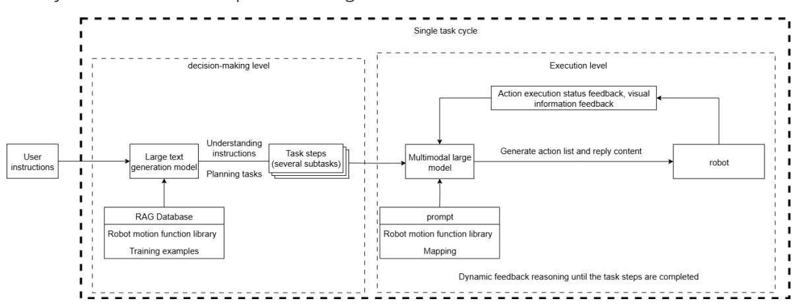
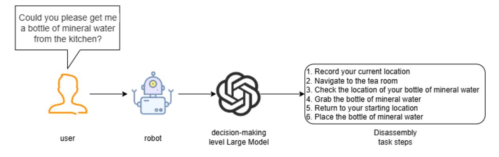
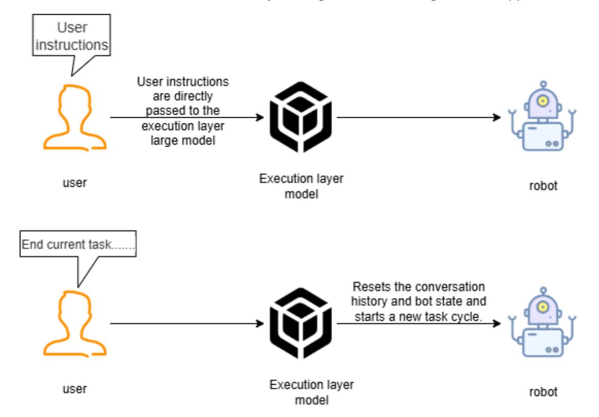
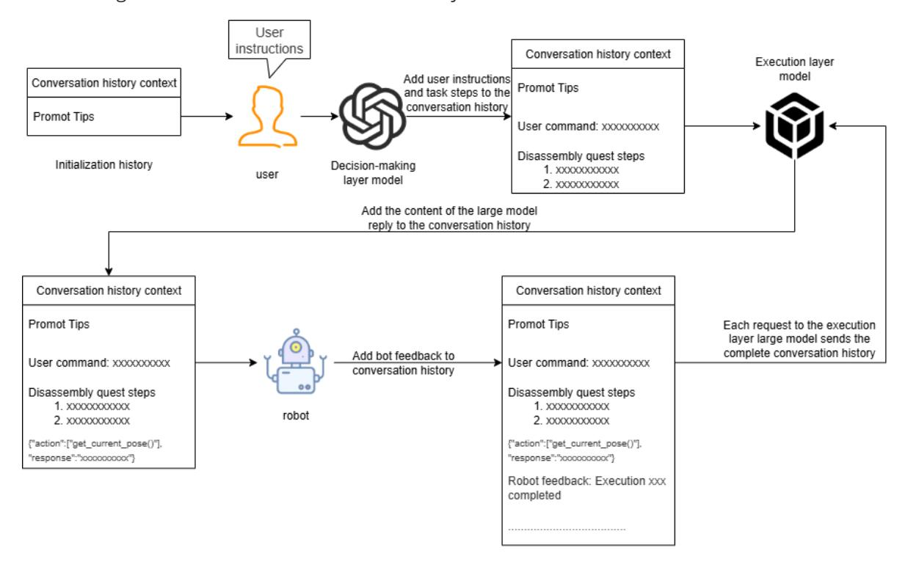
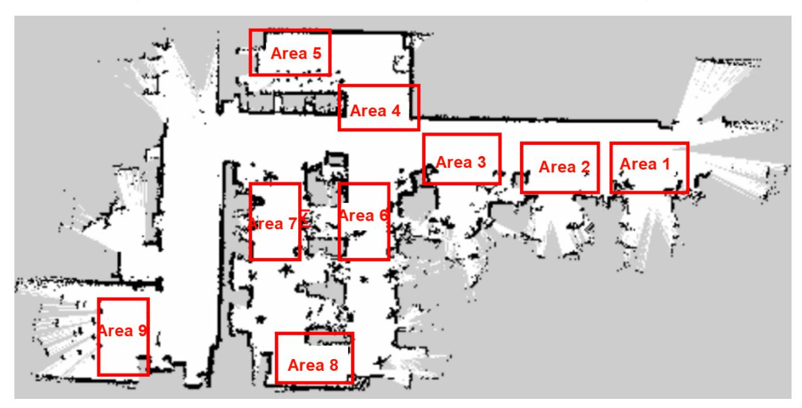
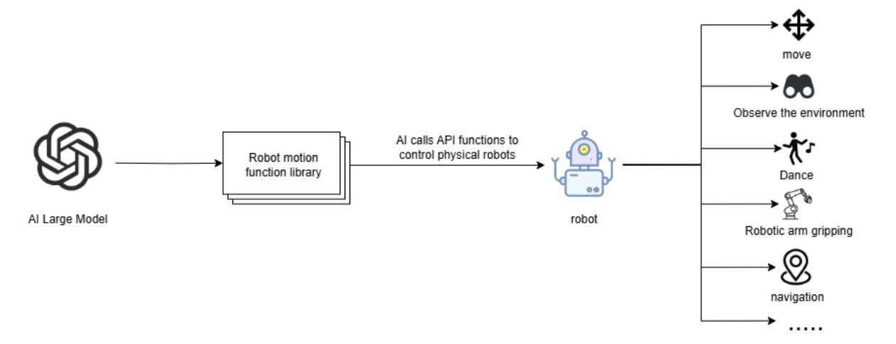

# **Multi-Agent Embodied Architecture (multi\_brains)**

#### **Multi-Agent Embodied [Architecture \(multi\\_brains\)](#page-0-0)**

- <span id="page-0-0"></span>[1. Course](#page-0-1) Content
- [2. Introduction](#page-0-2) to multi\_brains
  - 3.1 [Advantages](#page-1-0) of Dual-Model Inference
    - 3.1.1 Decoupling of [Task Decision](#page-1-1) and Action Conversion
    - 3.1.2 [Improved Success](#page-1-2) Rate for Long-Process Tasks
  - 3.2 [Decision-Making](#page-1-3) Layer AI
  - 3.3 [Execution](#page-2-0) Layer AI
- [4. Task Cycle](#page-2-1)
- [5. Historical](#page-3-0) Context
- [6. Map Mapping](#page-3-1)
- <span id="page-0-1"></span>7. Action [Function](#page-4-0) Library

#### **1. Course Content**

Understanding the multi\_brains multi-agent embodied architecture framework of ROSMASTER-M3 Pro

# **2. Introduction to multi\_brains**

- <span id="page-0-2"></span>multi\_brains is a self-developed embodied intelligence framework by Yabao Intelligent, adapted for general-purpose AI large models. It avoids the limitations of VLA models and end-to-end models, which require dedicated hardware, local computing power, and long data collection and training times. By simply connecting to general-purpose AI models from cloud model providers, the edge-side robot can achieve powerful embodied intelligence.
- multi\_brains expands training examples through a RAG knowledge base, allowing the robot to quickly adapt to different scenarios and tasks. It can be deployed on most small main control devices, offloading the massive model inference to the cloud or a local server.
- The core idea of multi\_brains is to decouple different stages of a task through multiple AI models. It is a comprehensive improvement on the first-generation self-developed dualmodel inference framework. Its main improvements include:
- Smoother recording experience with inertial end-of-speech detection and adjustable end-ofspeech detection duration.
- More flexible decision-making mechanism, adding task routing functionality. The AI agent can independently choose between dual-model and single-model inference based on task difficulty, giving the AI greater autonomy and a better user experience.
- Easy-to-understand visualized architecture process. multi\_brains uses Dify to build a visualized intelligent agent, allowing real-time observation of the AI agent's operation and data flow during debugging, providing users with a more intuitive understanding of the dualmodel inference process.
- Fully localized RAG knowledge base, eliminating concerns about data sensitivity.
- Seamless integration with most global AI models. Through Dify's model provider plugin, hundreds of AI models worldwide can be quickly and seamlessly integrated (local models can also be integrated if needed).

- Traceable history. By querying Dify's backend access history, users can view all task instructions and the robot's execution steps.
- Personalized response voice. Users can customize random response voices. The built-in speech synthesis commands are easy to configure and use.
- Comprehensive testing toolbox for quickly verifying core functional modules.
- Simpler setup steps, simplifying most operations and providing shortcut commands. ## 3. Dual-Model Inference Architecture
- The design of **dual-model inference** and **dynamic feedback inference** provides stronger system robustness compared to a single-model architecture.



#### **3.1 Advantages of Dual-Model Inference**

#### **3.1.1 Decoupling of Task Decision and Action Conversion**

- <span id="page-1-1"></span><span id="page-1-0"></span>The decision-making layer AI focuses on thinking, planning, and breaking down task instructions.
- <span id="page-1-2"></span>The execution layer AI focuses on chat responses and converting task steps into JSON text.

#### **3.1.2 Improved Success Rate for Long-Process Tasks**

When using a single-model approach for inference, it requires simultaneous "natural language understanding + environmental perception + process decomposition + action function output," which is prone to **modal interference** (language ambiguity or overly long instructions leading to misinterpretation). The dual-model approach processes in stages, allowing the decision-making layer to focus on task planning and the execution layer to focus on action execution.

#### **3.2 Decision-Making Layer AI**

<span id="page-1-3"></span>The decision-making layer large language model is primarily responsible for task planning. It can understand complex human instructions and break them down into specific task steps. For example, when receiving the instruction "Can you get me a bottle of mineral water from the kitchen?", the large language model will break it down into several tasks, as shown in the figure below.



#### **3.3 Execution Layer AI**

- <span id="page-2-0"></span>The execution layer large language model is primarily responsible for chat responses and converting task steps into JSON text. It continuously receives feedback (success/failure) and images from the robot's execution of actions, and provides instructions for the next action based on the success or failure of the action execution.
- The execution layer large language model acts as a supervisor, continuously monitoring the robot's progress in executing task steps and thinking and judging the next action to be performed based on the feedback from the robot's actions and environmental information, until the task is successfully completed or terminated prematurely due to special circumstances.


## **4. Task Cycle**

- <span id="page-2-1"></span>After the robot is awakened, a task cycle begins. All user commands and robot feedback are included in the AI model's historical context, acting as the robot's temporary memory, allowing it to "remember" what happened before.
- When the user requests to end the current task and have the robot rest, the robot resets the AI model's historical context, effectively causing the robot to "forget" what happened before.



# **5. Historical Context**

<span id="page-3-0"></span>The robot's conversation history is stored in DIfy's AI application variables, with a default setting of a maximum conversation memory of 50 turns.



## **6. Map Mapping**

<span id="page-3-1"></span>The robot uses a grid map for navigation. If the robot needs to understand location areas in the real world, a mapping relationship needs to be established between the grid map and the real-world environment areas. This relationship is called **map mapping**. - Let's assume we use a robot in a factory environment to generate a **grid map** using SLAM mapping. In the real factory, there are several manually defined areas, as shown in the image below:



We establish a one-to-one correspondence between these real-world areas and letter symbols:

A: "Area 1", B: "Area 2", C: "Area 3", D: "Area 4", E: "Area 5", F: "Area 6", G: "Area 7", H: "Area 8", I: "Area 9"

Then, we write the map coordinates for the letter symbols in a YAML file, for example:

```
A:
name: 'Area 1'
position:
  x: 4.4034953117370605
  y: 0.4879316985607147
orientation:
  x: 0.0
  y: 0.0
  z: 0.701498621044694
  w: 0.7126708108744126
```

When we want the robot to go to a specific real-world area, we simply have the large language model convert the area name into the corresponding letter symbol, allowing the robot to understand the location in the real-world environment.

#### **7. Action Function Library**

- <span id="page-4-0"></span>The API functions in the robot action function library are the bridge for the large language model to control the robot and interact with the real world.
- These API functions define the minimum actions that the physical robot can perform in the physical world.
- The AI large language model sends the required actions to the robot as JSON text, and the robot parses the JSON text to execute the corresponding actions.



All the minimum action functions and their corresponding functionalities are shown in the table below:

| Function Name                                             | Parameters                                                                                                                                                       | Functionality                                                                             | Calling<br>Command                               |
|-----------------------------------------------------------|------------------------------------------------------------------------------------------------------------------------------------------------------------------|-------------------------------------------------------------------------------------------|--------------------------------------------------|
| move_left(x,<br>angular_speed)                            | x: rotation angle,<br>angular_speed:<br>angular velocity                                                                                                         | Rotate left by x<br>degrees                                                               | Rotate left<br>by x degrees                      |
| move_right(x,<br>angular_speed)                           | x: rotation angle,<br>angular_speed:<br>angular velocity                                                                                                         | Rotate right by x<br>degrees                                                              | Rotate right<br>by x degrees                     |
| dance()                                                   | -                                                                                                                                                                | Trigger the robot's<br>preset dance<br>movements                                          | Dance,<br>perform a<br>dance, etc.               |
| set_cmdvel(linear_x,<br>linear_y, angular_z,<br>duration) | linear_x: x-axis<br>linear velocity,<br>linear_y: y-axis<br>linear velocity,<br>angular_z: z-axis<br>angular velocity,<br>duration: topic<br>publishing duration | Control the robot's<br>chassis movement<br>by setting linear<br>and angular<br>velocities | Move<br>forward,<br>backward,<br>left, right     |
| navigation(x)                                             | x: the symbol<br>corresponding to<br>the target point in<br>the map mapping                                                                                      | Control the robot<br>to navigate to the<br>target point                                   | Navigate to<br>a certain<br>location             |
| navigation(zero)                                          | zero: the recorded<br>coordinate point                                                                                                                           | Navigate back to<br>the previously<br>recorded<br>coordinate point                        | Return to<br>the origin,<br>starting<br>position |
| get_current_pose()                                        | -                                                                                                                                                                | Record the current<br>coordinates in the<br>global map to the<br>zero parameter           | Remember<br>the current<br>position              |
| arm_up()                                                  | -                                                                                                                                                                | Move the robotic<br>arm upwards                                                           | Robotic arm<br>up                                |
| arm_down()                                                | -                                                                                                                                                                | Move the robotic<br>arm downwards                                                         | Robotic arm<br>down                              |
| arm_nod()                                                 | -                                                                                                                                                                | Robotic arm nods                                                                          | Nod                                              |
| arm_shake()                                               | -                                                                                                                                                                | Robotic arm<br>shakes its head                                                            | Shake head                                       |
| arm_applaud()                                             | -                                                                                                                                                                | Robotic arm<br>applauds                                                                   | Applaud                                          |

| Function Name                              | Parameters                                                                                                                      | Functionality                                                                                          | Calling<br>Command                                                                              |
|--------------------------------------------|---------------------------------------------------------------------------------------------------------------------------------|--------------------------------------------------------------------------------------------------------|-------------------------------------------------------------------------------------------------|
| grasp_obj(x1, y1, x2, y2)                  | (x1, y1, x2, y2)<br>coordinates of the<br>top-left and<br>bottom-right points<br>of the bounding<br>box of the target<br>object | Robotic arm grasps<br>an object                                                                        | Grasp xxx                                                                                       |
| putdown()                                  | -                                                                                                                               |                                                                                                        |                                                                                                 |
| apriltag_sort(x)                           | x: machine code<br>number                                                                                                       | Sort out the<br>machine code with<br>the specified<br>number                                           | Sort out<br>machine<br>code<br>number x                                                         |
| track(x1, y1, x2, y2)                      | (x1, y1, x2, y2)<br>Coordinates of the<br>top-left and<br>bottom-right points<br>of the bounding<br>box of the target<br>object | Track the specified<br>object within the<br>field of view                                              | Track xx                                                                                        |
| apriltag_remove_higher(x)                  | x: height                                                                                                                       | Remove machine<br>codes at the<br>specified height                                                     | Remove<br>machine<br>codes higher<br>than x<br>centimeters                                      |
| color_remove_higher(color,<br>target_high) | color: color<br>target_high: height                                                                                             | Remove color<br>blocks at the<br>specified height                                                      | Remove<br>color blocks<br>of color with<br>height<br>greater than<br>target_high<br>centimeters |
| seewhat()                                  | -                                                                                                                               | Take an image of<br>the robot's current<br>view and upload it<br>to the execution<br>layer large model | Observe the<br>environment                                                                      |
| follw_line_clear()                         | -                                                                                                                               | Move along the<br>patrol line and<br>clear machine code<br>obstacles on the<br>path                    | Start line<br>clearing                                                                          |

| Function Name     | Parameters | Functionality                                                                                                                                     | Calling<br>Command |
|-------------------|------------|---------------------------------------------------------------------------------------------------------------------------------------------------|--------------------|
| finish_dialogue() | -          | Reset historical<br>context and start a<br>new task cycle                                                                                         | -                  |
| finish()          | -          | Automatically<br>called after the<br>robot completes<br>the task, used to<br>stop providing<br>status feedback to<br>the execution layer<br>model | -                  |