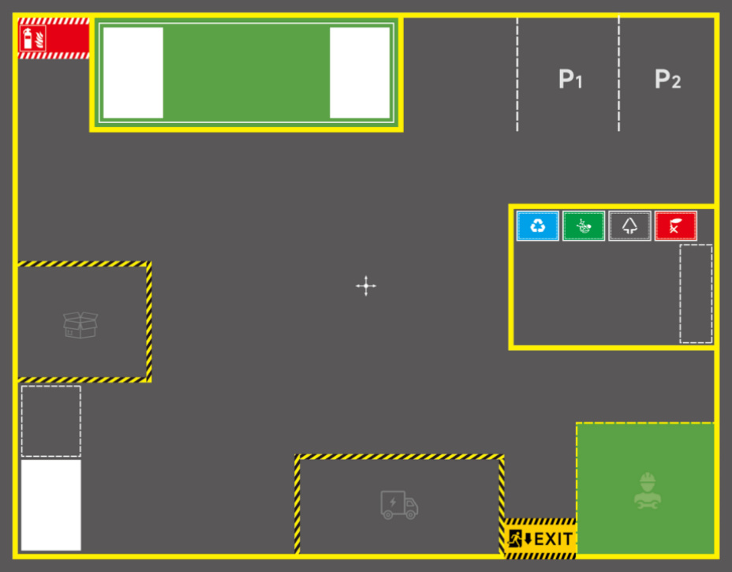
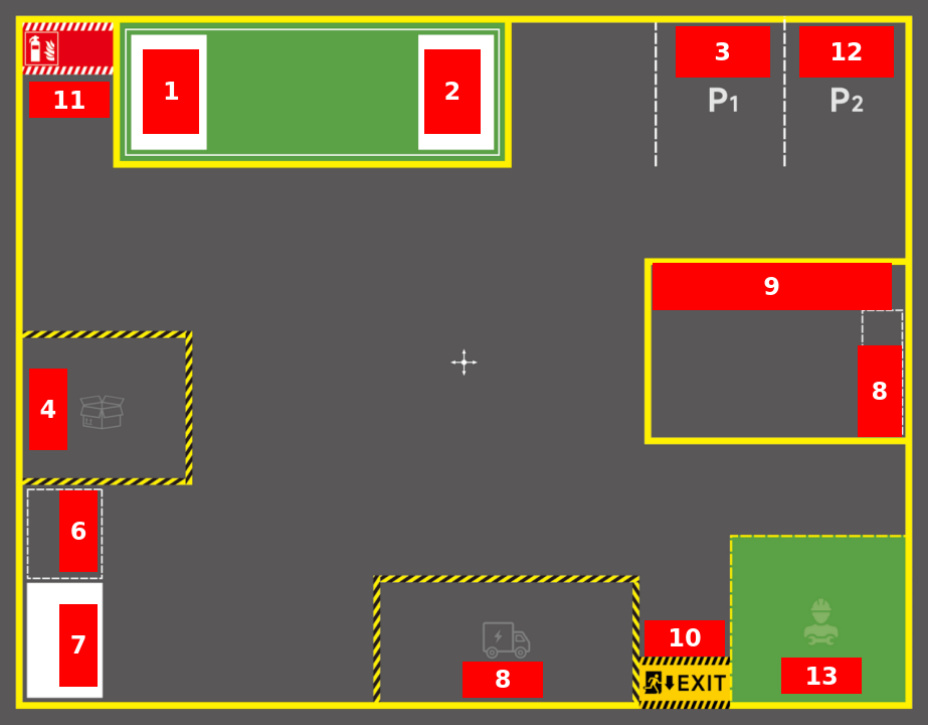
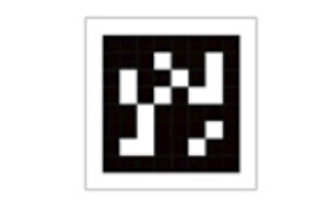
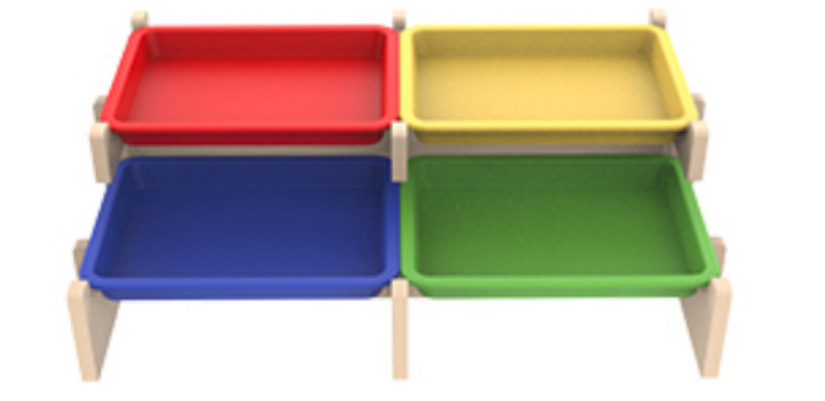
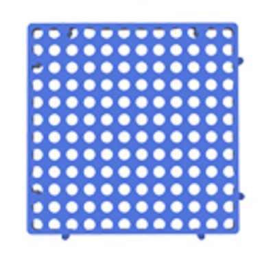
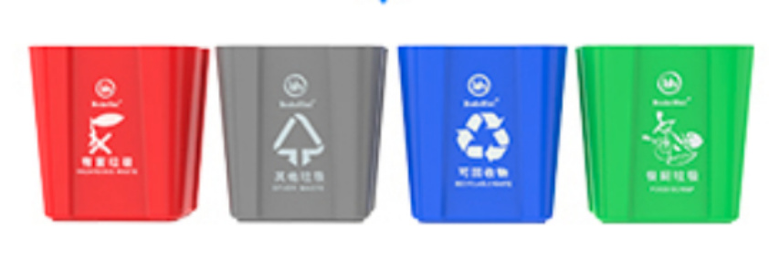

# Map Description And Prop Placement
**Map Description And Prop Placement**

1. Map Overview

2. Area Description

3. Prop Description

### 3.1 Tag Code

### 3.2 Shelves & Pallets

### 3.3 Blue Pad

### 3.4 Trash Bin

### 3.5 Color Block

## 1. Map Overview
## 2. Area Description
Area naming is arbitrary, **you can define them according to actual needs** . The following

area naming and placement are for reference only

1, 2, 7: Shelf area (place shelves & pallets)

3: Parking lot 1

12: Parking lot 2

4: Cargo warehouse (place blue pads, color blocks)

6: Cargo sorting area (place blue pads, color blocks)

8: Garbage sorting area (place garbage blocks)

9: Trash bin area (place trash bins)

10: Exit

11: Fire equipment area

13: Equipment maintenance area

## 3. Prop Description
### 3.1 Tag Code
Used for visual relocation enhancement, correcting positioning errors caused by various

reasons, providing robustness for robot global localization

### 3.2 Shelves & Pallets
Used for placing cargo blocks

### 3.3 Blue Pad
Used to simulate cargo pallets in a real warehouse

### 3.4 Trash Bin
Used in garbage sorting tasks where the robot sorts garbage into corresponding trash bins

### 3.5 Color Block
Used to simulate cargo of various colors, for robotic arm grasping tasks such as cargo sorting

and cargo transport

