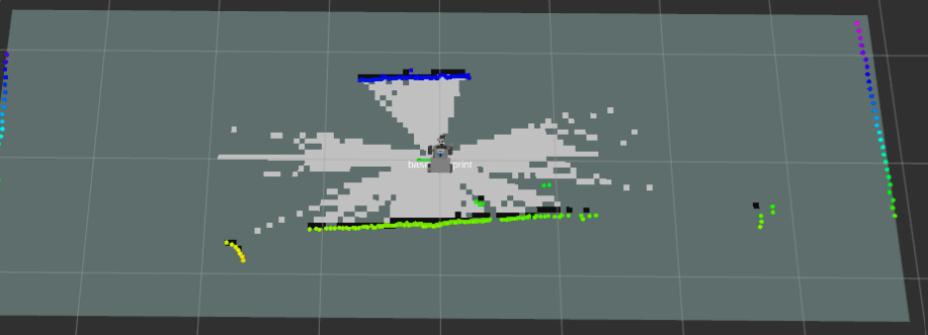
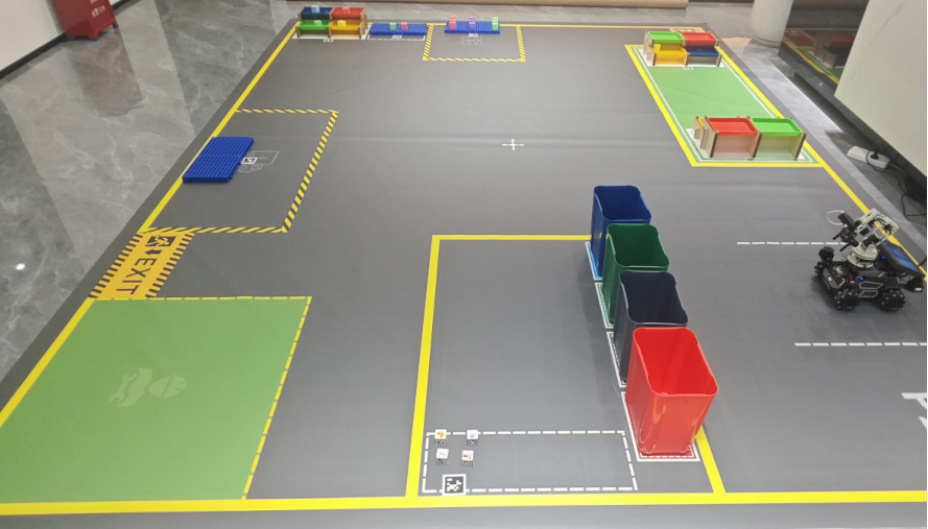
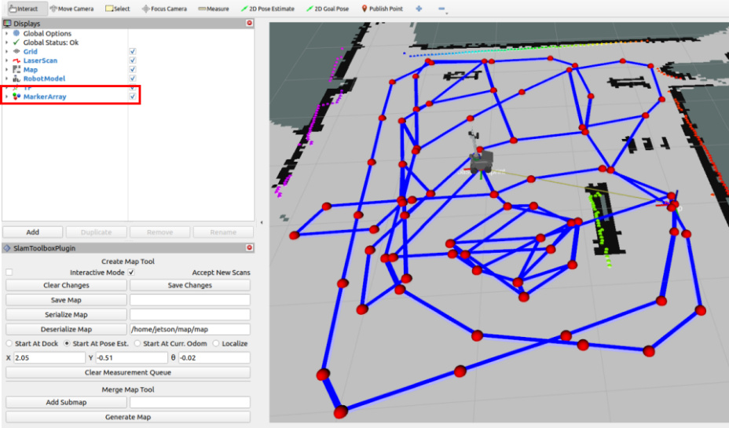
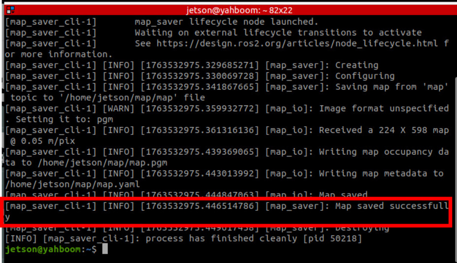
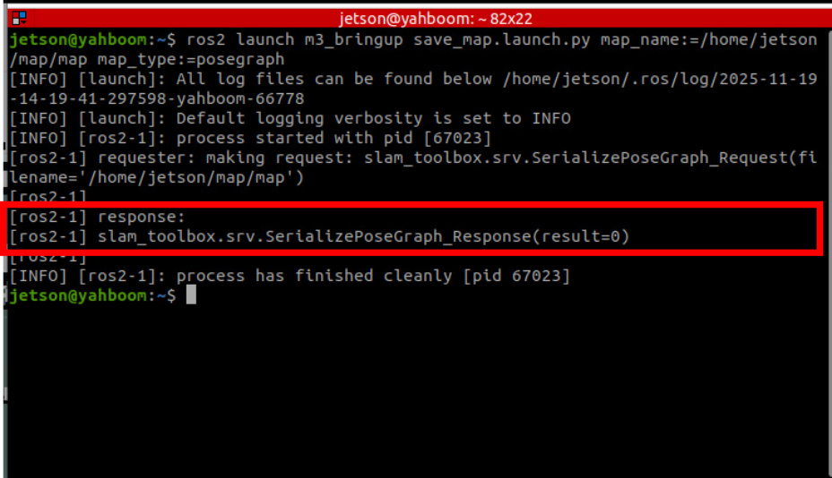
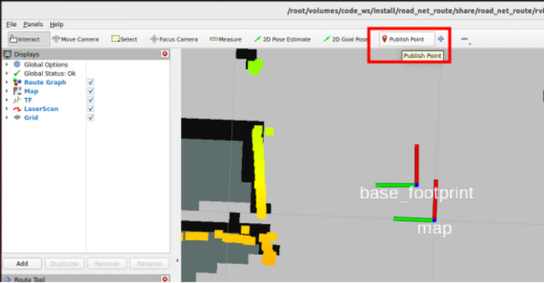
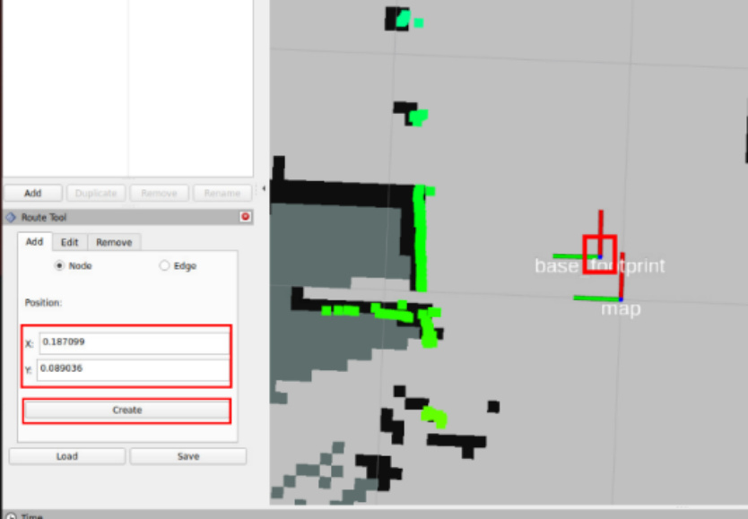
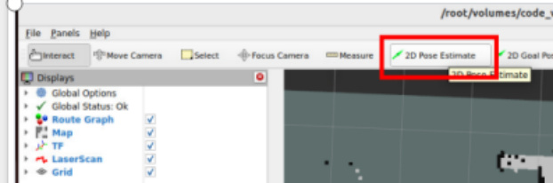
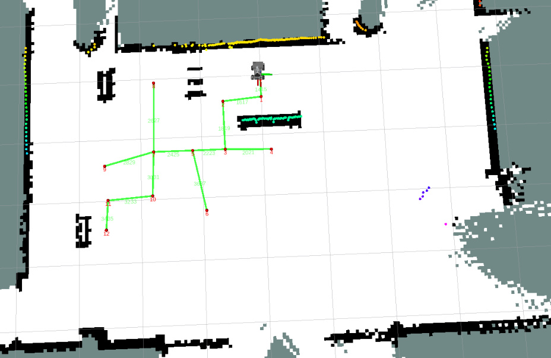

# Build Sand Table Map
**Build Sand Table Map**

1. Course Content

Learning Objectives

2. Preparation

3. Build Grid Map

4. Build Road Network Description File

## 1. Course Content
**Learning Objectives**

Master the complete process of building a sand table grid map using slam_toolbox

Learn to use the Publish Point tool to create waypoints, and use the 2D Pose Estimate tool

for relocation

Understand the basic principles of road network planning and annotation strategies for sand

table maps

[!IMPORTANT]

This section is a comprehensive course on sand table maps, introducing the complete

process of building a sand table map. For detailed principles, parameter debugging,

etc., refer to [04-OpenClaw Embodied AI Practice - OpenClaw SLAM Mapping

Navigation] and [Road Network Planning Navigation 1-6] chapters.
## 2. Preparation
Start the road network container

Start the MicroROS chassis agent (skip if already started)

## 3. Build Grid Map
Start SLAM mapping

Control the robot to move and complete map construction

**Check the number of pose points (important)**

Click the MarkerArray option in the Rviz Display panel to view the pose points of the

pose map. Ensure there are enough pose points in the map area. If an area has too few

or no pose points, the positioning effect in that area will be poor during navigation.

Save the grid map

Save the pose constraint map

## 4. Build Road Network Description File
Start slam_toolbox localization and navigation (start on host)

Annotate the road network file (start inside roadnet container)

Then click the left mouse button on the small blue dot at the center of the base_footprint

automatically fill in the coordinates of the current point. Then click Create to create a

waypoint.

Move the robot to the next waypoint that needs to be marked, then click the `2D Pose`

`Estimate` tool to give an estimated position near the approximate location of the robot for

relocation.

Repeat the above process until all required waypoints are marked and the road network is

connected (annotate according to actual needs. For detailed marking process, refer to the

[Road Network Planning Navigation] chapter tutorial).

The reference sand table map road network is as follows:

Here, waypoints are marked on the main roads and important areas of the sand table map.

You can annotate the road network according to the tasks you actually need to perform.

