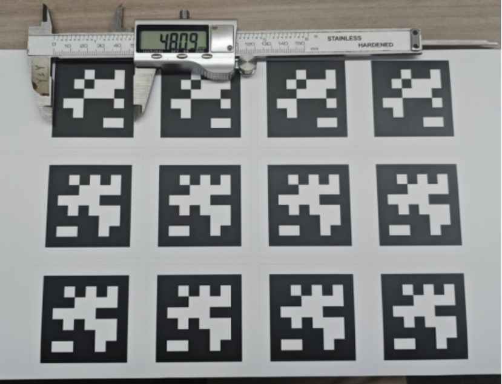
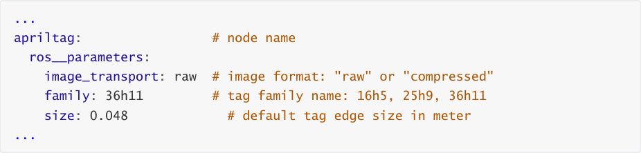
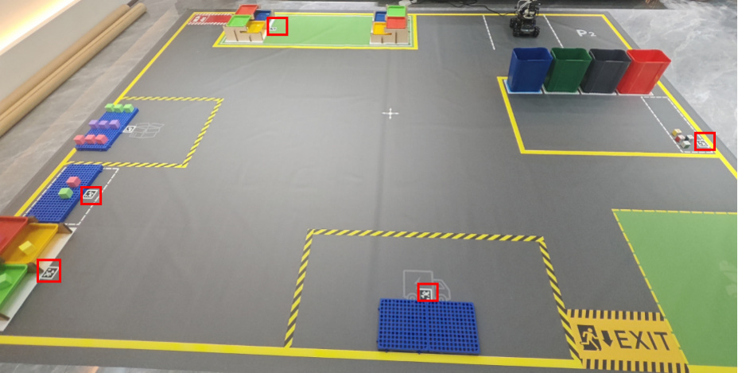
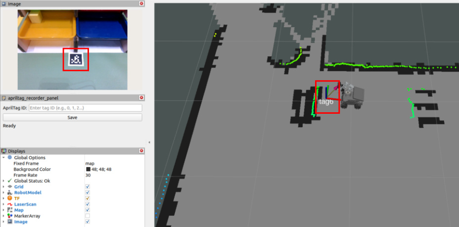
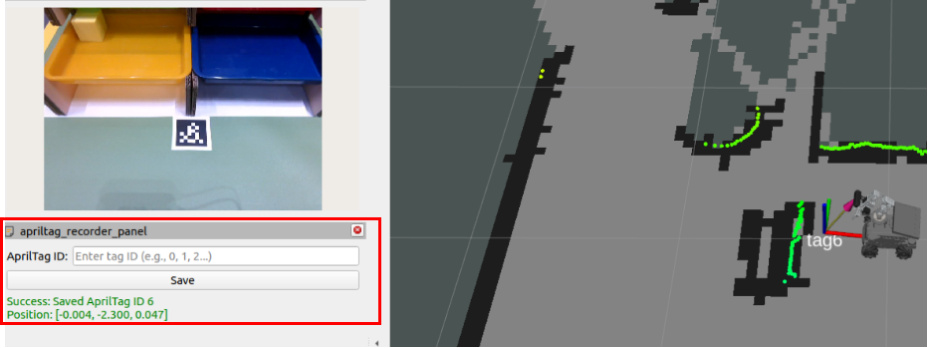
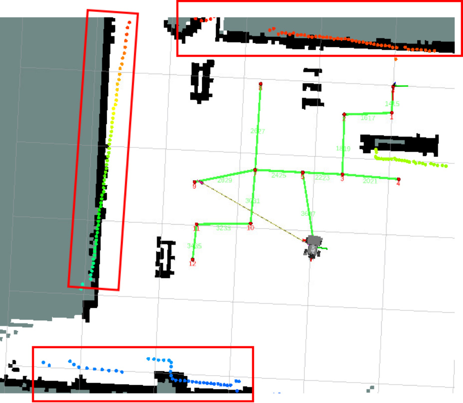
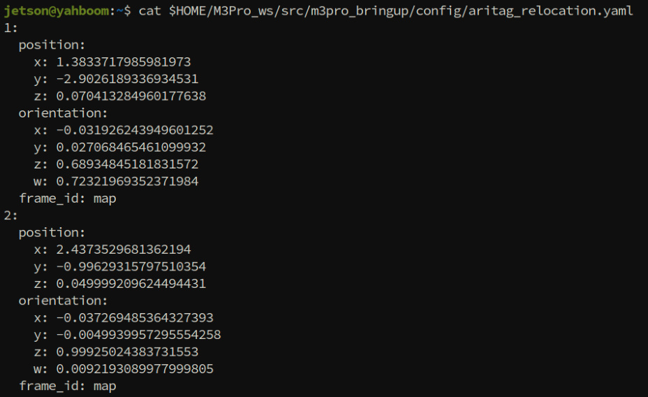

# Visual Relocation Markers
**Visual Relocation Markers**

1. Course Content

Learning Objectives

2. Preparation

### 2.1 Map Preparation

### 2.2 Start the MicroROS Chassis Agent

### 2.3 ArUco Tag Code

3. Place ArUco Tag Codes in the Map

4. Record ArUco Global Map Coordinates

## 1. Course Content
**Learning Objectives**

After completing this course, you will be able to:

Understand the working principle of ArUco tag codes in robot visual relocation

Master the process of using the apriltag_recorder_panel tool to record tag code global

coordinates

Understand the data structure and application of the apriltag_relocation.yaml configuration

file

[!IMPORTANT]

This section is a comprehensive course on sand table maps, introducing the complete

process of building a sand table map. For detailed principles, parameter debugging,

and operation steps, refer to the [Pose Constraint Combined with Visual Relocation

Navigation] chapter.

Visual relocation here is a redundant mechanism and is not mandatory, but it can

provide more stable positioning in various environments, used to solve issues such as

odometry errors, degradation, and confusion in similar scenes.
## 2. Preparation
### 2.1 Map Preparation
First, complete the construction of the sand table grid map, pose map, and road network file

according to the previous course.

### 2.2 Start the MicroROS Chassis Agent
Skip if already started

### 2.3 ArUco Tag Code
Prepare ArUco tag codes, which can be obtained in the following ways:

Tag codes from the sand table map package

Download and print the tag codes from the attachment materials

Determine the tag code size

Use a measuring tool to measure the actual side length of the tag code. The side length

of the tag code included in the sand table map package is 0.048m.

Modify the aritag detection configuration file

Modify the size to the actual size. If you are using the tag codes that come with the sand

table map, the default size is 0.048 and no modification is needed.

## 3. Place ArUco Tag Codes in the Map
The placement position depends on your actual needs. They can be placed anywhere the

camera can observe, such as on the ground, walls, or any other location.

The following is a reference for tag code placement.

[!IMPORTANT]

The relocation function occurs after navigating to the target location. If a tag code is

within the field of view, perform global relocation to calibrate the robot's global

position; otherwise, proceed directly with precise position adjustment.

## 4. Record ArUco Global Map Coordinates
Start the function to record ArUco code positions on the map

After starting, the interface is as shown below. The **aritag_recorder_panel** panel will appear

on the left.

When a tag code appears in the camera's field of view, the tf coordinates and ID of the tag

code will appear on the map.

In the **aritag_recorder_panel** panel, enter the tag code ID to be recorded in the **ArUco ID**

field, then click **Save** (check whether the robot positioning is accurate before recording).

**Note** :

Before recording the tag code position, if you find that the laser contour deviates

significantly from the environmental edge features, as shown in the figure below, it indicates
## a positioning error. In this case, use the 2D Estimate tool for manual relocation before

recording the position.

The figure below shows accurate positioning where the laser contour matches the

environmental edge features well.

Repeat the above steps to complete the recording of all tag code positions. The recording file

path is:

