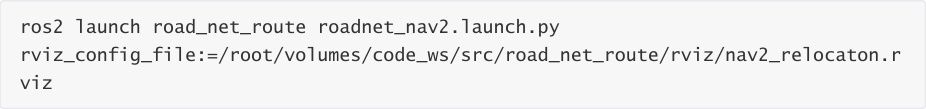
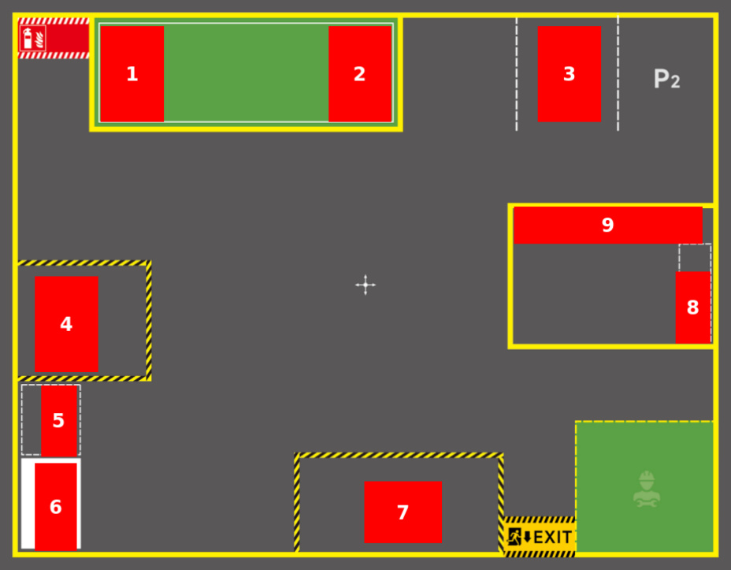
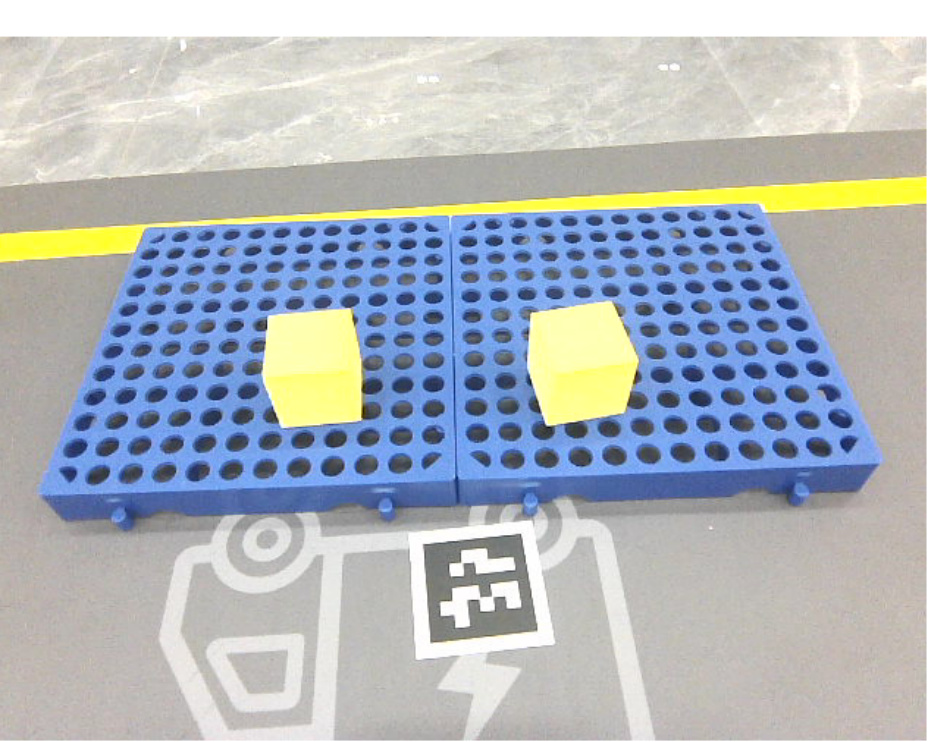
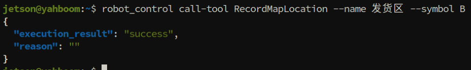
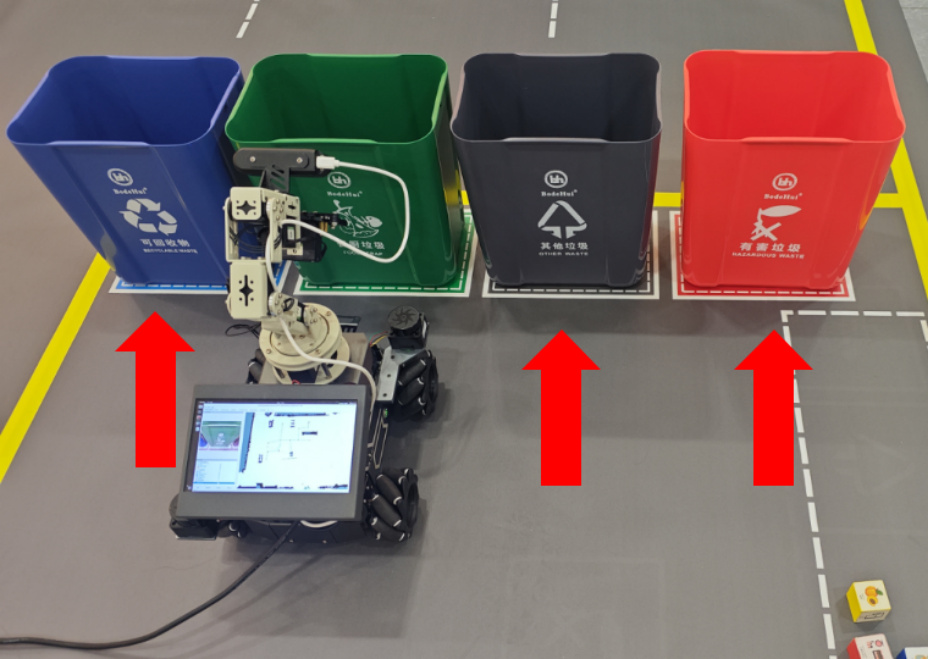
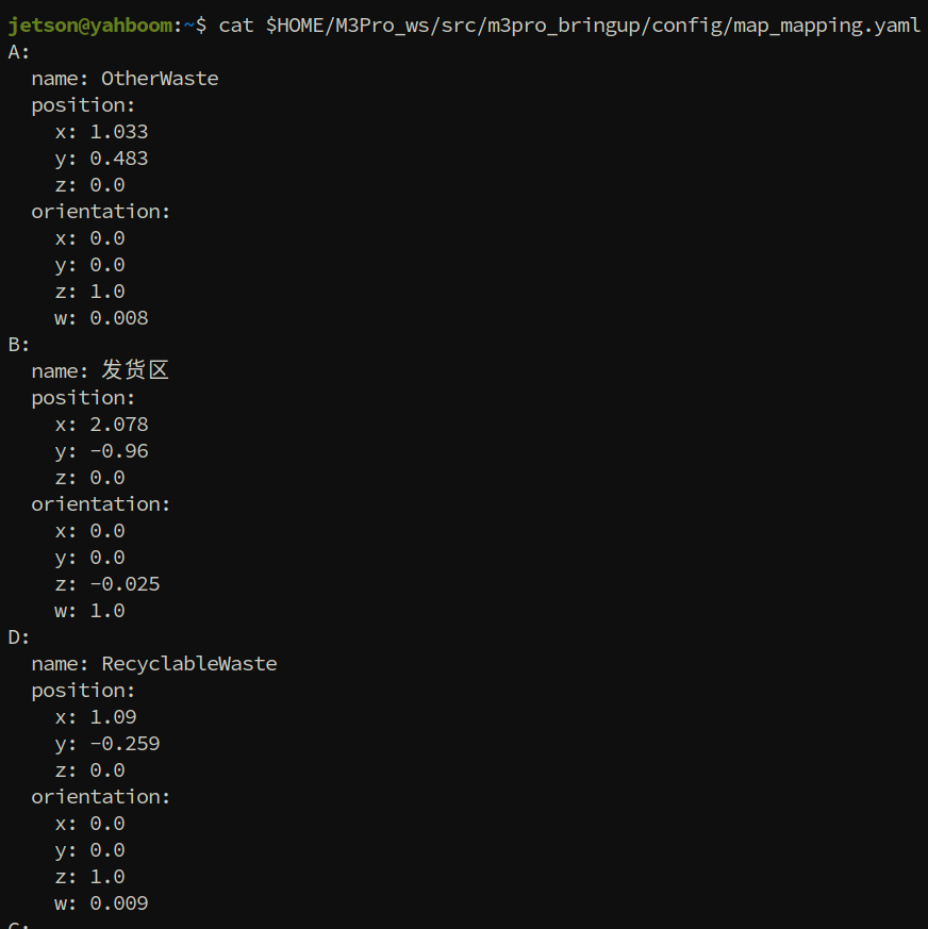

# Map Mapping Markers
**Map Mapping Markers**

1. Course Content

2. Preparation

### 2.1 Map Preparation

### 2.2 Start the MicroROS Chassis Agent

### 2.3 Start the Road Network Container

### 2.4 Start Odometry, tf, Robotic Arm Assistant, Camera, Aritag Detection Nodes

### 2.5 Start the MCP Service

### 2.6 Start Road Network Navigation

3. Record Map Mapping

## 1. Course Content
[!IMPORTANT]

This section is a comprehensive course that demonstrates and explains the use and

operation steps of the sand table map. For detailed parameter debugging and source

code explanation, refer to the prerequisite course: [05-OpenClaw SLAM Mapping

Navigation]

Mark map mapping for target locations that need to be used in the sand table map.
## 2. Preparation
### 2.1 Map Preparation
First, complete the construction of the sand table map and pose map according to the [Build

Sand Table Map] course.

### 2.2 Start the MicroROS Chassis Agent
Skip if already started

### 2.3 Start the Road Network Container
### 2.4 Start Odometry, tf, Robotic Arm Assistant, Camera,
**Aritag Detection Nodes**

### 2.5 Start the MCP Service
### 2.6 Start Road Network Navigation
Start inside the roadnet container

## 3. Record Map Mapping
The layout and area naming of the map site are arbitrary and can be modified according to

needs. The following reference area naming cases refer to:

1. Shelf 1

2. Shelf 2

3. Parking lot 1

4. Cargo warehouse

5. Cargo sorting area

6. Shelf 3

7. Shipping area

8. Garbage sorting area

9. Trash bin locations: including kitchen waste, recyclable waste, other waste, hazardous waste

Move the robot to the location that needs to be recorded, and use the robot_control CLI tool

to record the map mapping.

**Important** : Before recording a location, always check whether the laser contour matches the
## environmental edge features. If there is a deviation, use the 2D Estimate tool for manual

relocation before recording the position.

**Recording example:**

Record the shipping area. Move the robot to the location near the shipping area that needs

to be recorded.

Ensure that the cargo in the area is fully visible in the field of view.

Use the robot_control CLI tool to record the position of the robot's **base_link** in the **map**

coordinate system.

--name specifies the name of the recording point

--symbol specifies the symbol of the recording point, used by OpenClaw for identification

and differentiation.

The positions of different types of trash bins need to be recorded separately. Place the robot

in front of the trash bin to be recorded, then perform the recording.

Check the map mapping file map_mapping.yaml. The file path is:

Check whether all required locations have been recorded.

