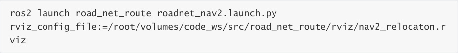
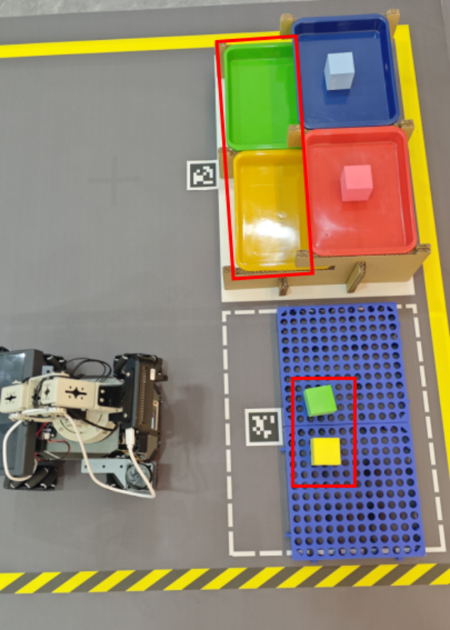
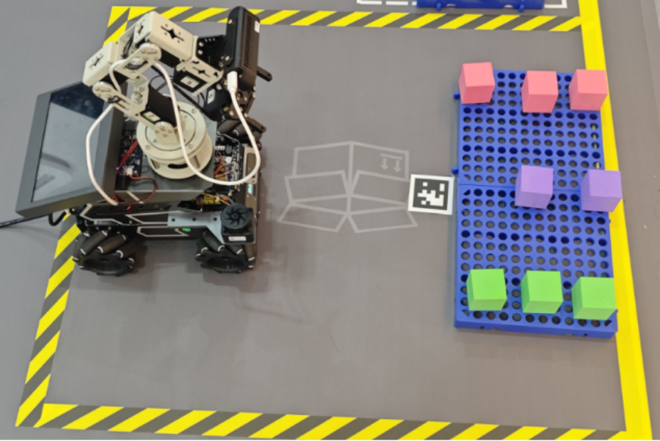
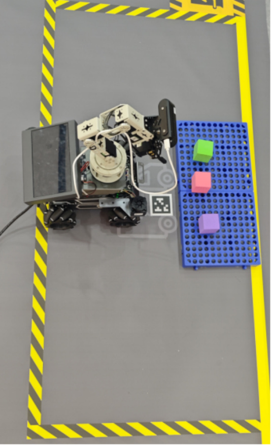
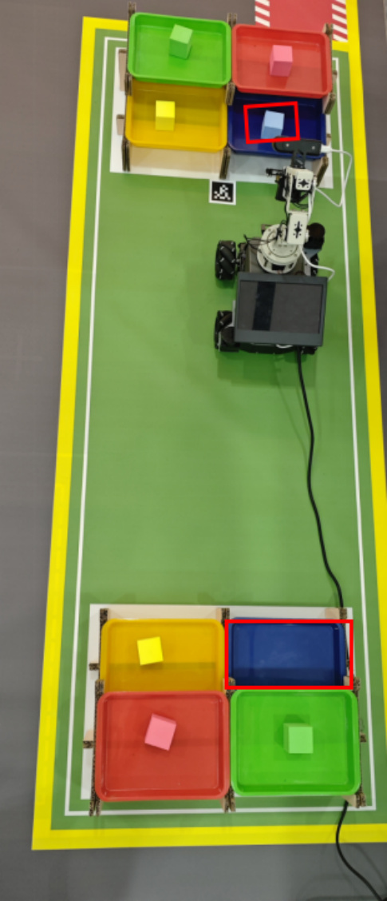
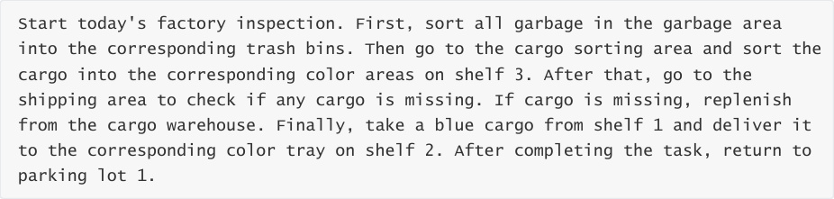

# OpenClaw Scenario Sandbox Comprehensive Case
**OpenClaw Scenario Sandbox Comprehensive Case**

1. Course Content

2. Preparation

### 2.1 Complete Prerequisite Courses

### 2.2 Start the MicroROS Chassis Agent

### 2.3 Start the Road Network Container

### 2.4 Start Odometry, tf, Robotic Arm Assistant, Camera, ArUco Detection Nodes

### 2.5 Start the MCP Service

### 2.6 Start Road Network Navigation

### 2.7 Voice Function Nodes

3. Reference Cases

### 3.1 Garbage Sorting

### 3.2 Cargo Sorting

### 3.3 Cargo Inspection and Replenishment

### 3.4 Inter-Shelf Object Transportation

4. Comprehensive Case

## 1. Course Content
This section uses OpenClaw to control the robot in the sand table map scenario to complete

complex long-flow tasks.
## 2. Preparation
### 2.1 Complete Prerequisite Courses
Complete the [02-Build Sand Table Map], [03-Visual Relocation Markers], and [04-Map

Mapping Markers] courses.

### 2.2 Start the MicroROS Chassis Agent
Skip if already started

### 2.3 Start the Road Network Container
### 2.4 Start Odometry, tf, Robotic Arm Assistant, Camera,
**ArUco Detection Nodes**

### 2.5 Start the MCP Service
### 2.6 Start Road Network Navigation
Start inside the roadnet container

### 2.7 Voice Function Nodes
If you need to use voice interaction, you need to additionally start the following nodes,

otherwise you can ignore them.

Voice recognition node

Voice reply node

## 3. Reference Cases
[!TIP]

You can customize your own command cases and gameplay features according to

actual needs. The following are some reference cases.

### 3.1 Garbage Sorting
Sort specified garbage from the garbage sorting area into corresponding trash bins.

### 3.2 Cargo Sorting
Sort all colors of cargo from the cargo sorting area to the designated shelves.

### 3.3 Cargo Inspection and Replenishment
Check for missing cargo in the shipping area and replenish from the cargo warehouse.

Cargo center

Shipping area

### 3.4 Inter-Shelf Object Transportation
Transport cargo from a designated shelf to a designated position on another shelf.

## 4. Comprehensive Case
**You can arbitrarily combine the above cases**, or customize command cases according to

actual needs. The following is a reference comprehensive case:

Factory comprehensive case 1

[!IMPORTANT]

The example long-flow task here takes a long time, approximately 25-40 minutes.

Choose any interaction method to send the command.
