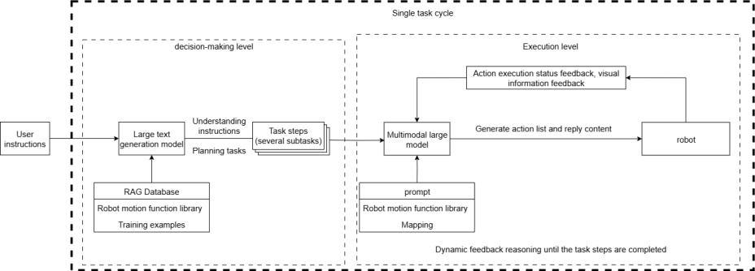
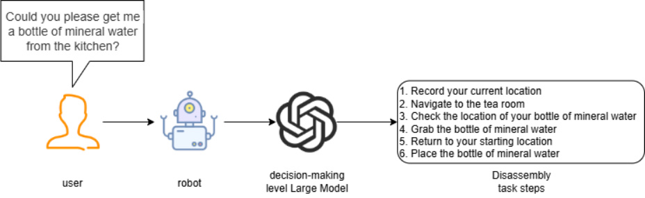
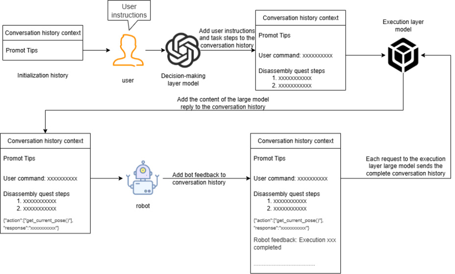
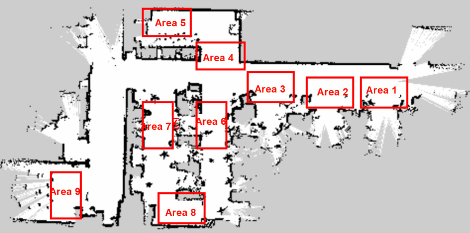
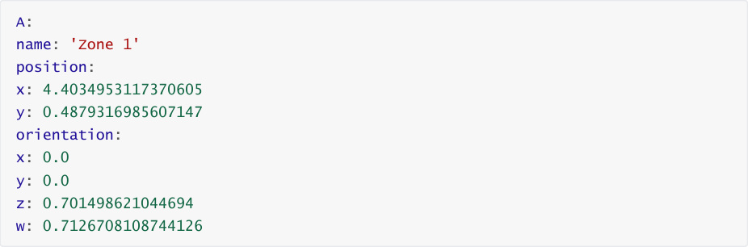
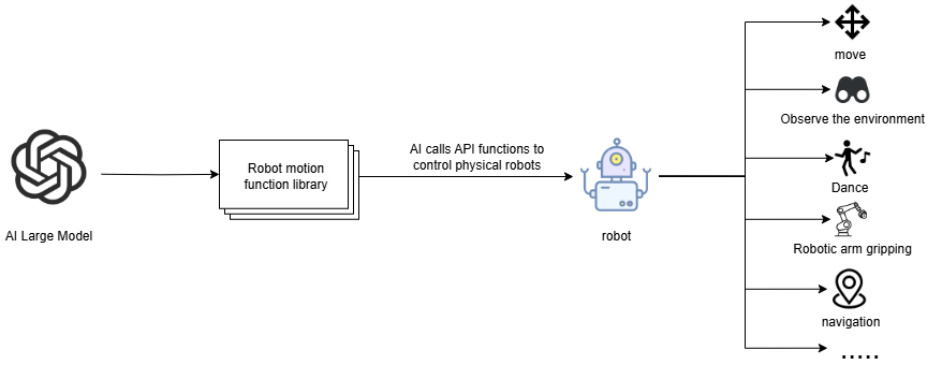

# Multi-Agent Embodied Architecture: multi_brains
**Multi-Agent Embodied Architecture: multi_brains**

1. Course Content

2. Introduction to multi_brains

3. Dual-Model Inference Architecture

### 3.1 Advantages of Dual-Model Inference

#### 3.1.1 Decoupling of Task Decision-Making and Action Translation

#### 3.1.2 Enhanced Success Rates for Long-Process Tasks

### 3.2 Decision Layer AI

### 3.3 Execution Layer AI

4. Task Cycle

5. Historical Context

6. Map Mapping

7. Action Function Library

## 1. Course Content
Gain an understanding of the multi-agent embodied architecture framework— _multi_brains_ —as

implemented on the ROSMASTER-M3 Pro.

## 2. Introduction to multi_brains
_multi_brains_ is a proprietary embodied intelligence framework developed by Yabo

Intelligence, designed to be compatible with general-purpose large AI models. It circumvents

the limitations typically associated with VLA (Vision-Language-Action) and end-to-end models

—specifically, the requirement for dedicated hardware, the need for substantial local

computing power, and the lengthy timeframes involved in data collection and training. By

simply integrating with general-purpose AI models provided by cloud-based vendors, the

framework enables edge-side robots to achieve powerful embodied intelligence capabilities.

_multi_brains_ utilizes a Retrieval-Augmented Generation (RAG) knowledge base to expand its

training examples, thereby allowing the robot to rapidly adapt to diverse scenarios and

tasks. It can be deployed on the vast majority of compact main control units, offloading the

computationally intensive model inference processes to the cloud or a local server.

The core philosophy behind _multi_brains_ lies in employing multiple AI models to

hierarchically decouple the various stages of a task. It represents a comprehensive upgrade

to our first-generation proprietary dual-model inference framework, featuring the following

key enhancements:

**Smoother Audio Recording Experience:** Features inertia-aware end-of-speech detection

with adjustable duration settings.

**More Flexible Decision-Making Mechanism:** Includes a task routing function that allows

the AI agent to autonomously select between dual-model and single-model inference

strategies based on the complexity of the task, thereby granting the AI greater autonomy

and enhancing the user experience.

**Intuitive Visual Architecture Workflow:** _multi_brains_ leverages Dify to construct a visual

representation of the agent's architecture. During debugging, users can observe the AI

agent's operations and data flow in real-time, providing a more intuitive understanding of

the specific processes involved in dual-model inference.

**Fully Localized RAG Knowledge Base:** Eliminates concerns regarding data sensitivity and

privacy issues.

**Seamless Integration with Global AI Models:** Through Dify's model provider plugins, users

can quickly and seamlessly integrate with hundreds of AI models available worldwide

(support is also available for integrating locally deployed models, should that be a

requirement).

**Traceable Historical Records:** By querying the backend access logs within Dify, users can

review a complete history of all task instructions issued and the specific steps executed by

the robot.

**Personalized Voice Responses:** Users can customize the random voice responses

generated by the robot. Configuration is handled via built-in speech synthesis commands,

making the process simple and easy to master.

**Comprehensive Testing Toolkit:** Provides a robust set of tools for rapidly validating the

core functional modules of the system. - Simplified onboarding process: Streamlined most

operational steps and configured quick commands.

## 3. Dual-Model Inference Architecture
The design features **dual-model inference** and **dynamic feedback inference**, offering

superior system robustness compared to a single-model architecture.

### 3.1 Advantages of Dual-Model Inference
#### 3.1.1 Decoupling of Task Decision-Making and Action Translation
The **Decision Layer AI** focuses on reasoning, planning, and breaking down task instructions.

The **Execution Layer AI** focuses on generating chat responses and translating task steps

into JSON text.

#### 3.1.2 Enhanced Success Rates for Long-Process Tasks
When using a single-model approach for inference, the system must simultaneously handle

"natural language understanding + environmental perception + process decomposition + action

function output." This often leads to **modal interference** (e.g., comprehension errors caused by

linguistic ambiguity or excessively long instructions). By processing tasks in distinct stages, the

dual-model architecture allows the Decision Layer to focus exclusively on task planning, while the

Execution Layer focuses on action execution.

### 3.2 Decision Layer AI
The large model within the Decision Layer is primarily responsible for task planning; it

interprets complex human instructions and decomposes them into specific, actionable task

steps. For instance, upon receiving the instruction, "Could you go to the kitchen and fetch me

a bottle of mineral water?", the large language model breaks it down into several distinct

tasks, as illustrated in the figure below.

### 3.3 Execution Layer AI
The large model within the Execution Layer is primarily responsible for generating chat

responses and translating task steps into JSON text. It continuously receives feedback

regarding the robot's actions—including success/failure status and visual data—and issues

instructions for the next action based on the outcome of the preceding step.

The Execution Layer large model functions as a supervisor, constantly monitoring the robot's

progress through the task steps. Based on the feedback received from the robot's actions

and the current environmental information, it determines the appropriate subsequent action

to take—continuing this process until the task is successfully completed or is terminated

early due to unforeseen circumstances.

## 4. Task Cycle
Upon waking up the robot, a "task cycle" begins. All user commands and robot responses are

stored within the AI model's historical context—effectively serving as the robot's temporary

memory—enabling it to "remember" events that occurred previously.

When a user requests to terminate the current task and dismiss the robot to rest, the robot

resets the AI model's historical context. This is akin to the robot experiencing "amnesia,"

causing it to forget everything that transpired during the previous interaction.

## 5. Historical Context
The robot's conversation history is stored within Dify's AI application variables; the default

setting allows for a maximum conversation memory of 50 turns.

## 6. Map Mapping

The robot utilizes a grid map for navigation. If the robot is required to comprehend specific

locations or zones within the real world, a mapping relationship must be established

between the grid map and the actual physical environment. This relationship is referred to as

**Map Mapping** . - Let's assume we use a robot in a factory environment to generate a **grid**

**map** using SLAM mapping. Within this real-world factory, there are several manually defined

zones, as illustrated in the figure below:

We establish a one-to-one correspondence between these real-world zones and specific

alphabetical symbols:

A: "Zone 1", B: "Zone 2", C: "Zone 3", D: "Zone 4", E: "Zone 5", F: "Zone 6", G: "Zone 7", H: "Zone 8",

I: "Zone 9"

Subsequently, we record the corresponding map coordinates for these alphabetical symbols

within a YAML configuration file—for example:

When we instruct the robot to navigate to a specific physical zone, the Large Language Model

(LLM) simply needs to translate this request into the corresponding alphabetical symbol; this

allows the robot to correctly interpret and locate the designated zone within the real-world

environment.

## 7. Action Function Library
The API functions within the robot's action function library serve as the bridge enabling the

Large Language Model to interact with the real world.

These API functions define the atomic actions—the most fundamental operations—that the

physical robot is capable of performing within the physical environment.

The AI Large Language Model initiates actions by translating the required operation into a

JSON text string, which is then transmitted to the robot; the robot subsequently parses this

JSON text to execute the corresponding action.

All atomic action functions and their corresponding functionalities are listed in the table below:

|Function Name|Parameters|Functionality|Invocation Commands|
|---|---|---|---|
|move_left(x, angular_speed)|x: Rotation Angle; angular_speed: Angular Velocity|Rotate left by x degrees|Turn left x degrees|
|move_right(x, angular_speed)|x: Rotation Angle; angular_speed: Angular Velocity|Rotate right by x degrees|Turn right x degrees|
|dance()|-|Trigger the robot's preset dance movements|Dance, Perform a dance, etc.|
|set_cmdvel(linear_x, linear_y, angular_z, duration)|linear_x: X-axis Linear Velocity; linear_y: Y-axis Linear Velocity; angular_z: Z-axis Angular Velocity; duration: Topic publishing duration|Control the robot chassis movement by setting linear and angular velocities|Move forward, Move backward, Strafe left/right|
|navigation(x)|x: Symbol corresponding to the target point in the map mapping|Control the robot to navigate to a target point|Navigate to [Location]|
|navigation(zero)|zero: A previously recorded coordinate point|Navigate back to the last recorded coordinate point|Return to origin, Return to starting position|
|get_current_pose()|-|Record the current coordinates within the global map into the 'zero' parameter|Remember current location|
|arm_up()|-|Raise the robotic arm upwards|Arm up|
|arm_down()|-|Move the robotic arm downwards|Arm down|
|arm_nod()|-|Perform a nodding motion with the arm|Nod|
|arm_shake()|-|Perform a head- shaking motion with the arm|Shake head|

|Function Name|Parameters|Functionality|Invocation Commands|
|---|---|---|---|
|arm_applaud()|-|Perform an applauding motion with the arm|Applaud|
|grasp_obj(x1, y1, x2, y2)|(x1, y1, x2, y2): Coordinates of the top-left and bottom- right corners of the target object's bounding box|Use the robotic arm to grasp a specific object|Grasp [Object]|
||putdown()|-|The robotic arm puts down the currently gripped object|
|apriltag_sort(x)|x: AprilTag ID|Sorts out the AprilTag with the specified ID|Sort out AprilTag #x|
|track(x1, y1, x2, y2)|(x1, y1, x2, y2): Coordinates of the top-left and bottom- right corners of the target object's bounding box|Tracks the specified object within the field of view|Track xx|
|apriltag_remove_higher(x)|x: Height|Removes AprilTags at or above the specified height|Remove AprilTags taller than x cm|
|color_remove_higher(color, target_high)|color: Color; target_high: Height|Removes color blocks at or above the specified height|Remove color blocks of 'color' taller than target_high cm|
|seewhat()|-|Captures an image from the robot's current perspective and uploads it to the execution-layer large model|Observe the environment|

|Function Name|Parameters|Functionality|Invocation Commands|
|---|---|---|---|
|follow_line_clear()|-|Moves along a patrol line and clears AprilTag obstacles from the path|Start line- following and clearing obstacles|
|finish_dialogue()|-|Resets historical context and initiates a new task cycle|-|
|finish()|-|Automatically called after the robot completes a task; used to stop providing status feedback to the execution-layer model|-|
|get_dist()|(x1, y1, x2, y2): Coordinates of the top-left and bottom- right corners of the target object's bounding box|Retrieves the distance to the target object within the camera's field of view|Check: How far away is the xx in front of you?|
