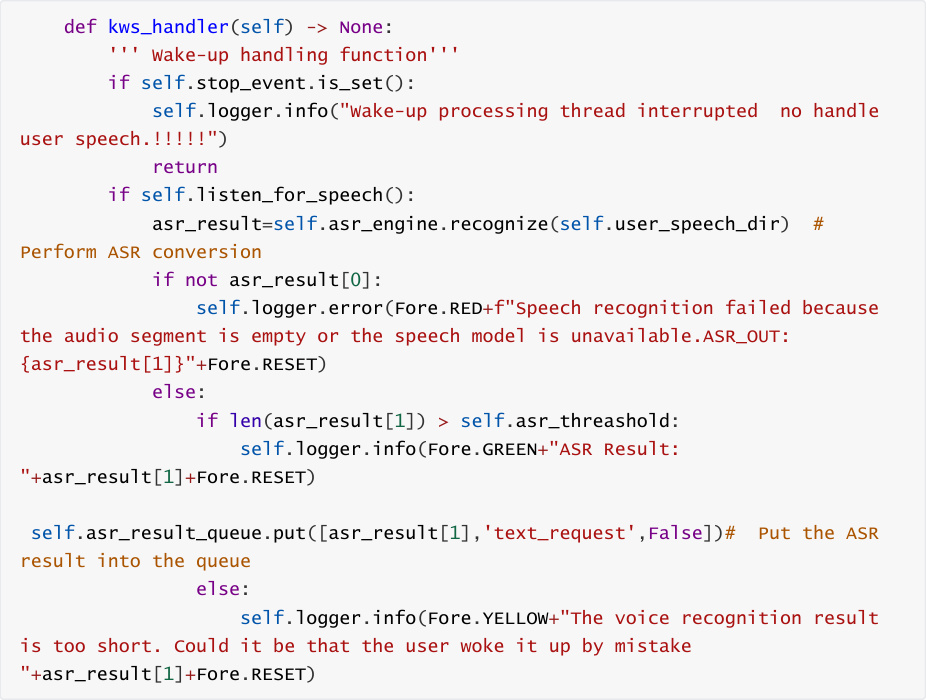
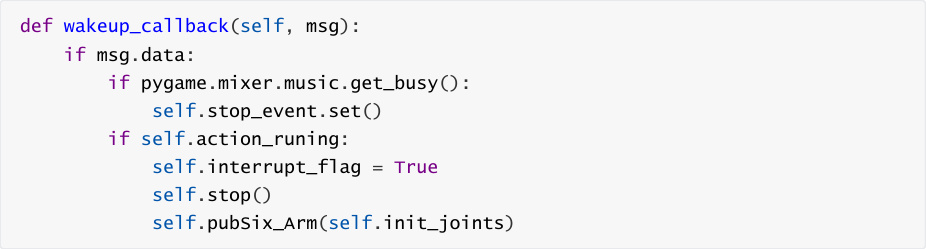
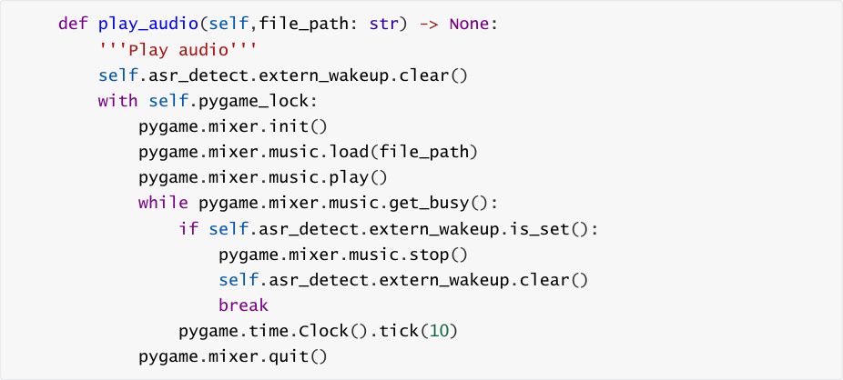
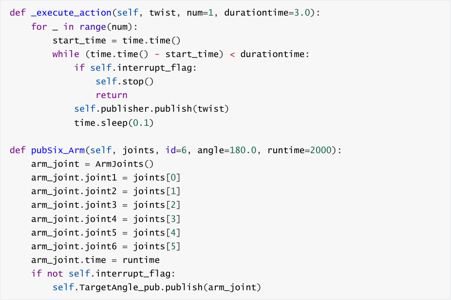

# multi_brains Framework Source Code Analysis
**multi_brains Framework Source Code Analysis**

1. Course Content

2. Source Code Package Structure

### 2.1 Functional Package File Structure

3. Speech Recognition Function

### 3.1 Dynamic Recording with Voice Activity Detection

### 3.3 ASR Speech Recognition

4. Model Service Functionality

5. Action Server Functionality

6. Interruption Function

### 6.1 Recording Stage Interruption

### 6.2 Interrupting the Dialogue Phase

### 6.3 Action Phase Interruption

#### 6.3.1 Normal Action Interruption

#### 6.3.2 Interruption of Actions with Subprocesses

## 1. Course Content
This section analyzes the core functionalities of the multi_brains functional package

architecture.

In subsequent lessons, each new action function introduced in the tutorials will be explained

separately.


[!TIP]


This course is a purely code-analysis course, intended for users who want a deeper

understanding of the functionality. If you only need to experience the functionality, you

can skip this section.
## 2. Source Code Package Structure
### 2.1 Functional Package File Structure
```
 ├── config

 │  ├── map_mapping.yaml

 │  ├── multi_brains_setting.yaml

 │  └── README.MD

 ├── language

 │  ├── en.yaml

 │  └── zh.yaml

 ├── launch

 │  └── llm_agent_control.launch.py

 ├── multi_brains

 │  ├── action_service.py

 │  ├── asr_detect.py

 │  ├── __init__.py

 │  ├── model_service.py

 │  └── utils

```

```
 ├── package.xml

 ├── resource

 │  └── multi_brains

 ├── setup.cfg

 ├── setup.py

 ├── system_vioce

 │  ├── en

 │  ├── notify.mp3

 │  ├── test_en.wav

 │  ├── test_zh.wav

 │  └── zh

 └── test

 ├── test_copyright.py

 ├── test_dify_connection.py

 ├── test_flake8.py

 ├── test_pep257.py

 ├── test_PiperTTS.py

 ├── test_SenseVoiceSmall.py

 ├── test_TongyiASR.py

 ├── test_TongyiTTS.py

 ├── test_xunfeiASR.py

 └── test_xunfeiTTS.py

```

config


Configuration folder, used to store configuration **file templates** .


multi_brains source code folder

asr_detect.py


Speech recognition program file


model_service.py


Model server program file, used to call various model interfaces to implement the model

inference architecture


action_service.py


Action server program file, used to receive the action list requested by the model server and

control the robot's movement


launch folder


Folder for storing ROS2 node launch files


language package


Stores log files in different languages


system_voice


System audio files
## 3. Speech Recognition Function
Source code path:


### 3.1 Dynamic Recording with Voice Activity Detection
1. Continuously read audio frames and perform voice activity detection.

2. If voice activity is detected, add the audio frames to the buffer; if continuous silence

exceeding a threshold (90 frames, approximately 1.5 seconds) is detected, end the recording.

3. After recording ends, remove the trailing silent portion and save the valid speech as a WAV

file.

4. If no valid speech is detected, no file will be saved.

```
    def listen_for_speech(self):

      ''' Dynamic recording with VAD'''

      self.record_flag = True

      PRE_SPEECH_FRAMES = 5 #150ms voice start compensation

      PRINT_EVERY_N_FRAMES = 5

      recording_active = False

      silence_counter = 0

      print_counter  = 0

      audio_buffer = []

      pre_speech_buffer = deque(maxlen=PRE_SPEECH_FRAMES)

      stream = self.pyaudio.open(

        format=pyaudio.paInt16,

        channels=1,

        rate=self.sample_rate,

        input=True,

        frames_per_buffer=self.frame_bytes,

 )

      self.play_audio(self.notify_audio)

      try:

        while not self.stop_event.is_set():

           frame = stream.read( self.frame_bytes,

 exception_on_overflow=False)

           is_speech = self.vad.is_speech(frame, self.sample_rate)

           print_counter += 1

           if print_counter >= PRINT_EVERY_N_FRAMES:

             print("1-1-1" if is_speech else "-----")

             print_counter = 0

           if not recording_active:

             # ---- IDLE ---
             pre_speech_buffer.append(frame)

             if is_speech:

                # RECORDING

                recording_active = True

                audio_buffer.extend(pre_speech_buffer)

                pre_speech_buffer.clear()

                audio_buffer.append(frame)

                silence_counter = 0

           else:

             # ---- RECORDING ---
             audio_buffer.append(frame)

             if is_speech:

                silence_counter = max(0, silence_counter - 1)

             else:

                silence_counter += 1

                if silence_counter >= self.MAX_SILENCE_FRAMES:

```

```
                  break

      finally:

        stream.stop_stream()

        stream.close()

        self.record_flag = False

      if recording_active and audio_buffer:

        with wave.open(self.user_speech_dir, "wb") as wf:

           wf.setnchannels(1)

           wf.setsampwidth(self.pyaudio.get_sample_size(pyaudio.paInt16) )

           wf.setframerate(self.sample_rate)

           wf.writeframes(b"".join(audio_buffer))

        return True

      return False

### 3.3 ASR Speech Recognition
```





## 4. Model Service Functionality
Source code path:


Core function explanation:


model.


interface with different parameters depending on the request type.

After receiving the AI agent's response from the Dify platform, it parses the corresponding

content for speech playback and sends the action list to the action server for execution.

```
    def handle_llm_thread(self)->None:

      '''

 Handle model request

 '''

      while True:

        if not self.llm_handler_queue.empty():#The queue is not empty,

 processing model requests.

           if not self.text_chat_mode and self.asr_detect.record_flag :

 continue

           request_query = self.llm_handler_queue.get()

           if self.debug_mode: self.get_logger().info(f"Processing LLM

 request: {request_query}")

           if request_query[1]=='text_request':

             '''text request'''

  result=self.dify_llmclient.chat(request_query[0],robot_feedback=request_query[2

 ])

           elif request_query[1]=='image_request':

             '''vision + text request'''

  result=self.dify_llmclient.chat(request_query[0],image_path=self.image_cache_pa

 th,robot_feedback=request_query[2])

           if result[0]:

             if not self.text_chat_mode and self.asr_detect.record_flag

 : continue

             split_result=self.extract_actions(result[1])

             if split_result is None: continue

  action_list,llm_response,decision_plan=self.extract_actions(result[1])

             if decision_plan is not None:

  self.get_logger().info(Fore.YELLOW+self.syslog.get_text("system_log_3",decision

 _plan=decision_plan)+Fore.RESET)

             self.get_logger().info(Fore.YELLOW+f'"action":

 {action_list},"response": {llm_response}'+Fore.RESET)

             if not self.text_chat_mode:#Voice reply

                if

 self.tts_engine.synthesize(llm_response,self.tts_out_path) :

                  self.play_audio(self.tts_out_path)

                else:

                  self.get_logger().error(Fore.RED+"Speech synthesis

 failed. Check whether the TTS model is available"+Fore.RESET)

             else:#Text Reply

                if decision_plan is not None:

```

```
  self.text_pub.publish(String(data=self.syslog.get_text("system_log_3",decision_

 plan=decision_plan)))

                self.text_pub.publish(String(data=f'"action":

 {action_list}, "response": {llm_response}'))

             if action_list!=[]: self.send_action_service(action_list,

 llm_response)

           else:

             self.get_logger().error(Fore.RED+f"The model request failed.

 Check whether the dify or AI model is normal.\

 Error Log:{result[1]}"+Fore.RESET)

        else:

           time.sleep(1.0)#Sleep for 1 second when there are no requests.

## 5. Action Server Functionality
```

Contains the implementation of all basic action functions that the robot can perform. It

receives action list requests and executes the corresponding actions. It also has the

functionality to interrupt and resume execution after being reactivated.


Core callback function `execute_callback` explanation:


Accepts a string representing the list of actions.

```
    def execute_callback(self, goal_handle):

      """action execution callback function"""

      actions = goal_handle.request.actions

      feedback_result = None

      if self.debug_mode:

 self.get_logger().info(self.actionlog.get_text("debug_log_1",actions=actions))

      self.action_runing = True

      for action in actions:

        if self.interrupt_event.is_set():

           break

        match = re.match(r"(\w+)\((.*)\)", action)

        action_name, args_str = match.groups()

        args = [arg.strip() for arg in args_str.split(",")] if args_str else

 []

        if not hasattr(self, action_name):

           self.get_logger().error(Fore.RED+f"action_service: {action} is

 invalid action, skip execution"+Fore.RESET)

        else:

           method = getattr(self, action_name)

           feedback_result = method(*args)

      if not self.interrupt_event.is_set():#Provide feedback to the Dify agent

 on the action execution results

        msg=LlmRequest()

        if feedback_result==False:

          #Action failed

  msg.llm_request=self.actionlog.get_text("action_feedback_2",action_name=actions

 )

           msg.robot_feedback=True

```

```
           self.llm_request_pub.publish(msg)

        elif feedback_result==True:

           #Action executed successfully

  msg.llm_request=self.actionlog.get_text("action_feedback_1",action_name=actions

 )

           msg.robot_feedback=True

           self.llm_request_pub.publish(msg)

        elif feedback_result==None:

          #No operation, no feedback

           if self.debug_mode:

 self.get_logger().info(self.actionlog.get_text("system_log_1"))

        if self.debug_mode: self.get_logger().info(msg.llm_request)

      if self.debug_mode:

 self.get_logger().info(self.actionlog.get_text("system_log_2"))

      self.action_runing = False

      self.interrupt_event.clear()

      goal_handle.succeed()

      result = Rot.Result()

      result.success = True

      return result

## 6. Interruption Function
```

The robot supports interruptions at any stage, which can be specifically divided into recording

stage interruptions, dialogue stage interruptions, and action stage interruptions. The principles of

interruption at each stage are introduced below.

### 6.1 Recording Stage Interruption
If you realize you've made a mistake while recording, or are dissatisfied with the recorded content

and need to re-record, you can interrupt the previous recording and start speaking and recording

again by re-activating the robot **during the recording process** .


Each time the robot is activated, if there is already a thread running for wake-up recording, it


After clearing the stop event flag, a new recording thread is started.

```
    def asr_detect_run(self):

      while True:

        # Process only the most recent wake-up request to prevent

 duplicates

        if self.wakeup_event.wait(timeout=0.1):

           self.wakeup_event.clear()

           self.extern_wakeup.set()

           self.publisher.wakeup_pub.publish(Bool(data=True))

```

`self.logger.info("I'm here` 🌟 `")`
```
           self.wake_up_voice() # Respond to the user

           if self.current_thread and self.current_thread.is_alive():  #

 Interrupt the previous wake-up handling thread

```

```
             self.stop_event.set()

             self.current_thread.join() # Wait for the current thread to

 finish

             self.stop_event.clear() # Clear the event

           self.current_thread = threading.Thread(target=self.kws_handler)

           self.current_thread.daemon = True

           self.current_thread.start()

        time.sleep(0.5)

### 6.2 Interrupting the Dialogue Phase
```

If you are dissatisfied with the robot's response during its speech or don't want the robot to

continue speaking, you can use the wake word to interrupt the robot's speech and start recording

your voice. At this point, you can give the robot a new command (still within the current task

cycle), or you can say "End current task" to directly end the current task and start a new task cycle.


The logic is implemented in the **wakeup_callback** and **play_audio** methods of the

**CustomActionServer** class in the action_service.py file:

wakeup_callback is the callback function for wake-up processing. In the asr.py program,

each time a wake-up signal is detected, it publishes a wake-up signal via topic

communication. wakeup_callback subscribes to and processes this signal.

Each time a wake-up occurs, it checks whether **pygame.mixer** is currently playing audio. If

so, it notifies the playback thread to stop playback via the thread event self.stop_event.

If a previous action is detected to be running after the wake-up, the **self.interrupt_flag** flag

is set, which is used for subsequent action interruption.





detects that it is set, it immediately stops the currently playing audio.





### 6.3 Action Phase Interruption
If the robot is interrupted during the execution of an action, it will stop the current action and

return to its initial posture. This can be divided into two types: normal action interruption and

action interruption with subprocesses.

#### 6.3.1 Normal Action Interruption
The robot's chassis movement and robotic arm movement are controlled by publishing

velocity topics and robotic arm joint angle topics.


`self.interrupt_event` interruption flag. If it is set, the chassis movement is immediately

stopped.


interruption flag; it will only publish the robotic arm joint angle topics normally if the flag is

not set.





#### 6.3.2 Interruption of Actions with Subprocesses
For example, actions such as robotic arm gripping and sorting machine codes require starting

external programs in subprocesses. Here, we'll use the robotic arm gripping action function


When the robotic arm gripping is not complete, it will continuously wait in a `while not`

`self.grasp_obj_future.done():` loop. During this process, if the `self.interrupt_event` flag is


ending the subprocess tree, and then the action will stop.

```
    def grasp_obj(self, x1, y1, x2, y2) -> None:

      """grasp_obj: Grasping objects x1,y1,x2,y2: Object outer border

 coordinates """

```

```
     def __reset_grasp_obj():

       kill_process_tree(self.grasp_obj_process_1.pid)

       kill_process_tree(self.grasp_obj_process_2.pid)

       kill_process_tree(self.grasp_obj_process_3.pid)

       self.grasp_obj_future = Future()

     cmd_1=['ros2', 'run', 'largemodel_arm', 'grasp_desktop']

     cmd_2=['ros2', 'run', 'largemodel_arm', 'KCF_follow']

     cmd_3=['ros2', 'run', 'M3Pro_KCF', 'ALM_KCF_Tracker_Node']

     self.grasp_obj_process_1=subprocess.Popen(cmd_1)

     time.sleep(5.0) #Waiting for grasp_desktop to finish starting up

     self.grasp_obj_process_2=subprocess.Popen(cmd_2)

     self.grasp_obj_process_3=subprocess.Popen(cmd_3)

     x1 = int(x1)

     y1 = int(y1)

     x2 = int(x2)

     y2 = int(y2)

     while not self.object_position_pub.get_subscription_count():

       time.sleep(0.5)

     self.object_position_pub.publish(Int16MultiArray(data=[x1, y1, x2, y2]))

     while not self.grasp_obj_future.done():

       if self.interrupt_event.is_set():

          __reset_grasp_obj()

          self.pubSix_Arm(self.init_joints)

          return None

       time.sleep(0.1)

     result = self.grasp_obj_future.result()

     if not self.interrupt_event.is_set():

       if result.data == "grasp_obj_done":

          res = True

       else:

          res = False

     __reset_grasp_obj()

     if self.interrupt_event.is_set():

       time.sleep(0.5)

       self.pubSix_Arm(self.init_joints) # Robotic arm retracted

     return res

```
