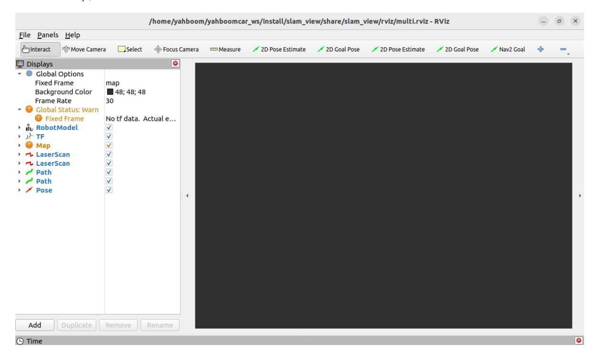
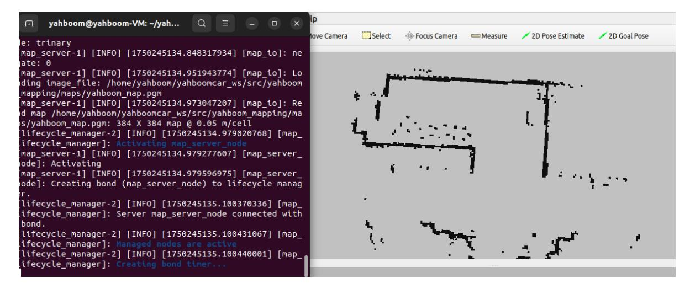
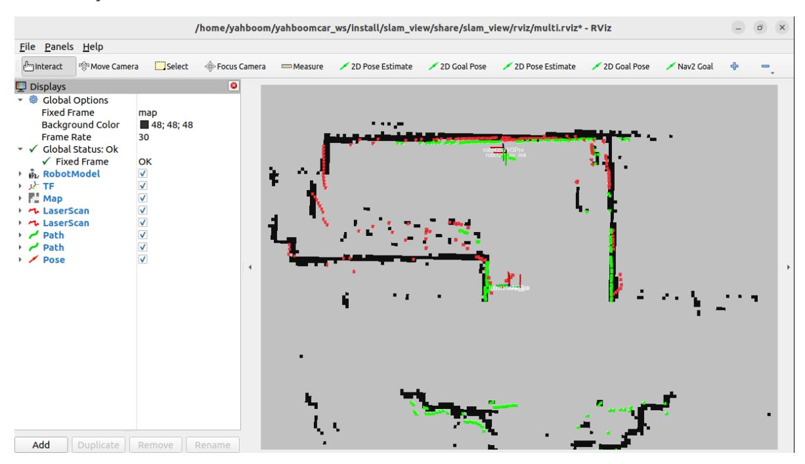
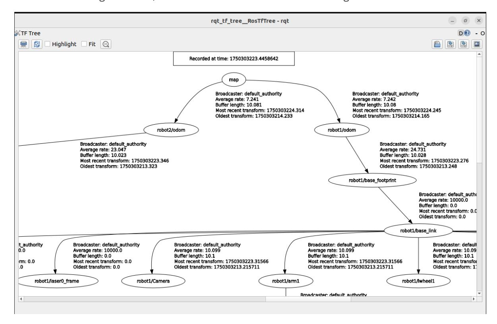

# **Multi-vehicle navigation**

# **1. Content Description**

This feature allows you to assign two cars different navigation points in rviz. The two cars will plan paths based on their positions on the map and navigate to the designated locations, avoiding obstacles in real time during the navigation process.

### **1.1 Functional Requirements**

For more information, please refer to this product course **[11. Multi-vehicle Function] - [1. Multi-vehicle Chassis Control] - [1.1. Functional Requirements]**

### **1.2 Navigation Map**

Before starting multi-vehicle navigation, you need to put the map file into /home/yahboom/yahboomcar\_ws/src/yahboom\_mapping/maps the path of the virtual machine. The map file includes a parameter file in .yaml format and an image file in .pgm format.

# **2. Program startup**

The virtual machine needs to be in the same LAN as the two cars, and the ROS\_DOMAIN\_ID must be the same as the two cars. The modification method can refer to the content of setting the car's ros\_domain\_id above. All you need to do is modify the content in ~/.bashrc and refresh the environment variables after the modification is completed.

This section requires entering commands in the terminal. The terminal you open depends on your motherboard type. This section uses the Raspberry Pi 5 as an example. For Raspberry Pi and Jetson-Nano motherboards, you'll need to open a terminal and enter commands to enter a Docker container. Once inside the Docker container, enter the commands mentioned in this section in the terminal. For instructions on entering a Docker container, refer to the product tutorial **[Robot Configuration and Operation Guide] - [Entering the Docker (Jetson-Nano and Raspberry Pi 5 users, see here)**.

Simply open the terminal on the Orin motherboard and enter the commands mentioned in this section.

### **2.1. Start chassis data fusion**

Open the terminal of robot1 and enter the following command to start the chassis data fusion, including dual radar fusion, filtering imu and odom data for ekf fusion.

```
ros2 launch yahboom_multi yahboom_bringup_multi.xml robot_name: = robot1
```

Similarly, open the terminal on robot2 and enter the following command to start chassis data fusion.

ros2 launch yahboom\_multi yahboom\_bringup\_multi.xml robot\_name:=robot2

#### **2.2. Start rviz and publish map data**

In the virtual machine, we open the terminal and enter the following command to start rviz.

```
ros2 launch slam_view multi_nav_rviz.launch.py
```

After startup, it is as shown below:



Then start the map loading program. The default map is yahboom\_map.yaml, and the file path is /home/yahboom/yahboomcar\_ws/src/yahboom\_mapping/maps . Enter the following command in the terminal to start,

```
ros2 launch yahboom_mapping map.launch.py
```

After successful operation, the map will be loaded in rviz.



### **2.3. Start amcl positioning**

Open the terminal of robot1 and enter the following command to start amcl positioning.

```
ros2 launch yahboom_multi robot1_amcl.launch.py
```

Open the terminal of robot2 and enter the following command to start amcl positioning.

```
ros2 launch yahboom_multi robot2_amcl.launch.py
```

As shown in the figure below, " **AMCL cannot publish a pose or update the transform. Please set the initial pose...** " appears, indicating that the program is running the amcl positioning program.

Next, based on the position of the car on the actual map, we use the [2D Pose Estimate] tool on rviz2 to give the car an initial pose. There are two [2D Pose Estimate] tools on rviz here. The first one is a tool for giving the initial pose of robot1, and the second one is a tool for giving the initial pose of robot2. Use these two tools to give the initial poses of the two cars respectively.

As shown in the figure below, the areas scanned by the two radars overlap with the black area on the map. The green point cloud is scanned by the robot1 radar, and the red point cloud is scanned by the robot2 radar.



### **2.4. Start nav2 navigation**

Open the terminal of robot1 and enter the following command to start the nav2 navigation of robot1.

```
ros2 launch yahboom_multi robot1_nav.launch.py
```

Open the terminal of robot2 and enter the following command to start the nav2 navigation of robot2.

```
ros2 launch yahboom_multi robot2_nav.launch.py
```

As shown in the figure below, both terminals that start nav2 navigation show "Creating bond timer...", indicating that the startup is successful.

Next, we use the [2D Goal Pose] tool on rviz2 to give the car an initial pose. There are two [2D Goal Pose] tools on rviz here. The first one is a tool for giving the target point of robot1, and the second one is a tool for giving the target point of robot2. Use these two tools to give target points to the two cars respectively. As shown in the figure below, after the car is given a target point, it will plan a path and navigate to the target point.

## **3. TF Tree**

Enter the following command in the virtual machine terminal to view the TF tree.

```
ros2 run rqt_tf_tree rqt_tf_tree
```

As shown in the figure below, this is the TF tree for multi-vehicle navigation.



# **4. Expansion**

This tutorial takes two cars as an example. If you want to increase the number of cars, for example, adding a third car, you need to modify the following parts. The following directories involving the files to be added need to be found according to the motherboard type.

Raspberry Pi 5 and Jetson boards: Look for the /root directory in the running Docker container.

Orin motherboard: Search in the /home/jetson directory

### **4.1. Add the URDF model file of the car**

In the /M3Pro\_ws/src/M3Pro/urdf directory, add the urdf model of robot3 and name it M3Pro\_robot3.urdf. You can copy the content of M3Pro\_robot1.urdf and replace the places where robot1 appears with robot3. Save and exit.

#### **4.2. Add car URDF startup file**

In the M3Pro\_ws/src/M3Pro/launch/ directory, add the robot3 urdf startup file and name it display\_robot3.launch.py. You can copy the content of display\_robot1.launch.py and replace the robot1 with robot3. Save and exit, then return to the M3Pro\_ws directory and use it colcon build --packages-select M3Pro to compile. After successful compilation, enter the command source ~/.bashrc and refresh the environment variables.

#### **4.3. Add the amcl parameter file of the car**

In the M3Pro\_ws/src/yahboom\_multi/param/ directory, add the amcl parameter file for robot3 and name it robot3\_amcl\_param.yaml. You can copy the content of robot1\_amcl\_param.yaml and replace the robot1 with robot3. Save and exit.

### **4.4. Add the amcl startup file of the car**

In the M3Pro\_ws/src/yahboom\_multi/launch/ directory, add the amcl startup file of robot3 and name it robot3\_amcl.launch.py. You can copy the content of robot1\_amcl.launch.py and replace the occurrences of robot1 with robot3. Save and exit.

### **4.5. Add the nav2 navigation parameter file of the car**

In the M3Pro\_ws/src/yahboom\_multi/param/ directory, add the nav2 navigation parameter file of robot3 and name it robot3\_nav\_param.yaml. You can copy the content of robot1\_nav\_param.yaml and replace the occurrences of robot1 with robot3. Save and exit.

#### **4.6. Add the nav2 navigation startup file of the car**

In the M3Pro\_ws/src/yahboom\_multi/launch/ directory, add the nav2 navigation startup file of robot3 and name it robot3\_nav.launch.py. You can copy the content of robot1\_nav.launch.py and replace the robot1 with robot3. Save and exit, then return to the M3Pro\_ws directory and use it colcon build --packages-select yahboom\_multi to compile. After successful compilation, enter the command source ~/.bashrc and refresh the environment variables.