# Register a Model Service Account
**Register a Model Service Account**

1. Course Content

2. Register Alibaba Cloud Model Studio Platform Account

### 2.1 Alibaba Cloud Model Studio Platform

### 2.2 Free Quota Description

3. Openrouter Platform Account

### 3.1 Register an Account

### 3.2 Create API-KEY

## 1. Course Content
Register an account and API key with a model service provider using your email or mobile

phone number to gain access to cloud-based models.
## 2. Register Alibaba Cloud Model Studio Platform
**Account**
### 2.1 Alibaba Cloud Model Studio Platform
International Site Address: https://modelstudio.console.alibabacloud.com/ap-southeast-1/?tab=d

oc#/doc/?type=model&url=2840914

If you don't have an account, you need to register first

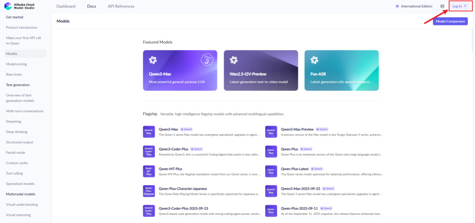
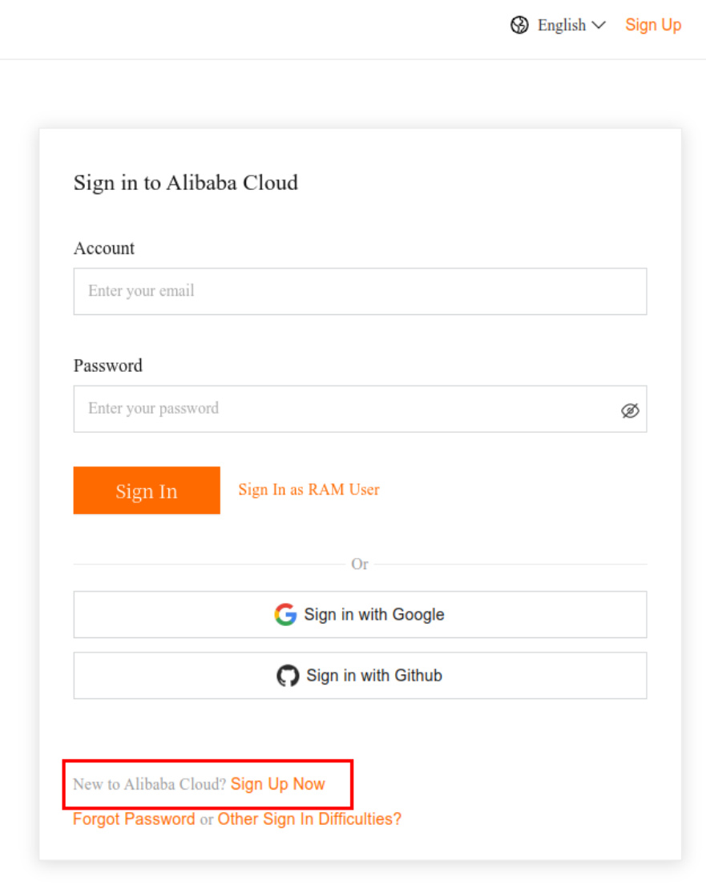

Choose individual Account to register

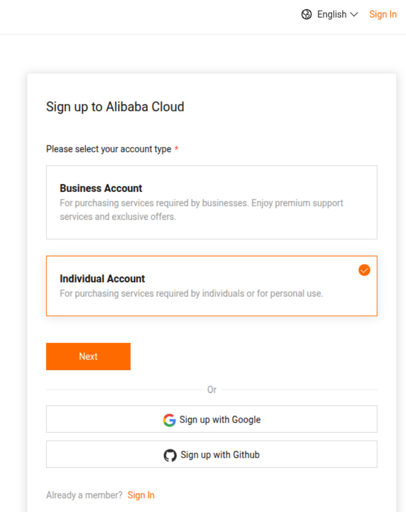

Return to the Alibaba Cloud Model Studio homepage, refresh and click "Agree" to complete

the registration of the Alibaba Cloud Model Studio Platform.

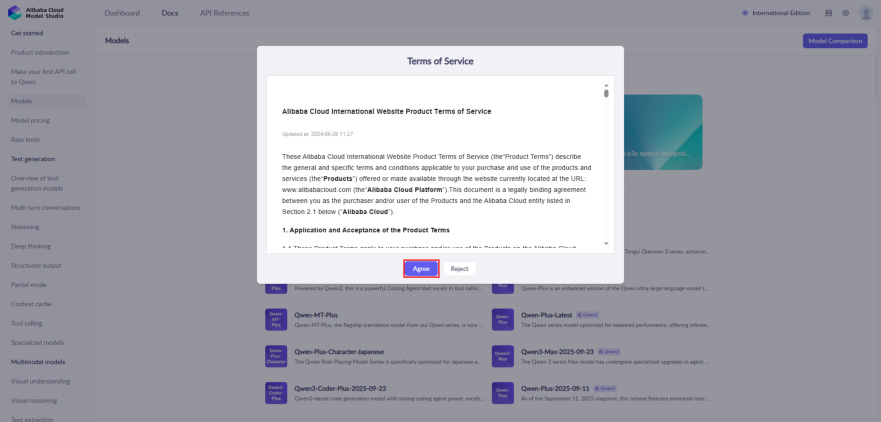
In API References, click [Singapore](https://modelstudio.console.alibabacloud.com/?tab=playground#/api-key) on the page to jump to the create API-key page

Click "Create API Key", select the account, and click "OK" to complete the creation

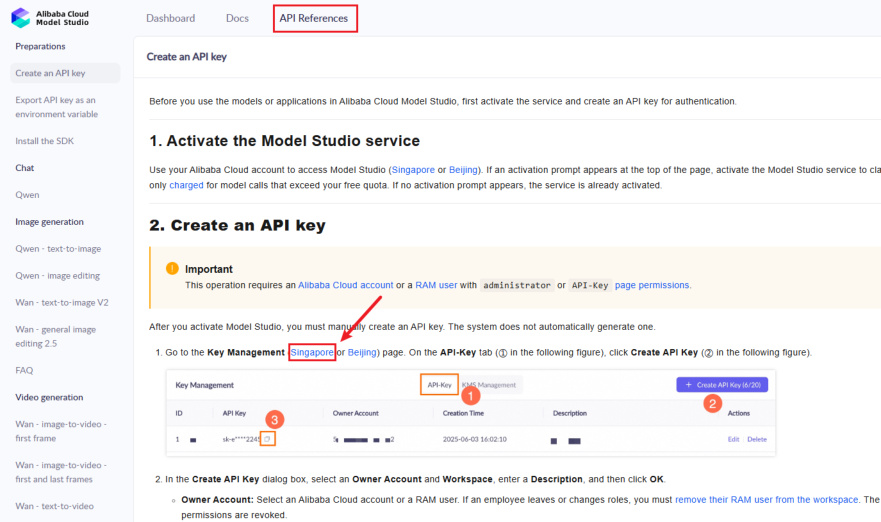

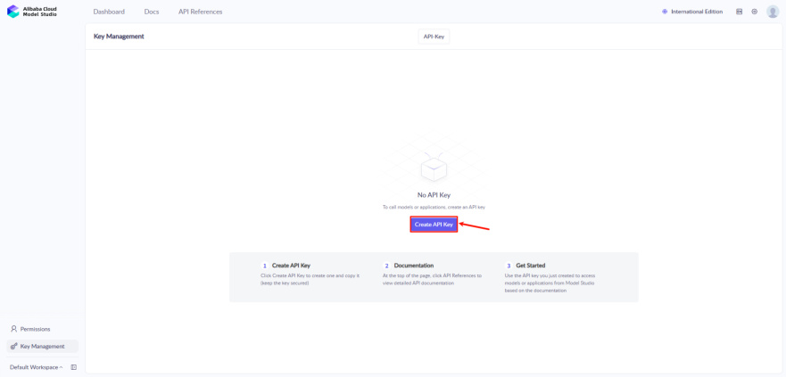
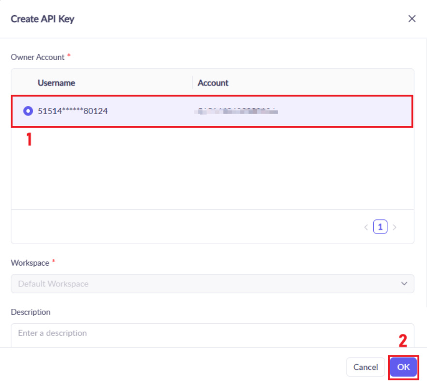

At this point, the account registration and API-KEY creation for Alibaba Cloud Model Studio

Platform are completed

### 2.2 Free Quota Description
When you activate Alibaba Cloud Model Studio(Singapore region) for the first time, each model

will automatically receive a free quota.

You can query the remaining quota for each model and select model versions in the "Models"

section. For example, for the model Qwen-Plus, click the model to view details.

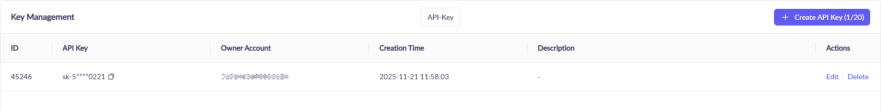
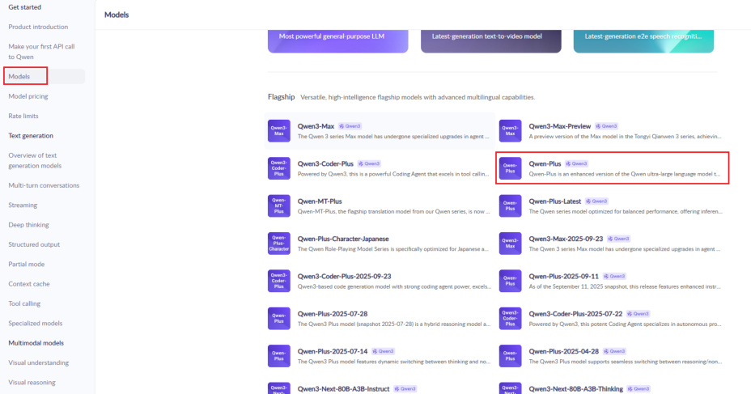

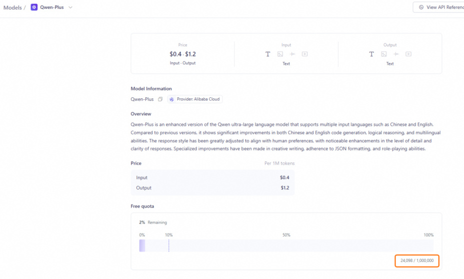

The free quota for new users is typically valid for 30 to 90 days, starting from the date you activate

Model Studio or your model request is approved. After the validity period expires or the free

quota is exhausted, continued use of the model inference service will incur fees.

For more detailed instructions, please refer to [Free quota for new users](https://modelstudio.console.alibabacloud.com/?tab=doc#/doc/?type=model&url=2766612)
## 3. Openrouter Platform Account
[!NOTE]

Openrouter offers many free model services, but there are access frequency limits and

the understanding capabilities of free models vary greatly. To ensure a better user

experience, it is recommended to prioritize using Alibaba's Bailian model service. This

section is for reference only for users who need to use Openrouter services.

### 3.1 Register an Account
Open the [openrouter](https://openrouter.ai/) link, click the avatar in the upper right corner to register an account.

Registering an account using an email address is similar to the process described above and will

not be repeated here.

### 3.2 Create API-KEY
Click on Keys in the upper right corner to create an API

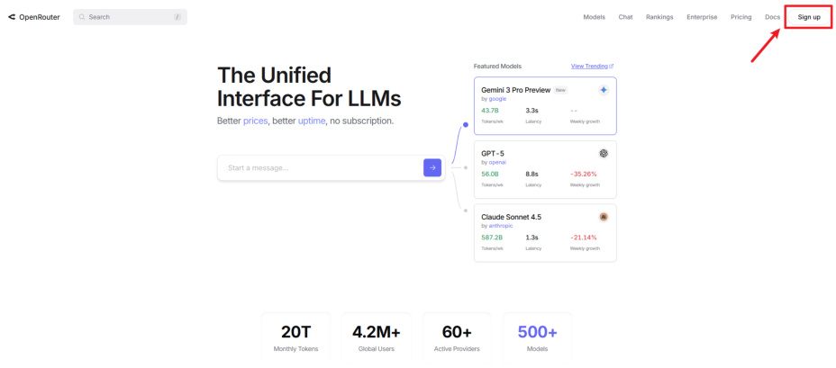

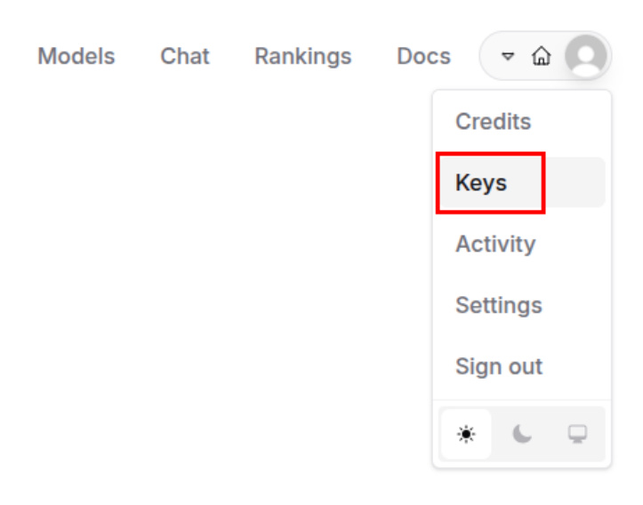
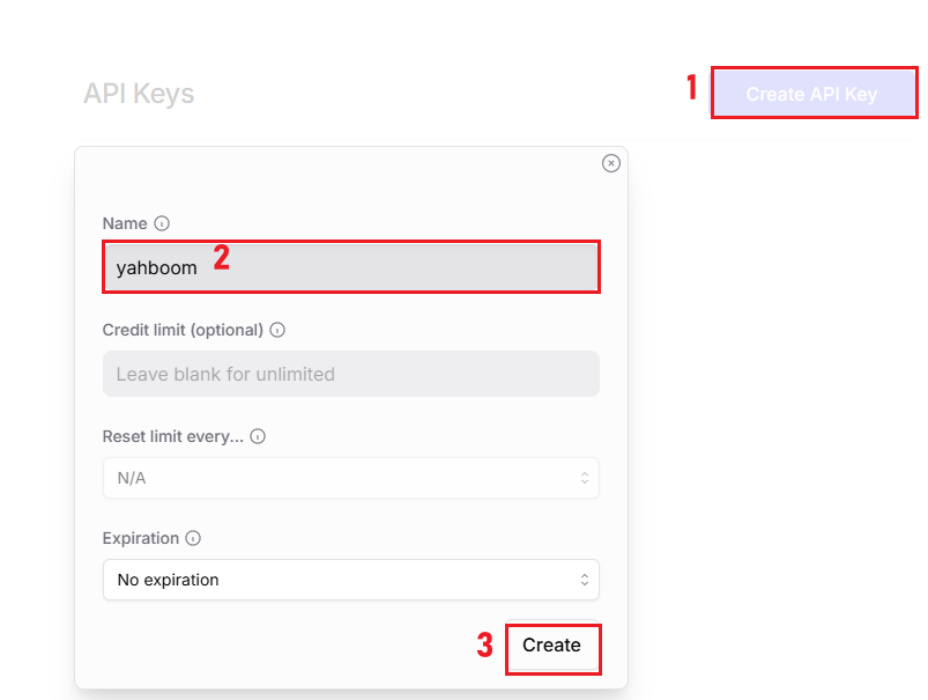

You will then get an API key. **You need to copy this key, because you won't be able to view it**

**again after closing this page.**

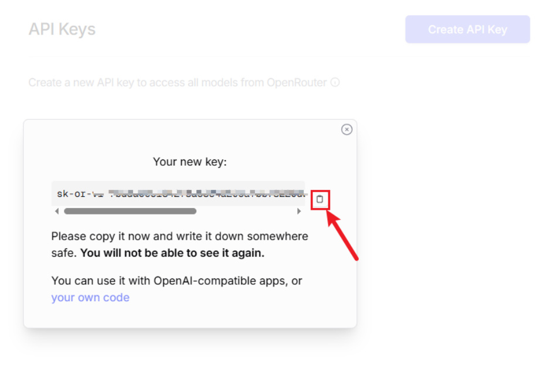
