# Configuring the API Key
**Configuring the API Key**

1. Course Content

2. Starting the Dify Service

3. Configuring the Model Service Provider API Key

4. Testing the API Key

5. Configuring the multi_brains Function Package API

6. Using Local Speech Services

### 6.1 Local Speech Recognition

### 6.2 Local Speech Synthesis

7. Modifying the Dfiy Service API

## 1. Course Content
Use the previously registered API key to configure the robot car's API key.

[!WARNING]

**Note** : Please ensure the car is connected to the internet to use the cloud-based model

services.
## 2. Starting the Dify Service
[!TIP]

ROSMASTER-M3 Pro uses Dify to build a multi-agent system, with Dify managing the calls to

the cloud-based models. - Connect to the vehicle's system via VNC or SSH, and enter the

following command in the terminal:

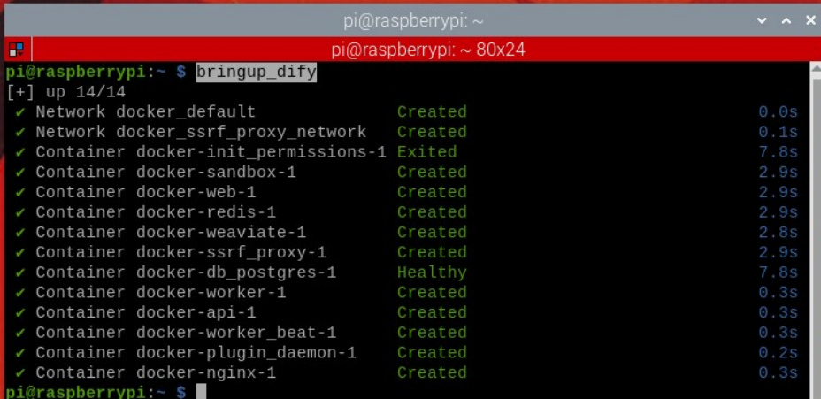

the terminal.

Enter the vehicle's IP address directly into your browser's address bar to access the Dify

management page. If this is the first time logging in, you will need to use the account and

password. You can select the language in the upper left corner.

[!NOTE]

All account passwords, intelligent agent applications, and RAG data are stored locally.

After logging in, the page will look like this:

## 3. Configuring the Model Service Provider API Key
Click Settings

Here, we'll use configuring the Alibaba Cloud Model Studio Platform account API as an

example. Click Model Provider -> Setup

Enter your Alibaba Cloud Model Studio Platform API key, then select whether it's an

international account, and click Save.

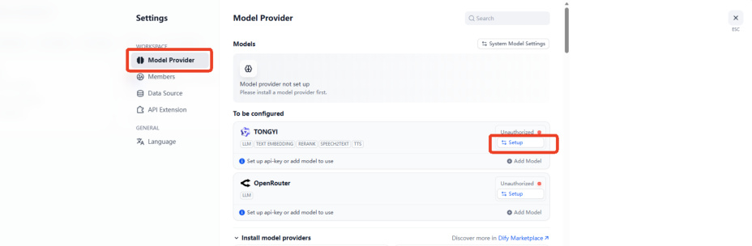
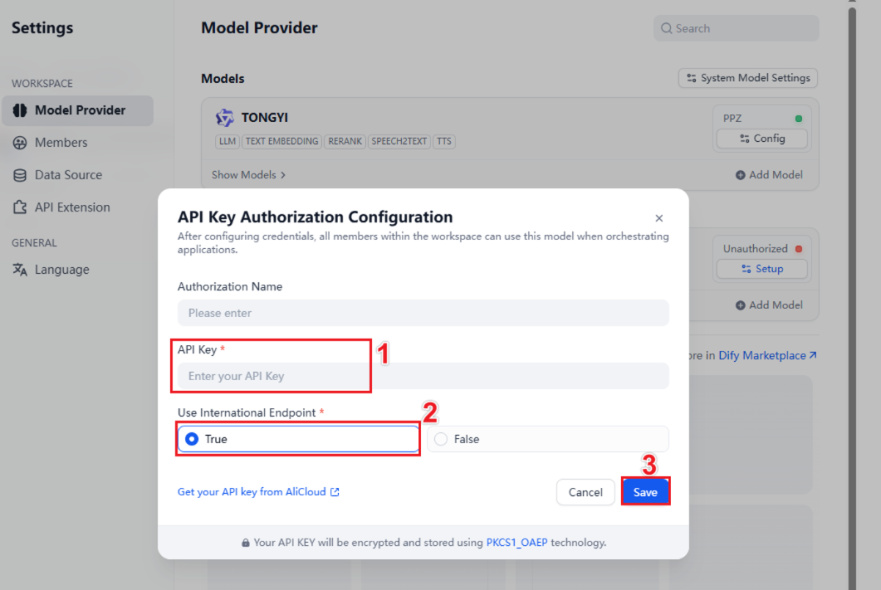
## 4. Testing the API Key
[!TIP]

If you need to test whether your API key is valid, you can refer to this section of the

tutorial. Otherwise, you can skip it.

Click on the "TEST_API" application in the studio.

Then, select any model in the model selection to test.

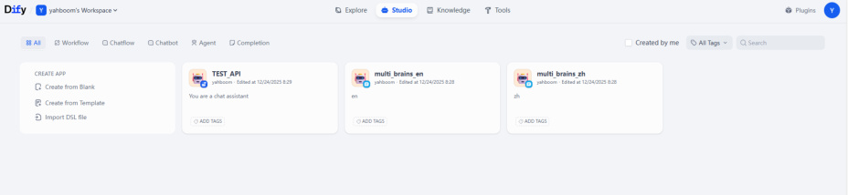

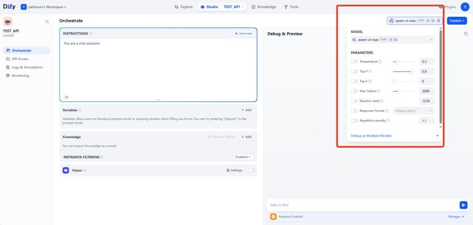
Enter any content in the chat box. If the registered API key is valid, you will see the model's

response.

## 5. Configuring the multi_brains Function Package
**API**

Generate the parameter file by running the following commands in the terminal:

If you later use Alibaba Cloud's speech synthesis service to generate a custom voice file,

**This does not affect normal use; you can ignore this if you don't need it.**

## 6. Using Local Speech Services
[!TIP]

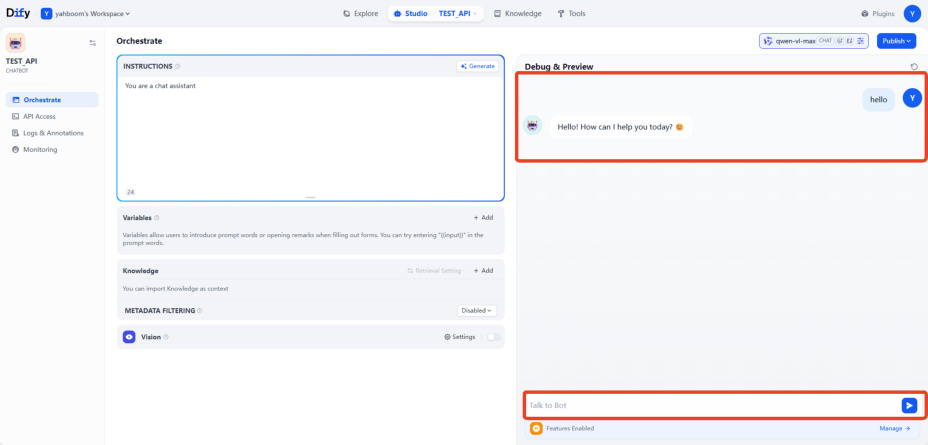

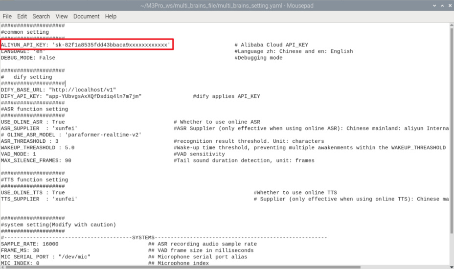
By default, online speech services are used for speech recognition and speech

synthesis. If you need to use local speech services, please refer to this section of the

tutorial; otherwise, you can skip this section.

Note that due to memory and performance limitations, local speech services are not

currently available on Jetson Nano.

### 6.1 Local Speech Recognition
Save and exit with Ctrl+x to enable local speech recognition.

Other parameters are used to configure some parameters of the recording process. See the

comments for details on the function of each parameter. Beginners can use the default

settings.

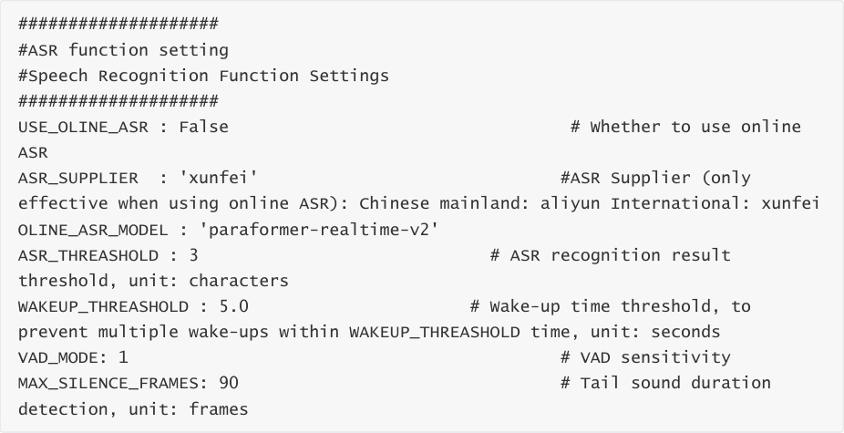

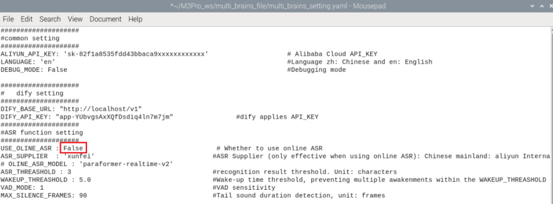
### 6.2 Local Speech Synthesis
Save and exit with Ctrl+x to enable local speech synthesis.

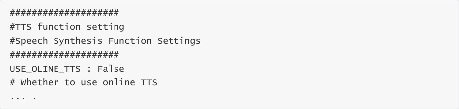

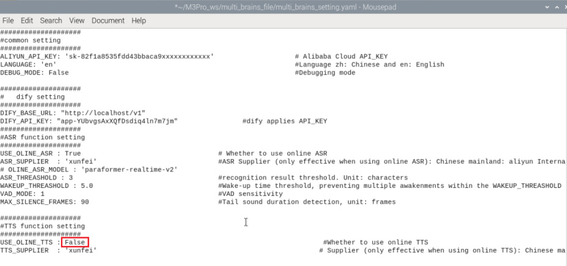
## 7. Modifying the Dfiy Service API
**Note** : This section is for users with development needs only and can generally be ignored.

If you need to modify the address that the vehicle's infotainment system uses to access the

Dify application's API, or if Dify is deployed on a different server, you need to modify the

access address in the configuration file:

`DIFY_API_KEY` is the API key for the AI application in Dify.

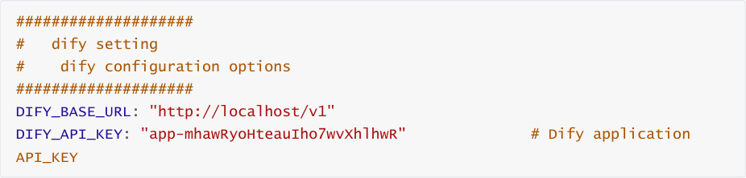
