# Dify Basic Functions
**Dify Basic Functions**

1. Course Content

2. Starting the Dify Service

3. Basic Usage

### 3.1 Switching Dify Language

### 3.2 Switching the AI Application's Access Model

4. Account Settings

5. Development Documentation

## 1. Course Content
Understand and master the basic operations and functions of Dify
## 2. Starting the Dify Service
Connect to the vehicle's computer via VNC or SSH, and enter the following command in the

terminal:

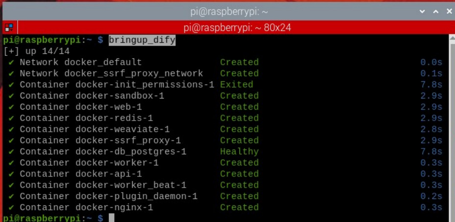

in the terminal.

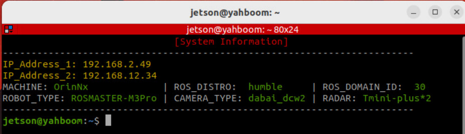
Enter the vehicle's IP address directly in the browser's address bar to access the Dify

management page. If this is the first time logging in, you will need to use the account and

password. You can select the language in the upper left corner.

[!NOTE]

All account passwords, AI agent applications, and RAG data are stored locally.

The Dify main interface is shown below:

## 3. Basic Usage
[!TIP]

If you need to use cloud-based AI models from model providers, please ensure the

vehicle's computer is connected to the internet.

### 3.1 Switching Dify Language
Generally, the Dify page will follow the browser's language. If you need to switch manually,

you can select the language in the settings.

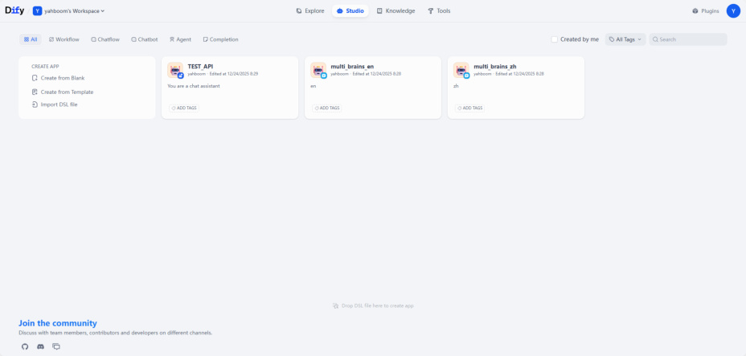
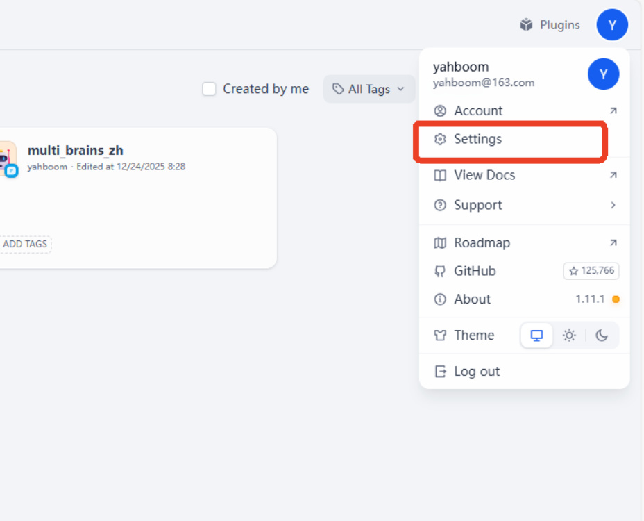

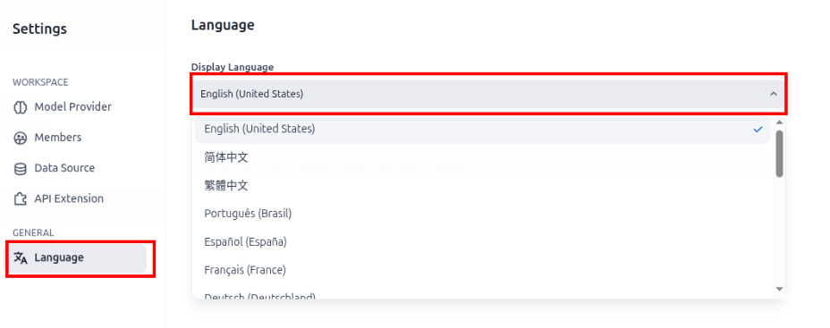

### 3.1 Accessing Model Provider Services

Dify has built-in model interface plugins for various model providers. These plugins are

maintained and upgraded by their respective model providers. We can install the

corresponding model provider's plugin to quickly access cloud models from different

vendors.

Click on "Plugins" -> "Explore Marketplace" -> "Models" in the upper left corner of the

homepage to access the model interface plugin page.

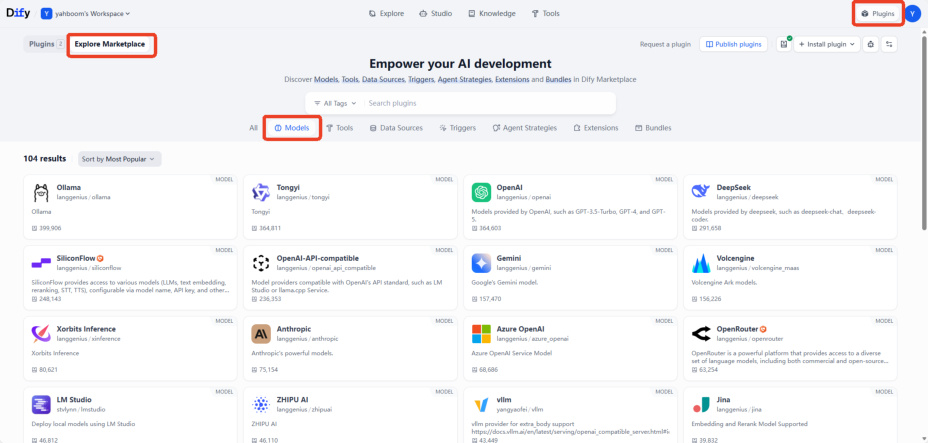

This example demonstrates installing and configuring the Tongyi Qianwen plugin. The

method is the same for other plugins; simply click "Install".

Afterwards, simply enter the API-KEY obtained from the corresponding platform in the `Model`

corresponding plugin will show a green light.

[!TIP]

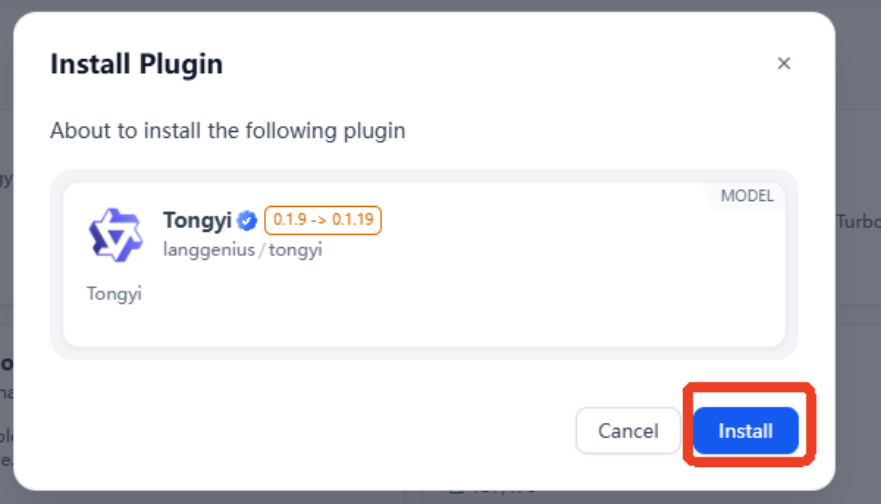
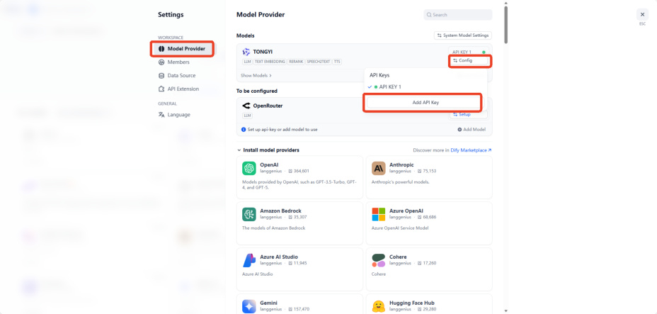
### 3.2 Switching the AI Application's Access Model
For already developed AI intelligent agent applications, you can quickly switch between

different models to test their effects. Here, we take the `multi_brains` core intelligent agent

of `ROSMASTER`    - `M3 Pro` as an example. Click on the intelligent agent application on the

homepage.

There are three core AIs: Task Routing, Decision Layer AI, and Execution Layer AI.

Here, we take switching the Decision Layer AI as an example. Click on the `Decision MAKING`

`AI` card, and you can switch between different vendor models in the model selection

dropdown menu.

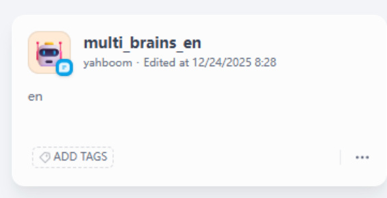

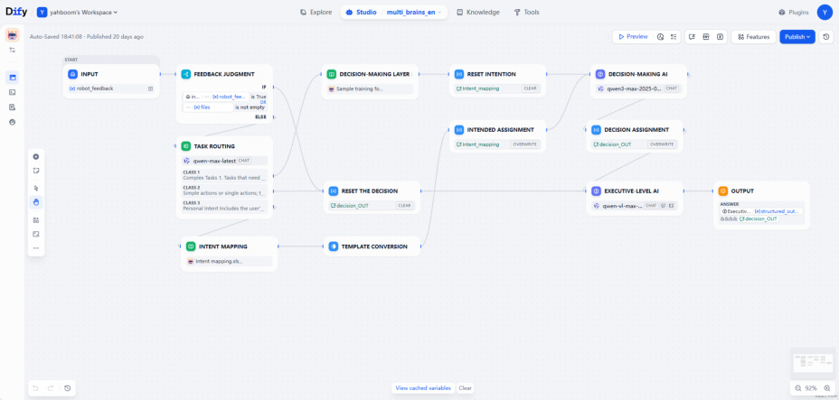
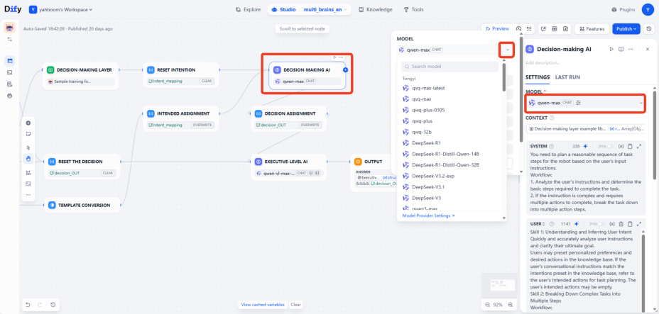

You can also fine-tune the parameters to adjust the model's response. The detailed function

of each parameter can be viewed by hovering the mouse over it.

Taking the temperature parameter as an example:

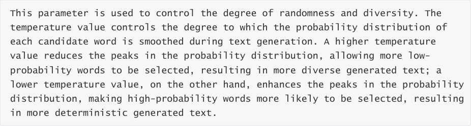

[!TIP]

Beginners can generally use the default parameters without adjustment.

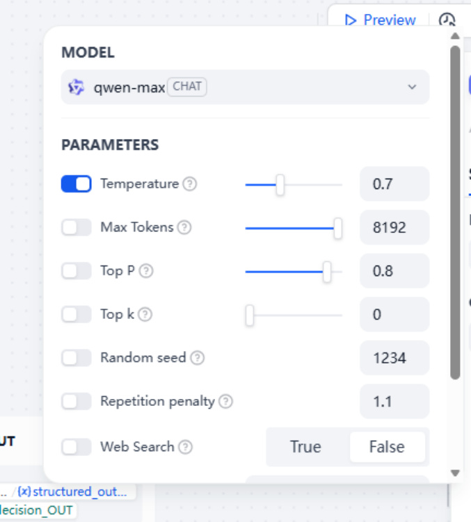

Note that after modifying the AI application, you need to click Publish - Publish Update to

save the changes.

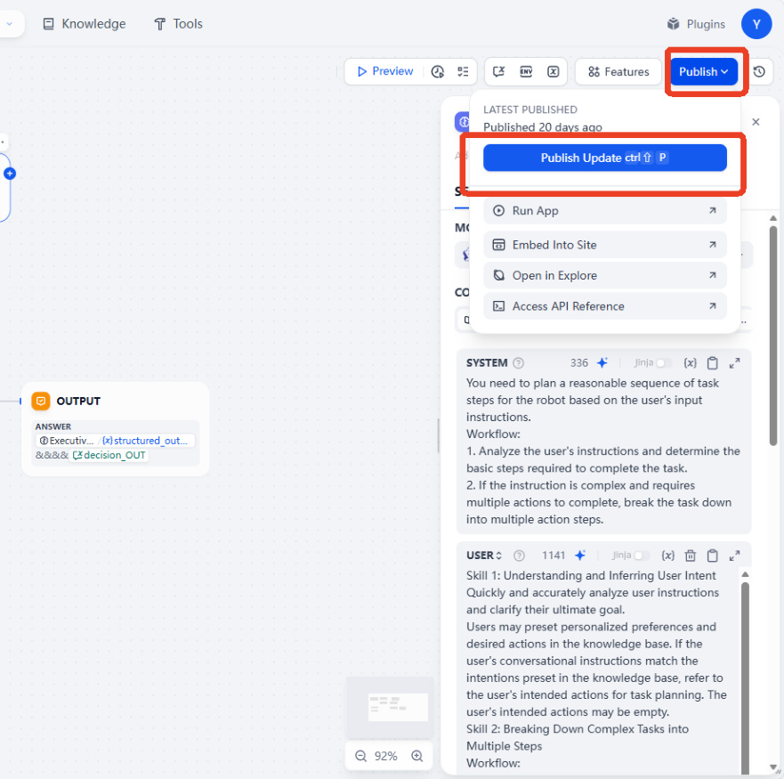

[!WARNING]

**Note:**

For the execution layer model, because it needs to process images, only multimodal

models can be selected (visual models will have special symbols as shown in the image

below).

There are no restrictions on the models for the task routing and decision-making

layers.

Task routing can select a smaller parameter model to improve response speed.

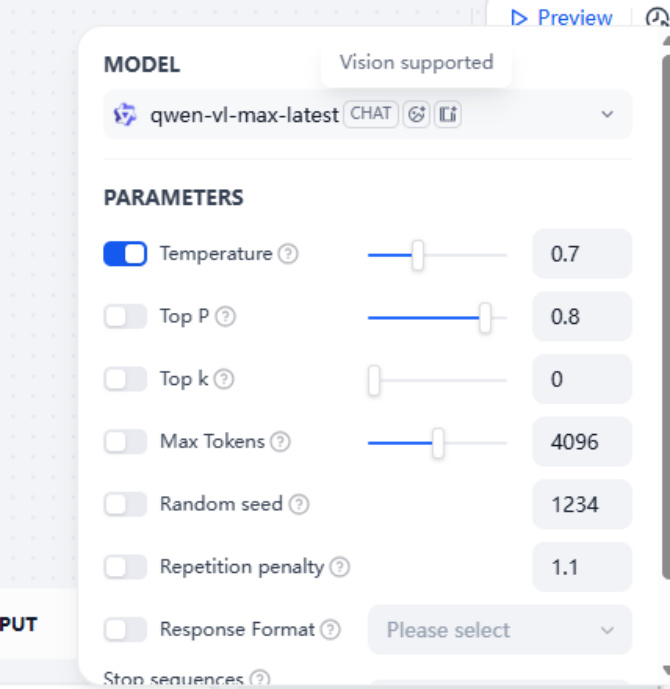
## 4. Account Settings
[!NOTE]

Dify account information is stored locally and has no privacy risks. The ROSMASTER-M3 Pro

comes with a pre-configured administrator account. Refer to this section of the tutorial only

if you need to modify account information.

Click the avatar in the upper right corner -> Account

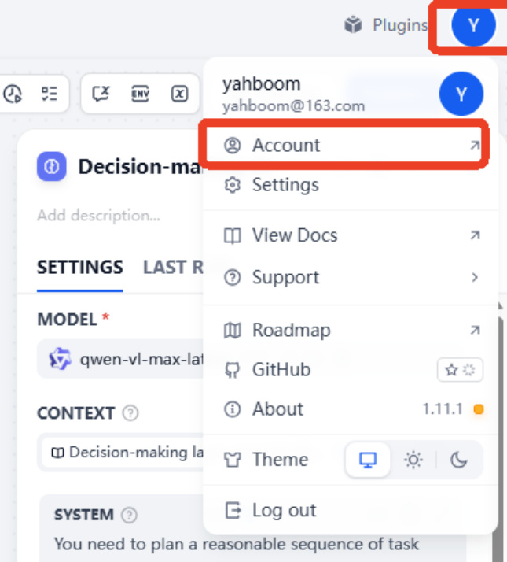

Account information is shown below. You can modify the information as needed.

To log out, click the avatar again to log out.

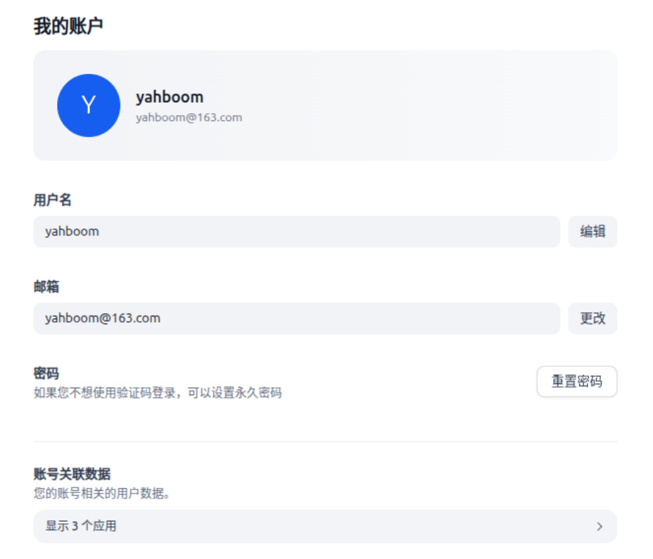
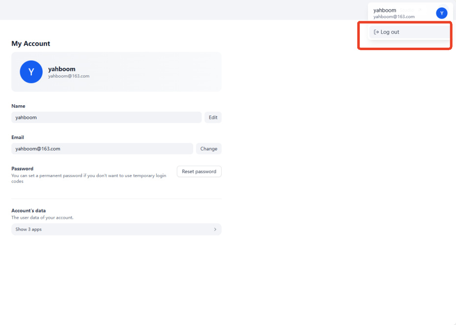
## 5. Development Documentation
For users who require further development, more detailed development documentation is

available. Click the avatar in the upper right corner -> View Docs

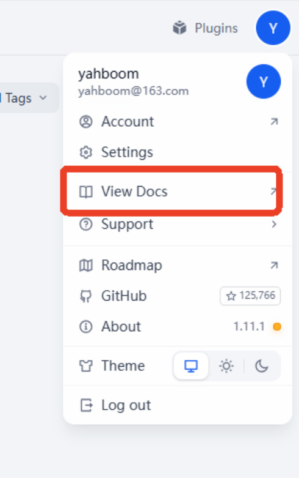
This will open Dify's online development documentation page. You can select and view different

documentation content from the dropdown list on the left.

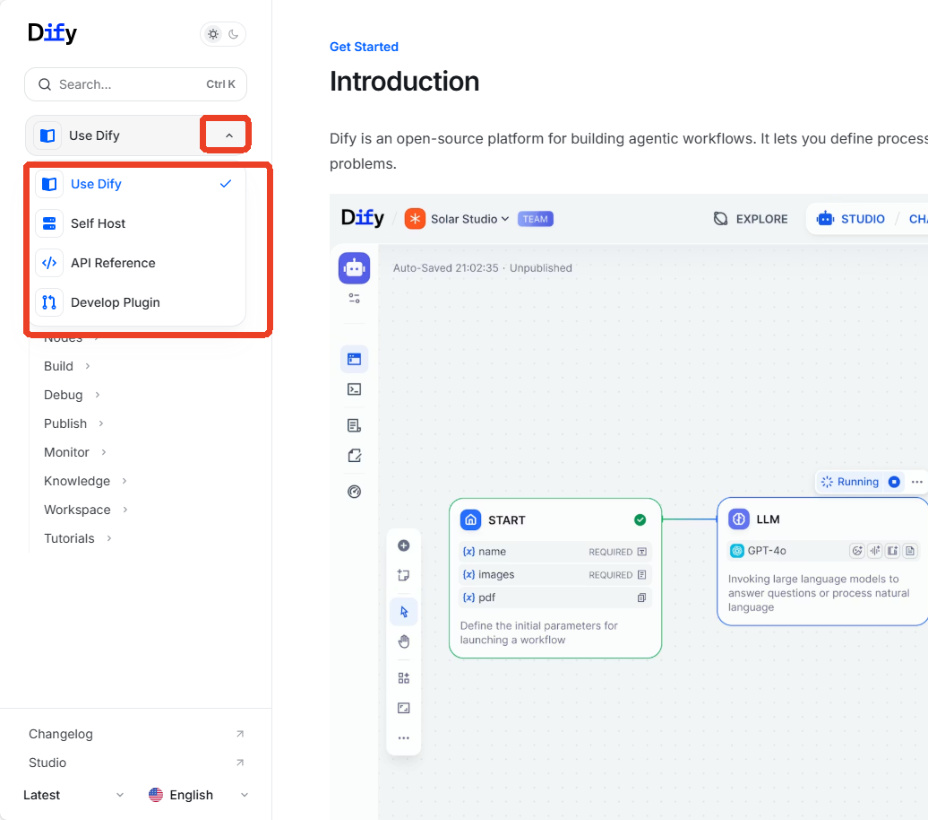
