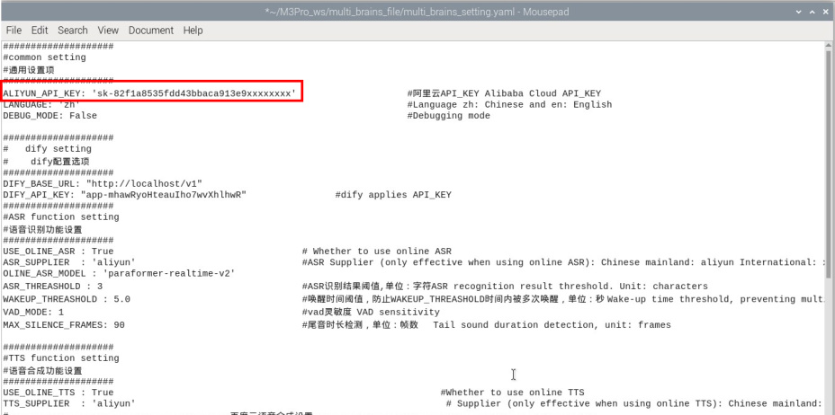
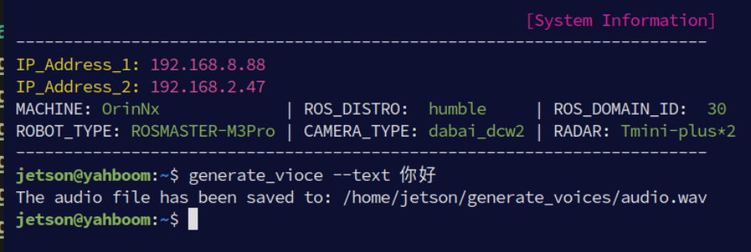
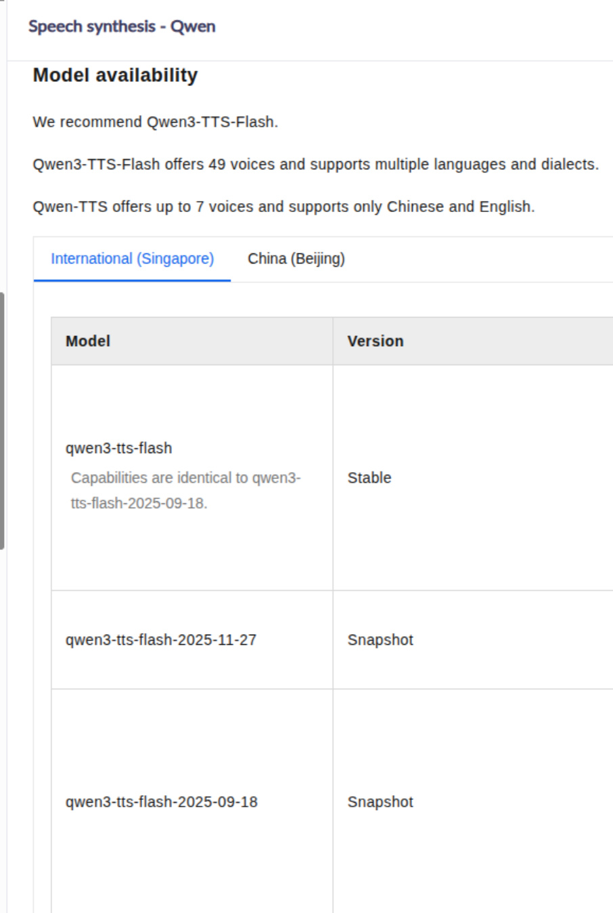
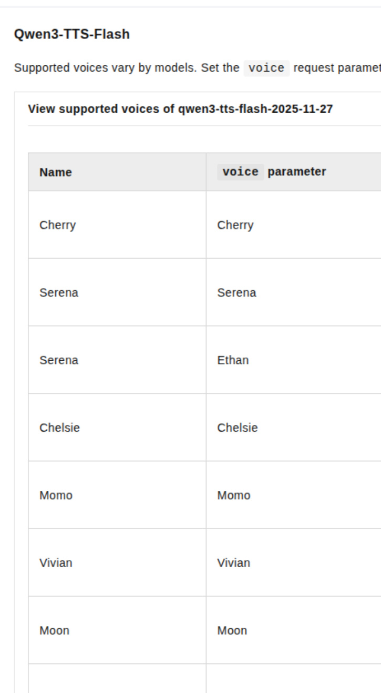
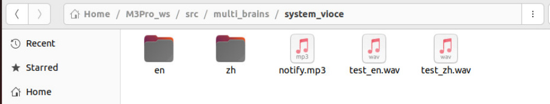
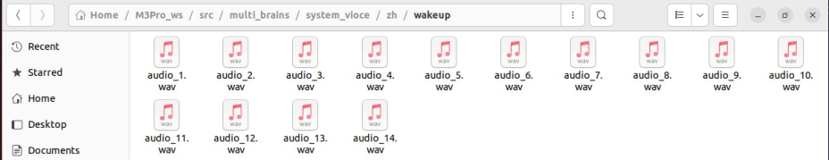
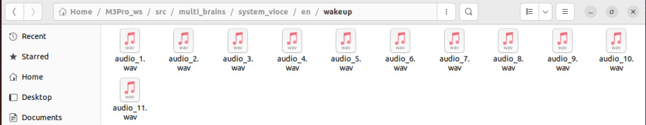

# Personalized Wake-Up Response
**Personalized Wake-Up Response**

1. Course Content

3. Loading Audio Files

## 1. Course Content
Add audio files to the multi_brains program's audio library to customize the voice response

after wake-up.


[!NOTE]


This section of the tutorial is only for users who need to customize personalized voice

responses and does not affect normal use.

If you do not need to customize personalized responses, you can skip this section. ##

2. Preparing Audio Files


The **audio materials for voice replies can be downloaded and prepared independently.**


command. The speech generation uses the speech synthesis model from the Bailian


Configuring API-KEY" section of this chapter.

Pre-configure the Bailian API-KEY


Run the command in the terminal:





speech.





[!NOTE]


Other optional startup parameters are as follows:


-- `config_file` : Configuration file path, default

```
    ~/M3Pro_ws/multi_brains_file/multi_brains_setting.yaml

```

For available speakers and speech synthesis models, please refer to the dynamic notifications on

the Bailian official website: https://bailian.console.aliyun.com/?spm=5176.29619931.J_SEsSjsNv72y

RuRFS2VknO.2.74cd10d73l2Pw5&tab=doc#/doc/?type=model&url=2879134


Reference model:




Reference Tone




Supported Languages


Chinese, English, Spanish, Russian, Italian, French, Korean, Japanese, German, Portuguese
## 3. Loading Audio Files
multi_brains system audio path:




Where:


in the directory:




files in the directory:




When the multi_brains program is started, it will automatically load the audio files in the

corresponding directory and randomly play personalized response voices when the user

wakes the system.
