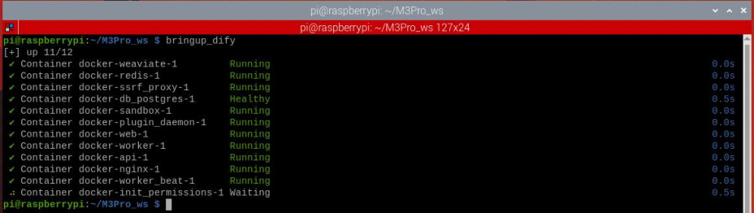
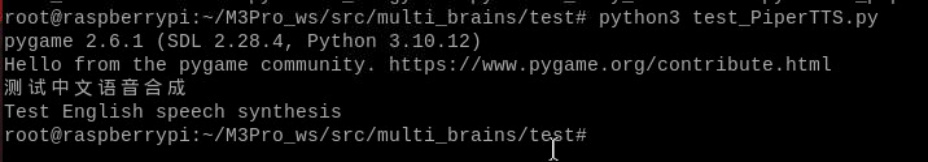
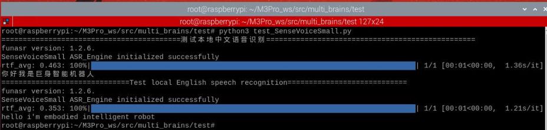
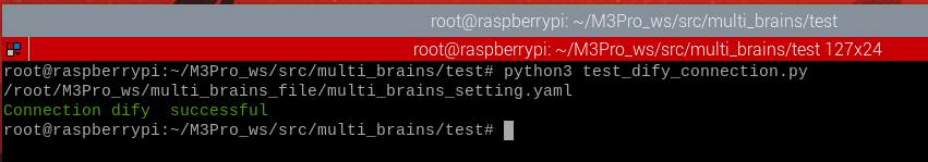
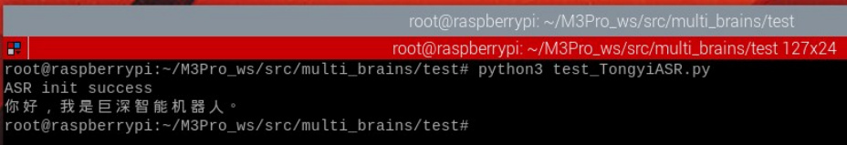
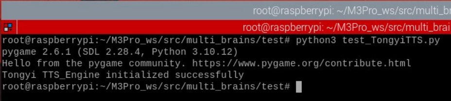
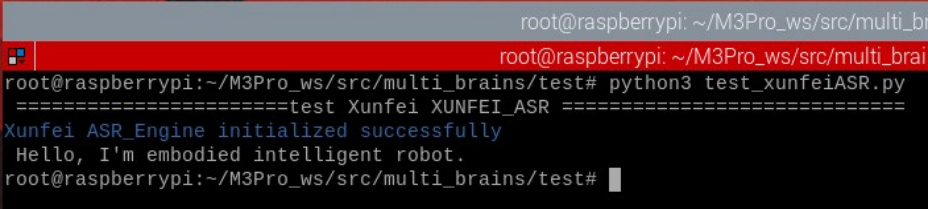

# Core Module Testing Tools
**Core Module Testing Tools**

1. Course Content

2. Start the Dify service

3. Navigate to the test tool path

4. Test local speech synthesis function

5. Test Local Speech Recognition Functionality

6. Testing Whether the Robot Can Access Dify Normally

7. Online Voice Services for Users in Mainland China

### 7.1 Bailian Speech Recognition (ASR)

### 7.2 Bailian Speech Synthesis (TTS)

### 7.3 Baidu Qianfan Speech Synthesis (TTS)

8. Online Voice Services for International Users

### 8.1 iFLYTEK Speech Recognition Service

### 8.2 iFLYTEK Speech Synthesis Service

## 1. Course Content
multi_brains provides minimal test programs for testing the core modules of a large model,

used to quickly locate problems in abnormal situations.
## 2. Start the Dify service
## 3. Navigate to the test tool path
Test tools are as follows:

## 4. Test local speech synthesis function
Test the local speech synthesis function for Chinese and English in sequence

After running, it will play the Chinese and English speech synthesis results sequentially.

## 5. Test Local Speech Recognition Functionality
After running, it will test the preset Chinese and English audio recordings sequentially.

After running, it will print the speech recognition results of the test audio.

## 6. Testing Whether the Robot Can Access Dify
**Normally**

If the program indicates that the model service is unavailable—and you are unsure whether

this is due to an incorrect network address preventing the robot/vehicle system from

accessing Dify—you can perform the following test:

If the robot successfully displays the information shown below, it confirms that the connection to

Dify is functioning correctly. Otherwise, Dify may not have started, or the Dify program may have

crashed and requires a restart.

## 7. Online Voice Services for Users in Mainland China

### 7.1 Bailian Speech Recognition (ASR)
If errors occur with the online speech recognition service, you can independently test the

Bailian speech recognition service:

Upon execution, the script will perform a speech recognition test using a preset audio

sample.

### 7.2 Bailian Speech Synthesis (TTS)
If errors occur with the online speech synthesis service, you can independently test the

Bailian speech synthesis service:

Upon execution, the script will first synthesize speech from a default text sample, and then play

the corresponding audio.

### 7.3 Baidu Qianfan Speech Synthesis (TTS)
If errors occur while using Baidu's speech synthesis service, you can independently test the

Baidu speech synthesis service:

Upon execution, the script will first synthesize speech from a default text sample, and then play

the corresponding audio.

## 8. Online Voice Services for International Users
### 8.1 iFLYTEK Speech Recognition Service
If international users encounter errors with online speech recognition, they can test the

iFLYTEK speech recognition service independently.

Upon execution, the script will perform a speech recognition test on a pre-configured test

audio file.

### 8.2 iFLYTEK Speech Synthesis Service
If international users encounter errors with online speech synthesis, they can test the

iFLYTEK speech synthesis service independently.

Upon execution, the script will first synthesize speech from a default text sample, and then play

the corresponding audio.
