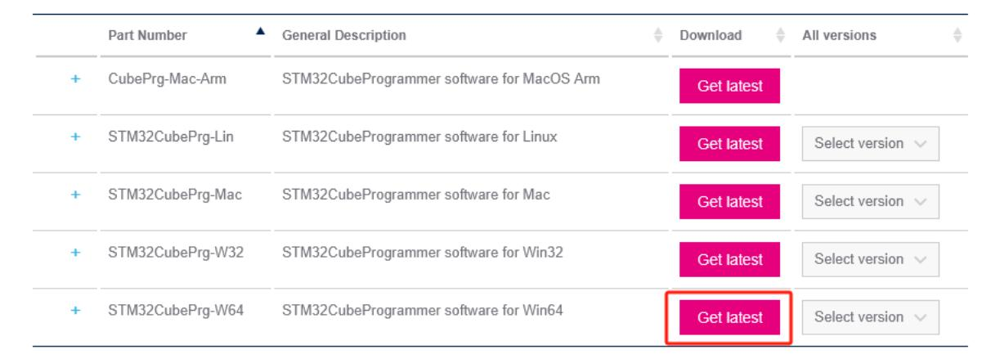
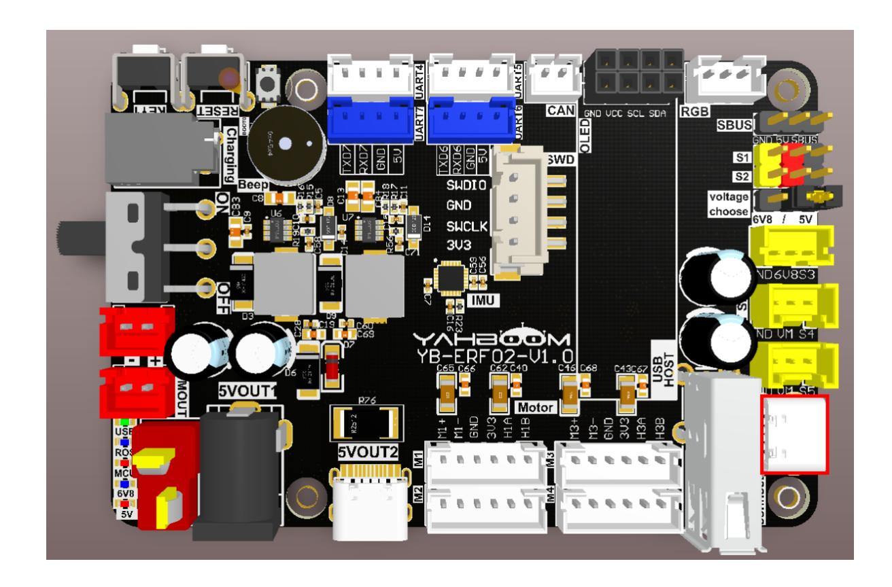
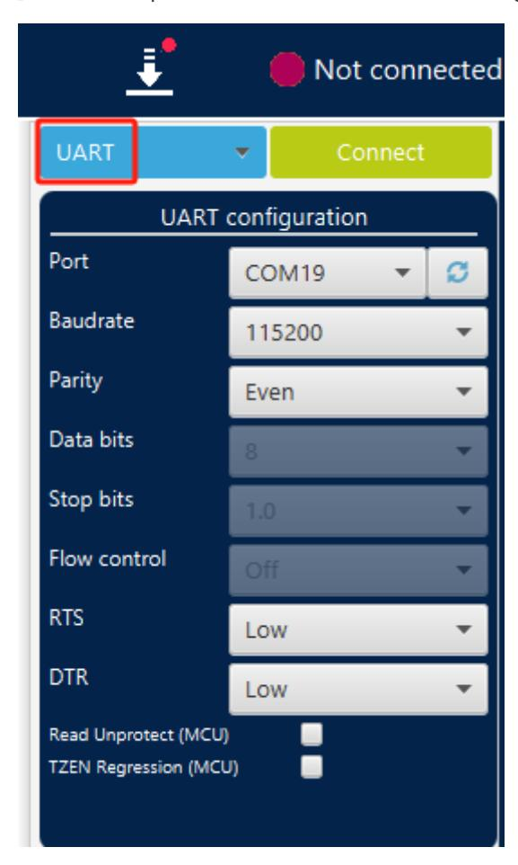
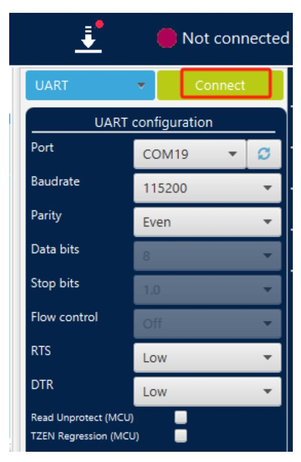
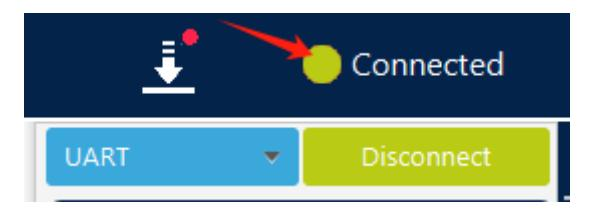
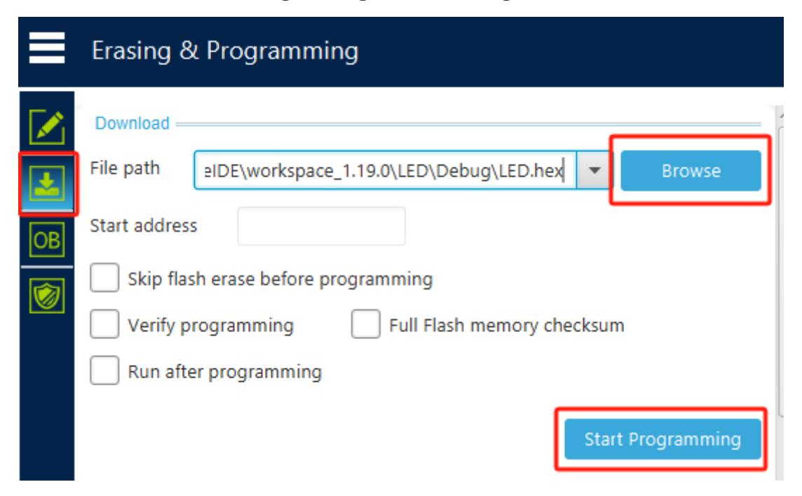

# **Burning STM32 firmware using serial port**

Burning STM32 [firmware](#page-0-0) using serial port

- [1. Download and install](#page-0-1) the tool
- [2. Hardware](#page-0-2) Connection
- [3. STM32CubeProgrammer](#page-1-0) burns firmware

### **1. Download and install the tool**

Here we take Win 64-bit system as an example

This time we need to use the STM32CubeProgrammer burning tool. Download link:

https://www.st.com/en/development-tools/stm32cubeprog.html

Serial port driver download address:

https://www.silabs.com/documents/public/software/CP210x\_Windows\_Drivers.zip

After downloading the burning tool and serial port driver, unzip them and follow the prompts to install them.

### **2. Hardware Connection**

Use a Type-C data cable to connect to the computer.

## **3. STM32CubeProgrammer burns firmware**

Open the STM32CubeProgrammer software, select the [UART] mode, select the corresponding serial port number in [Port], and other parameters are as shown in the figure below.

Now press and hold the BOOT button on the control board, press the RESET button again, and then release the BOOT button. The STM32 will enter the serial port programming mode. Click the [Connect] button to connect.

The status will change if the connection is successful.

Click the download button to enter the download page, click [Browse] to select the hex file to download, and then click [Start Programming] to start burning the firmware.

There will be a prompt after the firmware burning is completed.