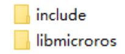
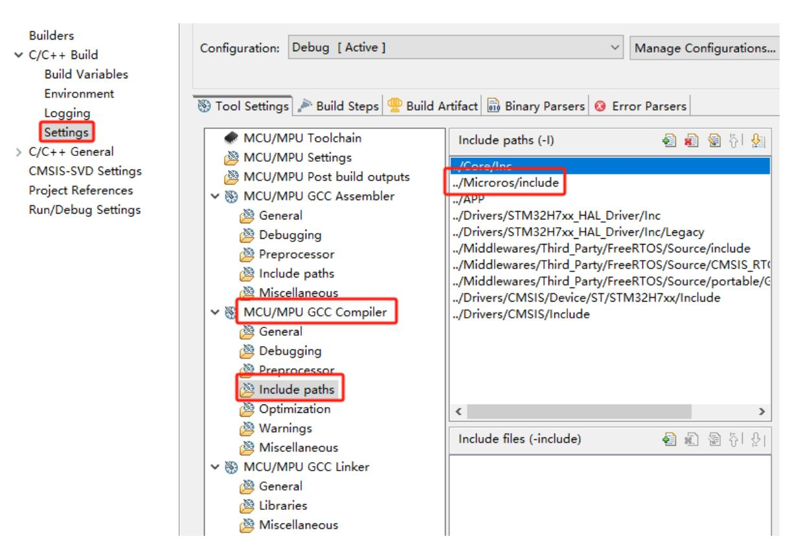
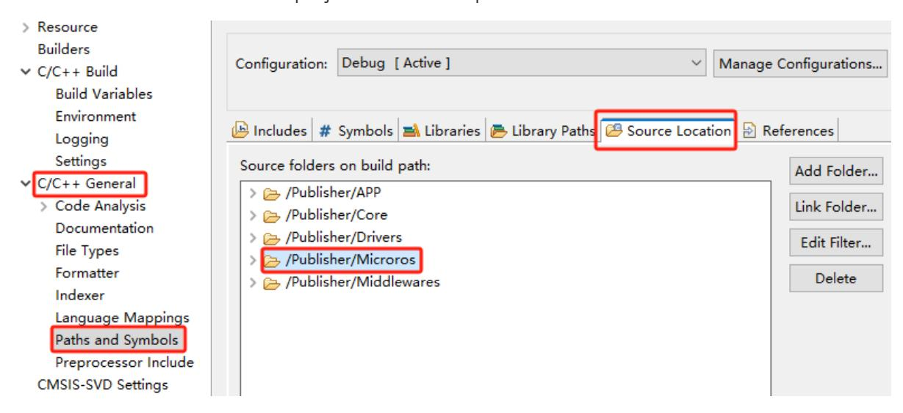
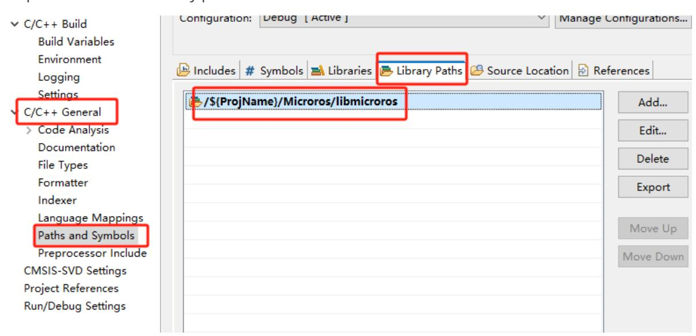
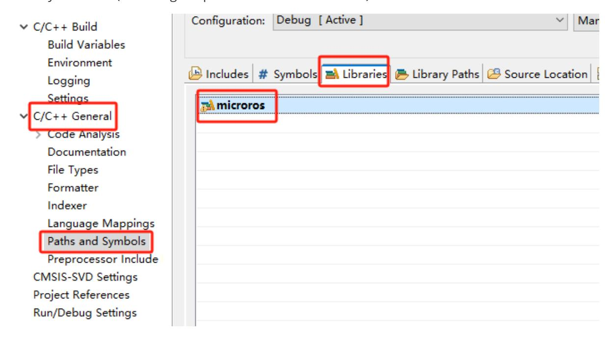

# **Compile the microros driver library**

Compile the [microros](#page-0-0) driver library

- <span id="page-0-0"></span>1. Install the [cross-compiler](#page-0-1)
- 2. Get the [STM32-microros](#page-0-2) library file
- 3. Modify [parameters](#page-1-0)
- [4. Add environment](#page-3-0) variables
- 5. Start [compiling](#page-3-1)
- 6. Solve the include [problem](#page-4-0)
- [7. The](#page-4-1) final file
- 8. Import [STM32CUBEIDE](#page-5-0) project

**Note: You must use Ubuntu to compile the microros driver library. Ubuntu 22.04 is recommended.**

# **1. Install the cross-compiler**

Open the download address and download the Linux version of the cross-compiler.

https://developer.arm.com/downloads/-/gnu-rm

<span id="page-0-1"></span>

<span id="page-0-2"></span>

After decompression, put the file in the following path

/opt/gcc-arm-none-eabi

And add the executable file path to the .bashrc environment variable in the user directory.

export PATH=\$PATH:/opt/gcc-arm-none-eabi/bin

# **2. Get the STM32-microros library file**

Download and compile the microros setup tool

```
mkdir uros_ws && cd uros_ws
git clone -b humble https://github.com/micro-ROS/micro_ros_setup.git
src/micro_ros_setup
rosdep update && rosdep install --from-paths src --ignore-src -y
colcon build
source install/local_setup.bash
```

Use the microros setup tool to generate the STM32-microros library file.

```
ros2 run micro_ros_setup create_firmware_ws.sh generate_lib
```

Check the workspace. We should now have five folders, among which the firmware folder contains the STM32-microros library files. build firmware install log src

# **3. Modify parameters**

Open the toolchain.cmake file

```
vim ~/uros_ws/firmware/toolchain.cmake
```

Copy the following content into

```
set(CMAKE_SYSTEM_NAME Generic)
set(CMAKE_CROSSCOMPILING 1)
set(CMAKE_TRY_COMPILE_TARGET_TYPE STATIC_LIBRARY)
# SET HERE THE PATH TO YOUR C99 AND C++ COMPILERS
# Add the compiler path here
set(PIX /opt/gcc-arm-none-eabi/bin)
set(CMAKE_C_COMPILER ${PIX}/arm-none-eabi-gcc)
set(CMAKE_CXX_COMPILER ${PIX}/arm-none-eabi-g++)
set(CMAKE_C_COMPILER_WORKS 1 CACHE INTERNAL "")
set(CMAKE_CXX_COMPILER_WORKS 1 CACHE INTERNAL "")
# SET HERE YOUR BUILDING FLAGS
set(FLAGS "-O2 -ffunction-sections -fdata-sections -fno-exceptions -mcpu=cortex-
m7 -mfpu=fpv5-d16 -mfloat-abi=hard -nostdlib -mthumb --param max-inline-insns-
single=500 -D'RCUTILS_LOG_MIN_SEVERITY=RCUTILS_LOG_MIN_SEVERITY_NONE'" CACHE
STRING "" FORCE)
# -mcpu=cortex-m7 indicates the microcontroller architecture
# -mfpu=fpv5-d16 -mfloat-abi=hard indicates support for hardware floating-point
compilation
```

```
set(CMAKE_C_FLAGS_INIT "-std=c11 ${FLAGS} -DCLOCK_MONOTONIC=0 -
D'__attribute__(x)='" CACHE STRING "" FORCE)
set(CMAKE_CXX_FLAGS_INIT "-std=c++11 ${FLAGS} -fno-rtti -DCLOCK_MONOTONIC=0 -
D'__attribute__(x)='" CACHE STRING "" FORCE)
set(__BIG_ENDIAN__ 0)
```

Save and exit.

Open the colcon.meta file

```
vim ~/uros_ws/firmware/colcon.meta
```

Copy the following content into

```
{
    "names": {
        "tracetools": {
            "cmake-args": [
                "-DTRACETOOLS_DISABLED=ON",
                "-DTRACETOOLS_STATUS_CHECKING_TOOL=OFF"
            ]
        },
        "rosidl_typesupport": {
            "cmake-args": [
                "-DROSIDL_TYPESUPPORT_SINGLE_TYPESUPPORT=ON"
            ]
        },
        "rcl": {
            "cmake-args": [
                "-DBUILD_TESTING=OFF",
                "-DRCL_COMMAND_LINE_ENABLED=OFF",
                "-DRCL_LOGGING_ENABLED=OFF"
            ]
        },
        "rcutils": {
            "cmake-args": [
                "-DENABLE_TESTING=OFF",
                "-DRCUTILS_NO_FILESYSTEM=ON",
                "-DRCUTILS_NO_THREAD_SUPPORT=ON",
                "-DRCUTILS_NO_64_ATOMIC=ON",
                "-DRCUTILS_AVOID_DYNAMIC_ALLOCATION=ON"
            ]
        },
        "microxrcedds_client": {
            "cmake-args": [
                "-DUCLIENT_PIC=OFF",
                "-DUCLIENT_PROFILE_UDP=OFF",
                "-DUCLIENT_PROFILE_TCP=OFF",
                "-DUCLIENT_PROFILE_DISCOVERY=OFF",
                "-DUCLIENT_PROFILE_SERIAL=OFF",
                "-UCLIENT_PROFILE_STREAM_FRAMING=ON",
                "-DUCLIENT_PROFILE_CUSTOM_TRANSPORT=ON",
                "-DUCLIENT_PROFILE_SHARED_MEMORY=ON",
                "-DUCLIENT_SHARED_MEMORY_MAX_ENTITIES=20"
            ]
        },
```

```
"rmw_microxrcedds": {
            "cmake-args": [
                "-DRMW_UXRCE_MAX_NODES=1",
                "-DRMW_UXRCE_MAX_PUBLISHERS=10",
                "-DRMW_UXRCE_MAX_SUBSCRIPTIONS=10",
                "-DRMW_UXRCE_MAX_SERVICES=1",
                "-DRMW_UXRCE_MAX_CLIENTS=1",
                "-DRMW_UXRCE_MAX_HISTORY=10",
                "-DRMW_UXRCE_TRANSPORT=custom"
            ]
        }
    }
}
```

"-DRMW\_UXRCE\_MAX\_NODES=1", #maximum number of nodes;

"-DRMW\_UXRCE\_MAX\_PUBLISHERS=10", #maximum number of publisher;

"-DRMW\_UXRCE\_MAX\_SUBSCRIPTIONS=10", #maximum number of subscribers;

"-DRMW\_UXRCE\_MAX\_SERVICES=1", #maximum number of servers;

"-DRMW\_UXRCE\_MAX\_CLIENTS=1", #maximum number of clients;

"-DRMW\_UXRCE\_MAX\_HISTORY=10", #history;

"-DRMW\_UXRCE\_TRANSPORT=custom" #custom transport interface

Save and exit.

# **4. Add environment variables**

```
export RMW_IMPLEMENTATION=rmw_microxrcedds
```

### **5. Start compiling**

```
cd ~/uros_ws/
ros2 run micro_ros_setup build_firmware.sh $(pwd)/firmware/toolchain.cmake
$(pwd)/firmware/colcon.meta
```

**Note: Since the compilation process requires downloading many files, and most file servers are located abroad, if there is a network anomaly, please solve the network download problem yourself.**

View the generated static library and header files

```
ls firmware/build
```

# <span id="page-4-0"></span>**6. Solve the include problem**

Since the generated include folder path is too long, you need to use a script to fix it.

Create a new fix\_include.sh script in the firmware folder

```
cd ~/uros_ws/firmware
vim fix_include.sh
```

Copy the following content into

```
#!/bin/bash
######## Fix include paths ########
BASE_PATH=build
pushd mcu_ws > /dev/null
    INCLUDE_ROS2_PACKAGES=$(colcon list | awk '{print $1}' | awk -vd=" " '{s=
(NR==1?s:sd)$0}END{print s}')
popd > /dev/null
for var in ${INCLUDE_ROS2_PACKAGES}; do
    if [ -d "${BASE_PATH}/include/${var}/${var}" ]; then
        rsync -r ${BASE_PATH}/include/${var}/${var}/* $BASE_PATH/include/${var}
        rm -rf ${BASE_PATH}/include/${var}/${var}
    fi
done
mkdir ${BASE_PATH}/libmicroros
mv ${BASE_PATH}/libmicroros.a ${BASE_PATH}/libmicroros
```

Save and exit.

Run the following command to fix the include folder problem.

```
bash fix_include.sh
```

#### <span id="page-4-1"></span>**7. The final file**

```
ls ~/uros_ws/firmware/build
ls ~/uros_ws/firmware/build/libmicroros
ls ~/uros_ws/firmware/build/include
```

## **8. Import STM32CUBEIDE project**

Create a new Microros folder in the project, and then copy the include and libmicroros folders generated by the previous step into Microros.

<span id="page-5-0"></span>

Right-click to open the project properties, then click [Settings]->[MCU/MPU GCC Compiler]-> [include paths] to add the microros include directory path, and then click [Apply] to take effect.



Add the microros folder as the project source code path.



#### Import the microros library path



Link the microros library file to the project. Make sure the name matches the libmicroros.a static library file name (excluding the prefix and suffix "microros").

