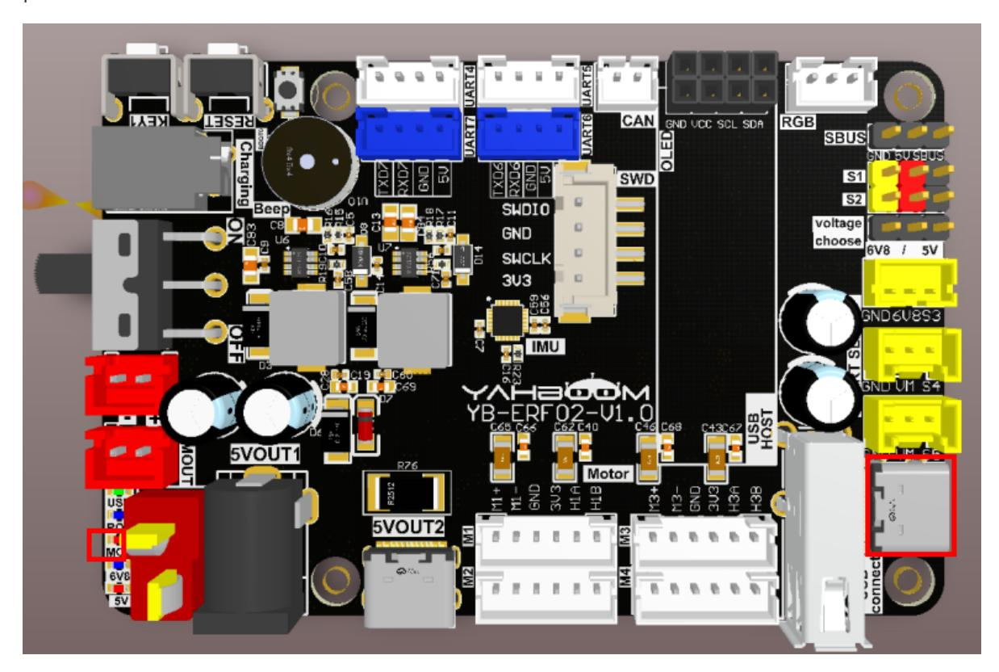
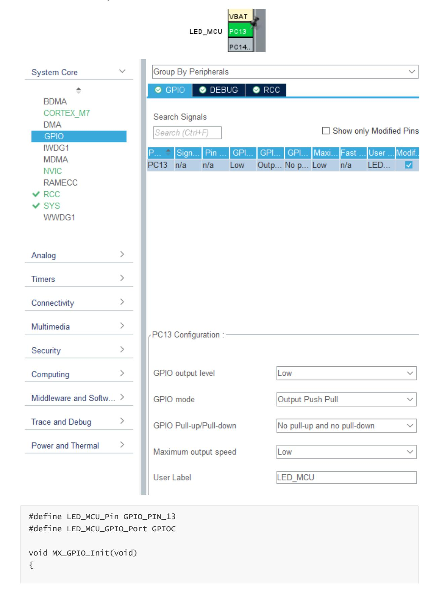
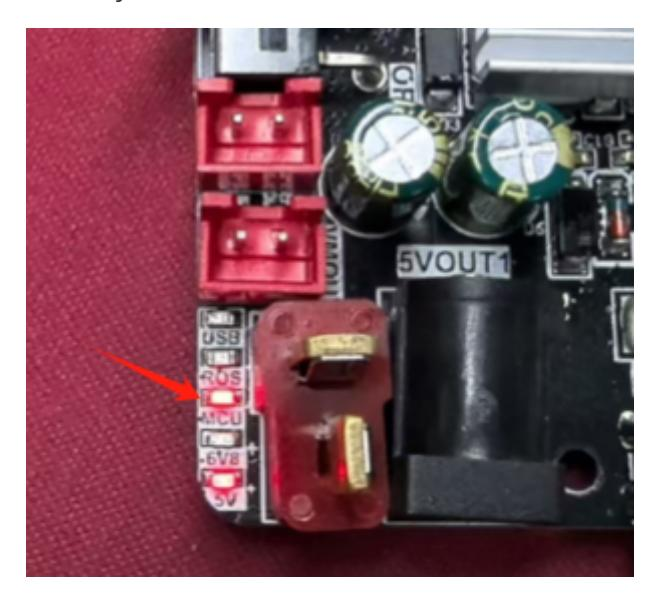

# **Light up the LED light**

Light [up the](#page-0-0) LED light

- <span id="page-0-0"></span>[1. Experimental](#page-0-1) Purpose
- [2. Hardware](#page-0-2) Connection
- 3. Core code [analysis](#page-1-0)
- 4. Compile, [download and burn](#page-3-0) firmware
- <span id="page-0-2"></span><span id="page-0-1"></span>[5. Experimental](#page-3-1) Results

## **1. Experimental Purpose**

Control the LED indicator on the STM32 control board to flash.

## **2. Hardware Connection**

As shown in the figure below, the LED indicator is an onboard component, so no external devices are required. Please connect the Type-C data cable between the computer and the USB Connect port on the STM32 control board.



#### <span id="page-1-0"></span>**3. Core code analysis**

Open STM32CUBEIDE and import the project. The path corresponding to the program source code is:

```
Board_Samples/STM32_Samples/Led
```

Initialize the LED peripheral, where LED\_GPIO corresponds to PC13 of the hardware circuit and the GPIO mode is output mode.



```
GPIO_InitTypeDef GPIO_InitStruct = {0};
  /* GPIO Ports Clock Enable */
  __HAL_RCC_GPIOC_CLK_ENABLE();
  __HAL_RCC_GPIOH_CLK_ENABLE();
  __HAL_RCC_GPIOA_CLK_ENABLE();
  /*Configure GPIO pin Output Level */
  HAL_GPIO_WritePin(LED_MCU_GPIO_Port, LED_MCU_Pin, GPIO_PIN_RESET);
  /*Configure GPIO pin : PtPin */
  GPIO_InitStruct.Pin = LED_MCU_Pin;
  GPIO_InitStruct.Mode = GPIO_MODE_OUTPUT_PP;
  GPIO_InitStruct.Pull = GPIO_NOPULL;
  GPIO_InitStruct.Speed = GPIO_SPEED_FREQ_LOW;
  HAL_GPIO_Init(LED_MCU_GPIO_Port, &GPIO_InitStruct);
}
```

Turn on the LED light

```
#define LED_MCU_ON() HAL_GPIO_WritePin(LED_MCU_GPIO_Port, LED_MCU_Pin, SET)
```

Turn off LED lights

```
#define LED_MCU_OFF() HAL_GPIO_WritePin(LED_MCU_GPIO_Port, LED_MCU_Pin, RESET)
```

Control the LED light status flip

```
#define LED_MCU_TOGGLE() HAL_GPIO_TogglePin(LED_MCU_GPIO_Port, LED_MCU_Pin)
```

The LED blinking function flips the LED state every time it is called 20 times.

```
void App_Led_Mcu_Handle(void)
{
    static uint8_t led_count = 0;
    led_count++;
    if (led_count >= 20)
    {
        led_count = 0;
        LED_MCU_TOGGLE();
    }
}
```

Call the App\_Led\_Mcu\_Handle function every 10 milliseconds to make the LED blink.

```
while (1)
{
    App_Led_Mcu_Handle();
    HAL_Delay(10);
}
```

## **4. Compile, download and burn firmware**

Select the project to be compiled in the file management interface of STM32CUBEIDE and click the compile button on the toolbar to start compiling.

<span id="page-3-0"></span>

If there are no errors or warnings, the compilation is complete.

Press and hold the BOOT0 button, then press the RESET button to reset, release the BOOT0 button to enter the serial port burning mode. Then use the serial port burning tool to burn the firmware to the board.

If you have STlink or JLink, you can also use STM32CUBEIDE to burn the firmware with one click, which is more convenient and quick.

### **5. Experimental Results**

The MCU\_LED light flashes every 200 milliseconds.

<span id="page-3-1"></span>