# **Robot kinematics analysis theory**

Robot [kinematics](#page-0-0) analysis theory

- [1. Experimental](#page-0-1) Purpose
- [2. Hardware](#page-0-2) Connection
- 3. Introduction of [Mecanum Wheel](#page-2-0)
- [4. Mecanum Wheel](#page-3-0) Motion Analysis and Direction Determination
- [6. Mecanum Wheel](#page-5-0) Installation Combination and Motion Analysis
- 7. Installation location of [Mecanum wheel](#page-11-0)
- 8. Final [installation](#page-13-0) method

## **1. Experimental Purpose**

Analyze the kinematics of the car based on its structural characteristics. Since real cars have structural errors and factors like resistance and friction during motion, the kinematics are quite complex. For simplicity, we will only analyze the car in an ideal state.

## **2. Hardware Connection**

As shown in the figure below, the STM32 control board integrates four encoder motor control interfaces. This requires additional connection to the encoder motor. The motor control interface supports 520 encoder motors. Because the encoder voltage requires high voltage and high current, a battery must be plugged in for power.

The corresponding names of the four motor interfaces are: left front wheel -> M1, left rear wheel - > M2, right front wheel -> M3, right rear wheel -> M4.

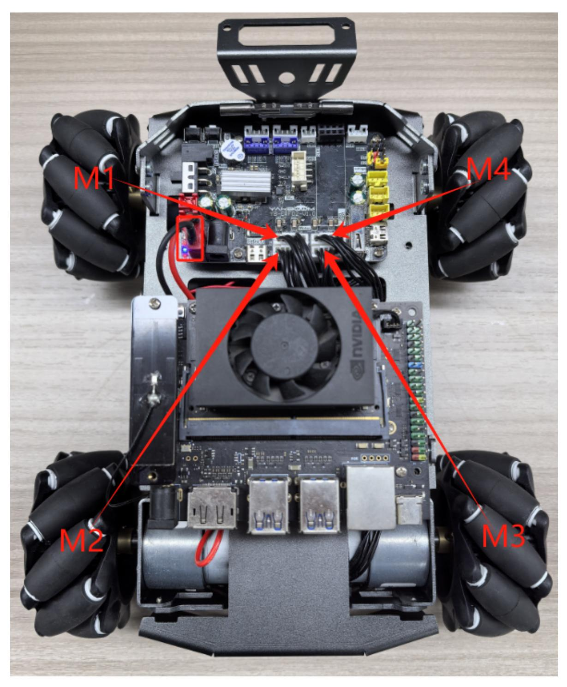

There is a detailed line sequence silk screen near the motor interface. Here we take motor M1 as an example. M1+ and M1- are the interfaces for controlling the rotation of the motor, GND and +3.3V are the power supply circuits for the encoder, and H1A and H1B are the encoder pulse detection pins.

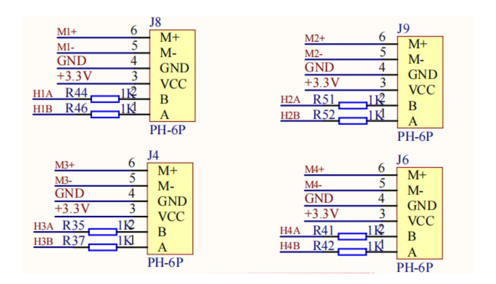

## **3. Introduction of Mecanum Wheel**

During the heyday of industrial manufacturing, traditional vehicle steering proved inconvenient in certain environments. For example, in aerospace component assembly, using traditional vehicles to transport and assemble components consumes significant manpower, material resources, and time. While accuracy is limited to a fraction of a millimeter, misalignment requires recalibration. For large, sophisticated equipment, high efficiency means a significant advantage over competitors. A method that allows a vehicle to translate and rotate at any angle without rotating the vehicle itself would be a perfect solution to this problem.

It was not until 1973 that the Swedish Mecanum company developed a more practical solution that was widely adopted, which is the Mecanum wheel we are going to introduce today.

A Mecanum wheel (hereafter referred to as a Mecanum wheel) consists of a hub and rollers surrounding the hub. The rollers are small, unpowered, driven wheels. The angle between the roller axis and the hub axis is 45 degrees. There are two types of Mecanum wheels: A and B, mirror images of each other, or sometimes referred to as left-handed and right-handed wheels. These are typically marked on the hub with the symbols A and B, or L and R.

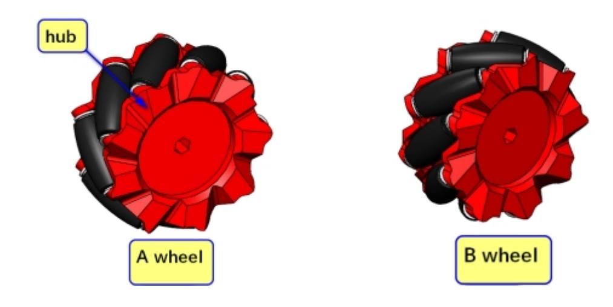

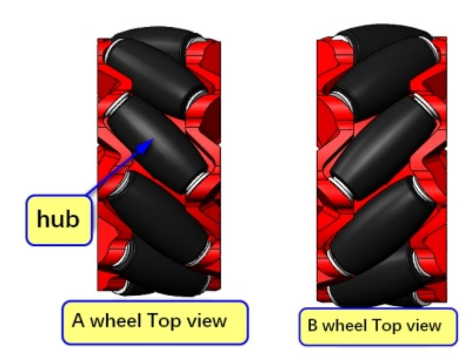

# **4. Mecanum Wheel Motion Analysis and Direction Determination**

As mentioned earlier, there are two types of wheels: A and B. If wheel A moves forward and to the right at the same time, that is, it moves diagonally to the right front, then on the contrary, wheel A will move backward and to the left at the same time, that is, it moves diagonally to the left rear; accordingly, wheel B can move diagonally to the left front and right rear.

**With the front of the car as the positive direction, the direction of the wheel moving forward is considered the motor's forward rotation, and the direction of the wheel moving backward is considered the motor's reverse rotation. (All the following lessons will be explained in this direction)**

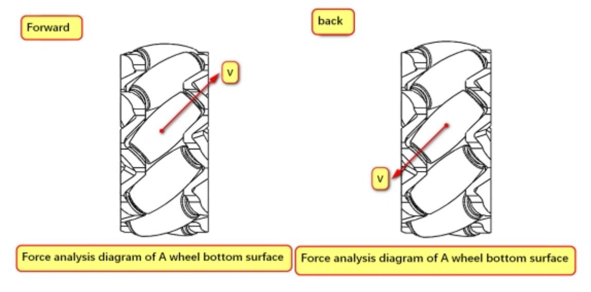

Take wheel A for example. The roller cannot provide forward force in the direction of movement due to rolling, and the roller cannot roll in the direction of the roller axis and rubs against the ground, generating friction force in the roller axis, that is, obliquely to the right front or left rear. Therefore, the speed direction of wheel A is obliquely to the right front or left rear. The same analysis can be applied to wheel B.

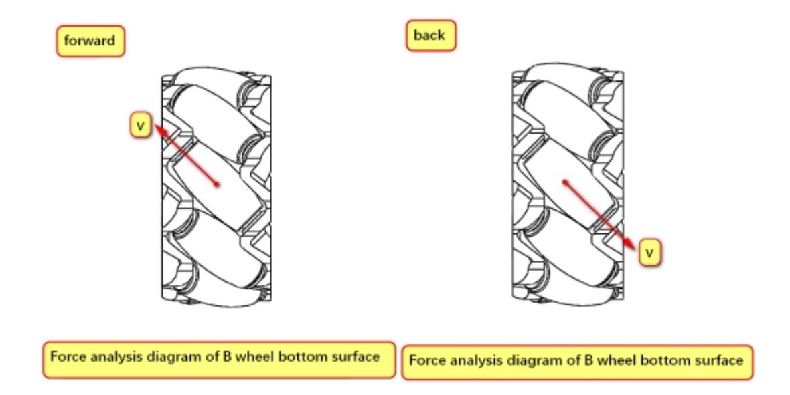

According to the physics knowledge we learned in high school, we know that speed can be decomposed orthogonally, and the direction of the vehicle's movement depends on the combined speed of the four wheels.

Then wheel A can be decomposed into velocity components axially to the right and vertically axially forward, or velocity components axially to the left and vertically axially backward.

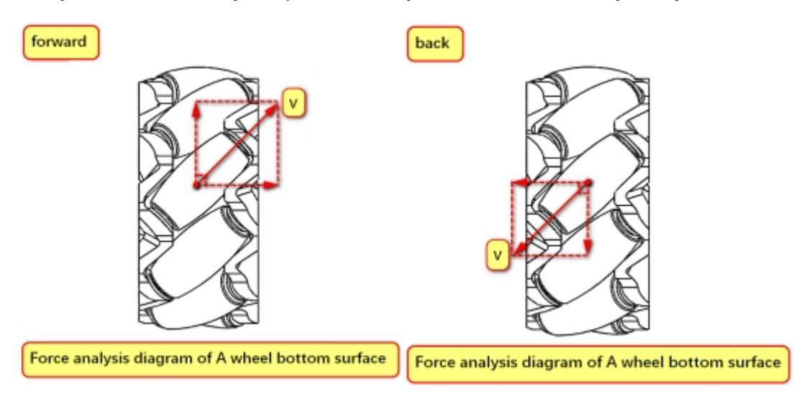

In this way, the velocity component of wheel B is a mirror image of wheel A.

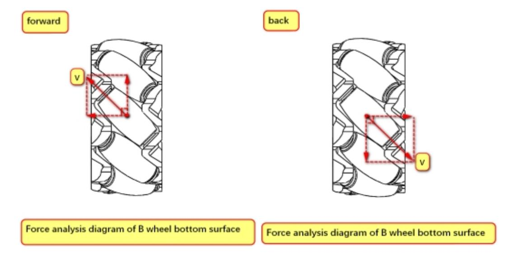

## **6. Mecanum Wheel Installation Combination and Motion Analysis**

After knowing the velocity components of wheels A and B, we can arrange the four-wheeled Mecanum wheel chassis into different combinations: AAAA, BBBB, AABB...

Do all combinations allow for full range of motion?

Below we will only give one wrong example and one correct example, and you can infer the rest on your own (actually there are too many).

#### **Analysis error example [AAAA]**

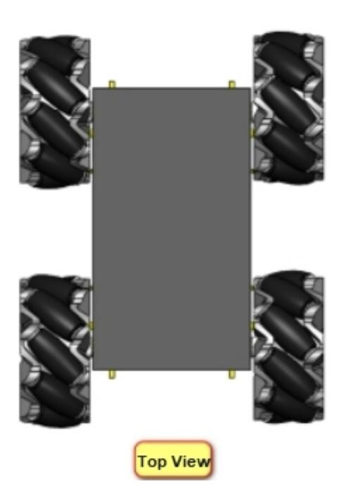

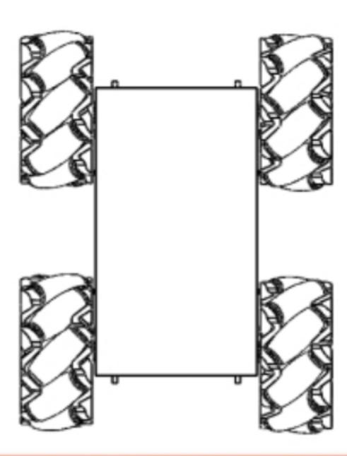

This might seem unreliable, but let's analyze it anyway because, as an example of an error, it's easy to understand what's wrong. We previously explained that the velocity components of wheel A are either front plus right, or rear plus left.

When the four wheels rotate forward at the same time, each wheel will have a leftward velocity component, which will cause the entire chassis to move to the left at the same time when moving forward; similarly, it will inevitably move to the right when moving backward, which makes it impossible to use. This thing will run around uncontrollably, which is not the omnidirectional movement we want.

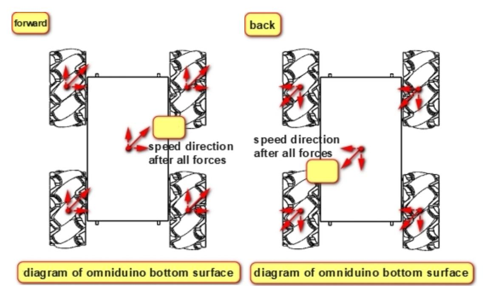

### **The correct wheat wheel distribution should be [ABBA]**

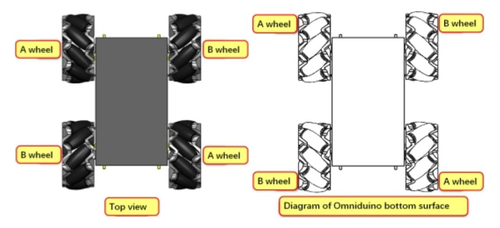

When all four wheels are turning forward, the A and B wheels can cancel each other's axial speed, leaving only the forward speed. In this way, the chassis moves straight forward without deviation, and the same applies to backward.

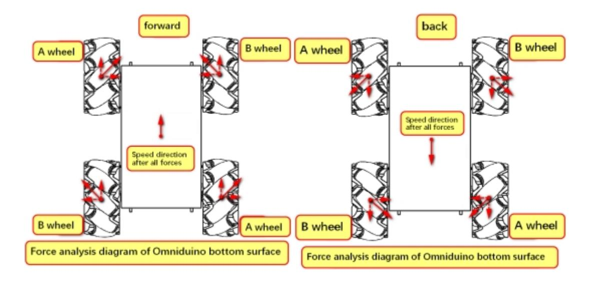

If wheel A rotates forward and wheel B rotates backward, the forward and backward speeds will cancel each other out, leaving only the rightward speed, and the chassis will move horizontally to the right.

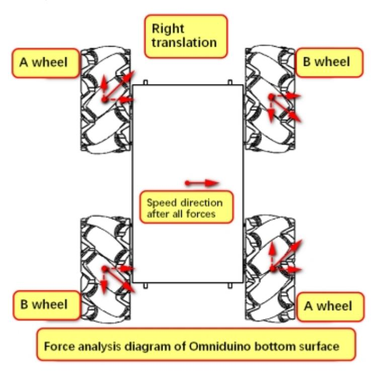

On the contrary, if wheel A rotates in reverse and wheel B rotates in forward direction, it will move horizontally to the left;

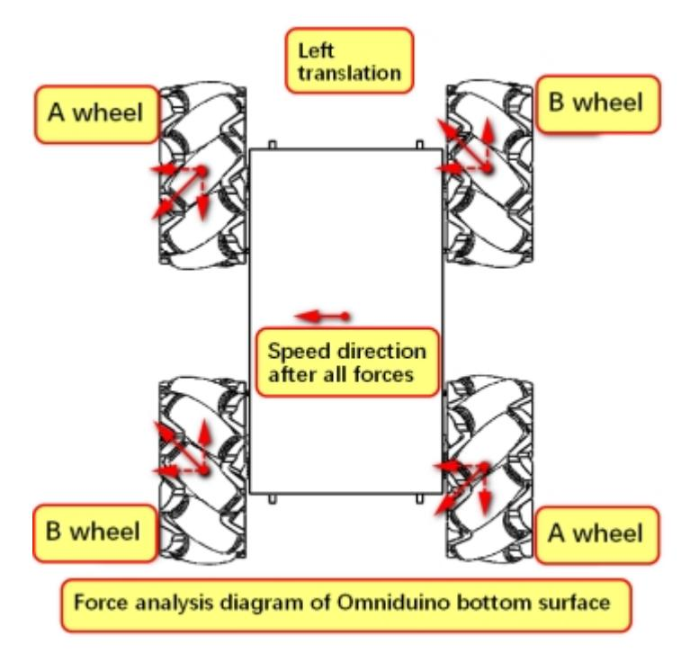

Finally, the left wheel of the chassis rotates forward and the right wheel rotates backward, so that the chassis can rotate to the right; otherwise, the chassis will rotate to the left.

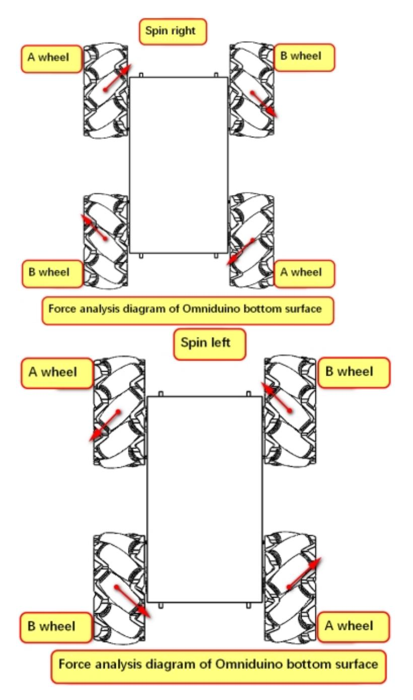

In addition, when wheel A rotates forward and wheel B is stationary, the chassis will move to the right front;

When wheel A reverses and wheel B remains stationary, the chassis moves to the left rear.

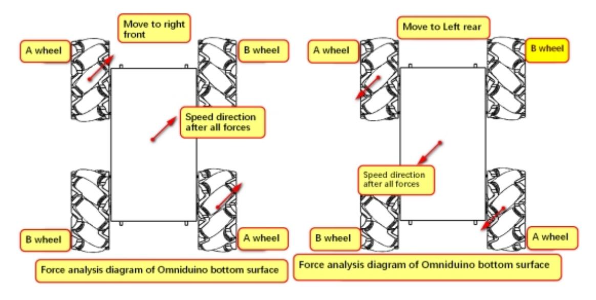

Accordingly, wheel A remains stationary, wheel B rotates forward, and the chassis moves to the left front;

Wheel A remains stationary, wheel B rotates in reverse, and the chassis moves to the right rear.

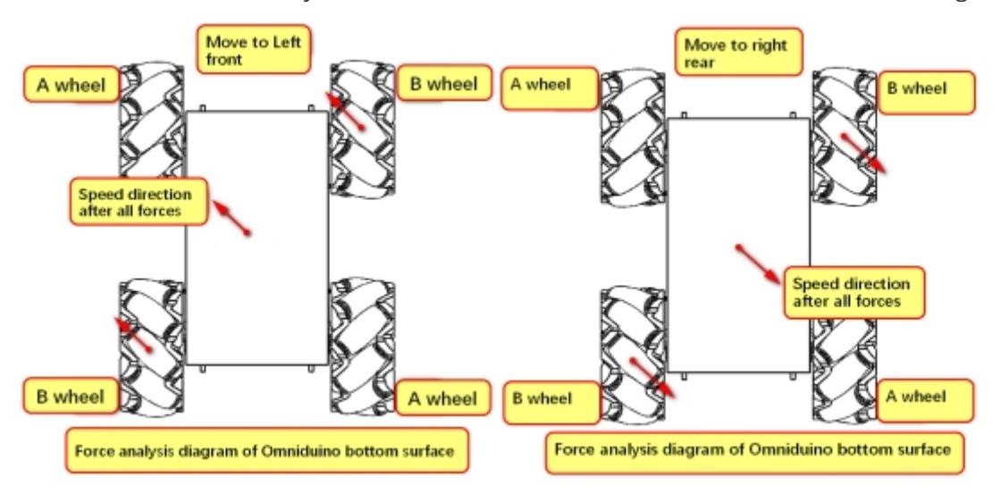

There are also four other movement modes that rotate around the midpoint of the axis.

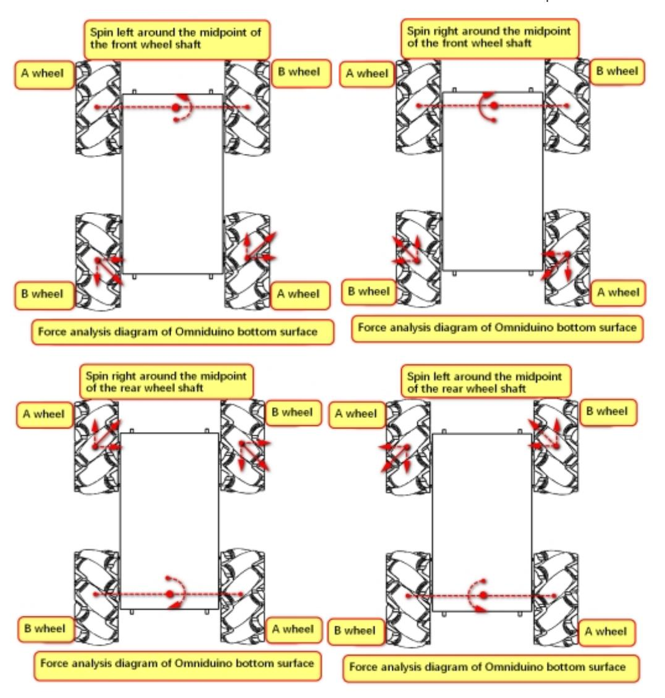

[Thinking] Are the above four situations very similar to translation? When the two stationary wheels move like translation, but the speed is lower than that of the other two wheels, how will the McLennan chassis move?

## **7. Installation location of Mecanum wheel**

We have explained the installation combination of the McReels above. There are also some considerations when installing the four McReels.

The shapes formed by the points of contact between the four wheels and the ground are mainly squares and rectangles. Although there are some unusual shapes, we will only analyze squares and rectangles here.

Square: The four wheels are located at the four vertices of a square, allowing for both translation and rotation. However, due to factors such as the shape and size of the robot chassis, this installation method, while ideal, is rarely possible.

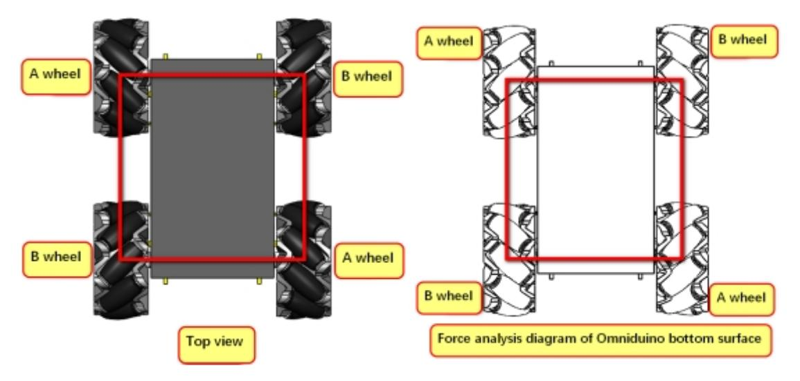

The chassis we use has a carefully designed square shape after adding the McDonnell Douglas wheels, making it the most ideal McDonnell Douglas wheel chassis.

Rectangular: Wheel rotation generates yaw-axis torque, and the torque arm is relatively long. This is the most common installation method.

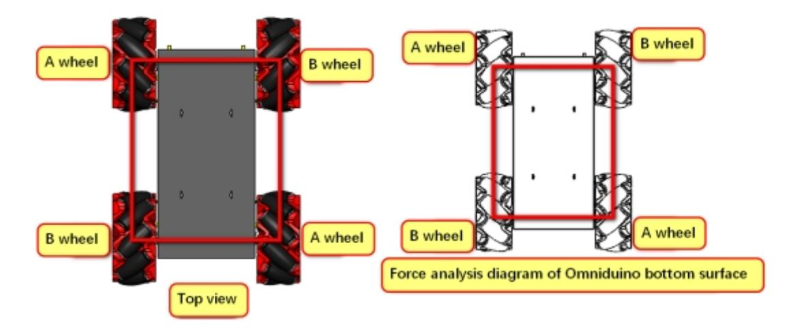

By comparing with traditional vehicles, we can find that when ordinary vehicles move, the wheels all turn in one direction, while when a vehicle using McDonnell Douglas wheels moves omnidirectionally, as analyzed above, the movement direction of each McDonnell Douglas wheel is different. Therefore, if the McDonnell Douglas wheels want to achieve true omnidirectional movement, each McDonnell Douglas wheel needs a separate motor to drive it. In this way, a control system is also required to control the steering and speed of each wheel.

Omnidirectional wheels and Mecanum wheels are commonly used to achieve omnidirectional motion. The above mainly describes the motion methods and installation combinations of Mecanum wheels. Omnidirectional wheels and Mecanum wheels differ in structure, mechanical properties, and kinematic characteristics. The fundamental reason for this is the different angles between the hub axis and the roller axis. The following table summarizes the differences in their kinematic and mechanical properties.

| 6/23/10 © Ether                                                                                                                                                                                                                                                                                                                                                                                                                                                                                                                                                                       | - 7        | Standard         | Omni                            | Mecanum                   |
|------------------------------------------------------------------------------------------------------------------------------------------------------------------------------------------------------------------------------------------------------------------------------------------------------------------------------------------------------------------------------------------------------------------------------------------------------------------------------------------------------------------------------------------------------------------------------------------|------------|------------------|---------------------------------|---------------------------|
| kinematics                                                                                                                                                                                                                                                                                                                                                                                                                                                                                                                                                                               | <b>V</b> f | $\omega \cdot r$ | $\omega \cdot r \cdot \sqrt{2}$ | $\omega \cdot r$          |
|                                                                                                                                                                                                                                                                                                                                                                                                                                                                                                                                                                                          | Vr         | -                | $\omega \cdot r \cdot \sqrt{2}$ | $\omega \cdot r$          |
|                                                                                                                                                                                                                                                                                                                                                                                                                                                                                                                                                                                          | Vd         | -                | $\omega \cdot r$                | $\omega \cdot r/\sqrt{2}$ |
| force                                                                                                                                                                                                                                                                                                                                                                                                                                                                                                                                                                                    | <b>F</b> f | $4\tau/r$        | $4\tau/(r\sqrt{2})$             | $4\tau/r$                 |
|                                                                                                                                                                                                                                                                                                                                                                                                                                                                                                                                                                                          | Fr         | -                | $4\tau/(r\sqrt{2})$             | $4\tau/r$                 |
|                                                                                                                                                                                                                                                                                                                                                                                                                                                                                                                                                                                          | Fd         | -                | $2\tau/r$                       | $2\tau\sqrt{2}/r$         |
| The three columns are for standard, omni, and mecanum 4-wheeled vehicles, respectively. The omni vehicle's wheels are mounted at 45 degrees. All wheels same diameter. The first three rows are vehicle velocity: forward, strafe, and diagonal, for a given wheel speed $\omega$ (radians/sec) 1 . The second three rows are vehicle total pushing force: forward, strafe, and diagonal, for a given wheel torque $\tau^1$ . These last three rows assume a) frictionless mecanum and omni roller bearings, and b) sufficient traction to support the floor reaction forces. |            |                  |                                 |                           |
| Bottom line: for the same wheel speeds, omni vehicle goes 41% faster than mecanum; for the same wheel torque, mecanum vehicle has 41% more pushing force than omni 2                                                                                                                                                                                                                                                                                                                                                                                                          |            |                  |                                 |                           |

The calculation process is as follows, for reference only:

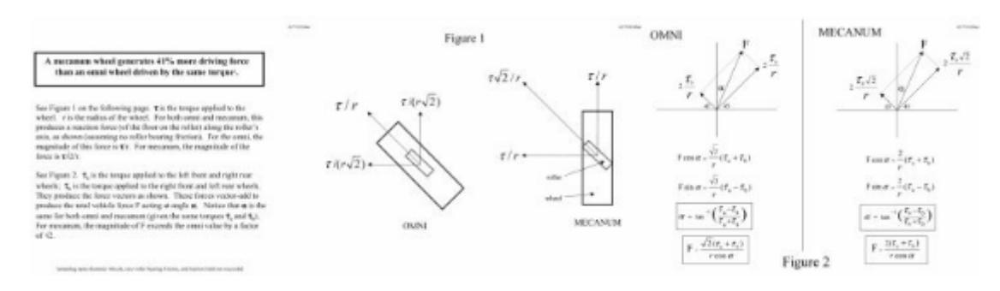

## **8. Final installation method**

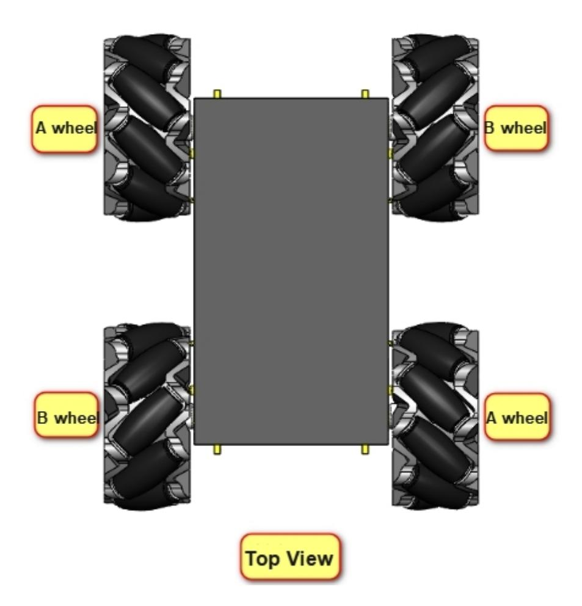