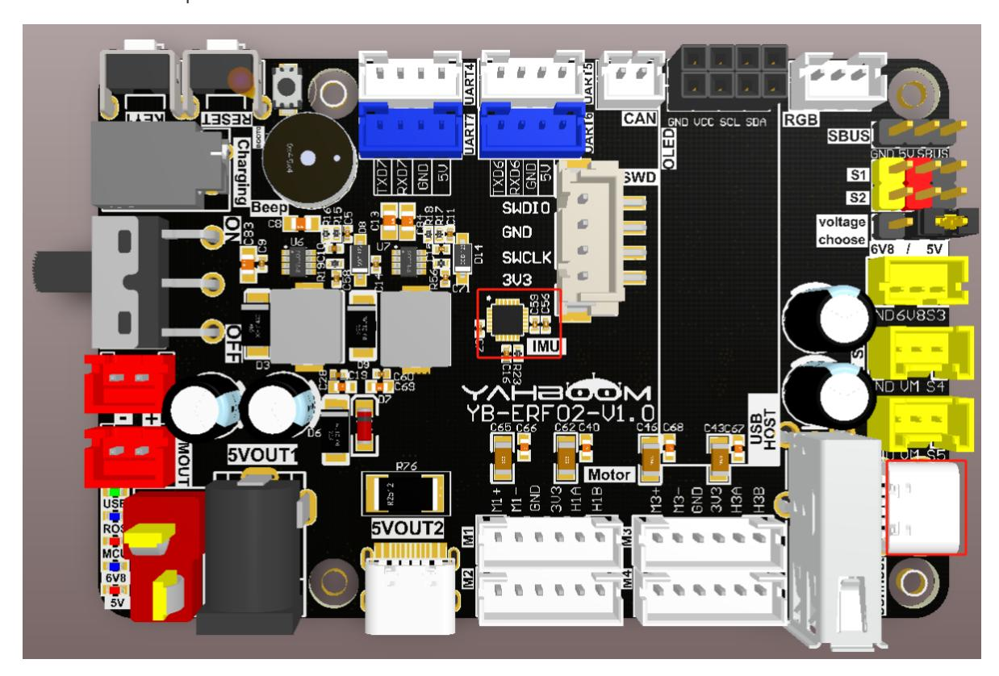
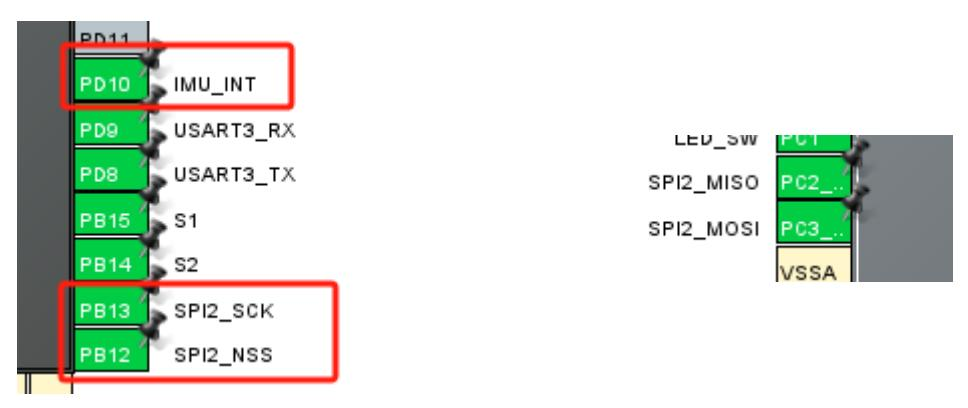
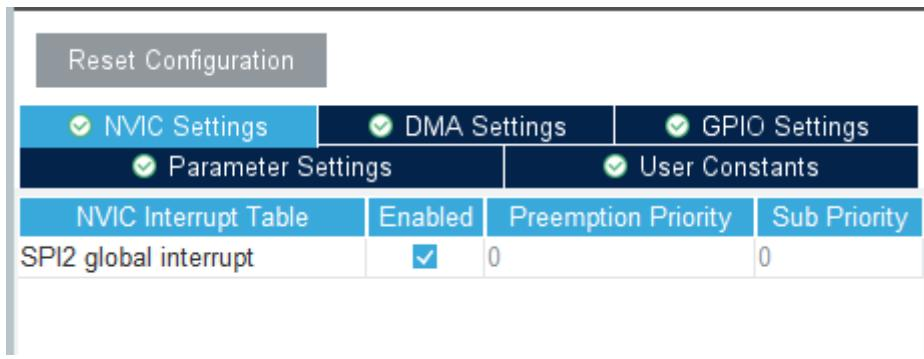
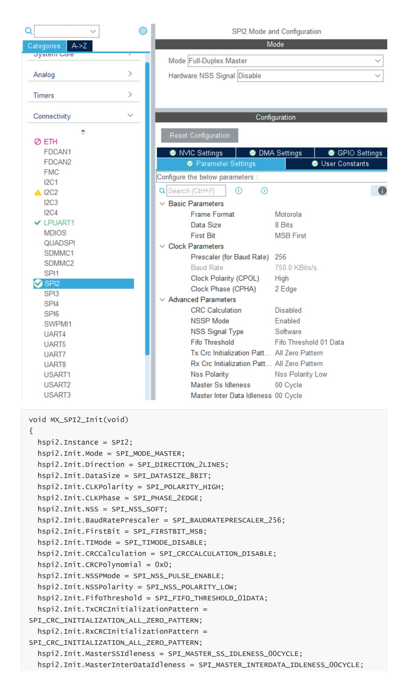
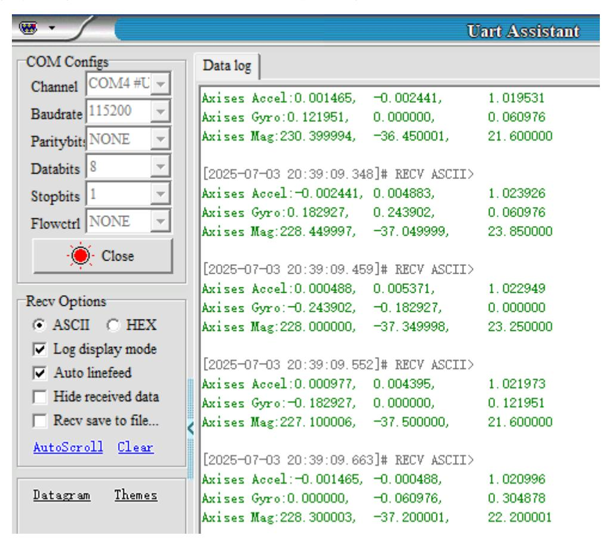

# **Read IMU data**

#### [Read IMU](#page-0-0) data

- <span id="page-0-0"></span>[1. Experimental](#page-0-1) Purpose
- [2. Hardware](#page-0-2) Connection
- 3. Core code [analysis](#page-1-0)
- 4. Compile, [download and burn](#page-10-0) firmware
- <span id="page-0-2"></span><span id="page-0-1"></span>[5. Experimental](#page-11-0) Results

## **1. Experimental Purpose**

Use the IMU attitude sensor chip of the STM32 control board to read the raw data of the IMU device.

# **2. Hardware Connection**

As shown in the figure below, the STM32 control board integrates the IMU attitude sensor chip. No additional external devices need to be connected. You only need to connect the type-C data cable to the computer and the Connect interface of the STM32 control board.



## **3. Core code analysis**

The path corresponding to the program source code is:

```
Board_Samples/STM32_Samples/Read_IMU
```

The IMU sensor chip uses the ICM20948 chip, which uses SPI communication to transmit data. According to the pin assignment, you need to initialize SPI2 as the host first.







```
hspi2.Init.MasterReceiverAutoSusp = SPI_MASTER_RX_AUTOSUSP_DISABLE;
  hspi2.Init.MasterKeepIOState = SPI_MASTER_KEEP_IO_STATE_DISABLE;
  hspi2.Init.IOSwap = SPI_IO_SWAP_DISABLE;
  if (HAL_SPI_Init(&hspi2) != HAL_OK)
  {
    Error_Handler();
  }
}
```

Enables and disables the SPI communication function of ICM20948.

```
static void ICM20948_Active()
{
    HAL_GPIO_WritePin(ICM20948_CS_PORT, ICM20948_CS_PIN, RESET);
}
static void ICM20948_NoActive()
{
    HAL_GPIO_WritePin(ICM20948_CS_PORT, ICM20948_CS_PIN, SET);
}
```

Read a byte from register reg.

```
static uint8_t read_single_reg(userbank_t ub, uint8_t reg)
{
    uint8_t read_reg = READ | reg;
    uint8_t reg_val;
    select_user_bank(ub);
    ICM20948_Active();
    HAL_SPI_Transmit(ICM20948_SPI, &read_reg, 1, 1000);
    HAL_SPI_Receive(ICM20948_SPI, ®_val, 1, 1000);
    ICM20948_NoActive();
    return reg_val;
}
```

Read multiple bytes of data from register reg.

```
static uint8_t* read_multiple_reg(userbank_t ub, uint8_t reg, uint8_t len)
{
    uint8_t read_reg = READ | reg;
    static uint8_t reg_val[MAX_RX_BUF];
    if (len > MAX_RX_BUF) return NULL;
    select_user_bank(ub);
    ICM20948_Active();
    HAL_SPI_Transmit(ICM20948_SPI, &read_reg, 1, 1000);
    HAL_SPI_Receive(ICM20948_SPI, reg_val, len, 1000);
    ICM20948_NoActive();
    return reg_val;
}
```

Write a byte to register reg.

```
static void write_single_reg(userbank_t ub, uint8_t reg, uint8_t val)
{
    uint8_t write_reg[2];
    write_reg[0] = WRITE | reg;
    write_reg[1] = val;
    select_user_bank(ub);
    ICM20948_Active();
    HAL_SPI_Transmit(ICM20948_SPI, write_reg, 2, 1000);
    ICM20948_NoActive();
}
```

Write multiple bytes of data to register reg.

```
static void write_multiple_reg(userbank_t ub, uint8_t reg, uint8_t* val, uint8_t
len)
{
    uint8_t write_reg = WRITE | reg;
    select_user_bank(ub);
    ICM20948_Active();
    HAL_SPI_Transmit(ICM20948_SPI, &write_reg, 1, 1000);
    HAL_SPI_Transmit(ICM20948_SPI, val, len, 1000);
    ICM20948_NoActive();
}
```

Read the who am i value of ICM20948 and determine whether it meets the requirements.

```
bool ICM20948_who_am_i()
{
    uint8_t ICM20948_id = read_single_reg(ub_0, B0_WHO_AM_I);
    if(ICM20948_id == ICM20948_ID)
        return true;
    else
        return false;
}
```

Reset and wake up the ICM20948 chip.

```
static void ICM20948_device_reset()
{
    write_single_reg(ub_0, B0_PWR_MGMT_1, 0x80 | 0x41);
    ICM20948_Delay_Ms(100);
}
static void ICM20948_wakeup()
{
    uint8_t new_val = read_single_reg(ub_0, B0_PWR_MGMT_1);
    new_val &= 0xBF;
    write_single_reg(ub_0, B0_PWR_MGMT_1, new_val);
    ICM20948_Delay_Ms(100);
}
```

```
static void ICM20948_gyro_calibration()
{
    raw_data_t temp;
    int32_t gyro_bias[3] = {0};
    uint8_t gyro_offset[6] = {0};
    for(int i = 0; i < 100; i++)
    {
        ICM20948_gyro_read(&temp);
        gyro_bias[0] += temp.x;
        gyro_bias[1] += temp.y;
        gyro_bias[2] += temp.z;
    }
    gyro_bias[0] /= 100;
    gyro_bias[1] /= 100;
    gyro_bias[2] /= 100;
    // Construct the gyro biases for push to the hardware gyro bias registers,
    // which are reset to zero upon device startup.
    // Divide by 4 to get 32.9 LSB per deg/s to conform to expected bias input
format.
    // Biases are additive, so change sign on calculated average gyro biases
    gyro_offset[0] = (-gyro_bias[0] / 4 >> 8) & 0xFF;
    gyro_offset[1] = (-gyro_bias[0] / 4) & 0xFF;
    gyro_offset[2] = (-gyro_bias[1] / 4 >> 8) & 0xFF;
    gyro_offset[3] = (-gyro_bias[1] / 4) & 0xFF;
    gyro_offset[4] = (-gyro_bias[2] / 4 >> 8) & 0xFF;
    gyro_offset[5] = (-gyro_bias[2] / 4) & 0xFF;
    write_multiple_reg(ub_2, B2_XG_OFFS_USRH, gyro_offset, 6);
}
```

Accelerometer self-calibration function.

```
static void ICM20948_accel_calibration()
{
    raw_data_t temp;
    uint8_t* temp2;
    uint8_t* temp3;
    uint8_t* temp4;
    int32_t accel_bias[3] = {0};
    int32_t accel_bias_reg[3] = {0};
    uint8_t accel_offset[6] = {0};
    for(int i = 0; i < 100; i++)
    {
        ICM20948_accel_read(&temp);
        accel_bias[0] += temp.x;
        accel_bias[1] += temp.y;
        accel_bias[2] += temp.z;
    }
    accel_bias[0] /= 100;
```

```
accel_bias[1] /= 100;
    accel_bias[2] /= 100;
    uint8_t mask_bit[3] = {0, 0, 0};
    temp2 = read_multiple_reg(ub_1, B1_XA_OFFS_H, 2);
    accel_bias_reg[0] = (int32_t)(temp2[0] << 8 | temp2[1]);
    mask_bit[0] = temp2[1] & 0x01;
    temp3 = read_multiple_reg(ub_1, B1_YA_OFFS_H, 2);
    accel_bias_reg[1] = (int32_t)(temp3[0] << 8 | temp3[1]);
    mask_bit[1] = temp3[1] & 0x01;
    temp4 = read_multiple_reg(ub_1, B1_ZA_OFFS_H, 2);
    accel_bias_reg[2] = (int32_t)(temp4[0] << 8 | temp4[1]);
    mask_bit[2] = temp4[1] & 0x01;
    accel_bias_reg[0] -= (accel_bias[0] / 8);
    accel_bias_reg[1] -= (accel_bias[1] / 8);
    accel_bias_reg[2] -= (accel_bias[2] / 8);
    accel_offset[0] = (accel_bias_reg[0] >> 8) & 0xFF;
    accel_offset[1] = (accel_bias_reg[0]) & 0xFE;
    accel_offset[1] = accel_offset[1] | mask_bit[0];
    accel_offset[2] = (accel_bias_reg[1] >> 8) & 0xFF;
    accel_offset[3] = (accel_bias_reg[1]) & 0xFE;
    accel_offset[3] = accel_offset[3] | mask_bit[1];
    accel_offset[4] = (accel_bias_reg[2] >> 8) & 0xFF;
    accel_offset[5] = (accel_bias_reg[2]) & 0xFE;
    accel_offset[5] = accel_offset[5] | mask_bit[2];
    write_multiple_reg(ub_1, B1_XA_OFFS_H, &accel_offset[0], 2);
    write_multiple_reg(ub_1, B1_YA_OFFS_H, &accel_offset[2], 2);
    write_multiple_reg(ub_1, B1_ZA_OFFS_H, &accel_offset[4], 2);
}
```

Set the gyroscope range to 2000dps

```
ICM20948_gyro_full_scale_select(_2000dps);
static void ICM20948_gyro_full_scale_select(gyro_scale_t full_scale)
{
    uint8_t new_val = read_single_reg(ub_2, B2_GYRO_CONFIG_1);
    switch(full_scale)
    {
        case _250dps :
            new_val |= 0x00;
            g_scale_gyro = 131.0;
            break;
        case _500dps :
            new_val |= 0x02;
            g_scale_gyro = 65.5;
            break;
        case _1000dps :
            new_val |= 0x04;
```

```
g_scale_gyro = 32.8;
            break;
        case _2000dps :
            new_val |= 0x06;
            g_scale_gyro = 16.4;
            break;
    }
    write_single_reg(ub_2, B2_GYRO_CONFIG_1, new_val);
}
```

Set the accelerometer range to 16g.

```
ICM20948_accel_full_scale_select(_16g);
static void ICM20948_accel_full_scale_select(accel_scale_t full_scale)
{
    uint8_t new_val = read_single_reg(ub_2, B2_ACCEL_CONFIG);
    switch(full_scale)
    {
        case _2g :
            new_val |= 0x00;
            g_scale_accel = 16384;
            break;
        case _4g :
            new_val |= 0x02;
            g_scale_accel = 8192;
            break;
        case _8g :
            new_val |= 0x04;
            g_scale_accel = 4096;
            break;
        case _16g :
            new_val |= 0x06;
            g_scale_accel = 2048;
            break;
    }
    write_single_reg(ub_2, B2_ACCEL_CONFIG, new_val);
}
```

Read the raw data from the gyroscope.

```
void ICM20948_gyro_read(raw_data_t* data)
{
    uint8_t* temp = read_multiple_reg(ub_0, B0_GYRO_XOUT_H, 6);
    data->x = (int16_t)(temp[0] << 8 | temp[1]);
    data->y = (int16_t)(temp[2] << 8 | temp[3]);
    data->z = (int16_t)(temp[4] << 8 | temp[5]);
}
```

Read the raw data from the accelerometer.

```
void ICM20948_accel_read(raw_data_t* data)
{
    uint8_t* temp = read_multiple_reg(ub_0, B0_ACCEL_XOUT_H, 6);
    data->x = (int16_t)(temp[0] << 8 | temp[1]);
    data->y = (int16_t)(temp[2] << 8 | temp[3]);
    // data->z = (int16_t)(temp[4] << 8 | temp[5]);
    data->z = (int16_t)(temp[4] << 8 | temp[5]) + g_scale_accel;
    // Add scale factor because calibraiton function offset gravity
acceleration.
}
```

Get the scaled accelerometer data

```
void ICM20948_accel_read_g(axises_t* data)
{
    ICM20948_accel_read(&g_raw_accel);
    data->x = (float)(g_raw_accel.x / g_scale_accel);
    data->y = (float)(g_raw_accel.y / g_scale_accel);
    data->z = (float)(g_raw_accel.z / g_scale_accel);
}
```

Get gyroscope scaled data

```
void ICM20948_gyro_read_dps(axises_t* data)
{
    ICM20948_gyro_read(&g_raw_gyro);
    data->x = (float)(g_raw_gyro.x / g_scale_gyro);
    data->y = (float)(g_raw_gyro.y / g_scale_gyro);
    data->z = (float)(g_raw_gyro.z / g_scale_gyro);
}
```

Aggregate and read IMU data.

```
void ICM20948_Read_Data_Handle(void)
{
    ICM20948_gyro_read_dps(&g_axises_gyro);
    ICM20948_accel_read_g(&g_axises_accel);
    AK09916_mag_read_uT(&g_axises_mag);
}
```

Initialize the magnetometer.

```
void AK09916_init()
{
    ICM20948_i2c_master_reset();
    ICM20948_i2c_master_enable();
    ICM20948_i2c_master_clk_frq(7);
    while(!AK09916_who_am_i());
    AK09916_soft_reset();
    AK09916_operation_mode_setting(continuous_measurement_100hz);
}
```

Read and determine the magnetometer ID number.

```
bool AK09916_who_am_i()
{
    uint8_t AK09916_id = read_single_mag_reg(MAG_WIA2);
    if(AK09916_id == AK09916_ID)
        return true;
    else
        return false;
}
```

Read raw data from the magnetometer.

```
bool AK09916_mag_read(raw_data_t* data)
{
    uint8_t* temp;
    uint8_t drdy, hofl;
    drdy = read_single_mag_reg(MAG_ST1) & 0x01;
    if(!drdy) return false;
    temp = read_multiple_mag_reg(MAG_HXL, 6);
    hofl = read_single_mag_reg(MAG_ST2) & 0x08;
    if(hofl) return false;
    data->x = (int16_t)(temp[1] << 8 | temp[0]);
    data->y = (int16_t)(temp[3] << 8 | temp[2]);
    data->z = (int16_t)(temp[5] << 8 | temp[4]);
    return true;
}
```

Read scaled magnetometer data.

```
bool AK09916_mag_read_uT(axises_t* data)
{
    bool new_data = AK09916_mag_read(&g_raw_mag);
    if(!new_data) return false;
    data->x = (float)(g_raw_mag.x * 0.15);
    data->y = (float)(g_raw_mag.y * 0.15);
    data->z = (float)(g_raw_mag.z * 0.15);
    return true;
}
```

Call ICM20948\_Read\_Data\_Handle to read and print relevant data.

```
void ICM20948_Read_Data_Handle(void)
{
    ICM20948_gyro_read_dps(&g_axises_gyro);
    ICM20948_accel_read_g(&g_axises_accel);
    AK09916_mag_read_uT(&g_axises_mag);
     static uint16_t print_count = 0;
    print_count++;
    if (print_count > 5)
    {
        print_count = 0;
// printf("RAW Accel:%d,\t%d,\t%d\n", g_raw_accel.x, g_raw_accel.y,
g_raw_accel.z);
// printf("RAW Gyro:%d,\t%d,\t%d\n", g_raw_gyro.x, g_raw_gyro.y, g_raw_gyro.z);
// printf("RAW Mag:%d,\t%d,\t%d\n", g_raw_mag.x, g_raw_mag.y, g_raw_mag.z);
        printf("Axises Accel:%f,\t%f,\t%f\n", g_axises_accel.x, g_axises_accel.y,
g_axises_accel.z);
        printf("Axises Gyro:%f,\t%f,\t%f\n", g_axises_gyro.x, g_axises_gyro.y,
g_axises_gyro.z);
        printf("Axises Mag:%f,\t%f,\t%f\n", g_axises_mag.x, g_axises_mag.y,
g_axises_mag.z);
    }
}
```

#### **4. Compile, download and burn firmware**

Select the project to be compiled in the file management interface of STM32CUBEIDE and click the compile button on the toolbar to start compiling.

<span id="page-10-0"></span>

If there are no errors or warnings, the compilation is complete.

Press and hold the BOOT0 button, then press the RESET button to reset, release the BOOT0 button to enter the serial port burning mode. Then use the serial port burning tool to burn the firmware to the board.

If you have STlink or JLink, you can also use STM32CUBEIDE to burn the firmware with one click, which is more convenient and quick.

#### **5. Experimental Results**

The MCU\_LED light flashes every 200 milliseconds.

Connect the control board to the computer via a Type-C data cable, open the serial port assistant (specific parameters are shown in the figure below), and you can see that the serial port assistant will display and print the relevant data of Accel Gyro Mag.

<span id="page-11-0"></span>