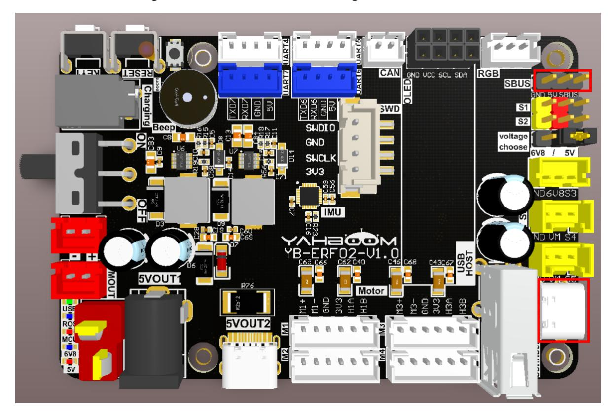
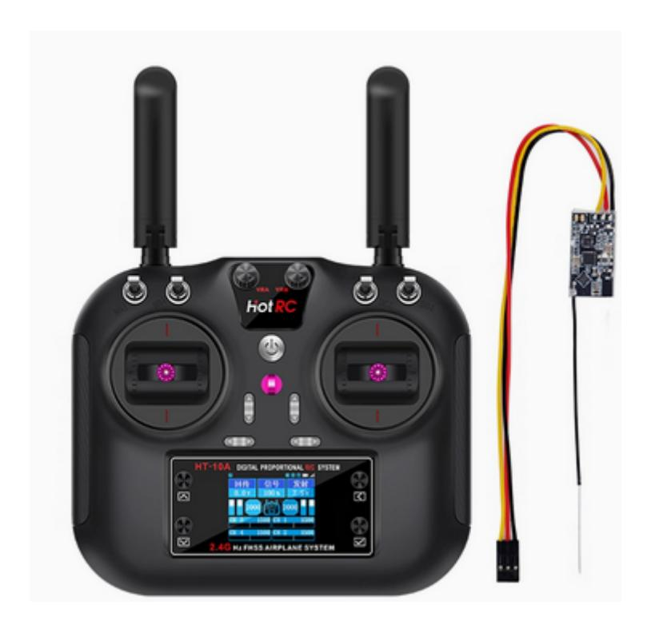
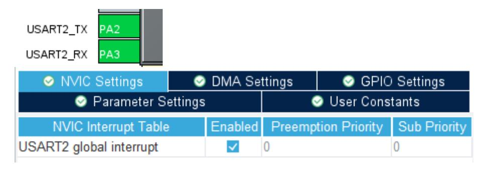
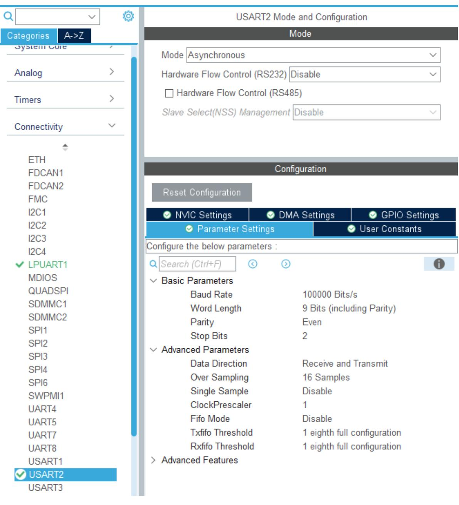
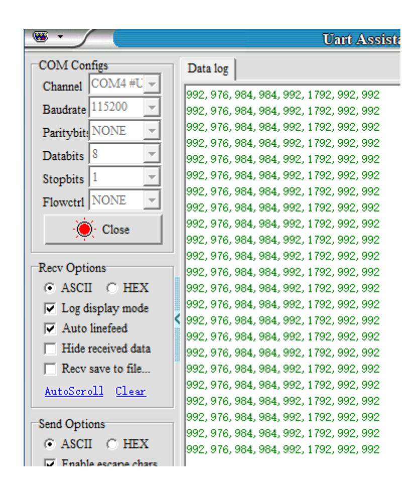

# **SBUS model aircraft remote control**

SBUS model aircraft [remote](#page-0-0) control

- <span id="page-0-0"></span>[1. Experimental](#page-0-1) Purpose
- [2. Hardware](#page-0-2) Connection
- 3. Core code [analysis](#page-1-0)
- 4. Compile, [download and burn](#page-6-0) firmware
- <span id="page-0-2"></span><span id="page-0-1"></span>[5. Experimental](#page-6-1) Results

#### **1. Experimental Purpose**

Use the serial port function of the STM32 control board to learn how to receive and parse SBUS data.

## **2. Hardware Connection**

As shown in the figure below, the STM32 control board integrates the SBUS interface, but an additional SBUS receiver needs to be connected. The SBUS receiver and aircraft remote control need to be prepared by yourself.

Please connect the Type-C data cable to the computer and the USB Connect port of the STM32 control board.

Note: The SBUS interface has a direction. Please connect according to the silk screen on the control board: GND to ground, 5V to VCC, and SBUS to signal.



Schematic diagram of the model aircraft remote control and SBUS receiver



### **3. Core code analysis**

The path corresponding to the program source code is:

<span id="page-1-0"></span>Board\_Samples/STM32\_Samples/SBus

According to the pin assignment, the SBUS signal pin is connected to PA3 (USART2\_RX). To meet SBUS communication requirements, a reverse circuit has been added to the hardware circuit. Serial port 2 is initialized with a baud rate of 100,000 bits/s, a data length of 9, stop bits of 2, even parity, and the serial port hardware control setting of None. The serial port receive interrupt function also needs to be enabled.





```
void MX_USART2_UART_Init(void)
{
  huart2.Instance = USART2;
  huart2.Init.BaudRate = 100000;
  huart2.Init.WordLength = UART_WORDLENGTH_9B;
  huart2.Init.StopBits = UART_STOPBITS_2;
  huart2.Init.Parity = UART_PARITY_EVEN;
  huart2.Init.Mode = UART_MODE_TX_RX;
  huart2.Init.HwFlowCtl = UART_HWCONTROL_NONE;
  huart2.Init.OverSampling = UART_OVERSAMPLING_16;
  huart2.Init.OneBitSampling = UART_ONE_BIT_SAMPLE_DISABLE;
  huart2.Init.ClockPrescaler = UART_PRESCALER_DIV1;
  huart2.AdvancedInit.AdvFeatureInit = UART_ADVFEATURE_NO_INIT;
  if (HAL_UART_Init(&huart2) != HAL_OK)
  {
    Error_Handler();
  }
  if (HAL_UARTEx_SetTxFifoThreshold(&huart2, UART_TXFIFO_THRESHOLD_1_8) !=
HAL_OK)
  {
    Error_Handler();
```

```
}
  if (HAL_UARTEx_SetRxFifoThreshold(&huart2, UART_RXFIFO_THRESHOLD_1_8) !=
HAL_OK)
  {
    Error_Handler();
  }
  if (HAL_UARTEx_DisableFifoMode(&huart2) != HAL_OK)
  {
    Error_Handler();
  }
}
```

Enable the receive interrupt function of serial port 2.

```
HAL_NVIC_SetPriority(USART2_IRQn, 0, 0);
HAL_NVIC_EnableIRQ(USART2_IRQn);
```

Initialize SBUS and enable receive interrupt.

```
void SBUS_Init(void)
{
    printf("start\n");
    HAL_UART_Receive_IT(&huart2, (uint8_t *)&g_rx_temp, 1);
}
```

Read the received data in the serial port interrupt.

```
void HAL_UART_RxCpltCallback(UART_HandleTypeDef *huart)
{
    if (huart == &huart2)
    {
        uint8_t rx_data = g_rx_temp;
        HAL_UART_Receive_IT(&huart2, (uint8_t *)&g_rx_temp, 1);
        SBUS_Reveive(rx_data);
    }
}
```

The BUS receives and processes the data. If it complies with the SBUS receiving protocol, the relevant data is extracted into sbus\_data.

```
void SBUS_Reveive(uint8_t rx_data)
{
    uint8_t data = rx_data;
    // If the protocol start flag is met, data is received
    if (sbus_start == 0 && data == SBUS_START)
    {
        sbus_start = 1;
        sbus_new_cmd = 0;
        sbus_buf_index = 0;
        inBuffer[sbus_buf_index] = data;
        inBuffer[SBUS_RECV_MAX - 1] = 0xff;
    }
    else if (sbus_start)
    {
        sbus_buf_index++;
```

```
inBuffer[sbus_buf_index] = data;
    }
    // Finish receiving a frame of data
    if (sbus_start & (sbus_buf_index >= (SBUS_RECV_MAX - 1)))
    {
        sbus_start = 0;
        if (inBuffer[SBUS_RECV_MAX - 1] == SBUS_END)
        {
            memcpy(sbus_data, inBuffer, SBUS_RECV_MAX);
            sbus_new_cmd = 1;
        }
    }
}
```

Parse the sbus\_data data to obtain data for sixteen channels.

```
static int SBUS_Parse_Data(void)
{
    g_sbus_channels[0] = ((sbus_data[1] | sbus_data[2] << 8) & 0x07FF);
    g_sbus_channels[1] = ((sbus_data[2] >> 3 | sbus_data[3] << 5) & 0x07FF);
    g_sbus_channels[2] = ((sbus_data[3] >> 6 | sbus_data[4] << 2 | sbus_data[5]
<< 10) & 0x07FF);
    g_sbus_channels[3] = ((sbus_data[5] >> 1 | sbus_data[6] << 7) & 0x07FF);
    g_sbus_channels[4] = ((sbus_data[6] >> 4 | sbus_data[7] << 4) & 0x07FF);
    g_sbus_channels[5] = ((sbus_data[7] >> 7 | sbus_data[8] << 1 | sbus_data[9]
<< 9) & 0x07FF);
    g_sbus_channels[6] = ((sbus_data[9] >> 2 | sbus_data[10] << 6) & 0x07FF);
    g_sbus_channels[7] = ((sbus_data[10] >> 5 | sbus_data[11] << 3) & 0x07FF);
    #ifdef ALL_CHANNELS
    g_sbus_channels[8] = ((sbus_data[12] | sbus_data[13] << 8) & 0x07FF);
    g_sbus_channels[9] = ((sbus_data[13] >> 3 | sbus_data[14] << 5) & 0x07FF);
    g_sbus_channels[10] = ((sbus_data[14] >> 6 | sbus_data[15] << 2 |
sbus_data[16] << 10) & 0x07FF);
    g_sbus_channels[11] = ((sbus_data[16] >> 1 | sbus_data[17] << 7) & 0x07FF);
    g_sbus_channels[12] = ((sbus_data[17] >> 4 | sbus_data[18] << 4) & 0x07FF);
    g_sbus_channels[13] = ((sbus_data[18] >> 7 | sbus_data[19] << 1 |
sbus_data[20] << 9) & 0x07FF);
    g_sbus_channels[14] = ((sbus_data[20] >> 2 | sbus_data[21] << 6) & 0x07FF);
    g_sbus_channels[15] = ((sbus_data[21] >> 5 | sbus_data[22] << 3) & 0x07FF);
    #endif
    // Security check, check if the connection is lost or the data is wrong
    // Security detection to check for lost connections or data errors
    failsafe_status = SBUS_SIGNAL_OK;
    if (sbus_data[23] & (1 << 2))
    {
        failsafe_status = SBUS_SIGNAL_LOST;
        printf("SBUS_SIGNAL_LOST\n");
        // lost contact errors Remote control lost contact error
    }
    else if (sbus_data[23] & (1 << 3))
    {
        failsafe_status = SBUS_SIGNAL_FAILSAFE;
        printf("SBUS_SIGNAL_FAILSAFE\n");
        // data loss error data loss error
    }
```

```
return failsafe_status;
}
```

Then print out the channel value.

```
static void print_data(void)
{
    static int print_count = 0;
    print_count++;
    if (print_count < 10)
    {
        return;
    }
    print_count = 0;
    #if SBUS_ALL_CHANNELS
    printf("%d,%d,%d,%d,%d,%d,%d,%d,%d,%d,%d,%d,%d,%d,%d,%d\r\n",
            g_sbus_channels[0], g_sbus_channels[1], g_sbus_channels[2],
            g_sbus_channels[3], g_sbus_channels[4], g_sbus_channels[5],
            g_sbus_channels[6], g_sbus_channels[7], g_sbus_channels[8],
            g_sbus_channels[9], g_sbus_channels[10], g_sbus_channels[11],
            g_sbus_channels[12], g_sbus_channels[13], g_sbus_channels[14],
            g_sbus_channels[15]);
    #else
    printf("SBus: %d,%d,%d,%d,%d,%d,%d,%d\r\n",
            g_sbus_channels[0], g_sbus_channels[1], g_sbus_channels[2],
            g_sbus_channels[3], g_sbus_channels[4],g_sbus_channels[5],
            g_sbus_channels[6], g_sbus_channels[7]);
    #endif
}
```

The SBUS\_Handle function is called every 10 milliseconds to check whether any data has been parsed and print it out if so.

```
void App_Handle(void)
{
    SBUS_Init();
    while (1)
    {
        SBUS_Handle();
        App_Led_Mcu_Handle();
        HAL_Delay(10);
    }
}
void SBUS_Handle(void)
{
    if (sbus_new_cmd)
    {
        int res = SBUS_Parse_Data();
        sbus_new_cmd = 0;
        if (res) return;
        print_data();
    }
}
```

## **4. Compile, download and burn firmware**

Select the project to be compiled in the file management interface of STM32CUBEIDE and click the compile button on the toolbar to start compiling.

<span id="page-6-0"></span>

If there are no errors or warnings, the compilation is complete.

Press and hold the BOOT0 button, then press the RESET button to reset, release the BOOT0 button to enter the serial port burning mode. Then use the serial port burning tool to burn the firmware to the board.

If you have STlink or JLink, you can also use STM32CUBEIDE to burn the firmware with one click, which is more convenient and quick.

## <span id="page-6-1"></span>**5. Experimental Results**

The MCU\_LED light flashes every 200 milliseconds.

Open the serial port assistant (specific parameters are shown in the figure below), and you can see that the serial port assistant has been printing the data of each channel of the model aircraft remote control. When we manually turn the joystick or button of the model aircraft remote control, the data will change accordingly.

