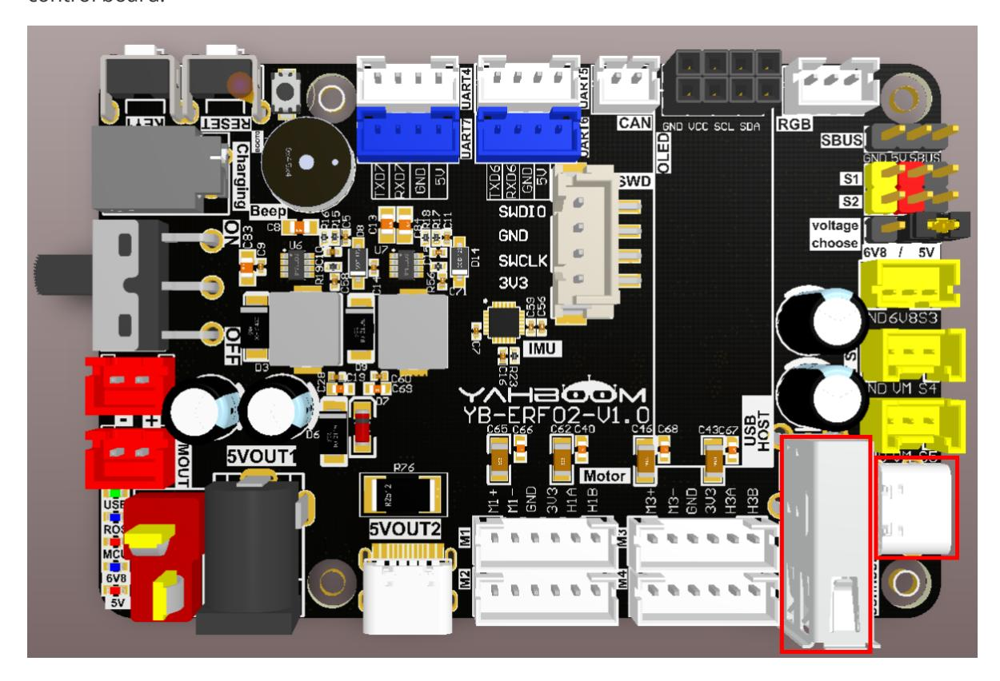
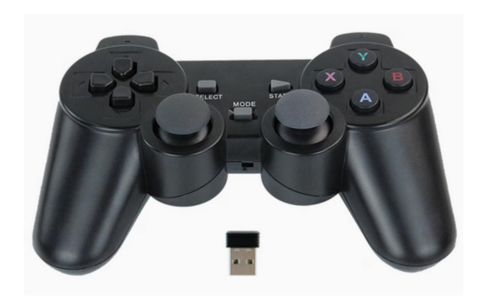
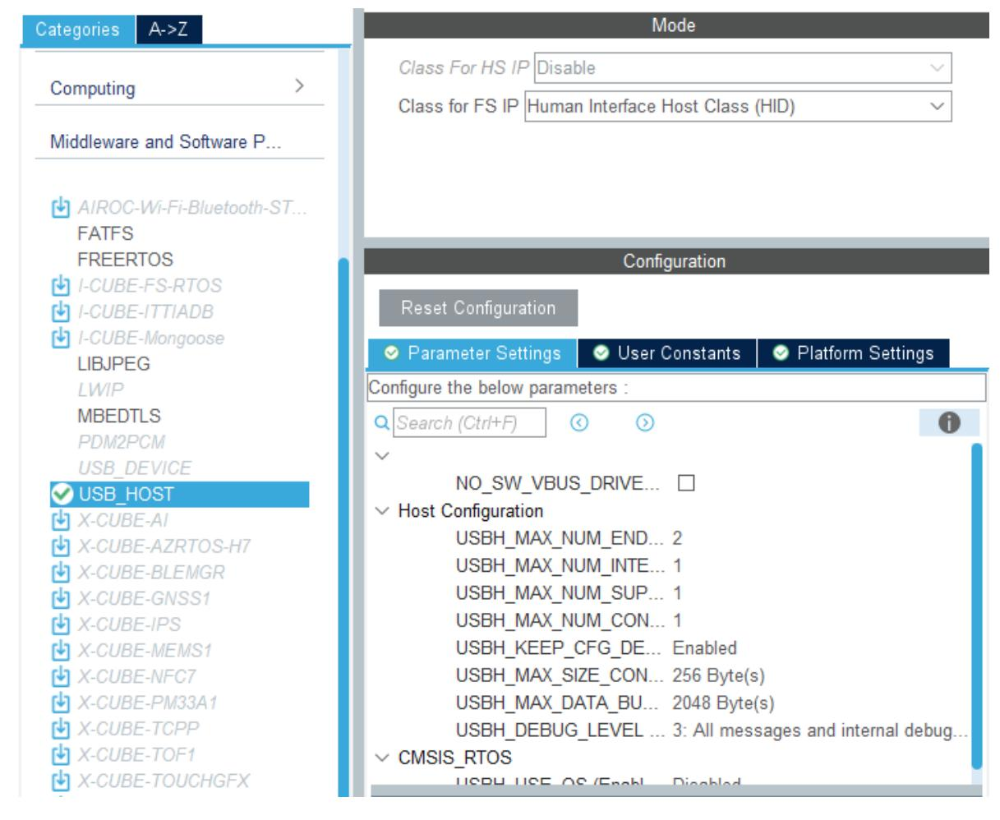
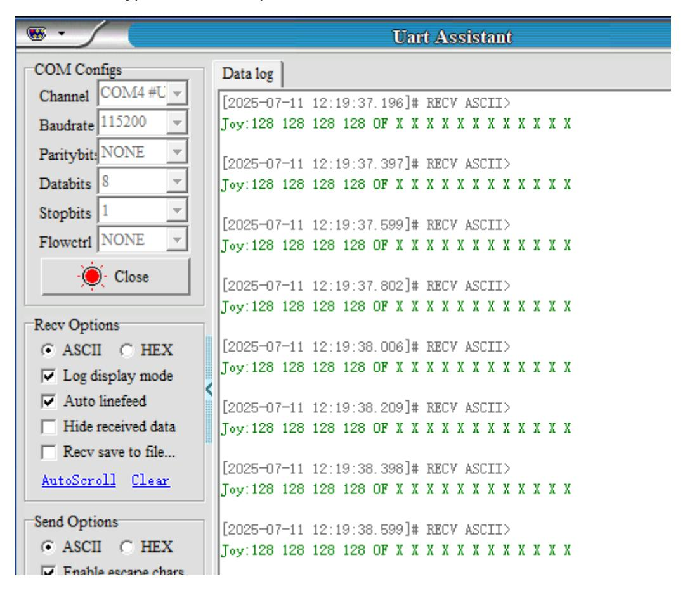

# **USB controller remote control**

USB [controller](#page-0-0) remote control

- <span id="page-0-0"></span>[1. Experimental](#page-0-1) Purpose
- [2. Hardware](#page-0-2) Connection
- 3. Core code [analysis](#page-1-0)
- 4. Compile, [download and burn](#page-6-0) firmware
- <span id="page-0-2"></span><span id="page-0-1"></span>[5. Experimental](#page-7-0) Results

### **1. Experimental Purpose**

Learn to use the USB host function of the STM32 control board to receive and parse data from the USB controller.

## **2. Hardware Connection**

As shown in the figure below, the STM32 control board integrates a USB host interface. Insert the USB handle receiver into the USB host interface on the control board. The USB handle receiver and wireless handle must be prepared by yourself.

Please connect the type-C data cable to the computer and the USB Connect port of the STM32 control board.



Schematic diagram of wireless controller and USB controller receiver



## **3. Core code analysis**

The path corresponding to the program source code is:

Board\_Samples/STM32\_Samples/USB\_Host

According to the pin assignment, USB-DP is connected to PA12 and USB-DM is connected to PA11.

<span id="page-1-0"></span>

According to the USB\_HOST component provided by STM32CUBEIDE, configure USB to HID mode.



Get the controller data in the USB interrupt callback function.

```
void USBH_HID_EventCallback(USBH_HandleTypeDef *phost)
{
    // USBH_UsrLog("Product : %d", phost-
>device.CfgDesc.Itf_Desc[0].bInterfaceProtocol);
    if (phost->device.CfgDesc.Itf_Desc[0].bInterfaceProtocol ==
HID_KEYBRD_BOOT_CODE)
    {
        USBH_UsrLog("KeyBoard device value...");
        USBH_HID_GetKeybdInfo(phost);
    }
    else if (phost->device.CfgDesc.Itf_Desc[0].bInterfaceProtocol ==
HID_MOUSE_BOOT_CODE)
    {
        USBH_UsrLog("Mouse device value...");
        USBH_HID_GetMouseInfo(phost);
    }
    else if (phost->device.CfgDesc.Itf_Desc[0].bInterfaceProtocol == 0x00)
    {
        USBH_HID_GetJoystickInfo(phost);
    }
}
```

If the data is read successfully, the joystick\_info structure data is returned.

```
HID_JOYSTICK_Info_TypeDef *USBH_HID_GetJoystickInfo(USBH_HandleTypeDef *phost)
{
  if (USBH_HID_JoystickDecode(phost) == USBH_OK)
  {
    return &joystick_info;
  }
  else
  {
    return NULL;
  }
}
```

The joystick\_info structure stores the current status of the controller. The data printed later is sorted in this order.

```
typedef struct _HID_JOYSTICK_Info
{
  uint8_t left_axis_x;
  uint8_t left_axis_y;
  uint8_t right_axis_x;
  uint8_t right_axis_y;
  uint8_t pad_arrow:4;
  uint8_t left_hat:1;
  uint8_t right_hat:1;
  uint8_t select:1;
  uint8_t start:1;
  uint8_t pad_a:1;
  uint8_t pad_b:1;
  uint8_t pad_x:1;
  uint8_t pad_y:1;
  uint8_t reserved:4;
  uint8_t l1:1;
  uint8_t l2:1;
  uint8_t r1:1;
  uint8_t r2:1;
} HID_JOYSTICK_Info_TypeDef;
```

If the controller data is read and parsed successfully, the current value of the controller will be printed out.

```
static USBH_StatusTypeDef USBH_HID_JoystickDecode(USBH_HandleTypeDef *phost)
{
  HID_HandleTypeDef *HID_Handle = (HID_HandleTypeDef *) phost->pActiveClass-
>pData;
  static uint32_t prev_time = 0;
  if (HID_Handle->length == 0U)
  {
    return USBH_FAIL;
  }
  /*Fill report */
```

```
if (USBH_HID_FifoRead(&HID_Handle->fifo, &joystick_report_data, HID_Handle-
>length) == HID_Handle->length)
  {
    uint8_t* p = (uint8_t*)joystick_report_data;
    uint8_t is_diff=0;
    for(uint8_t i=0;i<HID_Handle->length/4;i++) {
        if(old_report_data[i] != joystick_report_data[i]) {
            is_diff = 1;
        }
    }
    if(!is_diff && ((HAL_GetTick() - prev_time) < MIN_JOY_SEND_TIME_MS)) {
        return USBH_OK;
    }
    prev_time = HAL_GetTick();
    memcpy(old_report_data, p, HID_Handle->length);
    #ifdef DEBUG_JOY_RAW_INFO
    print_raw_data(HID_Handle);
    #endif
    /*Decode report */
    joystick_info.pad_arrow = (uint8_t)HID_ReadItem((HID_Report_ItemTypedef *)
&prop_pad, 0U) & 0x0F;
    joystick_info.left_hat = (uint8_t)HID_ReadItem((HID_Report_ItemTypedef *)
&prop_hat_switch_left, 0U) ? 1 : 0;
    joystick_info.right_hat = (uint8_t)HID_ReadItem((HID_Report_ItemTypedef *)
&prop_hat_switch_right, 0U) ? 1 : 0;
    joystick_info.left_axis_x = (uint8_t)HID_ReadItem((HID_Report_ItemTypedef *)
&prop_x, 0U);
    joystick_info.left_axis_y = (uint8_t)HID_ReadItem((HID_Report_ItemTypedef *)
&prop_y, 0U);
    joystick_info.right_axis_x = (uint8_t)HID_ReadItem((HID_Report_ItemTypedef *)
&prop_z, 0U);
    joystick_info.right_axis_y = (uint8_t)HID_ReadItem((HID_Report_ItemTypedef *)
&prop_rz, 0U);
    joystick_info.pad_a = (uint8_t)HID_ReadItem((HID_Report_ItemTypedef *)
&prop_btn_a, 0U) ? 1 : 0;
    joystick_info.pad_b = (uint8_t)HID_ReadItem((HID_Report_ItemTypedef *)
&prop_btn_b, 0U) ? 1 : 0;
    joystick_info.pad_x = (uint8_t)HID_ReadItem((HID_Report_ItemTypedef *)
&prop_btn_x, 0U) ? 1 : 0;
    joystick_info.pad_y = (uint8_t)HID_ReadItem((HID_Report_ItemTypedef *)
&prop_btn_y, 0U) ? 1 : 0;
    joystick_info.l1 = (uint8_t)HID_ReadItem((HID_Report_ItemTypedef *)
&prop_btn_l1, 0U) ? 1 : 0;
    joystick_info.r1 = (uint8_t)HID_ReadItem((HID_Report_ItemTypedef *)
&prop_btn_r1, 0U) ? 1 : 0;
    joystick_info.l2 = (uint8_t)HID_ReadItem((HID_Report_ItemTypedef *)
&prop_btn_l2, 0U) ? 1 : 0;
    joystick_info.r2 = (uint8_t)HID_ReadItem((HID_Report_ItemTypedef *)
&prop_btn_r2, 0U) ? 1 : 0;
```

```
joystick_info.select = (uint8_t)HID_ReadItem((HID_Report_ItemTypedef *)
&prop_btn_select, 0U) ? 1 : 0;
    joystick_info.start = (uint8_t)HID_ReadItem((HID_Report_ItemTypedef *)
&prop_btn_start, 0U) ? 1 : 0;
    #ifdef DEBUG_JOY_INFO
    print_joy_info(joystick_info);
    #endif
    return USBH_OK;
  }
  return USBH_FAIL;
}
```

Print the current status of the controller.

```
static void print_pushed(uint8_t b)
{
    printf("%c ", b?'O':'X');
}
static void print_joy_info(HID_JOYSTICK_Info_TypeDef joystick_info)
{
  printf("Joy:");
  printf("%3d ", (char)joystick_info.left_axis_x);
  printf("%3d ", (char)joystick_info.left_axis_y);
  printf("%3d ", (char)joystick_info.right_axis_x);
  printf("%3d ", (char)joystick_info.right_axis_y);
  printf("%02X ", joystick_info.pad_arrow);
  print_pushed(joystick_info.left_hat);
  print_pushed(joystick_info.right_hat);
  print_pushed(joystick_info.select);
  print_pushed(joystick_info.start);
  print_pushed(joystick_info.pad_a);
  print_pushed(joystick_info.pad_b);
  print_pushed(joystick_info.pad_x);
  print_pushed(joystick_info.pad_y);
  print_pushed(joystick_info.l1);
  print_pushed(joystick_info.r1);
  print_pushed(joystick_info.l2);
  print_pushed(joystick_info.r2);
  printf("\n");
}
```

Define JOY\_SEND\_TIME\_MS to manage the timeout period for printing data. If there is no key change in the handle, print once every 200 milliseconds. If there is a key change in the handle, print the value immediately.

```
#define JOY_SEND_TIME_MS (200)
```

In the App\_Handle function, call MX\_USB\_HOST\_Process cyclically to process the data sent by the USB handle.

```
void App_Handle(void)
```

```
{
    uint32_t lastTick = HAL_GetTick();
    while (1)
    {
        MX_USB_HOST_Process();
        if (HAL_GetTick() - lastTick >= 10)
        {
            lastTick = HAL_GetTick();
            App_Loop_10ms();
        }
    }
}
```

Since USB\_HOST is automatically generated by the STM32CUBEIDE component, if you regenerate the code, you need to add the import of the app\_joystick.h header file in the Middlewares\ST\STM32\_USB\_Host\_Library\Class\HID\Src\usbh\_hid.c file.

# **4. Compile, download and burn firmware**

Select the project to be compiled in the file management interface of STM32CUBEIDE and click the compile button on the toolbar to start compiling.

<span id="page-6-0"></span>

If there are no errors or warnings, the compilation is complete.

Press and hold the BOOT0 button, then press the RESET button to reset, release the BOOT0 button to enter the serial port burning mode. Then use the serial port burning tool to burn the firmware to the board.

If you have STlink or JLink, you can also use STM32CUBEIDE to burn the firmware with one click, which is more convenient and quick.

### **5. Experimental Results**

The MCU\_LED light flashes every 200 milliseconds.

Open the Serial Port Assistant (specific parameters are shown in the figure below) and you'll see data from each channel of the USB controller continuously printed out. When you manually toggle the joystick or button on the USB wireless controller, the data changes accordingly, with "X" indicating release and "O" indicating press. For the button order, see the HID\_JOYSTICK\_Info\_TypeDef structure parameters.

<span id="page-7-0"></span>

Note: If the USB wireless controller is not used for a period of time, it will enter a dormant state. At this time, you need to press the START button to activate the controller before operating the controller to see any value changes.