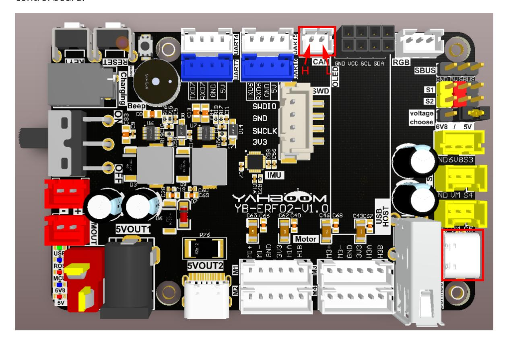
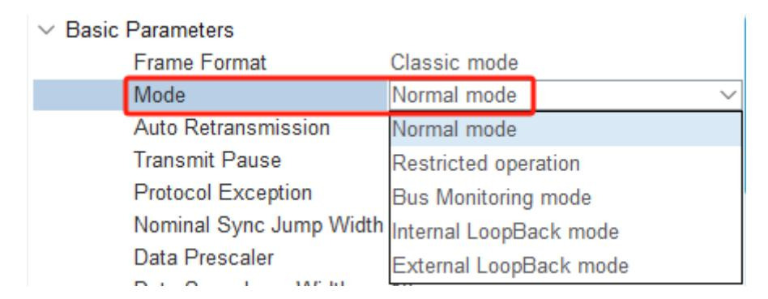
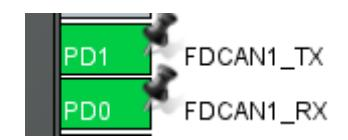
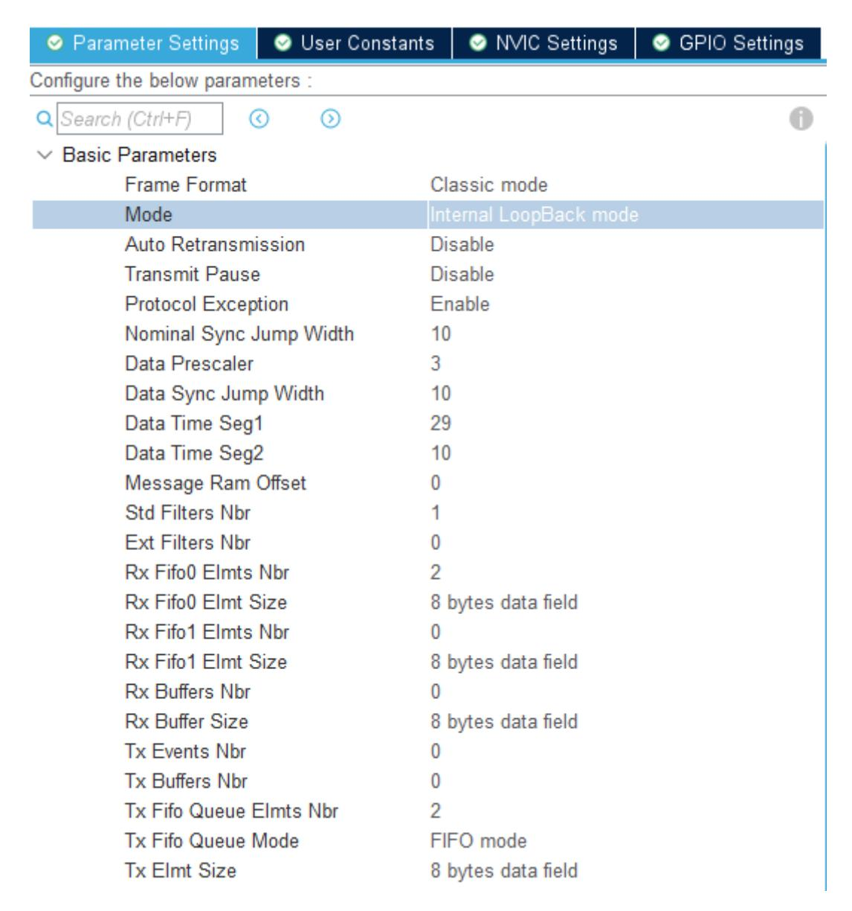
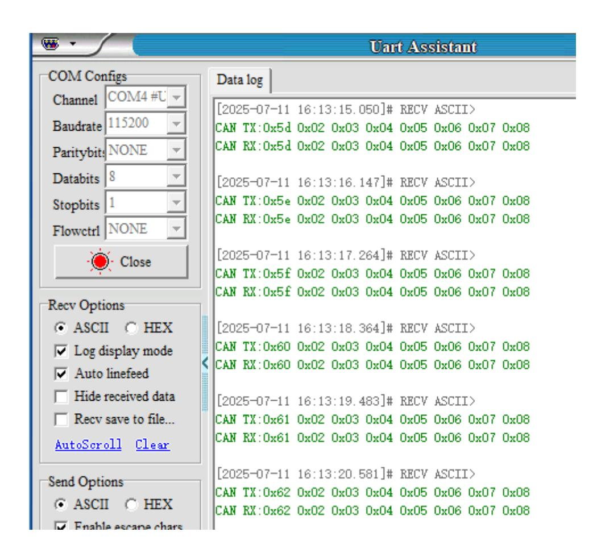

# **CAN bus communication**

CAN bus [communication](#page-0-0)

- <span id="page-0-0"></span>[1. Experimental](#page-0-1) Purpose
- [2. Hardware](#page-0-2) Connection
- 3. Core code [analysis](#page-1-0)
- 4. Compile, [download and burn](#page-5-0) firmware
- <span id="page-0-2"></span><span id="page-0-1"></span>[5. Experimental](#page-5-1) Results

### **1. Experimental Purpose**

Use the FDCAN function of the STM32 control board, configure the FDCAN as a traditional CAN function, and learn how to receive and parse CAN data.

### **2. Hardware Connection**

As shown in the figure below, the STM32 control board integrates the FDCAN interface. For testing convenience, this routine uses the loopback mode and the CAN interface does not need to be connected to other CAN devices.

Please connect the type-C data cable to the computer and the USB Connect port of the STM32 control board.



Note: In the test routine, the CAN interface can be left floating.

If you need to connect other CAN devices, please align the CAN interface silkscreen: connect CAN-H on the left and CAN-L on the right. Then change the CAN mode to standard mode, recompile the firmware and burn it.



# **3. Core code analysis**

The path corresponding to the program source code is:

Board\_Samples/STM32\_Samples/CAN

According to the pin assignment, CAN\_TX is connected to PD1 and CAN\_RX is connected to PD0.

<span id="page-1-0"></span>

According to the CAN component provided by STM32CUBEIDE, configure the frame format to traditional mode and the CAN mode to loopback mode. If you need to connect an external CAN device, set the Mode mode to standard mode.



#### Set the baud rate of FDCAN to 1000kbps

| → Bit Timings Parameters |               |
|--------------------------|---------------|
| Nominal Prescaler        | 3             |
| Nominal Time Quantum     | 25.0 ns       |
| Nominal Time Seg1        | 29            |
| Nominal Time Seg2        | 10            |
| Nominal Time for one Bit | 1000 ns       |
| Nominal Baud Rate        | 1000000 bit/s |

#### Initialize CAN configuration.

```
FDCAN_TxFrame_TypeDef TxFrame = {
    .hcan = &hfdcan1,
    .Header.IdType = FDCAN_STANDARD_ID,
    .Header.TxFrameType = FDCAN_DATA_FRAME,
    .Header.DataLength = 8,
    .Header.ErrorStateIndicator = FDCAN_ESI_ACTIVE,
    .Header.BitRateSwitch = FDCAN_BRS_OFF,
    .Header.FDFormat = FDCAN_CLASSIC_CAN,
    .Header.TxEventFifoControl = FDCAN_NO_TX_EVENTS,
    .Header.MessageMarker = 0,
};
```

```
void Can_Init(void)
{
    FDCAN_FilterTypeDef FDCAN1_FilterConfig;
    FDCAN1_FilterConfig.IdType = FDCAN_STANDARD_ID;
    FDCAN1_FilterConfig.FilterIndex = 0;
    FDCAN1_FilterConfig.FilterType = FDCAN_FILTER_MASK;
    FDCAN1_FilterConfig.FilterConfig = FDCAN_FILTER_TO_RXFIFO0;
    FDCAN1_FilterConfig.FilterID1 = 0x00000000;
    FDCAN1_FilterConfig.FilterID2 = 0x00000000;
    if (HAL_FDCAN_ConfigFilter(&hfdcan1, &FDCAN1_FilterConfig) != HAL_OK)
    {
        Error_Handler();
    }
    if (HAL_FDCAN_ConfigGlobalFilter(&hfdcan1, FDCAN_REJECT, FDCAN_REJECT,
FDCAN_FILTER_REMOTE, FDCAN_FILTER_REMOTE) != HAL_OK)
    {
        Error_Handler();
    }
    if (HAL_FDCAN_ActivateNotification(&hfdcan1, FDCAN_IT_RX_FIFO0_NEW_MESSAGE,
0) != HAL_OK)
    {
        Error_Handler();
    }
    if (HAL_FDCAN_Start(&hfdcan1) != HAL_OK)
    {
        Error_Handler();
    }
}
```

Receive the data sent by CAN in the interrupt.

```
void HAL_FDCAN_RxFifo0Callback(FDCAN_HandleTypeDef *hfdcan, uint32_t RxFifo0ITs)
{
    HAL_FDCAN_GetRxMessage(hfdcan, FDCAN_RX_FIFO0, &FDCAN1_RxFrame.Header,
FDCAN1_RxFrame.Data);
    FDCAN1_RxFifo0RxHandler(&FDCAN1_RxFrame.Header.Identifier,
FDCAN1_RxFrame.Data);
}
```

Print out the data received by CAN. Data parsing and event processing functions can be added here later.

```
static void FDCAN1_RxFifo0RxHandler(uint32_t *StdId, uint8_t Data[8])
{
    printf("CAN RX:");
    for (int i = 0; i < 8; i++)
    {
        printf("0x%02x ", Data[i]);
    }
    printf("\n");
}
```

The test sends a string of data via CAN and prints the data through the serial port. Each time it is sent, the first data is automatically incremented by 1, and the other data remain unchanged.

```
void Can_Test_Send(void)
{
    uint8_t send_data[8] = {0x01, 0x02, 0x03, 0x04, 0x05, 0x06, 0x07, 0x08};
    static uint8_t count = 0;
    count++;
    send_data[0] = count;
    TxFrame.Header.Identifier = 0x000B & 0x7FF;
    for (int i = 0; i < 8; i++)
    {
        TxFrame.Data[i] = send_data[i];
    }
    printf("CAN TX:");
    for (int i = 0; i < 8; i++)
    {
        printf("0x%02x ", send_data[i]);
    }
    printf("\n");
    HAL_FDCAN_AddMessageToTxFifoQ(TxFrame.hcan,&TxFrame.Header,TxFrame.Data);
}
```

Send test CAN data once per second.

```
void App_Handle(void)
{
    int count = 0;
    Can_Init();
    printf("Hello Yahboom\n");
    while (1)
    {
        count++;
        if (count >= 100)
        {
            count = 0;
            Can_Test_Send();
        }
        App_Led_Mcu_Handle();
        HAL_Delay(10);
    }
}
```

# **4. Compile, download and burn firmware**

Select the project to be compiled in the file management interface of STM32CUBEIDE and click the compile button on the toolbar to start compiling.

<span id="page-5-0"></span>

If there are no errors or warnings, the compilation is complete.

Press and hold the BOOT0 button, then press the RESET button to reset, release the BOOT0 button to enter the serial port burning mode. Then use the serial port burning tool to burn the firmware to the board.

If you have STlink or JLink, you can also use STM32CUBEIDE to burn the firmware with one click, which is more convenient and quick.

### <span id="page-5-1"></span>**5. Experimental Results**

The MCU\_LED light flashes every 200 milliseconds.

Open the serial port assistant (specific parameters are shown in the figure below), and you can see that the serial port assistant is constantly printing the data sent and received by CAN.

