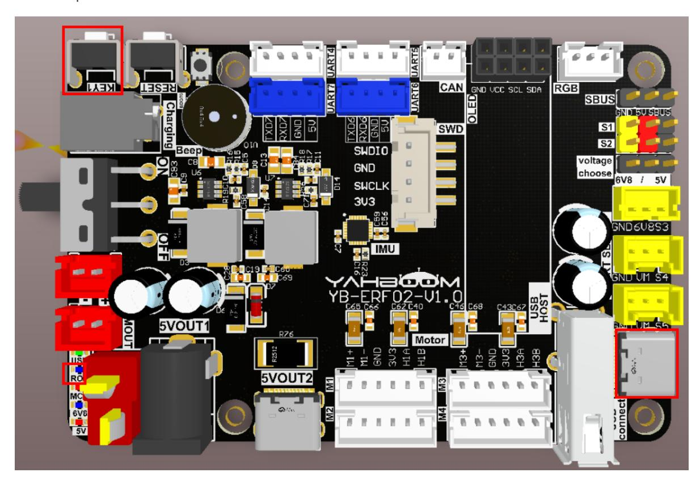
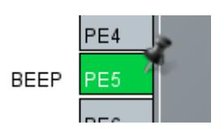
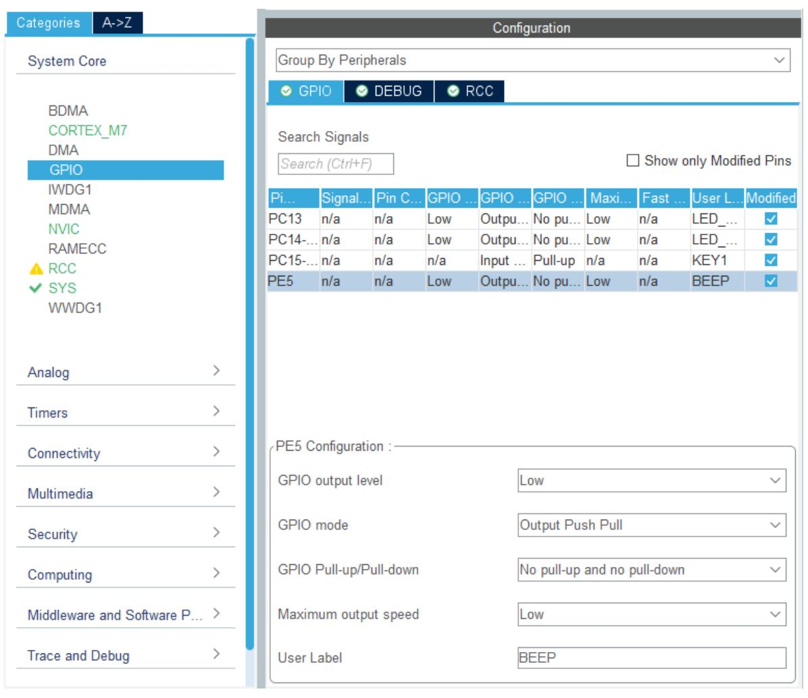
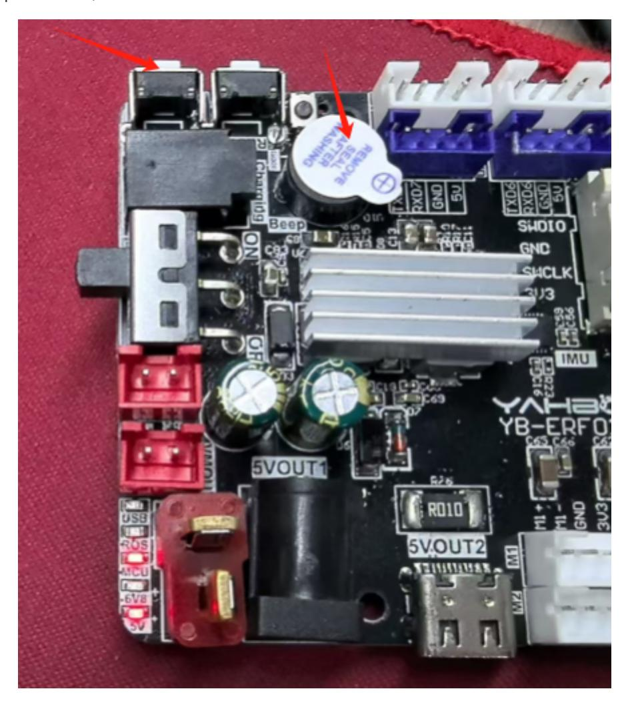

# **Drive the buzzer**

#### Drive the [buzzer](#page-0-0)

- <span id="page-0-0"></span>[1. Experimental](#page-0-1) Purpose
- [2. Hardware](#page-0-2) Connection
- 3. Core code [analysis](#page-1-0)
- 4. Compile, [download and burn](#page-3-0) firmware
- <span id="page-0-2"></span><span id="page-0-1"></span>[5. Experimental](#page-4-0) Results

#### **1. Experimental Purpose**

Read the KEY1 button on the STM32 control board and control the active buzzer to sound.

### **2. Hardware Connection**

As shown in the figure below, the KEY1 button and buzzer are onboard components, so no external devices are required. Please connect the Type-C data cable to the computer and the USB Connect port on the STM32 control board.



#### **3. Core code analysis**

Open STM32CUBEIDE and import the project. The path corresponding to the program source code is:

```
Board_Samples/STM32_Samples/Beep
```

Initialize the peripheral GPIO, where BEEP\_GPIO corresponds to PE5 of the hardware circuit, the GPIO mode is output mode, KEY1 corresponds to PC15 of the hardware circuit, and the GPIO mode is input pull-up mode.

<span id="page-1-0"></span>



```
#define BEEP_Pin GPIO_PIN_5
#define BEEP_GPIO_Port GPIOE
#define LED_MCU_Pin GPIO_PIN_13
#define LED_MCU_GPIO_Port GPIOC
#define LED_ROS_Pin GPIO_PIN_14
#define LED_ROS_GPIO_Port GPIOC
#define KEY1_Pin GPIO_PIN_15
#define KEY1_GPIO_Port GPIOC
void MX_GPIO_Init(void)
{
  GPIO_InitTypeDef GPIO_InitStruct = {0};
```

```
/* GPIO Ports Clock Enable */
  __HAL_RCC_GPIOE_CLK_ENABLE();
  __HAL_RCC_GPIOC_CLK_ENABLE();
  __HAL_RCC_GPIOH_CLK_ENABLE();
  __HAL_RCC_GPIOA_CLK_ENABLE();
  /*Configure GPIO pin Output Level */
  HAL_GPIO_WritePin(BEEP_GPIO_Port, BEEP_Pin, GPIO_PIN_RESET);
  /*Configure GPIO pin Output Level */
  HAL_GPIO_WritePin(GPIOC, LED_MCU_Pin|LED_ROS_Pin, GPIO_PIN_RESET);
  /*Configure GPIO pin : PtPin */
  GPIO_InitStruct.Pin = BEEP_Pin;
  GPIO_InitStruct.Mode = GPIO_MODE_OUTPUT_PP;
  GPIO_InitStruct.Pull = GPIO_NOPULL;
  GPIO_InitStruct.Speed = GPIO_SPEED_FREQ_LOW;
  HAL_GPIO_Init(BEEP_GPIO_Port, &GPIO_InitStruct);
  /*Configure GPIO pins : PCPin PCPin */
  GPIO_InitStruct.Pin = LED_MCU_Pin|LED_ROS_Pin;
  GPIO_InitStruct.Mode = GPIO_MODE_OUTPUT_PP;
  GPIO_InitStruct.Pull = GPIO_NOPULL;
  GPIO_InitStruct.Speed = GPIO_SPEED_FREQ_LOW;
  HAL_GPIO_Init(GPIOC, &GPIO_InitStruct);
  /*Configure GPIO pin : PtPin */
  GPIO_InitStruct.Pin = KEY1_Pin;
  GPIO_InitStruct.Mode = GPIO_MODE_INPUT;
  GPIO_InitStruct.Pull = GPIO_PULLUP;
  HAL_GPIO_Init(KEY1_GPIO_Port, &GPIO_InitStruct);
}
```

Turn on the buzzer

```
#define BEEP_ON() HAL_GPIO_WritePin(BEEP_GPIO_Port, BEEP_Pin, SET)
```

Turn off the buzzer

```
#define BEEP_OFF() HAL_GPIO_WritePin(BEEP_GPIO_Port, BEEP_Pin, RESET)
```

Set the buzzer on time. When time=0, it will be off. When time=1, it will keep ringing. When time>=10, it will automatically turn off after a delay of xx milliseconds.

```
void Beep_On_Time(uint16_t time)
{
    if (time == BEEP_STATE_ON_ALWAYS)
    {
        Beep_Set_State(BEEP_STATE_ON_ALWAYS);
        Beep_Set_Time(0);
        BEEP_ON();
    }
    else if (time == BEEP_STATE_OFF)
    {
        Beep_Set_State(BEEP_STATE_OFF);
```

```
Beep_Set_Time(0);
        BEEP_OFF();
    }
    else
    {
        if (time >= 10)
        {
            Beep_Set_State(BEEP_STATE_ON_DELAY);
            Beep_Set_Time(time / 10);
            BEEP_ON();
        }
    }
}
```

The buzzer automatically turns off when it times out and needs to be called every 10 milliseconds.

```
void Beep_Handle(void)
{
    if (Beep_Get_State() == BEEP_STATE_ON_DELAY)
    {
        if (Beep_Get_Time())
        {
            beep_on_time--;
        }
        else
        {
            BEEP_OFF();
            Beep_Set_State(BEEP_STATE_OFF);
        }
    }
}
```

The Beep\_Handle function is called every 10 milliseconds to control the buzzer to sound according to the status value of the KEY1 button.

```
while (1)
{
    if (Key1_State())
    {
        Beep_On_Time(100);
    }
    Beep_Handle();
    App_Led_Mcu_Handle();
    HAL_Delay(10);
}
```

# <span id="page-3-0"></span>**4. Compile, download and burn firmware**

Select the project to be compiled in the file management interface of STM32CUBEIDE and click the compile button on the toolbar to start compiling.


If there are no errors or warnings, the compilation is complete.

Press and hold the BOOT0 button, then press the RESET button to reset, release the BOOT0 button to enter the serial port burning mode. Then use the serial port burning tool to burn the firmware to the board.

If you have STlink or JLink, you can also use STM32CUBEIDE to burn the firmware with one click, which is more convenient and quick.

# **5. Experimental Results**

The MCU\_LED light flashes every 200 milliseconds.

When you press KEY1, the buzzer sounds once.

<span id="page-4-0"></span>