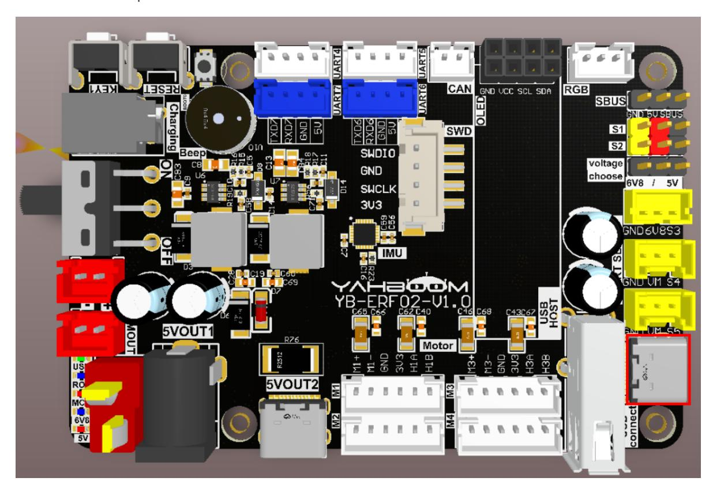
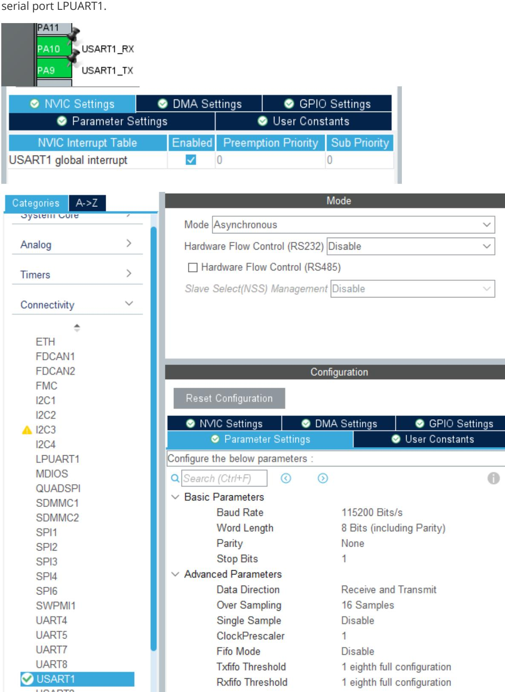
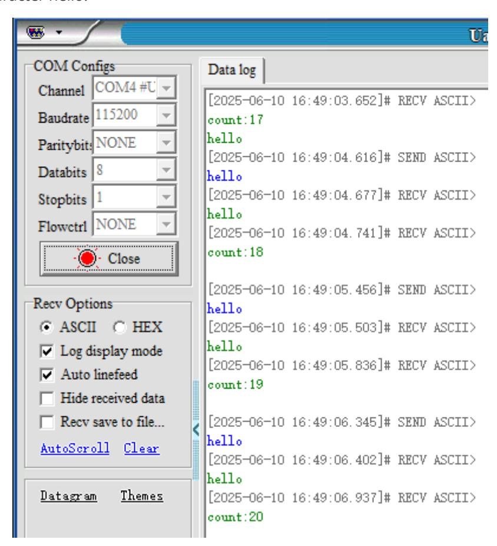

# **Serial communication**

Serial [communication](#page-0-0)

- <span id="page-0-0"></span>[1. Experimental](#page-0-1) Purpose
- [2. Hardware](#page-0-2) Connection
- 3. Core code [analysis](#page-1-0)
- 4. Compile, [download and burn](#page-3-0) firmware
- <span id="page-0-2"></span><span id="page-0-1"></span>[5. Experimental](#page-4-0) Results

#### **1. Experimental Purpose**

Use the serial port on the STM32 control board to learn how to receive and send data.

## **2. Hardware Connection**

As shown in the figure below, the CP2104 serial port chip is an onboard component, so no external devices are required. Please connect the Type-C data cable between the computer and the USB Connect port on the STM32 control board.



If the CP2104 serial port driver is not installed, please open the browser and enter the following URL to download, decompress and install it.

https://www.silabs.com/documents/public/software/CP210x\_Windows\_Drivers.zip

#### **3. Core code analysis**

The path corresponding to the program source code is:

```
Board_Samples/STM32_Samples/Uart
```

Here we take serial port 1 as an example. UART1\_TXD of serial port 1 corresponds to hardware PA9, UART1\_RXD corresponds to hardware PA10, and the baud rate is set to 115200, 8-bit data, 1 stop bit, and no parity check.

Note: PA9/PA10 can also be used as multiplexed pins, redirecting their function to the low-power



```
void MX_USART1_UART_Init(void)
{
  /* USER CODE BEGIN USART1_Init 0 */
  /* USER CODE END USART1_Init 0 */
  /* USER CODE BEGIN USART1_Init 1 */
  /* USER CODE END USART1_Init 1 */
  huart1.Instance = USART1;
  huart1.Init.BaudRate = 115200;
  huart1.Init.WordLength = UART_WORDLENGTH_8B;
  huart1.Init.StopBits = UART_STOPBITS_1;
  huart1.Init.Parity = UART_PARITY_NONE;
  huart1.Init.Mode = UART_MODE_TX_RX;
  huart1.Init.HwFlowCtl = UART_HWCONTROL_NONE;
  huart1.Init.OverSampling = UART_OVERSAMPLING_16;
  huart1.Init.OneBitSampling = UART_ONE_BIT_SAMPLE_DISABLE;
  huart1.Init.ClockPrescaler = UART_PRESCALER_DIV1;
  huart1.AdvancedInit.AdvFeatureInit = UART_ADVFEATURE_NO_INIT;
  if (HAL_UART_Init(&huart1) != HAL_OK)
  {
    Error_Handler();
  }
  if (HAL_UARTEx_SetTxFifoThreshold(&huart1, UART_TXFIFO_THRESHOLD_1_8) !=
HAL_OK)
  {
    Error_Handler();
  }
  if (HAL_UARTEx_SetRxFifoThreshold(&huart1, UART_RXFIFO_THRESHOLD_1_8) !=
HAL_OK)
  {
    Error_Handler();
  }
  if (HAL_UARTEx_DisableFifoMode(&huart1) != HAL_OK)
  {
    Error_Handler();
  }
  /* USER CODE BEGIN USART1_Init 2 */
  /* USER CODE END USART1_Init 2 */
}
```

Redefine the printf function to print data to serial port 1.

```
int _write(int file, char*p, int len)
{
  HAL_UART_Transmit(&huart1, (uint8_t *)p, len, 0xFFFF);
  return len;
}
```

Enable serial port interrupt request data.

```
HAL_UART_Receive_IT(&huart1, (uint8_t *)&RxTemp, 1);
```

Receive serial port data and then print it out through the serial port.

```
void HAL_UART_RxCpltCallback(UART_HandleTypeDef *huart)
{
    /* Prevent unused argument(s) compilation warning */
    UNUSED(huart);
    /* NOTE: This function should not be modified, when the callback is needed,
              the HAL_UART_RxCpltCallback can be implemented in the user file
     */
    // Test sending data. In actual application, data should not be sent in
interruption
    // Test sending data. In practice, data should not be sent during interrupts
    HAL_UART_Transmit(&huart1, (uint8_t *)&RxTemp, 1, 0xFFFF);
    // Continue receiving data
    HAL_UART_Receive_IT(&huart1, (uint8_t *)&RxTemp, 1);
}
```

Loop function that prints a string of characters every second.

```
while (1)
{
    print_count++;
    if (print_count % 100 == 0)
    {
        printf("count:%d\n", print_count/100);
    }
    App_Led_Mcu_Handle();
    HAL_Delay(10);
}
```

# **4. Compile, download and burn firmware**

Select the project to be compiled in the file management interface of STM32CUBEIDE and click the compile button on the toolbar to start compiling.

<span id="page-3-0"></span>

If there are no errors or warnings, the compilation is complete.

Press and hold the BOOT0 button, then press the RESET button to reset, release the BOOT0 button to enter the serial port burning mode. Then use the serial port burning tool to burn the firmware to the board.

If you have STlink or JLink, you can also use STM32CUBEIDE to burn the firmware with one click, which is more convenient and quick.

## **5. Experimental Results**

The MCU\_LED light flashes every 200 milliseconds.

Connect the control board to the computer via a Type-C data cable, open the serial port assistant (specific parameters are shown in the figure below), and you can see that the serial port assistant will display print count:xx, and the count value will automatically increase by 1 per second.

The serial port assistant sends the character hello, and the expansion board will automatically return the character hello.

<span id="page-4-0"></span>