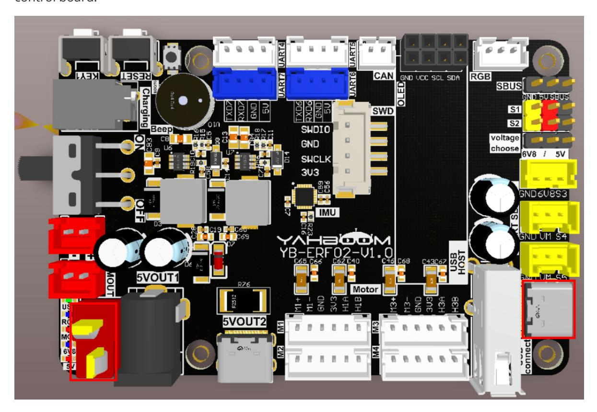
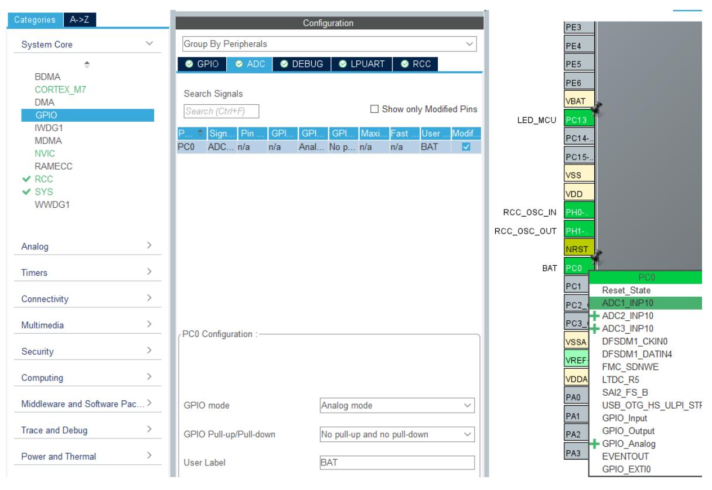
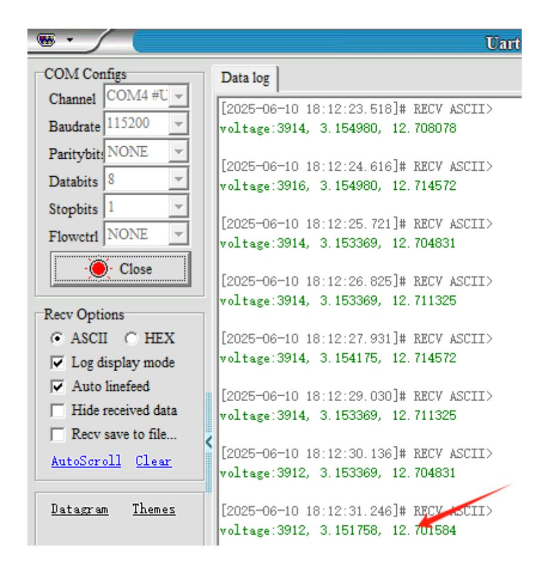

# **Battery voltage detection**

Battery voltage [detection](#page-0-0)

- <span id="page-0-0"></span>[1. Experimental](#page-0-1) Purpose
- [2. Hardware](#page-0-2) Connection
- 3. Core code [analysis](#page-1-0)
- 4. Compile, [download and burn](#page-4-0) firmware
- <span id="page-0-2"></span><span id="page-0-1"></span>[5. Experimental](#page-4-1) Results

#### **1. Experimental Purpose**

Use the voltage detection function on the STM32 control board to learn how to read ADC values.

### **2. Hardware Connection**

As shown in the figure below, the battery voltage detection circuit has been integrated into the STM32 control board, and the battery needs to be plugged into the battery interface.

Please connect the type-C data cable to the computer and the USB Connect port of the STM32 control board.



#### **3. Core code analysis**

The path corresponding to the program source code is:

```
Board_Samples/STM32_Samples/Adc
```

First, initialize the battery voltage detection ADC channel. The hardware GPIO connected to the voltage detection is PC0, and the corresponding ADC channel is ADC1\_INP10.

<span id="page-1-0"></span>



```
void MX_ADC1_Init(void)
{
  /* USER CODE BEGIN ADC1_Init 0 */
  /* USER CODE END ADC1_Init 0 */
  ADC_MultiModeTypeDef multimode = {0};
  ADC_ChannelConfTypeDef sConfig = {0};
  /* USER CODE BEGIN ADC1_Init 1 */
  /* USER CODE END ADC1_Init 1 */
  /** Common config
  */
  hadc1.Instance = ADC1;
  hadc1.Init.ScanConvMode = ADC_SCAN_DISABLE;
  hadc1.Init.EOCSelection = ADC_EOC_SINGLE_CONV;
  hadc1.Init.LowPowerAutoWait = DISABLE;
  hadc1.Init.ContinuousConvMode = DISABLE;
```

```
hadc1.Init.NbrOfConversion = 1;
  hadc1.Init.DiscontinuousConvMode = DISABLE;
  hadc1.Init.ExternalTrigConv = ADC_SOFTWARE_START;
  hadc1.Init.ExternalTrigConvEdge = ADC_EXTERNALTRIGCONVEDGE_NONE;
  hadc1.Init.ConversionDataManagement = ADC_CONVERSIONDATA_DR;
  hadc1.Init.Overrun = ADC_OVR_DATA_PRESERVED;
  hadc1.Init.LeftBitShift = ADC_LEFTBITSHIFT_NONE;
  hadc1.Init.OversamplingMode = DISABLE;
  hadc1.Init.Oversampling.Ratio = 1;
  if (HAL_ADC_Init(&hadc1) != HAL_OK)
  {
    Error_Handler();
  }
  hadc1.Init.ClockPrescaler = ADC_CLOCK_ASYNC_DIV6;
  hadc1.Init.Resolution = ADC_RESOLUTION_12B;
  if (HAL_ADC_Init(&hadc1) != HAL_OK)
  {
    Error_Handler();
  }
  /** Configure the ADC multi-mode
  */
  multimode.Mode = ADC_MODE_INDEPENDENT;
  if (HAL_ADCEx_MultiModeConfigChannel(&hadc1, &multimode) != HAL_OK)
  {
    Error_Handler();
  }
  /** Configure Regular Channel
  */
  sConfig.Channel = ADC_CHANNEL_10;
  sConfig.Rank = ADC_REGULAR_RANK_1;
  sConfig.SamplingTime = ADC_SAMPLETIME_1CYCLE_5;
  sConfig.SingleDiff = ADC_SINGLE_ENDED;
  sConfig.OffsetNumber = ADC_OFFSET_NONE;
  sConfig.Offset = 0;
  sConfig.OffsetSignedSaturation = DISABLE;
  if (HAL_ADC_ConfigChannel(&hadc1, &sConfig) != HAL_OK)
  {
    Error_Handler();
  }
  /* USER CODE BEGIN ADC1_Init 2 */
  /* USER CODE END ADC1_Init 2 */
}
```

Read the value of the current GPIO ADC channel.

```
uint16_t Bat_Get_Adc(uint32_t ch)
{
    ADC_ChannelConfTypeDef ADC1_ChanConf;
    ADC1_ChanConf.Channel = ch;
    ADC1_ChanConf.Rank = ADC_REGULAR_RANK_1;
    ADC1_ChanConf.SamplingTime = ADC_SAMPLETIME_1CYCLE_5;
    ADC1_ChanConf.SingleDiff = ADC_SINGLE_ENDED;
```

```
ADC1_ChanConf.OffsetNumber = ADC_OFFSET_NONE;
    ADC1_ChanConf.Offset = 0;
    ADC1_ChanConf.OffsetSignedSaturation = DISABLE;
    HAL_ADC_ConfigChannel(&hadc1, &ADC1_ChanConf); // Channel configuration
    HAL_ADC_Start(&hadc1);
    HAL_ADC_PollForConversion(&hadc1, 10);
    return (uint16_t)HAL_ADC_GetValue(&hadc1);
}
```

Convert the read ADC value into a GPIO voltage value.

```
float Bat_Get_GPIO_Volotage(void)
{
    uint16_t adcx;
    float temp;
    adcx = Bat_Get_Adc(BAT_ADC_CHANNEL);
    temp = (float)adcx * (3.30f / 4096);
    return temp;
}
```

Calculate the battery terminal voltage based on the GPIO voltage.

```
float Bat_Get_Battery_Volotage(void)
{
    float temp;
    temp = Bat_Get_GPIO_Volotage();
    temp = temp * 4.03f; // temp*(10+3.3)/3.3;
    return temp;
}
```

In App\_Handle, print the current battery voltage value in a loop, once per second.

```
void App_Handle(void)
{
    int print_count = 0;
    uint16_t adc = 0;
    float voltage = 0.0;
    float battery = 0.0;
    while (1)
    {
        print_count++;
        if (print_count % 100 == 0)
        {
            adc = Bat_Get_Adc(BAT_ADC_CHANNEL);
            voltage = Bat_Get_GPIO_Voltage();
            battery = Bat_Get_Battery_Volotage();
            printf("voltage:%d, %f, %f\n", adc, voltage, battery);
        }
        App_Led_Mcu_Handle();
        HAL_Delay(10);
    }
}
```

## **4. Compile, download and burn firmware**

Select the project to be compiled in the file management interface of STM32CUBEIDE and click the compile button on the toolbar to start compiling.

<span id="page-4-0"></span>

If there are no errors or warnings, the compilation is complete.

Press and hold the BOOT0 button, then press the RESET button to reset, release the BOOT0 button to enter the serial port burning mode. Then use the serial port burning tool to burn the firmware to the board.

If you have STlink or JLink, you can also use STM32CUBEIDE to burn the firmware with one click, which is more convenient and quick.

## <span id="page-4-1"></span>**5. Experimental Results**

The MCU\_LED light flashes every 200 milliseconds.

Connect the expansion board to the computer via a Type-C data cable, open the serial port assistant (specific parameters are shown in the figure below), and you can see the serial port assistant print the current battery voltage.

Among them, the first value is the ADC value, the second value is the GPIO voltage value, and the third value is the battery voltage value.

