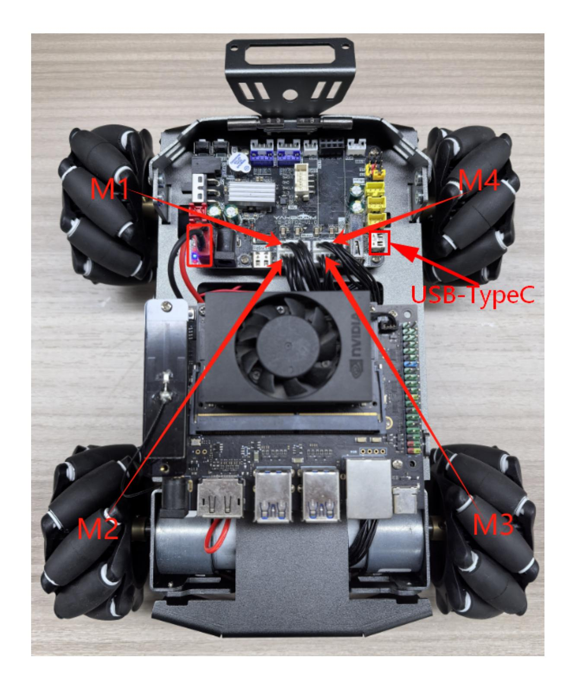
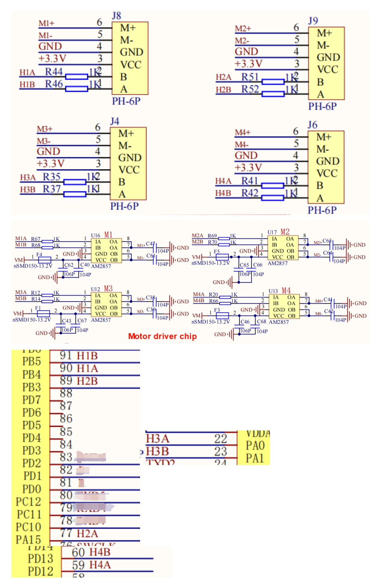
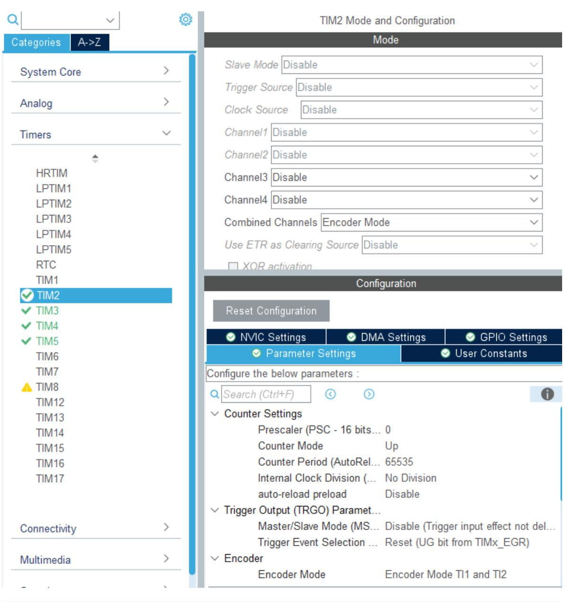
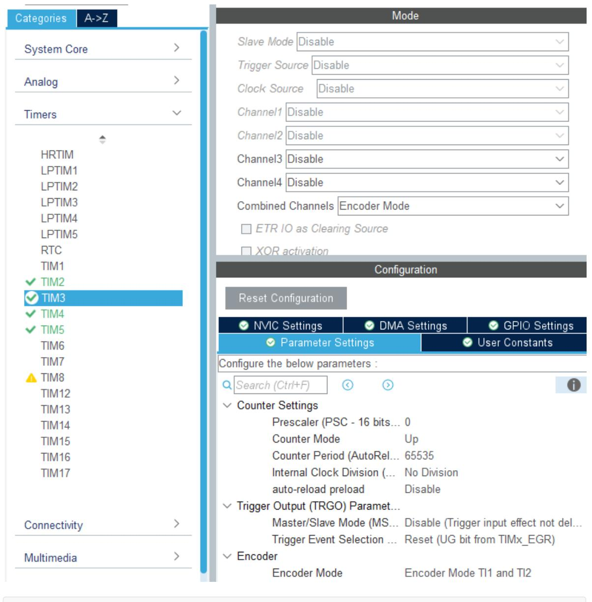

# **Read motor encoder data**

[Read motor](#page-0-0) encoder data

- <span id="page-0-0"></span>[1. Experimental](#page-0-1) Purpose
- [2. Hardware](#page-0-2) Connection
- 3. Core code [analysis](#page-3-0)
- 4. Compile, [download and burn](#page-8-0) firmware
- <span id="page-0-2"></span><span id="page-0-1"></span>[5. Experimental](#page-8-1) Results

#### **1. Experimental Purpose**

Use the encoder motor interface of the STM32 control board and learn to use the STM32 timer to capture the number of motor encoder pulses.

#### **2. Hardware Connection**

As shown in the figure below, the STM32 control board integrates four encoder motor control interfaces. This requires additional connection to an encoder motor. The motor control interface supports 520 encoder motors. Because encoder motors require high voltage and current, they must be powered by a battery.

Use a type-C data cable to connect the computer USB and the USB Connect port of the STM32 control board.

The corresponding names of the four motor interfaces are: left front wheel -> M1, left rear wheel - > M2, right front wheel -> M3, right rear wheel -> M4.





The corresponding relationship of motor encoder GPIO is shown in the following table:

| Motor interface encoder signal | STM32 GPIO numbering | STM32 timer channels |
|--------------------------------|----------------------|----------------------|
| H1A                            | PB4                  | TIM3_CH1             |
| H1B                            | PB5                  | TIM3_CH2             |
| H2A                            | PA15                 | TIM2_CH1             |
| H2B                            | PB3                  | TIM2_CH2             |
| H3A                            | PA0                  | TIM5_CH1             |
| H3B                            | PA1                  | TIM5_CH2             |
| H4A                            | PD12                 | TIM4_CH1             |
| H4B                            | PD13                 | TIM4_CH2             |

## **3. Core code analysis**

The path corresponding to the program source code is:

<span id="page-3-0"></span>Board\_Samples/STM32\_Samples/Encoder

Since the initialization process for the four motor encoders is similar, set timer channels 1 and 2 to encoder mode and configure the rising and falling edge trigger signals. Since timers TIM2 and TIM5 are 32-bit timers, and TIM3 and TIM4 are 16-bit timers, for ease of calculation, we uniformly set the maximum count value to 65535. This example uses the encoder initialization for timers TIM2 and TIM3.



```
void MX_TIM2_Init(void)
{
  TIM_Encoder_InitTypeDef sConfig = {0};
  TIM_MasterConfigTypeDef sMasterConfig = {0};
  /* USER CODE BEGIN TIM2_Init 1 */
  /* USER CODE END TIM2_Init 1 */
  htim2.Instance = TIM2;
  htim2.Init.Prescaler = 0;
  htim2.Init.CounterMode = TIM_COUNTERMODE_UP;
  htim2.Init.Period = 65535;
  htim2.Init.ClockDivision = TIM_CLOCKDIVISION_DIV1;
  htim2.Init.AutoReloadPreload = TIM_AUTORELOAD_PRELOAD_DISABLE;
  sConfig.EncoderMode = TIM_ENCODERMODE_TI12;
  sConfig.IC1Polarity = TIM_ICPOLARITY_RISING;
  sConfig.IC1Selection = TIM_ICSELECTION_DIRECTTI;
  sConfig.IC1Prescaler = TIM_ICPSC_DIV1;
  sConfig.IC1Filter = 0;
  sConfig.IC2Polarity = TIM_ICPOLARITY_RISING;
  sConfig.IC2Selection = TIM_ICSELECTION_DIRECTTI;
  sConfig.IC2Prescaler = TIM_ICPSC_DIV1;
```

```
sConfig.IC2Filter = 0;
  if (HAL_TIM_Encoder_Init(&htim2, &sConfig) != HAL_OK)
  {
    Error_Handler();
  }
  sMasterConfig.MasterOutputTrigger = TIM_TRGO_RESET;
  sMasterConfig.MasterSlaveMode = TIM_MASTERSLAVEMODE_DISABLE;
  if (HAL_TIMEx_MasterConfigSynchronization(&htim2, &sMasterConfig) != HAL_OK)
  {
    Error_Handler();
  }
}
```



```
void MX_TIM3_Init(void)
{
  TIM_Encoder_InitTypeDef sConfig = {0};
  TIM_MasterConfigTypeDef sMasterConfig = {0};
  /* USER CODE BEGIN TIM3_Init 1 */
  /* USER CODE END TIM3_Init 1 */
  htim3.Instance = TIM3;
  htim3.Init.Prescaler = 0;
```

```
htim3.Init.CounterMode = TIM_COUNTERMODE_UP;
  htim3.Init.Period = 65535;
  htim3.Init.ClockDivision = TIM_CLOCKDIVISION_DIV1;
  htim3.Init.AutoReloadPreload = TIM_AUTORELOAD_PRELOAD_DISABLE;
  sConfig.EncoderMode = TIM_ENCODERMODE_TI12;
  sConfig.IC1Polarity = TIM_ICPOLARITY_RISING;
  sConfig.IC1Selection = TIM_ICSELECTION_DIRECTTI;
  sConfig.IC1Prescaler = TIM_ICPSC_DIV1;
  sConfig.IC1Filter = 0;
  sConfig.IC2Polarity = TIM_ICPOLARITY_RISING;
  sConfig.IC2Selection = TIM_ICSELECTION_DIRECTTI;
  sConfig.IC2Prescaler = TIM_ICPSC_DIV1;
  sConfig.IC2Filter = 0;
  if (HAL_TIM_Encoder_Init(&htim3, &sConfig) != HAL_OK)
  {
    Error_Handler();
  }
  sMasterConfig.MasterOutputTrigger = TIM_TRGO_RESET;
  sMasterConfig.MasterSlaveMode = TIM_MASTERSLAVEMODE_DISABLE;
  if (HAL_TIMEx_MasterConfigSynchronization(&htim3, &sMasterConfig) != HAL_OK)
  {
    Error_Handler();
  }
}
```

During initialization, start channels 1 and 2 of timers TIM2, TIM3, TIM4, and TIM5.

```
void Encoder_Init(void)
{
    HAL_TIM_Encoder_Start(&htim2, TIM_CHANNEL_1 | TIM_CHANNEL_2);
    HAL_TIM_Encoder_Start(&htim3, TIM_CHANNEL_1 | TIM_CHANNEL_2);
    HAL_TIM_Encoder_Start(&htim4, TIM_CHANNEL_1 | TIM_CHANNEL_2);
    HAL_TIM_Encoder_Start(&htim5, TIM_CHANNEL_1 | TIM_CHANNEL_2);
}
```

Get the encoder data cache value.

```
static int Encoder_Read_CNT(uint8_t Encoder_id)
{
    int Encoder_TIM = 0;
    switch(Encoder_id)
    {
    case ENCODER_ID_M1: Encoder_TIM = (short)TIM3 -> CNT; TIM3 -> CNT = 0;
break;
    case ENCODER_ID_M2: Encoder_TIM = (long)TIM2 -> CNT; TIM2 -> CNT = 0; break;
    case ENCODER_ID_M3: Encoder_TIM = (long)TIM5 -> CNT; TIM5 -> CNT = 0; break;
    case ENCODER_ID_M4: Encoder_TIM = (short)TIM4 -> CNT; TIM4 -> CNT = 0;
break;
    default: break;
    }
    return Encoder_TIM;
}
```

In order to update the total count value of the encoder in time, this function needs to be called every 10 milliseconds.

```
void Encoder_Update_Count(void)
{
    // g_Encoder_M1_Now -= Encoder_Read_CNT(ENCODER_ID_M1);
    // g_Encoder_M2_Now -= Encoder_Read_CNT(ENCODER_ID_M2);
    // g_Encoder_M3_Now += Encoder_Read_CNT(ENCODER_ID_M3);
    // g_Encoder_M4_Now += Encoder_Read_CNT(ENCODER_ID_M4);
    g_Encoder_M1_Now += Encoder_Read_CNT(ENCODER_ID_M1);
    g_Encoder_M2_Now += Encoder_Read_CNT(ENCODER_ID_M2);
    g_Encoder_M3_Now -= Encoder_Read_CNT(ENCODER_ID_M3);
    g_Encoder_M4_Now -= Encoder_Read_CNT(ENCODER_ID_M4);
}
```

Based on Encoder\_id, read the total encoder count from the time a certain channel is powered on to the present.

```
int Encoder_Get_Count_Now(uint8_t Encoder_id)
{
    if (Encoder_id == ENCODER_ID_M1) return g_Encoder_M1_Now;
    if (Encoder_id == ENCODER_ID_M2) return g_Encoder_M2_Now;
    if (Encoder_id == ENCODER_ID_M3) return g_Encoder_M3_Now;
    if (Encoder_id == ENCODER_ID_M4) return g_Encoder_M4_Now;
    return 0;
}
```

It is also possible to obtain the encoder values of four motors at one time.

```
void Encoder_Get_ALL(int* Encoder_all)
{
    Encoder_all[0] = g_Encoder_M1_Now;
    Encoder_all[1] = g_Encoder_M2_Now;
    Encoder_all[2] = g_Encoder_M3_Now;
    Encoder_all[3] = g_Encoder_M4_Now;
}
```

Define the value of the encoder for a full rotation of the wheel as: reduction ratio \* number of encoder lines \* number of channels \* signal trigger source

Here we take the M3 car motor as an example. The parameters are reduction ratio: 56, number of encoder lines: 11, number of channels (two Hall sensors): 2, signal trigger source (including rising and falling edges): 2. The calculated encoder value for one wheel rotation is approximately 2464.

```
#define ENCODER_CIRCLE (2464)
```

Call the Encoder\_Init function in App\_Handle to initialize the motor encoders. In the loop, print the accumulated pulse counts of the four motor encoders every 300 milliseconds.

```
void App_Handle(void)
{
    uint8_t print_count = 0;
    int g_Encoder_Now[4] = {0};
    Encoder_Init();
    HAL_Delay(100);
```

```
while (1)
    {
        Encoder_Update_Count();
        Encoder_Get_ALL(g_Encoder_Now);
        print_count++;
        if (print_count >= 30)
        {
            print_count = 0;
            printf("count:%d, %d, %d, %d\n", g_Encoder_Now[0], g_Encoder_Now[1],
g_Encoder_Now[2], g_Encoder_Now[3]);
        }
        App_Led_Mcu_Handle();
        HAL_Delay(10);
    }
}
```

## **4. Compile, download and burn firmware**

Select the project to be compiled in the file management interface of STM32CUBEIDE and click the compile button on the toolbar to start compiling.

<span id="page-8-0"></span>

If there are no errors or warnings, the compilation is complete.

Press and hold the BOOT0 button, then press the RESET button to reset, release the BOOT0 button to enter the serial port burning mode. Then use the serial port burning tool to burn the firmware to the board.

If you have STlink or JLink, you can also use STM32CUBEIDE to burn the firmware with one click, which is more convenient and quick.

## <span id="page-8-1"></span>**5. Experimental Results**

The MCU\_LED light flashes every 200 milliseconds.

Taking motor 3 as an example, when the wheel rotates forward, the encoder data accumulates. When the wheel rotates forward one circle, the encoder data increases by approximately 2464. Due to a certain error in manual rotation, there may be some difference in the values, as long as the difference is not too large.

Press the reset button on the STM32 control board to reset the value to 0.

When the wheel rotates backward, the encoder data decreases. If the wheel rotates backward one circle, it decreases by about 2464.