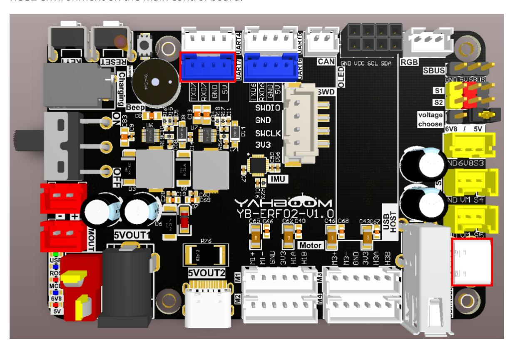

# **Multi-topic subscription and publishing**

[Multi-topic subscription](#page-0-0) and publishing

- <span id="page-0-0"></span>[1. Experimental](#page-0-1) Purpose
- [2. Hardware](#page-0-2) Connection
- 3. Core code [analysis](#page-1-0)
- 4. Compile, [download and burn](#page-4-0) firmware
- <span id="page-0-2"></span><span id="page-0-1"></span>[5. Experimental](#page-4-1) Results

#### **1. Experimental Purpose**

Learn about the STM32-microROS component, access the ROS2 environment, and subscribe to and publish multiple int32 topics.

## **2. Hardware Connection**

As shown in the figure below, the STM32 control board integrates the STM32H743 chip and can use the microros framework program.

Please connect the Type-C data cable to the USB port of the main control board and the USB Connect port of the STM32 control board.

If you have a USB-to-serial module such as CH340, you can connect to the serial port assistant to view debugging information.

Since ROS2 requires the Ubuntu environment, it is recommended to install Ubuntu22.04 and ROS2 environment on the main control board.



Note: There are many types of main control boards. Here we take the Jetson Orin series main control board as an example, with the default factory image burned.

## <span id="page-1-0"></span>**3. Core code analysis**

The virtual machine path corresponding to the program source code is:

```
Board_Samples/Microros_Samples/Publisher_Subscriber
```

Create three publishers with message type of Int32.

```
executor_count++;
// Create a publisher
RCCHECK(rclc_publisher_init_default(
    &publisher_1,
    &node,
    ROSIDL_GET_MSG_TYPE_SUPPORT(std_msgs, msg, Int32),
    "int32_publisher_1"));
executor_count++;
// Create a publisher
RCCHECK(rclc_publisher_init_default(
    &publisher_2,
    &node,
    ROSIDL_GET_MSG_TYPE_SUPPORT(std_msgs, msg, Int32),
    "int32_publisher_2"));
executor_count++;
// Create a publisher
RCCHECK(rclc_publisher_init_default(
    &publisher_3,
    &node,
    ROSIDL_GET_MSG_TYPE_SUPPORT(std_msgs, msg, Int32),
    "int32_publisher_3"));
```

Create three timers.

```
#definePUBLISHER_TIMEOUT_1 (1000)
#definePUBLISHER_TIMEOUT_2 (800)
#definePUBLISHER_TIMEOUT_3 (500)
    RCCHECK(rclc_timer_init_default(
        &publisher_timer_1,
        &support,
        RCL_MS_TO_NS(PUBLISHER_TIMEOUT_1),
        publisher_callback_1));
    RCCHECK(rclc_timer_init_default(
        &publisher_timer_2,
        &support,
        RCL_MS_TO_NS(PUBLISHER_TIMEOUT_2),
        publisher_callback_2));
    RCCHECK(rclc_timer_init_default(
        &publisher_timer_3,
```

```
&support,
RCL_MS_TO_NS(PUBLISHER_TIMEOUT_3),
publisher_callback_3));
```

Create three subscribers, and the message type is Int32.

```
executor_count++;
RCCHECK(rclc_publisher_init_default(
        &publisher,
        &node,
        ROSIDL_GET_MSG_TYPE_SUPPORT(std_msgs, msg, Int32),
        "int32_publisher_1"));
executor_count++;
RCCHECK(rclc_publisher_init_default(
        &publisher,
        &node,
        ROSIDL_GET_MSG_TYPE_SUPPORT(std_msgs, msg, Int32),
        "int32_publisher_2"));
executor_count++;
RCCHECK(rclc_publisher_init_default(
        &publisher,
        &node,
        ROSIDL_GET_MSG_TYPE_SUPPORT(std_msgs, msg, Int32),
        "int32_publisher_3"));
```

Adds a publisher's timer to the executor.

```
RCCHECK(rclc_executor_add_timer(&executor, &publisher_timer_1));
RCCHECK(rclc_executor_add_timer(&executor, &publisher_timer_2));
RCCHECK(rclc_executor_add_timer(&executor, &publisher_timer_3));
```

Adding subscribers to the executor

```
RCCHECK(rclc_executor_add_subscription(
        &executor,
        &subscriber_1,
        &subscriber_msg_1,
        &subscriber_callback_1,
        ON_NEW_DATA));
    RCCHECK(rclc_executor_add_subscription(
        &executor,
        &subscriber_2,
        &subscriber_msg_2,
        &subscriber_callback_2,
        ON_NEW_DATA));
    RCCHECK(rclc_executor_add_subscription(
        &executor,
        &subscriber_3,
        &subscriber_msg_3,
        &subscriber_callback_3,
        ON_NEW_DATA));
```

The publisher timer's timing callback function is processed.

```
void publisher_callback_1(rcl_timer_t *timer, int64_t last_call_time)
```

```
{
    RCLC_UNUSED(last_call_time);
    if (timer != NULL)
    {
        printf("Publishing_1: %d\n", (int) publisher_msg_1.data);
        RCSOFTCHECK(rcl_publish(&publisher_1, &publisher_msg_1, NULL));
        publisher_msg_1.data++;
    }
}
void publisher_callback_2(rcl_timer_t *timer, int64_t last_call_time)
{
    RCLC_UNUSED(last_call_time);
    if (timer != NULL)
    {
        printf("Publishing_2: %d\n", (int) publisher_msg_2.data);
        RCSOFTCHECK(rcl_publish(&publisher_2, &publisher_msg_2, NULL));
        publisher_msg_2.data++;
    }
}
void publisher_callback_3(rcl_timer_t *timer, int64_t last_call_time)
{
    RCLC_UNUSED(last_call_time);
    if (timer != NULL)
    {
        printf("Publishing_3: %d\n", (int) publisher_msg_3.data);
        RCSOFTCHECK(rcl_publish(&publisher_3, &publisher_msg_3, NULL));
        publisher_msg_3.data++;
    }
}
```

The subscriber's receiving callback function is processed.

```
void subscriber_callback_1(const void *msgin)
{
    const std_msgs__msg__Int32 * msg = (const std_msgs__msg__Int32 *)msgin;
    int32_t msg_data = msg->data;
    printf("subscriber_1 data:%ld\n", msg_data);
}
void subscriber_callback_2(const void *msgin)
{
    const std_msgs__msg__Int32 * msg = (const std_msgs__msg__Int32 *)msgin;
    int32_t msg_data = msg->data;
    printf("subscriber_2 data:%ld\n", msg_data);
}
void subscriber_callback_3(const void *msgin)
{
    const std_msgs__msg__Int32 * msg = (const std_msgs__msg__Int32 *)msgin;
    int32_t msg_data = msg->data;
    printf("subscriber_3 data:%ld\n", msg_data);
}
```

Call rclc\_executor\_spin\_some in a loop to make microros work properly.

```
while (ros_error < 3)
{
    rclc_executor_spin_some(&executor, RCL_MS_TO_NS(ROS2_SPIN_TIMEOUT_MS));
    if (ping_microros_agent() != RMW_RET_OK) break;
    vTaskDelayUntil(&lastWakeTime, 10);
    // vTaskDelay(pdMS_TO_TICKS(100));
}
```

#### **4. Compile, download and burn firmware**

Select the project to be compiled in the file management interface of STM32CUBEIDE and click the compile button on the toolbar to start compiling.

<span id="page-4-0"></span>

If there are no errors or warnings, the compilation is complete.

Since the Type-C communication serial port used by the microros agent is multiplexed with the burning serial port, it is recommended to use the STlink tool to burn the firmware.

If you are using the serial port to burn, you need to first plug the Type-C data cable into the computer's USB port, enter the serial port download mode, burn the firmware, and then plug it back into the USB port of the main control board.

## <span id="page-4-1"></span>**5. Experimental Results**

The MCU\_LED light flashes every 200 milliseconds.

The functional operation is similar to the single topic subscription and publishing functions, except that the topic name is different.

If the proxy is not enabled on the main control board terminal, enter the following command to enable it. If the proxy is already enabled, disable it and then re-enable it.

```
sh ~/start_agent.sh
```

After the connection is successful, three nodes and three subscribers are created.

Open another terminal and view the /YB\_Example\_Node node.

```
ros2 node list
ros2 node info /YB_Example_Node
```

Publish a message with the int data 123 to the topic /subscriber\_1.

```
ros2 topic pub /subscriber_1 std_msgs/msg/Int32 "data: 123"
```

Publish a message with the int data value 456 to the topic /subscriber\_2.

```
ros2 topic pub /subscriber_2 std_msgs/msg/Int32 "data: 456"
```

Publish a message with the integer value 789 to the topic /subscriber\_3.

```
ros2 topic pub /subscriber_3 std_msgs/msg/Int32 "data: 789"
```

You can see the corresponding information printed on the serial port assistant, indicating that the subscription is successful.

Check the frequency of /publisher\_1, /publisher\_2, and /publisher\_3 topics

```
ros2 topic hz /int32_publisher_1
ros2 topic hz /int32_publisher_2
ros2 topic hz /int32_publisher_3
```

Press Ctrl+C to end the command.

Subscribe to data from topics /int32\_publisher\_1, /int32\_publisher\_2, and /int32\_publisher\_3

```
ros2 topic echo /int32_publisher_1
ros2 topic echo /int32_publisher_2
ros2 topic echo /int32_publisher_3
```

Press Ctrl+C to end the command.