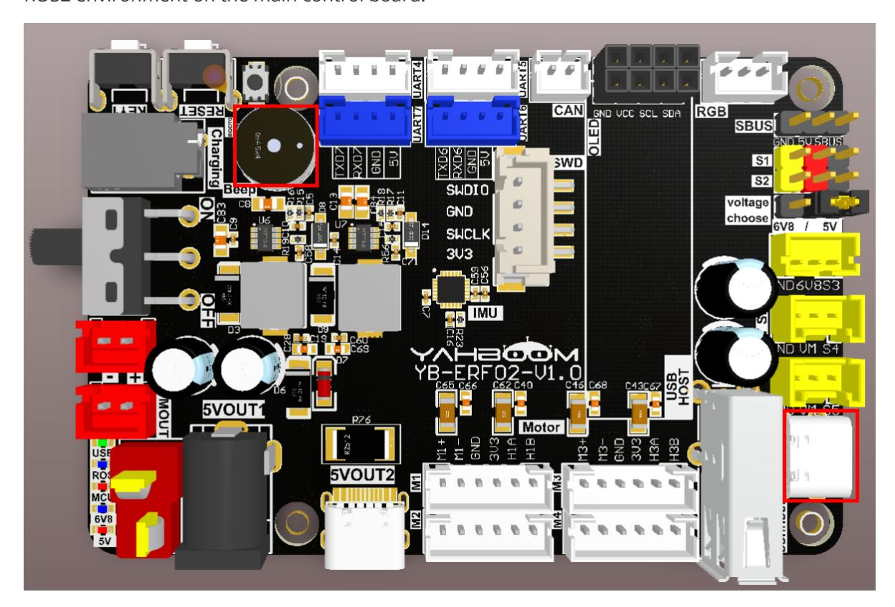

# **Subscribe to the buzzer topic**

[Subscribe](#page-0-0) to the buzzer topic

- <span id="page-0-0"></span>[1. Experimental](#page-0-1) Purpose
- [2. Hardware](#page-0-2) Connection
- 3. Core code [analysis](#page-1-0)
- 4. Compile, [download and burn](#page-1-1) firmware
- <span id="page-0-2"></span><span id="page-0-1"></span>[5. Experimental](#page-2-0) Results

#### **1. Experimental Purpose**

Learn about the STM32-microROS component, access the ROS2 environment, and subscribe to the topic of controlling the buzzer switch.

## **2. Hardware Connection**

As shown in the figure below, the STM32 control board integrates an active buzzer.

Use a Type-C data cable to connect the USB port of the main control board and the USB Connect port of the STM32 control board.

Since ROS2 requires the Ubuntu environment, it is recommended to install Ubuntu22.04 and ROS2 environment on the main control board.



Note: There are many types of main control boards. Here we take the Jetson Orin series main control board as an example, with the default factory image burned.

### <span id="page-1-0"></span>**3. Core code analysis**

The virtual machine path corresponding to the program source code is:

```
Board_Samples/Microros_Samples/Subscriber_beep
```

Create a subscriber beep, the message type is UInt16.

```
RCCHECK(rclc_subscription_init_default(
        &beep_subscriber,
        &node,
        ROSIDL_GET_MSG_TYPE_SUPPORT(std_msgs, msg, UInt16),
        "beep"));
```

Add a subscriber beep to the executor.

```
RCCHECK(rclc_executor_add_subscription(
        &executor,
        &beep_subscriber,
        &beep_msg,
        &beep_Callback,
        ON_NEW_DATA));
```

The buzzer receives data callback function and controls the buzzer switch.

```
void beep_Callback(const void *msgin)
{
    const std_msgs__msg__UInt16 * msg = (const std_msgs__msg__UInt16 *)msgin;
    uint16_t beep_time = msg->data;
    printf("beep:%d\n", beep_time);
    Beep_On_Time(beep_time);
}
```

Call rclc\_executor\_spin\_some in a loop to make microros work properly.

```
while (ros_error < 3)
{
    rclc_executor_spin_some(&executor, RCL_MS_TO_NS(ROS2_SPIN_TIMEOUT_MS));
    if (ping_microros_agent() != RMW_RET_OK) break;
    vTaskDelayUntil(&lastWakeTime, 10);
    // vTaskDelay(pdMS_TO_TICKS(100));
}
```

## <span id="page-1-1"></span>**4. Compile, download and burn firmware**

Select the project to be compiled in the file management interface of STM32CUBEIDE and click the compile button on the toolbar to start compiling.


If there are no errors or warnings, the compilation is complete.

Since the Type-C communication serial port used by the microros agent is multiplexed with the burning serial port, it is recommended to use the STlink tool to burn the firmware.

If you are using the serial port to burn, you need to first plug the Type-C data cable into the computer's USB port, enter the serial port download mode, burn the firmware, and then plug it back into the USB port of the main control board.

## <span id="page-2-0"></span>**5. Experimental Results**

The MCU\_LED light flashes every 200 milliseconds.

If the proxy is not enabled on the main control board terminal, enter the following command to enable it. If the proxy is already enabled, disable it and then re-enable it.

```
sh ~/start_agent.sh
```

After the connection is successful, a node and a subscriber are created.

Open another terminal and view the /YB\_Example\_Node node.

```
ros2 node list
ros2 node info /YB_Example_Node
```

Publish data to the /beep topic to control the buzzer to keep beeping.

```
ros2 topic pub --once /beep std_msgs/msg/UInt16 "data: 1"
```

Publish data to the /beep topic to turn off the buzzer.

```
ros2 topic pub --once /beep std_msgs/msg/UInt16 "data: 0"
```

Publish data to the /beep topic to control the buzzer to sound for 300 milliseconds and then turn off automatically.

```
ros2 topic pub --once /beep std_msgs/msg/UInt16 "data: 300"
```