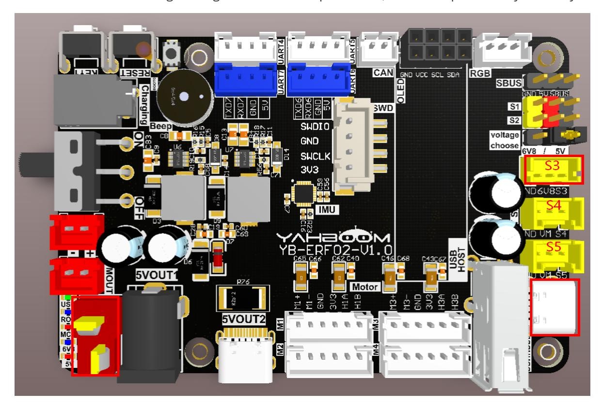
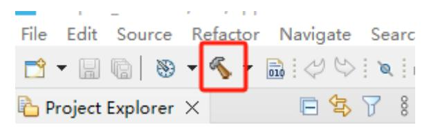

# **Subscribe to the Bus Servo Topic**

[Subscribe](#page-0-0) to the Bus Servo Topic

- <span id="page-0-0"></span>[1. Experimental](#page-0-1) Purpose
- [2. Hardware](#page-0-2) Connection
- 3. Core code [analysis](#page-1-0)
- 4. Compile, [download and burn](#page-2-0) firmware
- <span id="page-0-2"></span><span id="page-0-1"></span>[5. Experimental](#page-2-1) Results

#### **1. Experimental Purpose**

Learn about the STM32-microROS component, access the ROS2 environment, and subscribe to topics related to controlling the servo angle on the bus.

### **2. Hardware Connection**

As shown in the figure below, the STM32 control board integrates three bus servo interfaces. You need to prepare additional bus servos and connect them to see the effect.

Use a Type-C data cable to connect the USB port of the main control board and the USB Connect port of the STM32 control board.

Since the bus servo has high voltage and current requirements, it must be powered by a battery.



Note: There are many types of main control boards. Here we take the Jetson Orin series main control board as an example, with the default factory image burned.

Note: There are three bus servo interfaces (S3/S4/S5), of which S3 is a 6.8V bus servo interface, and S4 and S5 are 12V bus servo interfaces. Since the M3PRO's robotic arm bus servo is 6.8V, we will use S3 as an example.

### <span id="page-1-0"></span>**3. Core code analysis**

The virtual machine path corresponding to the program source code is:

```
Board_Samples/Microros_Samples/Subscriber_uart_servo
```

Create a subscriber arm\_joint with the message type ArmJoint.

```
RCCHECK(rclc_subscription_init_default(
        &uart_servo_subscriber,
        &node,
        ROSIDL_GET_MSG_TYPE_SUPPORT(arm_msgs, msg, ArmJoint),
        "arm_joint"));
```

The message type arm\_msgs/msg/ArmJoint is a custom type and has the following format:

```
uint8 id
int16 joint
int16 time
```

Add subscriber arm\_joint to the executor.

```
RCCHECK(rclc_executor_add_subscription(
        &executor,
        &uart_servo_subscriber,
        &uart_servo_msg,
        &uart_servo_Callback,
        ON_NEW_DATA));
```

The bus servo receives data callback function to control the bus servo robotic arm.

```
void uart_servo_Callback(const void *msgin)
{
    const arm_msgs__msg__ArmJoint * msg = (const arm_msgs__msg__ArmJoint
*)msgin;
    uint8_t id = msg->id;
    int16_t angle = msg->joint;
    int16_t runtime = msg->time;
    printf("uart servo:%d, %d, %d\n", id, angle, runtime);
    Arm_Set_Angle(id, angle, runtime);
}
```

Call rclc\_executor\_spin\_some in a loop to make microros work properly.

```
while (ros_error < 3)
{
    rclc_executor_spin_some(&executor, RCL_MS_TO_NS(ROS2_SPIN_TIMEOUT_MS));
    if (ping_microros_agent() != RMW_RET_OK) break;
    vTaskDelayUntil(&lastWakeTime, 10);
    // vTaskDelay(pdMS_TO_TICKS(100));
}
```

### **4. Compile, download and burn firmware**

Select the project to be compiled in the file management interface of STM32CUBEIDE and click the compile button on the toolbar to start compiling.

<span id="page-2-0"></span>

If there are no errors or warnings, the compilation is complete.

Since the Type-C communication serial port used by the microros agent is multiplexed with the burning serial port, it is recommended to use the STlink tool to burn the firmware.

If you are using the serial port to burn, you need to first plug the Type-C data cable into the computer's USB port, enter the serial port download mode, burn the firmware, and then plug it back into the USB port of the main control board.

## <span id="page-2-1"></span>**5. Experimental Results**

The MCU\_LED light flashes every 200 milliseconds.

If the proxy is not enabled on the main control board terminal, enter the following command to enable it. If the proxy is already enabled, disable it and then re-enable it.

```
sh ~/start_agent.sh
```

After the connection is successful, a node and two subscribers are created.

Open another terminal and view the /YB\_Example\_Node node.

```
ros2 node list
ros2 node info /YB_Example_Node
```

Note: Before running commands to control the robotic arm, please confirm the current position of the robotic arm to avoid it hitting other objects during movement.

Publish data to the /arm\_joint topic to control the bus servo with ID=1 to rotate to 60 degrees. Observe that servo No. 1 slowly rotates to the 60-degree position.

```
ros2 topic pub --once /arm_joint arm_msgs/msg/ArmJoint "{id: 1, joint: 60, time:
1000}"
```

Publish data to the /arm\_joint topic to control the bus servo with ID=1 to rotate to 120 degrees. Observe that servo No. 1 slowly rotates to the 120-degree position.

```
ros2 topic pub --once /arm_joint arm_msgs/msg/ArmJoint "{id: 1, joint: 120, time:
1000}"
```