# Intent Understanding
**Intent Understanding**

1. Course Content

2. Preparation

### 2.1 Content Description

### 2.2 Starting the Agent

### 2.2 Configuring the Intent Mapping File

### 2.3 Configuring the Knowledge Base

### 4.1 Starting the Program

### 4.2 Test Cases

5. Effect Debugging

### 5.1 Visualized Workflow

## 1. Course Content
Basic: Master customizing unique user intent understanding functions through the RAG

knowledge base.

Advanced: Master debugging the intent understanding effect on the DIfy platform.

[!IMPORTANT]

Intent understanding is designed to increase the rapport between the robot and the

user, allowing the robot to understand the user more uniquely. This function should

not be used to perform "strange" and "unconventional" tasks.
## 2. Preparation
### 2.1 Content Description
This section of the course uses the Jetson Orin NX as an example. For Raspberry Pi and Jetson
Nano boards, you need to open a terminal on the host machine, then enter the command to

enter the Docker container. After entering the Docker container, enter the commands mentioned

in this section of the course in the terminal. For instructions on entering the Docker container

from the host machine, please refer to the content in [0. Instructions and Installation Steps] ->

[Entering the Car's Docker (For Jetson-Nano and Raspberry Pi 5 users)] in this product tutorial. For

Orin and NX boards, simply open the terminal and enter the commands mentioned in this section

of the course.

### 2.2 Starting the Agent
**Note: If it has already been started, there is no need to start it again.**

Enter the following command in the vehicle terminal:

The terminal will print the following information, indicating a successful connection:

### 2.2 Configuring the Intent Mapping File
This file is used to store personal fuzzy intents and the corresponding tasks that the robot

should perform. - Open the example file in the tutorial folder for this section. You can add

multiple custom intents according to the reference format. Below is a simple example:

|query|answer|
|---|---|
|I'm a little thirsty|1. Navigate to the kitchen, 2. Check if there is bottled water or drinks, 3. If there is, use the robotic arm to pick up the drink, 4. Navigate back to the starting position|

### 2.3 Configuring the Knowledge Base
Next, we need to upload the edited intent mapping file to Dify's RAG knowledge base.

[!TIP]

For detailed instructions on using the RAG knowledge base, please refer to the tutorial

in `[2. AI Model Development`      - `06`      - `Deploy the RAG knowledge base]` .

demonstrate how to use the intent understanding function.

file.

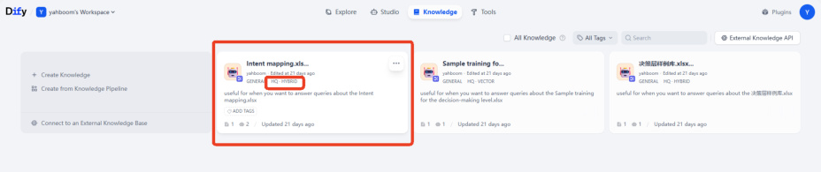

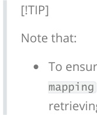
### 4.1 Starting the Program
On the vehicle's onboard computer, open a terminal and enter the command to start the AI

agent function:

Alternatively, you can use the shortcut command:

On the vehicle's onboard computer, open two more terminals and enter the commands to

start the navigation function:

On the robot, start rviz:

Then, follow the procedure for starting the navigation function to initialize the positioning. This
## will open the rviz2 visualization interface. Click on 2D Pose Estimate in the toolbar at the top to

enter the selection state. Roughly mark the robot's location and orientation on the map. After

initializing the positioning, the preparation is complete.

### 4.2 Test Cases
These test cases are for reference only; users can create their own dialogue commands.

I'm in the master bedroom now, and I feel a little thirsty.

The task steps for the decision-making layer model planning are as follows:

The tasks are executed sequentially according to the task steps planned by the decision-making

layer's large model:

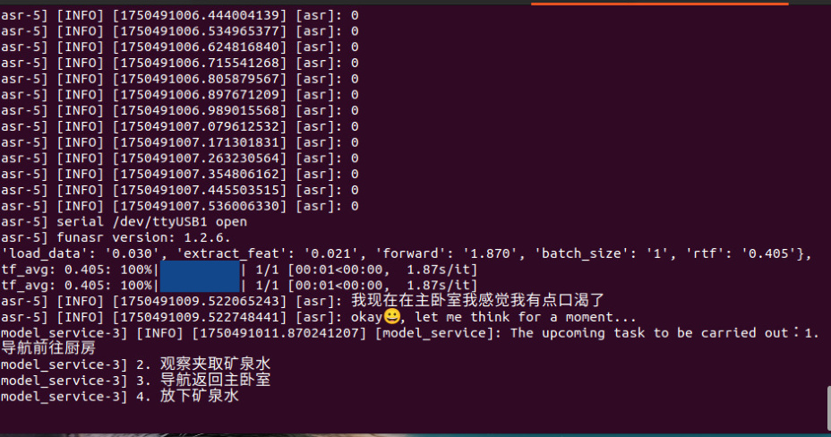

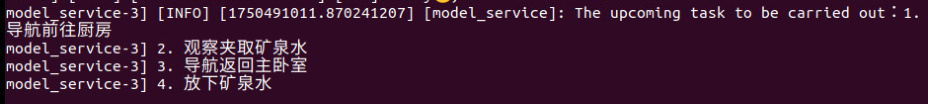
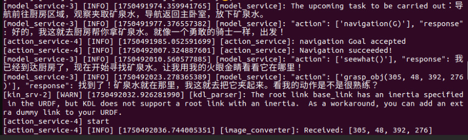

When the robotic arm is grasping, a visualization window will be displayed, as shown below:

After arriving at the "master bedroom," the robot will use its robotic arm to put down the red

block and prompt the user that the task is complete.

## 5. Effect Debugging
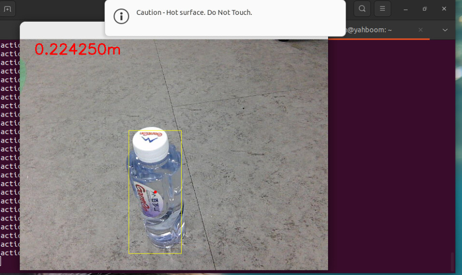

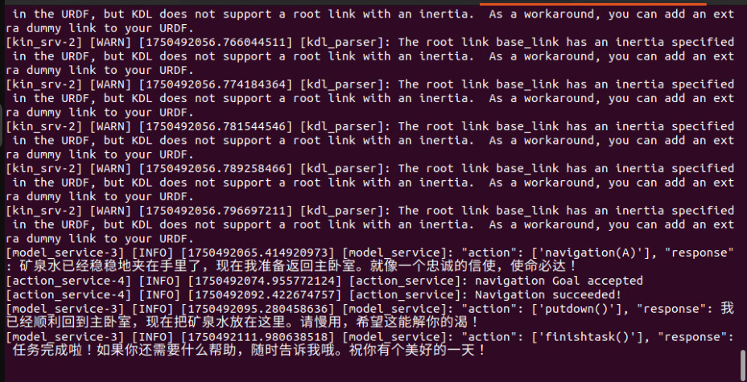
### 5.1 Visualized Workflow
Open the corresponding language version of the multi_brains application, then click preview

to input test content and view the data flow.

You can also open the workflow to view the time taken for each step and the input and

output content of each process.

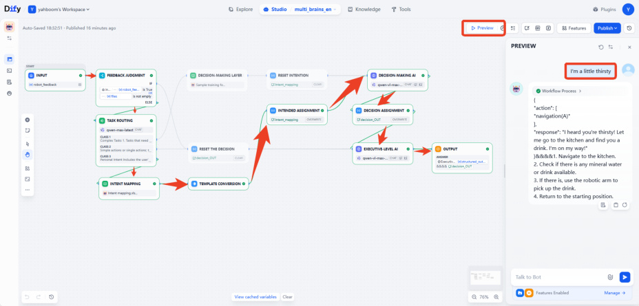
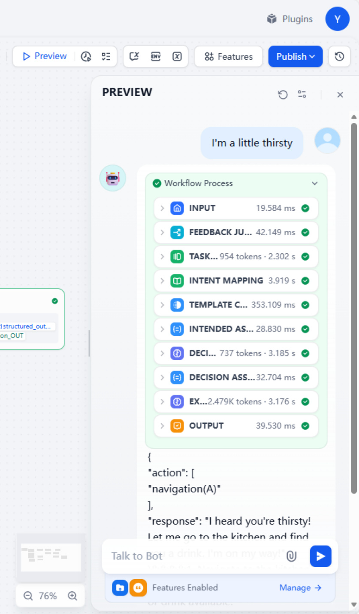

If the task routing module is inaccurate in certain contexts and does not categorize the input

descriptions for personal intent here.

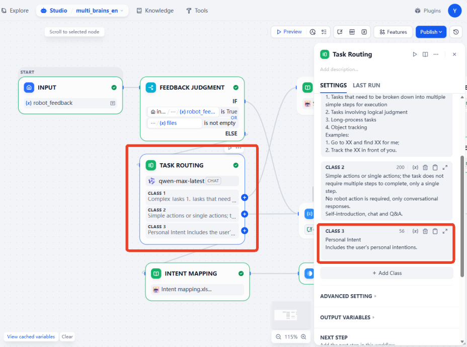

In addition, the recall performance of input sentences in the knowledge base can also be

tested separately within the intent mapping knowledge base.

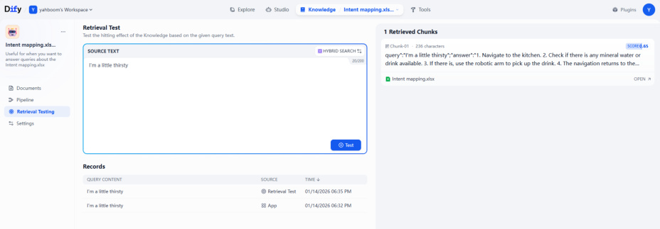
