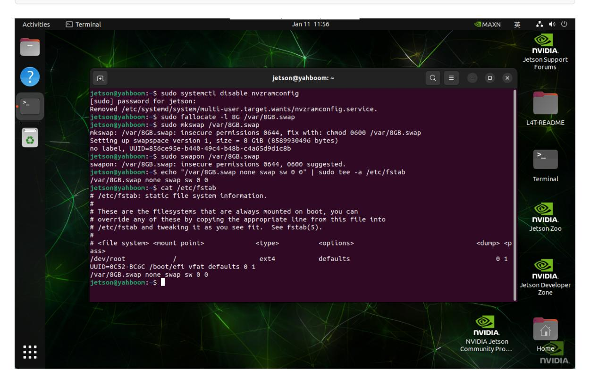
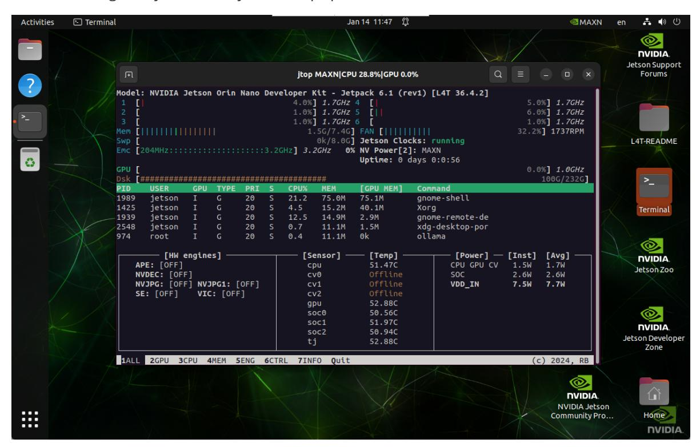

# **Exchange space expansion**

#### **[Exchange space expansion](#page-0-0)**

- <span id="page-0-0"></span>[1. Exchange](#page-0-1) space
- [2. Swap space](#page-0-2) expansion
  - 2.1. Disable ZRAM [swap configuration](#page-1-0)
  - 2.2, [Create](#page-1-1) 8GB file
  - 2.3. Set the [swap space](#page-1-2) format
  - 2.4. Enable [swap space](#page-1-3)
  - [2.5. Permanently](#page-1-4) start swap space
- <span id="page-0-1"></span>3. Verify the [expansion](#page-1-5)

## **1. Exchange space**

Swap space is a mechanism used by the operating system to expand available memory. It can continue to run when there is insufficient memory, avoiding program crashes or system freezes!

<span id="page-0-2"></span>Note: The access speed of swap space is much lower than that of physical memory

# **2. Swap space expansion**

```
sudo systemctl disable nvzramconfig
sudo fallocate -l 8G /var/8GB.swap
sudo mkswap /var/8GB.swap
sudo swapon /var/8GB.swap
echo "/var/8GB.swap none swap sw 0 0" | sudo tee -a /etc/fstab
```



### **2.1. Disable ZRAM swap configuration**

Disable ZRAM swap configuration on Jetson devices: ZRAM compresses and stores memory pages in memory to reduce reliance on disk.

<span id="page-1-1"></span><span id="page-1-0"></span>sudo systemctl disable nvzramconfig

### **2.2, Create 8GB file**

Use fallocate to create a file of 8GB in size, located in the /var/8GB.swap path.

<span id="page-1-2"></span>sudo fallocate -l 8G /var/8GB.swap

### **2.3. Set the swap space format**

<span id="page-1-3"></span>sudo mkswap /var/8GB.swap

### **2.4. Enable swap space**

<span id="page-1-4"></span>sudo swapon /var/8GB.swap

### **2.5. Permanently start swap space**

<span id="page-1-5"></span>echo "/var/8GB.swap none swap sw 0 0" | sudo tee -a /etc/fstab

# **3. Verify the expansion**

After restarting the system, the system swap space increases to 8GB:

