# **Restore the factory image system**

#### **[Restore the factory image system](#page-0-0)**

- [1. Format](#page-0-1) the SSD
  - [1.1. Download DiskGenius](#page-0-2)
  - 1.1. Use [DiskGenius](#page-1-0)
    - 1.1.1, Delete [partition](#page-1-1)
    - [1.1.2. Create](#page-3-0) a new partition
- [2. Restore](#page-7-0) the factory image
  - 2.1. Install [Win32DiskImager](#page-7-1)
  - 2.2. Use [Win32DiskImager](#page-11-0)
- [3. Description](#page-12-0)

# **1. Format the SSD**

Before restoring the factory image, you need to format the SSD into exFAT format.

## **1.1. Download DiskGenius**

Download URL: <https://www.diskgenius.com/>

Double-click the exe file you just downloaded to install DiskGenius. Follow the prompts to install the software on the Windows computer. After opening the software, it will be as shown below.

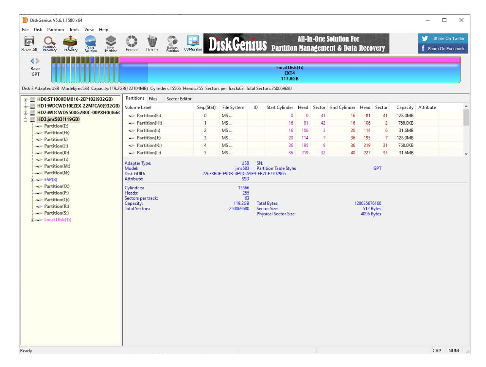

## **1.1. Use DiskGenius**

#### **1.1.1, Delete partition**

Deleting a partition will clear the disk data. Please confirm whether the drive letter is the disk that needs to be formatted before confirming the operation: you can judge based on the disk size and the newly added drive letter of the connected disk

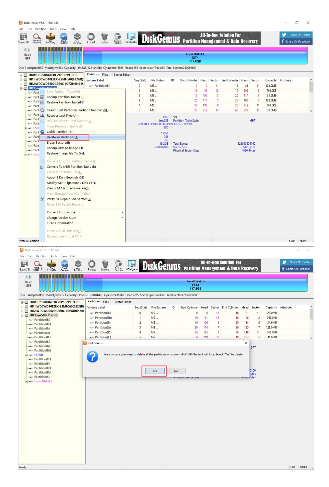

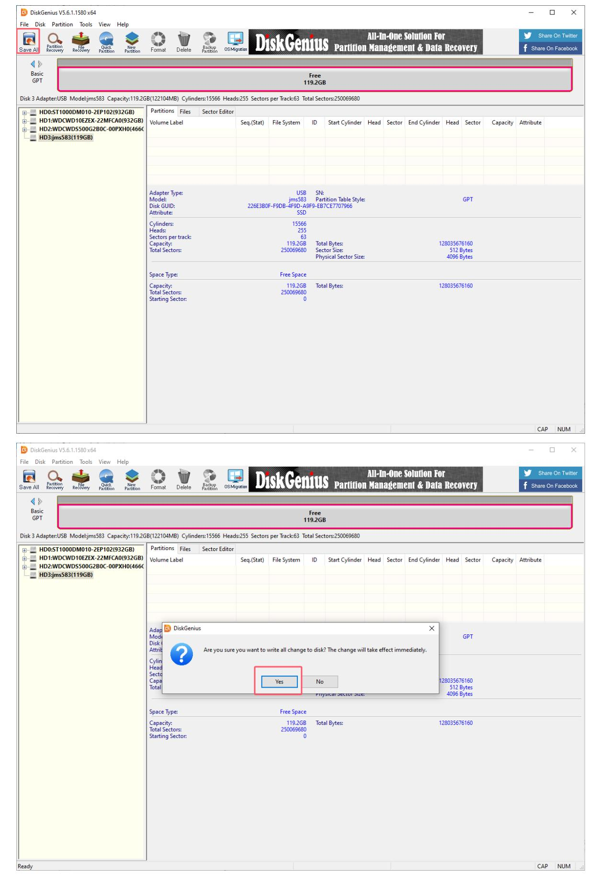

#### **1.1.2. Create a new partition**

Partition the SSD into NTFS format.

Select the drive letter corresponding to the SSD, and then click New Partition:

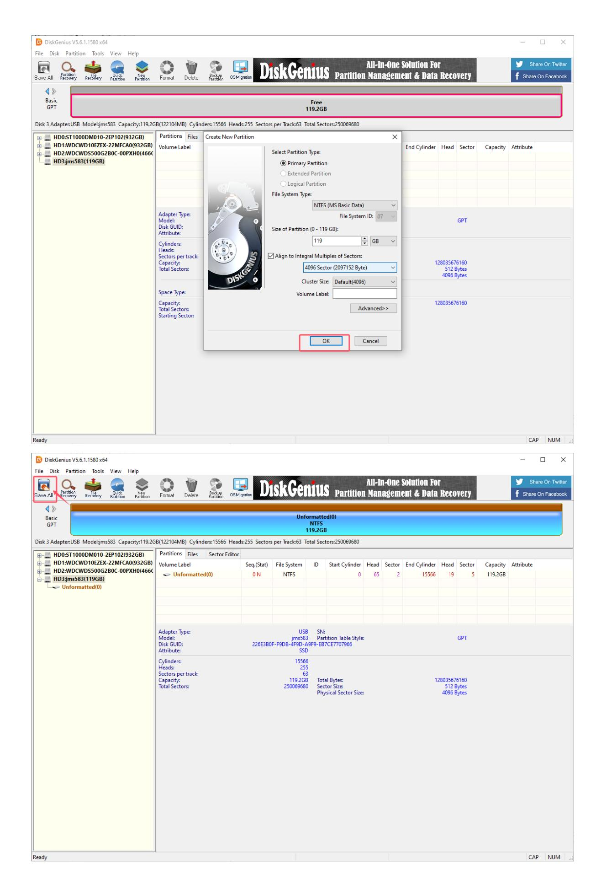

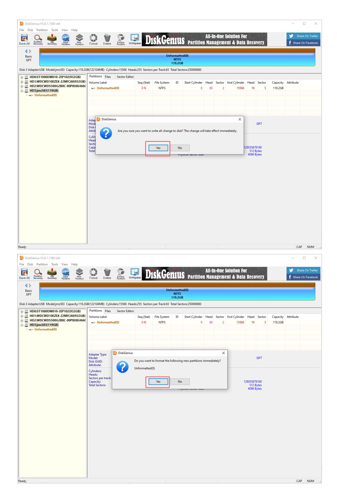

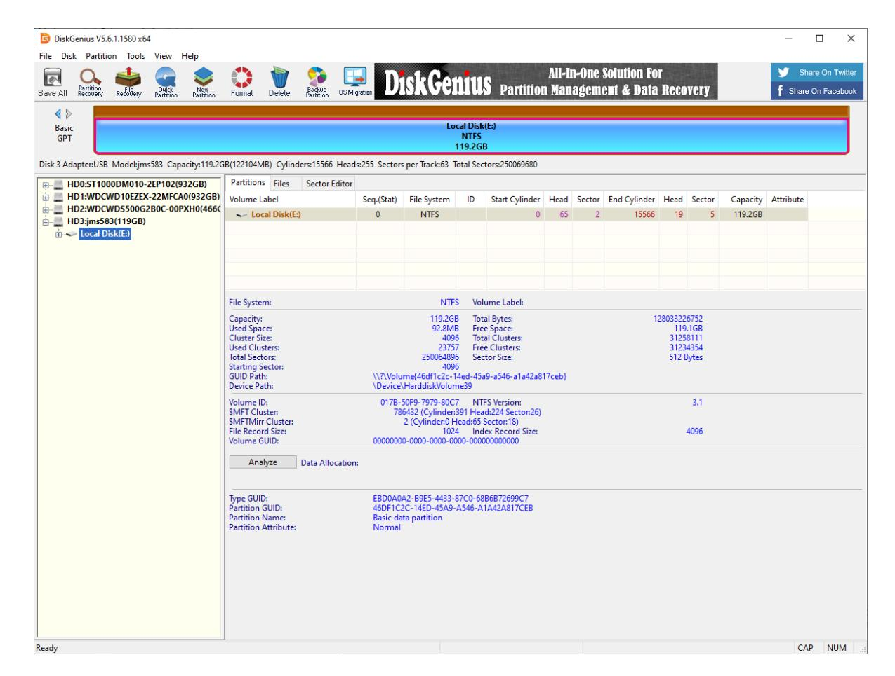

# **2. Restore the factory image**

You need to download and decompress the factory image system in the data to the local computer in advance.

## **2.1. Install Win32DiskImager**

Download URL: <https://sourceforge.net/projects/win32diskimager/>

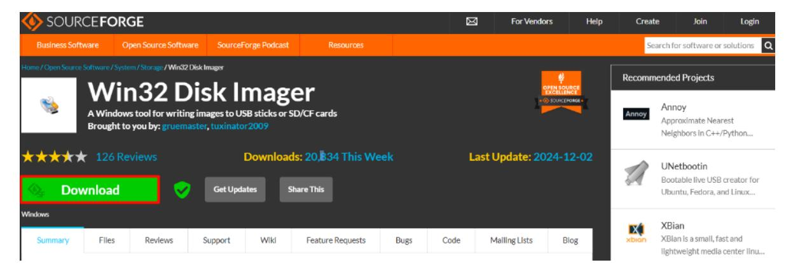

Open the win32diskimager-1.0.0-install.exe installation package as an administrator and accept the agreement:

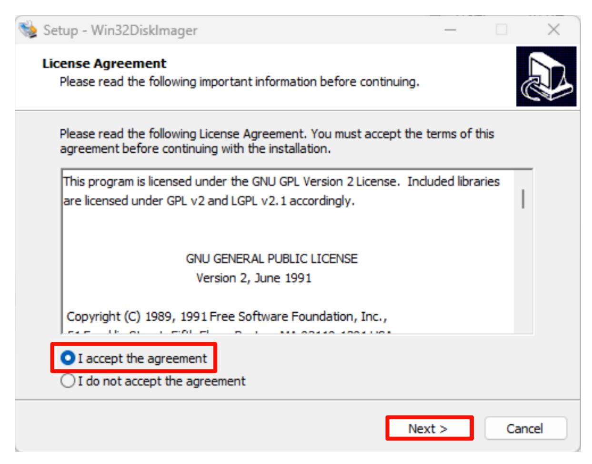

Installation location: The default location is recommended

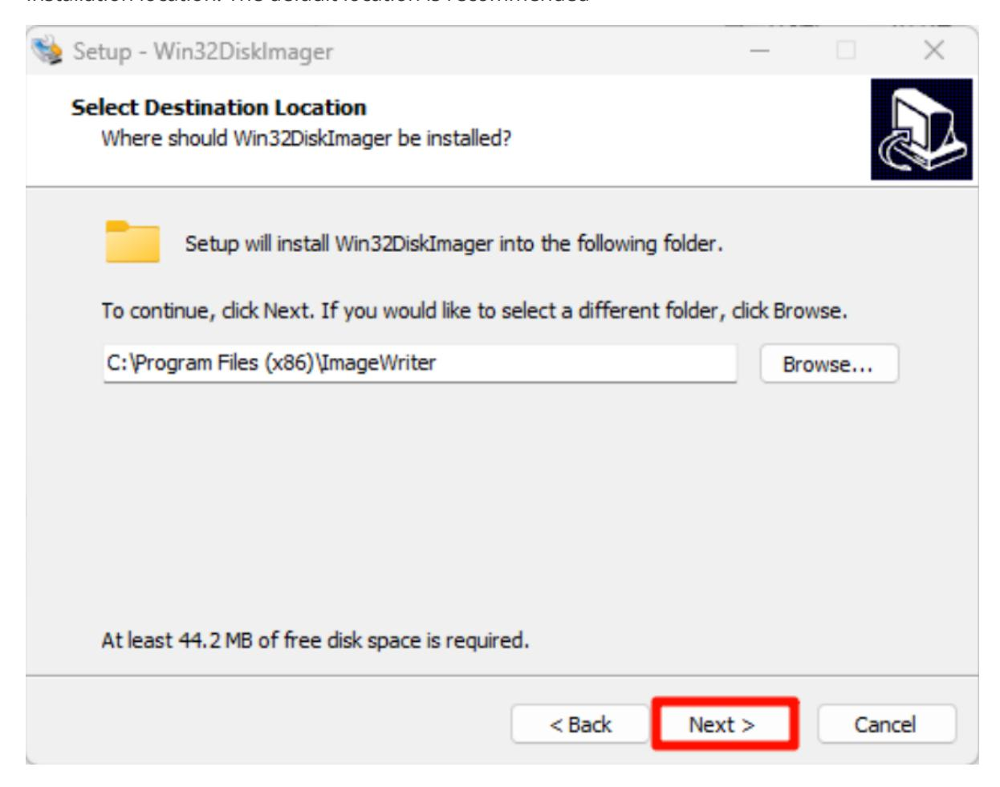

Installation options:

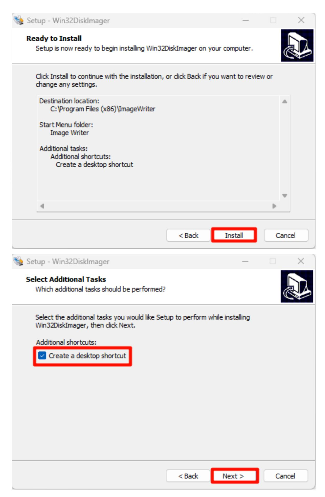

Start installation:

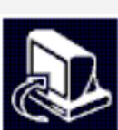

#### Complete installation:

### **2.2. Use Win32DiskImager**

- ①: Select the factory image file (\*.img) in the data
- ②: Select the drive letter corresponding to the solid-state drive
- ③: Write the factory image to the solid-state drive

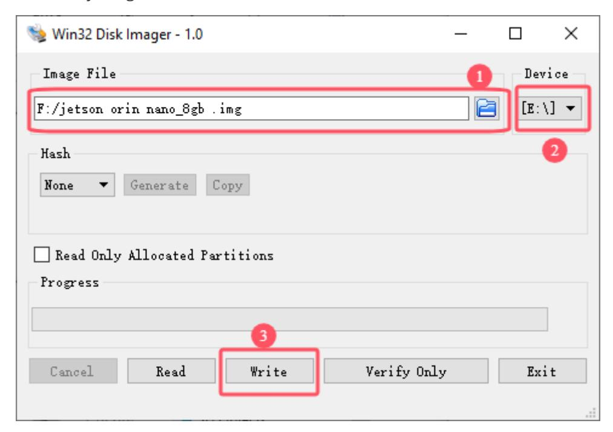

Confirm writing to the system:

image-20250123105608261

Wait for the system to be written successfully:

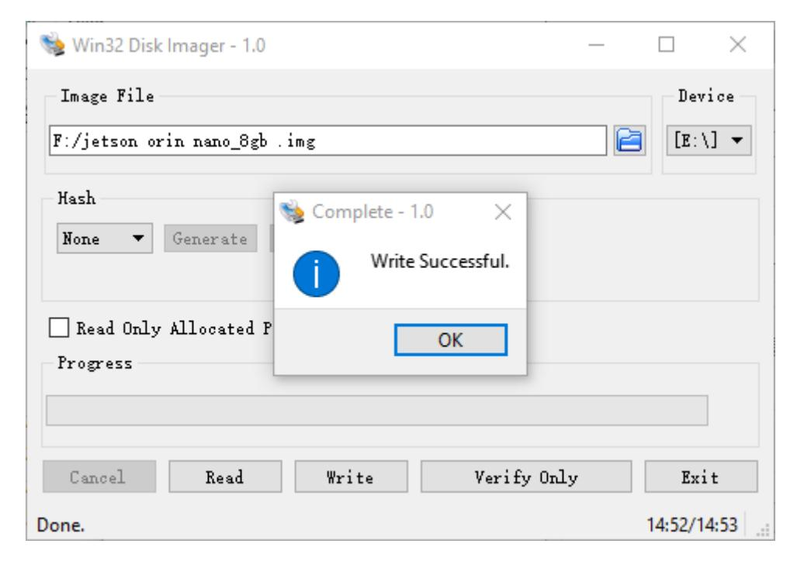

After the system is written, you can close the program and install the SSD to the Jetson Orin motherboard!

## **3. Description**

The Jetson motherboard can start the system normally and it depends on the system Jetpack version. Generally, only the same version can start the system!