# **Backup SSD system**

#### **[Backup](#page-0-0) SSD system**

- <span id="page-0-0"></span>[1. Hardware](#page-0-1) connection
- [2. Compress](#page-0-2) the SSD
  - [2.1. Install](#page-0-3) Gparted
  - 2.2. Use [GParted](#page-1-0)
    - [2.2.1. Select](#page-1-1) the SSD
    - [2.2.2. Unmount](#page-2-0) the partition
    - [2.2.3. Perform disk compression](#page-2-1)
- [3. Back up the](#page-4-0) SSD
  - [3.1. Check disk information](#page-5-0)
  - 3.2. Start [disk backup](#page-5-1)

During the development process, users may need to back up the system to prevent subsequent development from affecting the current system environment.

The image file demonstrated in the tutorial is not the actual factory image, it is only for tutorial demonstration

## **1. Hardware connection**

Users need to prepare the SSD box in advance, install the SSD into the SSD box and connect it to the computer or virtual machine: the computer and virtual machine systems need to be Ubuntu systems.

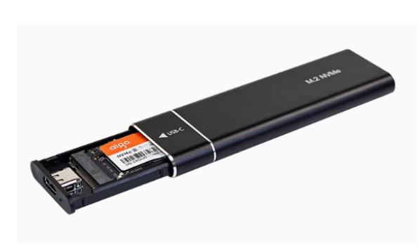

<span id="page-0-3"></span><span id="page-0-2"></span><span id="page-0-1"></span>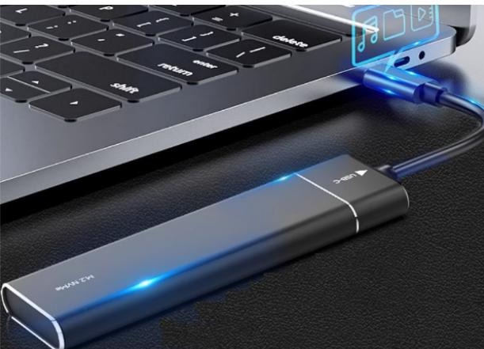

## **2. Compress the SSD**

Since the SSD capacity of the Jetson Orin series motherboard is relatively large, we need to compress it to an appropriate space for system backup to save time for backup and burning the system.

### **2.1. Install Gparted**

```
sudo apt update
sudo apt install gparted -y
```

### <span id="page-1-0"></span>**2.2. Use GParted**

Find the GParted application icon in the system application menu bar to open it or enter the following command in the terminal to start it:

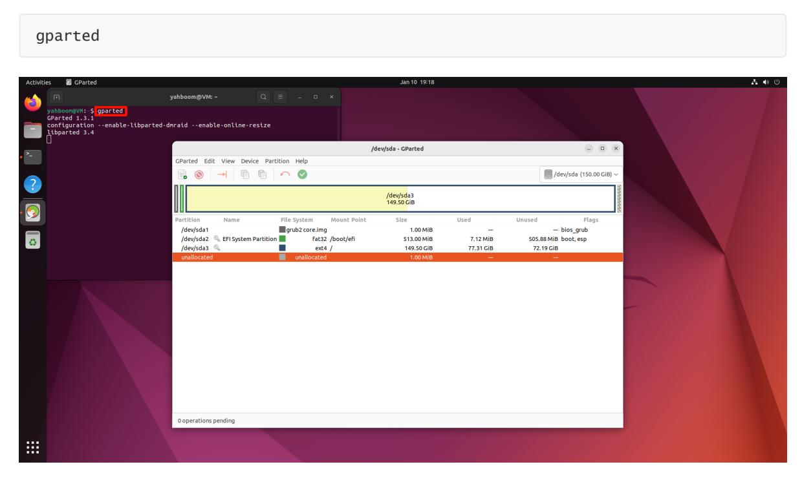

#### <span id="page-1-1"></span>**2.2.1. Select the SSD**

Select the newly added disk symbol: You can confirm again whether it is the SSD you mounted based on the disk capacity

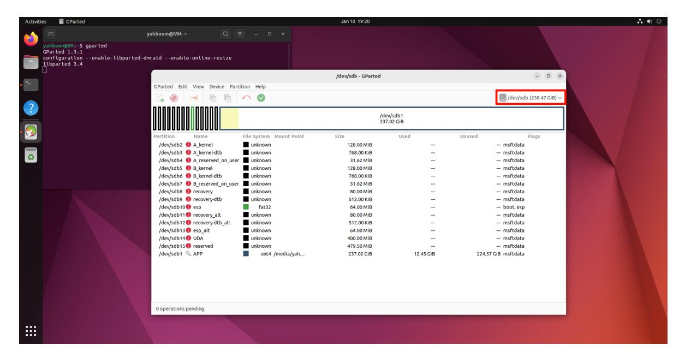

#### <span id="page-2-0"></span>**2.2.2. Unmount the partition**

Before operating the disk, you need to unmount the disk: select the APP partition (largest partition) in the disk, and click Unmount to unmount the partition

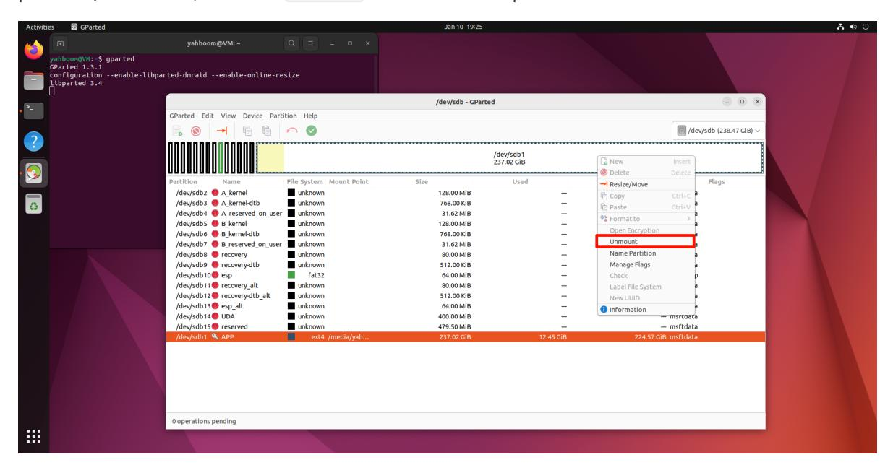

### <span id="page-2-1"></span>**2.2.3. Perform disk compression**

Right-click the uninstalled disk partition and resize the previously uninstalled partition space:

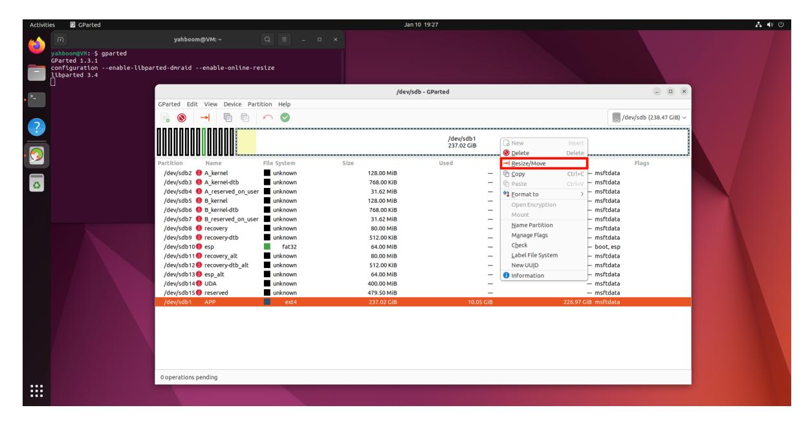

You can adjust the partition size using the slider: yellow is the space used by the partition, white is the unused space, it is recommended to leave about 5-10G of unused space in the partition to avoid the system from failing to start

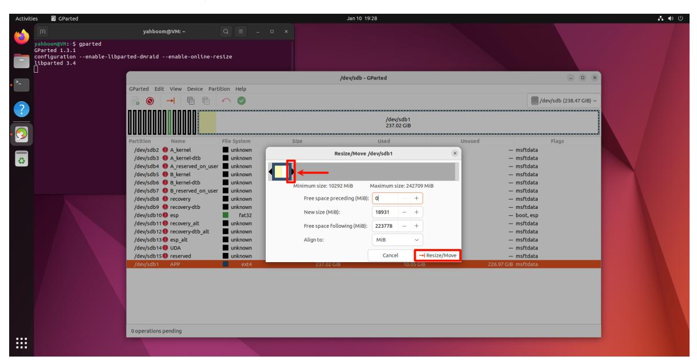

Confirm the disk operation:

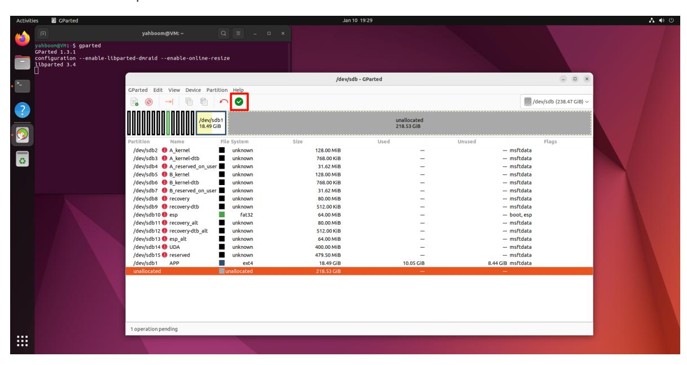

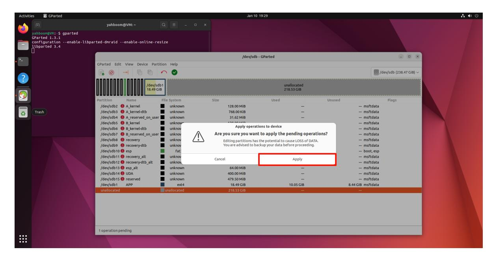

Wait for the operation to complete:

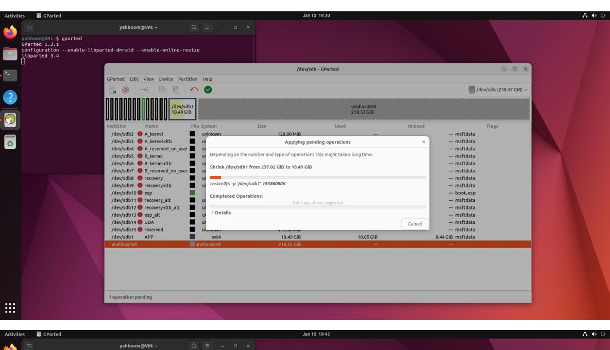

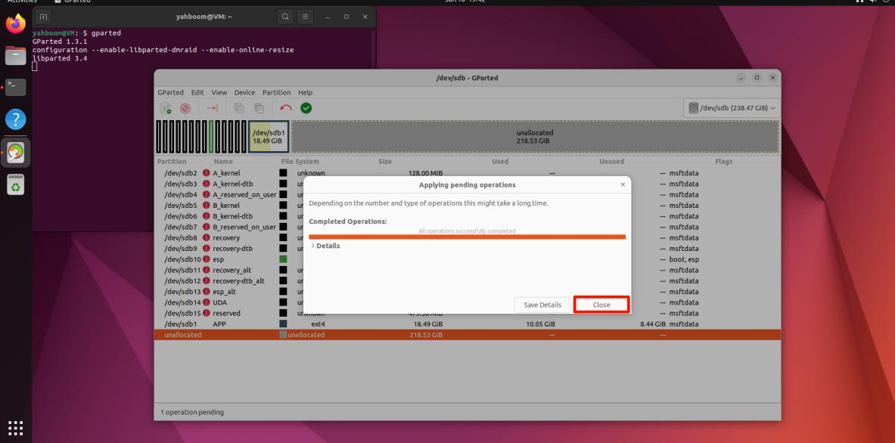

After completing the above operations, close GParted!

### <span id="page-4-0"></span>**3. Back up the SSD**

### **3.1. Check disk information**

Open the terminal and use the script to view the current disk information: the drive letter needs to correspond to the drive letter of the SSD you backed up

```
sudo bash parted_info.sh /dev/sdb
```

#### **parted\_info.sh script content**

```
#!/bin/bash
date
echo $1
sudo parted $1 <<EOF
unit s
print free
quit
EOF
```

Record the data in the figure: 41822208s

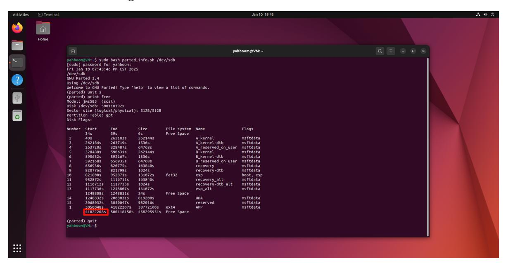

### <span id="page-5-1"></span>**3.2. Start disk backup**

Use the dd command to back up the SSD to the img file. Enter the following in the terminal:

```
sudo dd if=/dev/sdb of=Jetson_Orin_Nano_8G.img bs=512 count=41822208
```

/dev/sdb : SSD drive letter

Jetson\_Orin\_Nano\_8G.img : Image name

bs=512 : Set block size to 512 bytes

56393728 : Data queried by the script

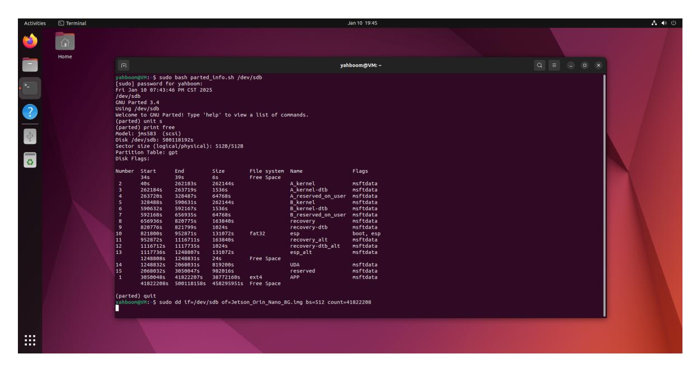

To view the dd process information, open another terminal and enter the following command:

```
sudo watch -n 3 pkill -USR1 ^dd$
```

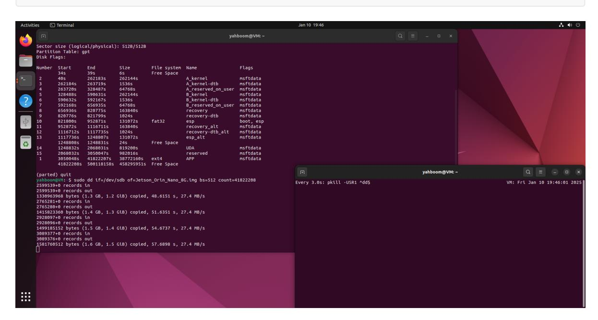

Wait for the backup to complete:

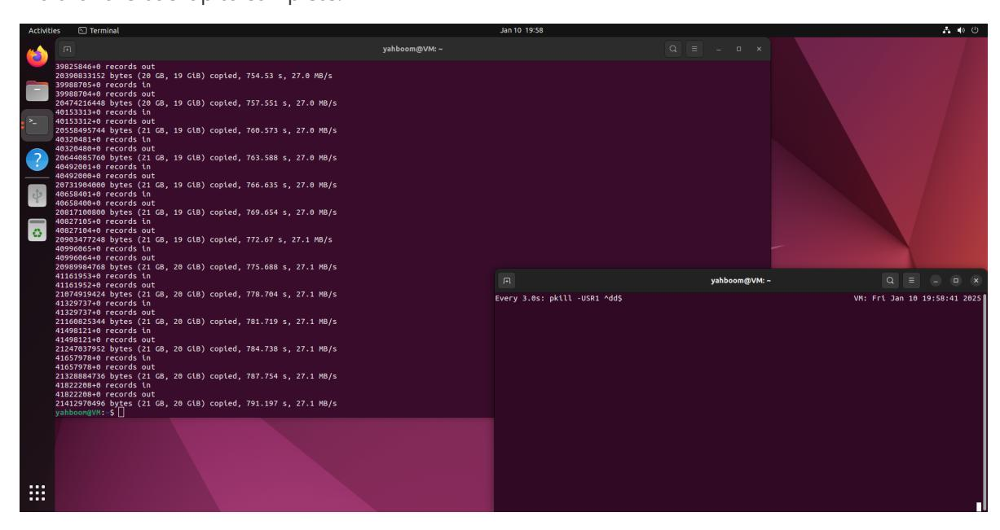

After the system backup is complete, move the backup file (Jetson\_Orin\_Nano\_8G.img) to the Windows system for use.

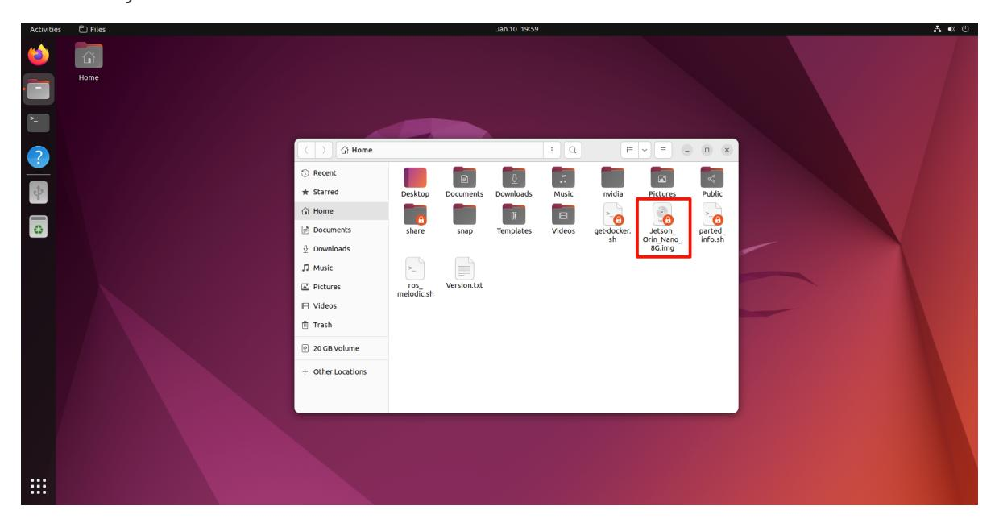