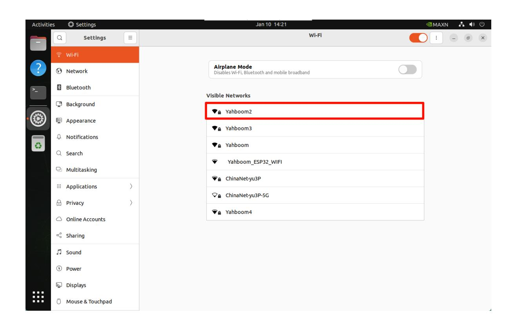
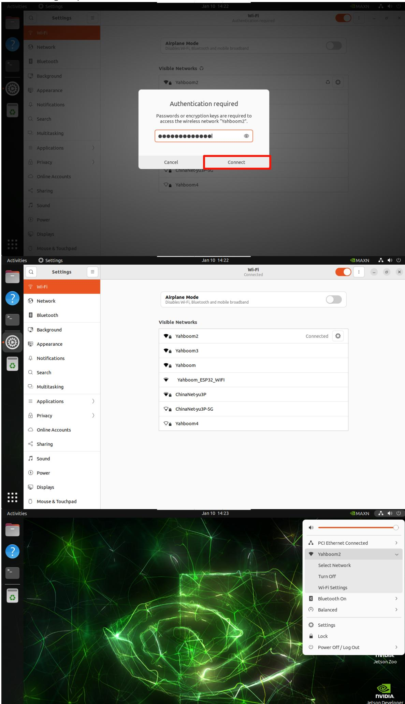
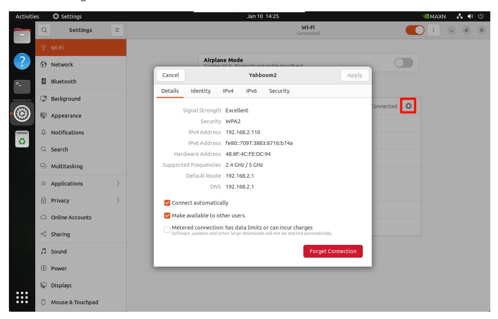
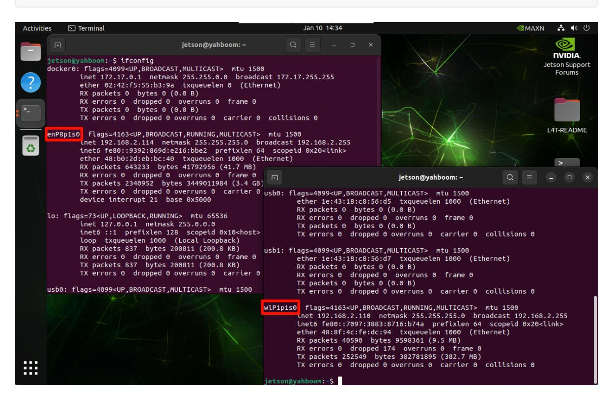
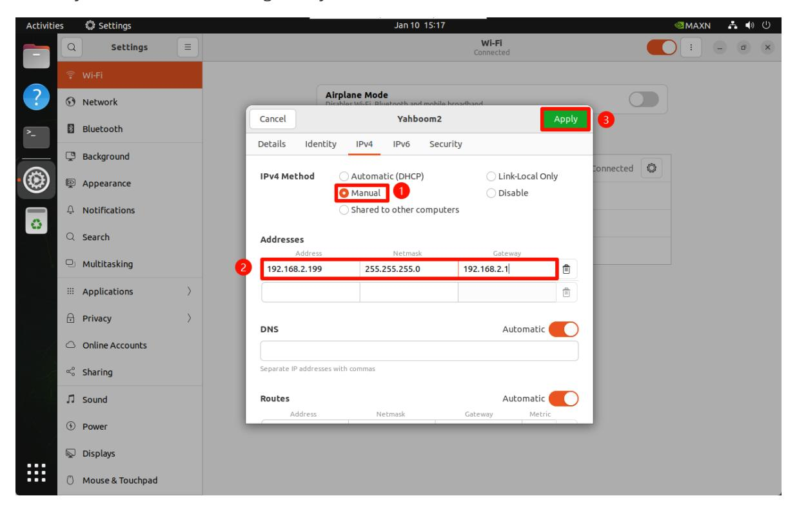
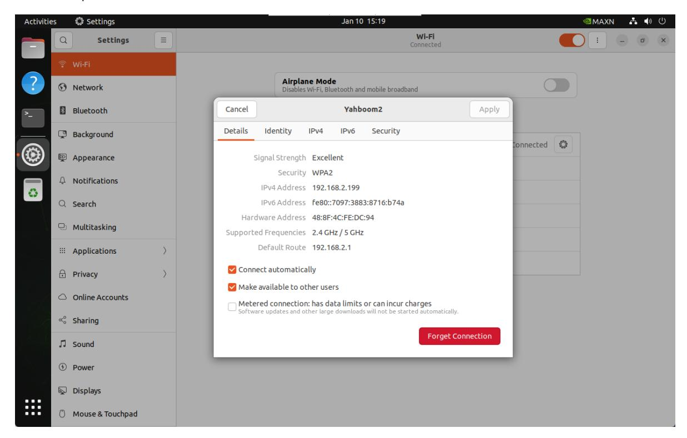
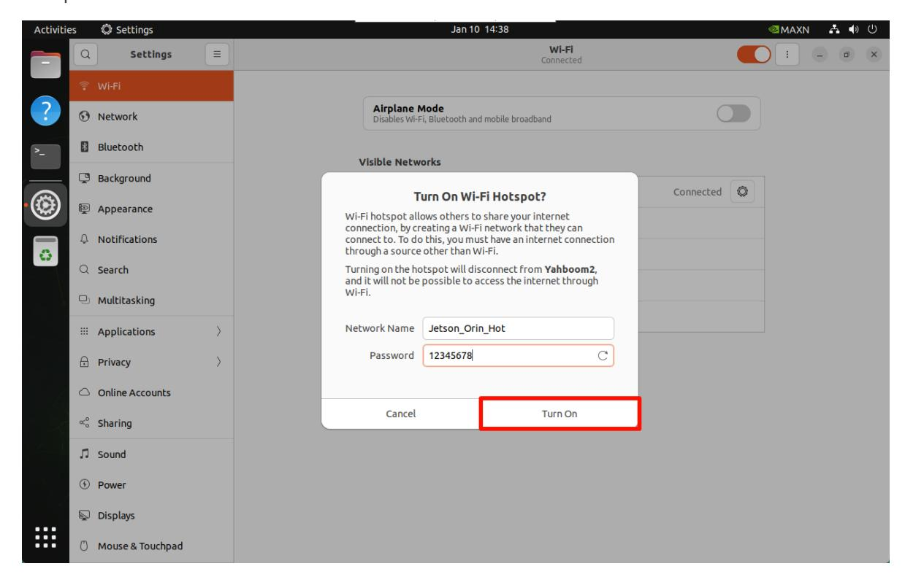

# **Network configuration**

#### **[Network configuration](#page-0-0)**

- [1. WIFI](#page-0-1) mode
  - [1.1. Connect](#page-0-2) to WiFi
  - 1.3. Set [static IP](#page-4-0)
- [2. Hotspot](#page-4-1) mode
  - [2.1. Create](#page-5-0) a hotspot
  - 2.2, Hotspot [information](#page-5-1)

WiFi and hotspot modes require the use of a wireless network card. Before making the following settings, check whether the wireless network card and antenna are installed!

It is recommended to switch networks by connecting to the display screen. Once the network is switched to a new network, the system needs to re-enable network sharing for the new network before VNC remote

### **1. WIFI mode**

### **1.1. Connect to WiFi**

Select the menu option in the upper right corner of the system desktop → WiFi options → Wi-Fi Settings:

Select the WiFi you want to connect to: If the WiFi signal is very weak, check whether the antenna is not installed or the signal in the environment is poor

After entering the password, click Connect :

### 1.2. Check WiFi information

Click the settings icon of the connected WiFi:

The terminal can use the following command to view the IP addresses of all networks: enP8p1s0 is the IP connected by the network cable, and wlP1p1s0 is the IP connected by WiFi

## ifconfig

#### **1.3. Set static IP**

Click the setting icon of the connected WiFi to modify the IPv4 option:

Address: Fill in the required fixed IP address, which needs to be in the assignable IP address range

Netmask: Fill in 255.255.255.0

Gateway: Fill in the WiFi default gateway address

After completion, reconnect WiFi to take effect:

### **2. Hotspot mode**

The wireless network card needs to support hotspot to enable hotspot mode.

Configure the hotspot mode on the desktop system. The hotspot will be automatically turned off after the system restarts. Users who need it can find the tutorial on how to start the hotspot on Ubuntu 22.04

### **2.1. Create a hotspot**

Enter WiFi settings and select Turn On Wi-Fi Hotspot...

### **2.2, Hotspot information**

Hotspot name: Jetson\_Orin\_Hot (customizable)

Hotspot password: 12345678 (customizable)

Hotspot mode default IP: 10.42.0.1

