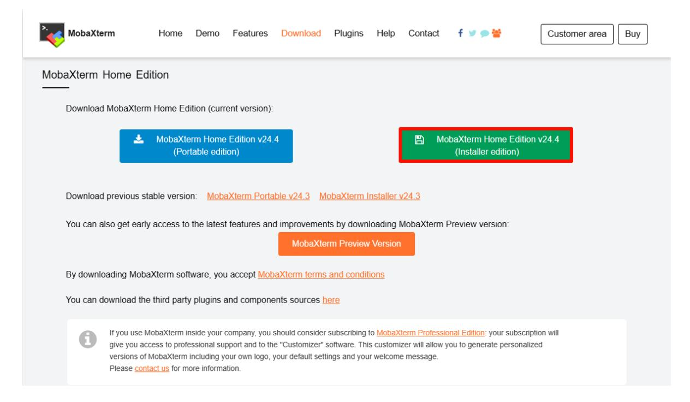
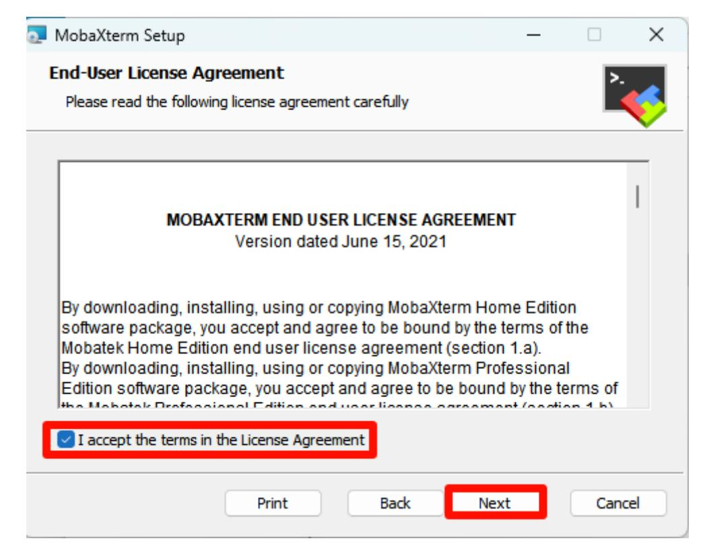
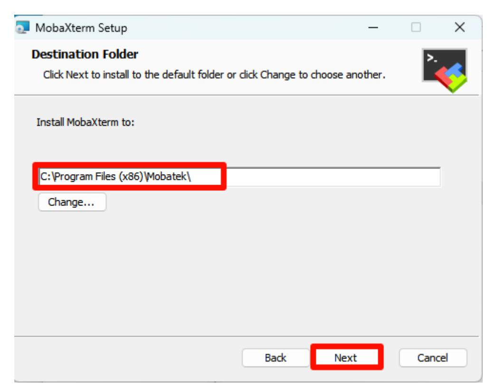
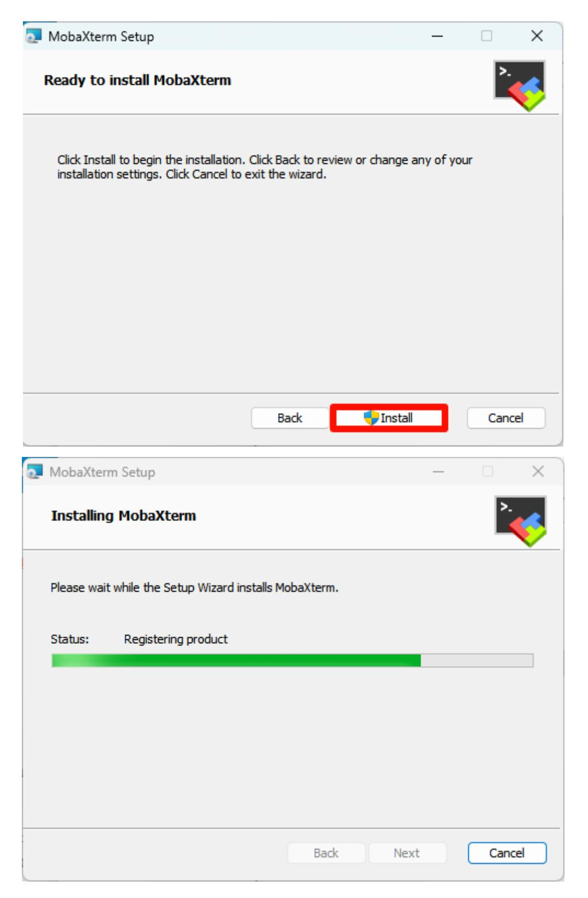
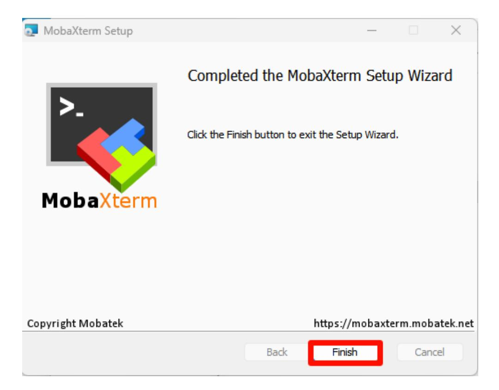
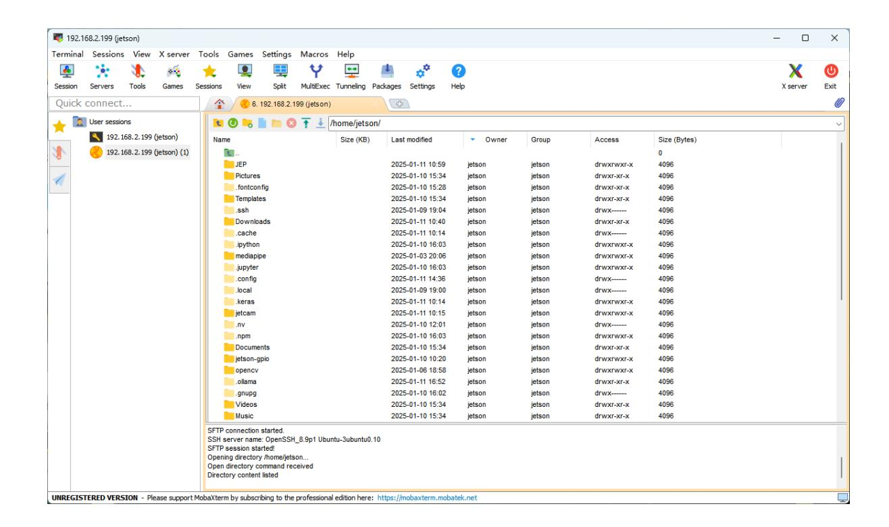

# **Remote file transfer**

#### **[Remote file transfer](#page-0-0)**

- [1. MobaXterm](#page-0-1)
- [2. MobaXterm installation](#page-0-2)
  - [2.1. Download MobaXterm](#page-0-3)
  - 2.2. Install [MobaXterm](#page-1-0)
- 3. Use [MobaXterm](#page-4-0)
- [4. MobaXterm: SFTP](#page-4-1) remote

### **1. MobaXterm**

MobaXterm is a powerful remote tool that integrates SHH, VNC, FTP and other remote tools.

## **2. MobaXterm installation**

Official website: <https://mobaxterm.mobatek.net/>

#### **2.1. Download MobaXterm**

Select the free version to download:

Select the installation version to download:

### **2.2. Install MobaXterm**

Unzip the compressed package downloaded from the official website, open the MobaXterm\_installer\_24.4.msi file to install:

Agree to the agreement:

Select the software installation location: the default location is recommended

Official installation:

Complete installation:

### **3. Use MobaXterm**

Find the MobaXterm icon on the desktop and open it:

### **4. MobaXterm: SFTP remote**

Select Session → FTP : Fill in the remote device IP and username

Default information of Jetson motherboard:

Username: jetson Password: yahboom

Note: If MobaXterm uses SSH remotely, it will automatically use SFTP remote login in the sidebar

