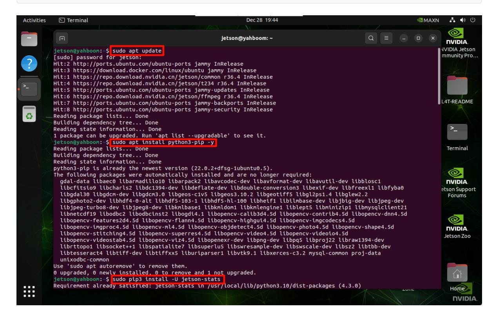
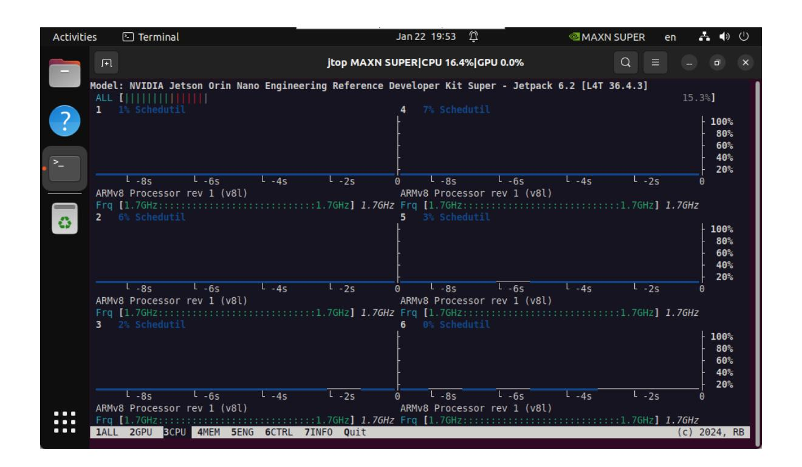

# **Jtop tool**

#### **Jtop [tool](#page-0-0)**

- <span id="page-0-0"></span>[1. Install](#page-0-1) Jtop
- 2. Best [performance](#page-0-2) mode
  - [2.2. Enable](#page-0-3) MAXN mode
  - [2.2. Enable](#page-1-0) Jetson Clocks
- <span id="page-0-1"></span>[3. Use](#page-1-1) Jtop

Jtop is a system monitoring tool developed for NVIDIA Jetson series devices. It can display the resource usage of various aspects of Jetson devices, such as CPU, GPU, memory, disk, network, etc., and can display different hardware temperatures, power consumption, frequency, etc. in real time.

# **1. Install Jtop**

```
sudo apt update
sudo apt install python3-pip -y
sudo pip3 install -U jetson-stats
```



### <span id="page-0-2"></span>**2. Best performance mode**

#### **2.2. Enable MAXN mode**

Enabling MAXN Power Mode on Jetson will ensure that all CPU and GPU cores are turned on:

```
sudo nvpmodel -m 2
```

#### <span id="page-1-0"></span>**2.2. Enable Jetson Clocks**

Enabling Jetson Clocks will ensure that all CPU and GPU cores run at maximum frequency:

```
sudo jetson_clocks
```

## <span id="page-1-1"></span>**3. Use Jtop**

Only after restarting the system can you enter the jtop command in the terminal to start the Jtop tool:

```
jtop
```

Note: The motherboard power mode must be set to MAXN to display the strongest performance parameters!




