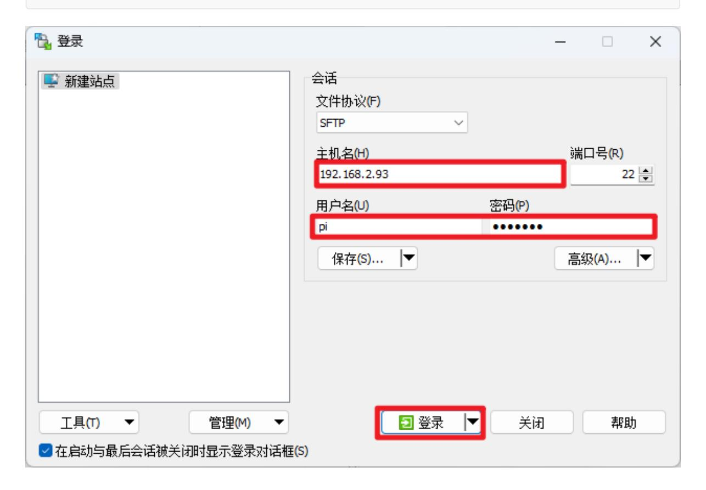
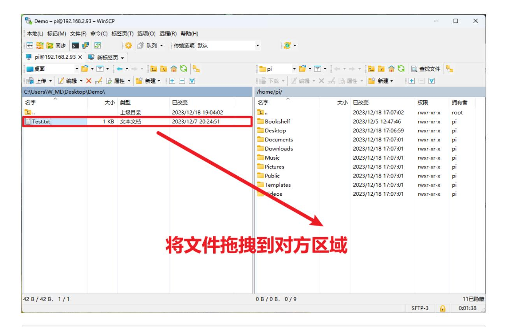
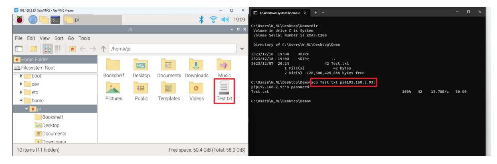
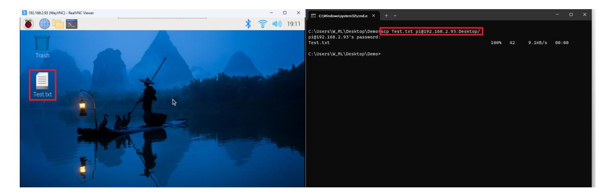
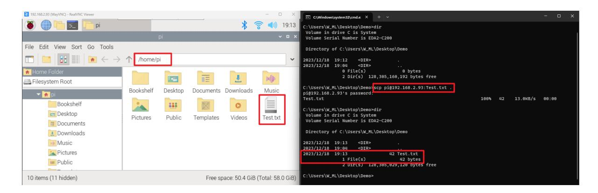

# **Transfer files remotely**

### **[Transfer files](#page-0-0) remotely**

- [1. WinSCP](#page-0-1) software
  - [Transfer](#page-1-0) files
- 2. SCP [command](#page-2-0)
  - 1.1. Copy the file to the Raspberry Pi [motherboard](#page-2-1)
  - 1.2. Copy files from the Raspberry Pi [motherboard to](#page-3-0) the current computer

It mainly introduces the use of WinSCP software to transfer files and the scp command to transfer files. The former is recommended first!

## **1. WinSCP software**

Install the WinSCP software by yourself. Here we mainly introduce how to connect to the Raspberry Pi system based on IP, username and password information.

My current login user name is pi, the password is yahboom, and the IP address is 192.168.2.93

### 继续连接未知服务器,并将其主机密钥添加到缓存中吗?

服务器的主机密钥不在缓存中。不能确保该服务器就是你想连的电脑。

#### 服务器Ed25519的密钥明细是:

算法: ssh-ed25519 255

SHA-256: AmyCUFkAYb3rKjKuYS9Jli0b39Pj03CmqWQpxokTOEk

MD5: ba:7e:d9:3a:dd:22:6c:51:ec:04:a2:37:3f:5b:68:83

如果你信任该主机,按 是。要继续连接但不把主机密钥加入缓存,按 否。要放弃连接

按 取消。

### 将密钥指纹复制到剪贴板(C)

#### Connection success interface:

## **Transfer files**

You can directly drag local files to the other party's area, so that the files can be copied; the following demonstration is to transfer the Text.txt file to the Raspberry Pi system.

You can directly select a folder on your computer and move it to the other party's area. It does not necessarily need to be done within the software!

## **2. SCP command**

Use the scp command to send files to the Raspberry Pi system through ssh. This operation does not require the use of software, just use the terminal!

My current login user name is pi, the password is yahboom, and the IP address is 192.168.2.93

## **1.1. Copy the file to the Raspberry Pi motherboard**

#### **Single file copy command: scp file name username@IP address:path**

Copy the file to the user directory: scp Test.txt pi@192.168.2.93:

Copy the file to the desktop: scp Test.txt pi@192.168.2.93:Desktop/

## **1.2. Copy files from the Raspberry Pi motherboard to the current computer**

### **Single file copy command: scp username@IP address: file name**

Copy the files in the Raspberry Pi system to the current directory of the computer: scp pi@192.168.2.93:Test.txt.

Note: The copied file should be in the user directory of the Raspberry Pi system (the copied Test.txt file should be in the pi user directory of the Raspberry Pi)

