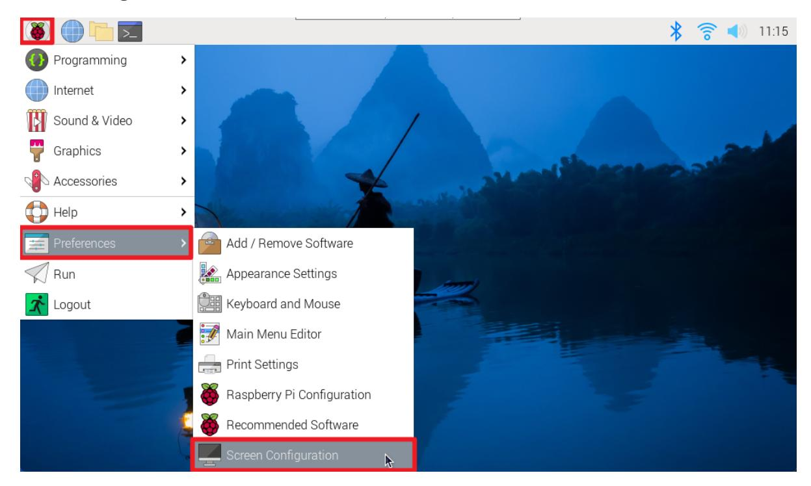
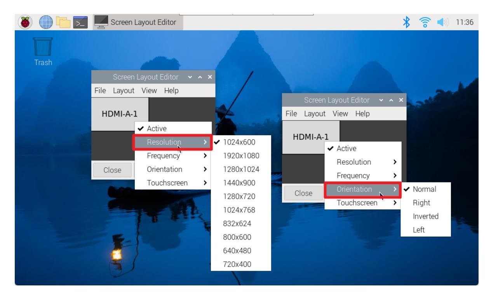
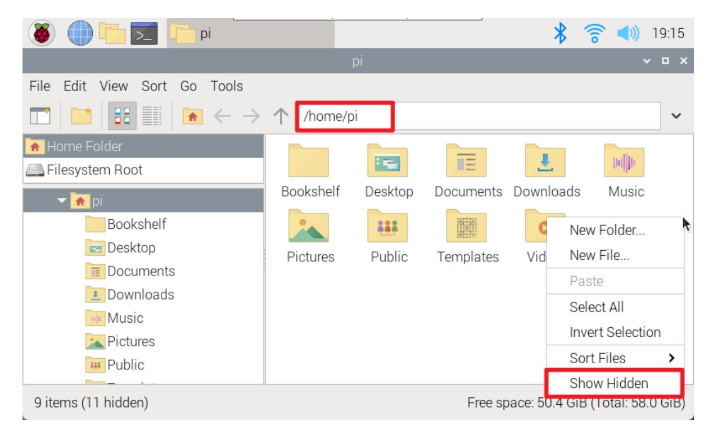
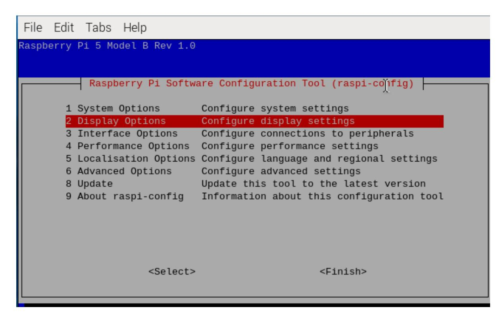

# **Set display resolution and rotation**

#### **Set [display resolution](#page-0-0) and rotation**

- [1. Display](#page-0-1) display settings
  - [1.1. System settings](#page-0-2) adjustment
  - 1.2. Modify [configuration](#page-1-0) file adjustment
- 2. VNC [remote](#page-2-0) display
  - [2.1. Graphical](#page-3-0) interface
  - [2.2. Command line](#page-3-1)

This tutorial mainly introduces the relevant settings of the Raspberry Pi motherboard system interface display:

- 1. Connect the resolution and rotation direction settings of the display screen
- 2. Resolution setting of VNC remote display when no display is connected

If the display resolution is incorrectly selected, screen blur may occur. You can set it according to the display resolution supported by the product!

# **1. Display display settings**

### **1.1. System settings adjustment**

Adjust the resolution and rotation direction of the display: applications menu → Preferences → Screen Configuration

Right-click the corresponding HDMI output interface to set the resolution, rotation direction, etc.

### **1.2. Modify configuration file adjustment**

Enter the user directory of the Raspberry Pi system, display hidden files, and then enter the .config folder to modify the wayfire.ini file

This method can customize the display resolution, position and rotation direction

Show hidden files

Enter the .config folder and modify the wayfire.ini file

## **2. VNC remote display**

Adjust the resolution displayed when remote.

When connecting to a monitor, adjusting the resolution of the VNC remote will not affect it. The displayed resolution will still be based on the resolution set by the monitor!

### **2.1. Graphical interface**

Enter Display to modify the VNC remote resolution. After modification, you need to restart the system and reconnect to VNC!

applications menu → Preferences → Raspberry Pi Configuration → Display

#### **2.2. Command line**

Use the raspi-config tool to adjust the VNC resolution.

Display Options

VNC Resolution

| ſ | R | aspberry | Pi Software       | Configuration | Tool                                      | (raspi-config) |  |
|---|---|----------|-------------------|---------------|-------------------------------------------|----------------|--|
| ı |   |          |                   |               |                                           |                |  |
| ı |   |          |                   | 640x480       |                                           |                |  |
| ı |   |          |                   | 720x480       |                                           |                |  |
| ı |   |          |                   | 800x600       |                                           |                |  |
| ı |   |          |                   | 1024x768      |                                           |                |  |
| ı |   |          |                   | 1280x720      |                                           |                |  |
| ı |   |          |                   | 1280×1024     |                                           |                |  |
| ı |   |          |                   | 1600×1200     |                                           |                |  |
| ı |   |          |                   | 1920x1080     |                                           |                |  |
| ı |   |          |                   |               |                                           |                |  |
| ı |   |          |                   |               |                                           |                |  |
| ı |   |          |                   |               |                                           |                |  |
| ı |   |          |                   |               |                                           |                |  |
|   |   |          |                   |               |                                           |                |  |
| ı |   |          | <select></select> |               | <e< th=""><th>Back&gt;</th><th></th></e<> | Back>          |  |
| 1 |   |          |                   |               |                                           |                |  |
| L |   |          |                   |               |                                           |                |  |