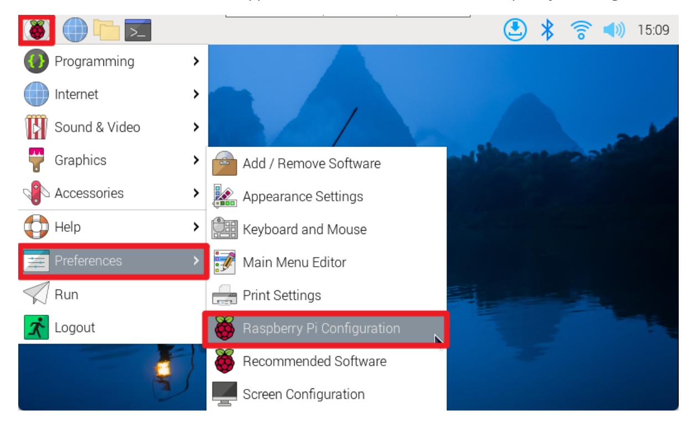
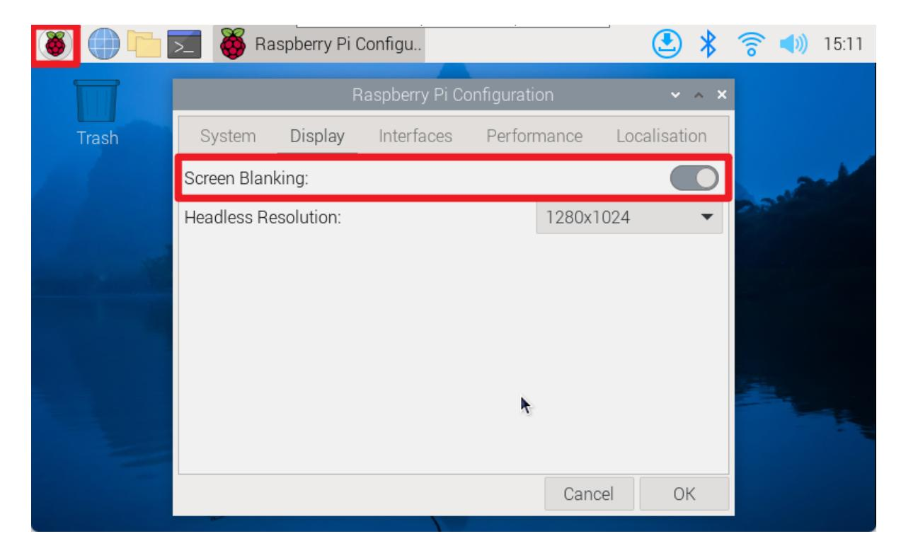
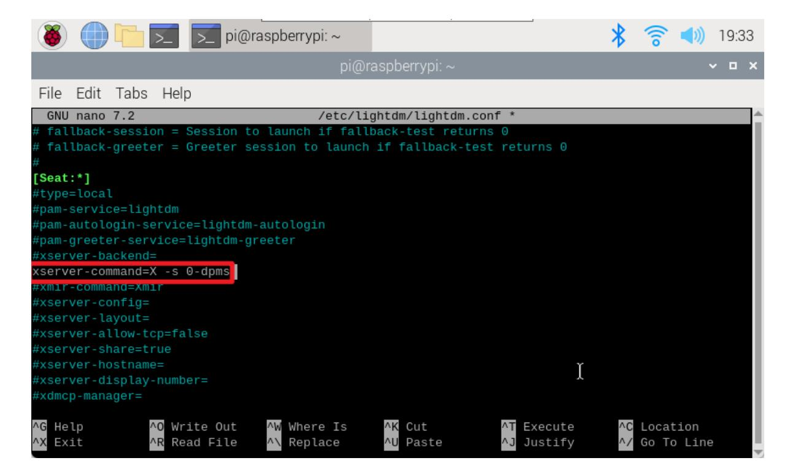

# **Set screen to sleep**

#### **Set [screen](#page-0-0) to sleep**

```
environment
Idea 1 (recommended)
    Graphical interface
        Command Line
    Restart
Idea 2
    Configuration file modification
    Restart
```

The tutorial mainly introduces how to set the screen to always be on. If the screen is turned on on the Raspberry Pi system, the default is to automatically turn off the screen after 10 minutes of no operation.

# **environment**

System: Raspberry Pi OS

<span id="page-0-3"></span><span id="page-0-2"></span><span id="page-0-1"></span>Raspbian is the old name of Raspberry Pi's official Debian-based operating system, and Raspberry Pi OS is its new name after its name change in 2020.

# **Idea 1 (recommended)**

### **Graphical interface**

Turn on automatic screen break: applications menu → Preferences → Raspberry Pi Configuration



Display → Screen Blanking: Turn on (if you need to turn off the screen blanking, just turn off the switch)



#### <span id="page-1-0"></span>**Command Line**

Use the raspi-config tool to automatically blank the screen: Display Options → Screen Blanking: enable

### <span id="page-1-1"></span>**Restart**

The modified configuration will take effect after restarting!

# <span id="page-1-2"></span>**Idea 2**

You can configure the lightdm desktop display manager to use xservice to keep the screen always on.

## **Configuration file modification**

lightdm.conf file location:/etc/lightdm

<span id="page-1-3"></span>sudo nano /etc/lightdm/lightdm.conf

Cancel the comment character # of xserver-command=X in the file and change it to xservercommand=X -s 0-dpms. After the modification is completed.

The nano editor can use the shortcut key Ctrl+W to search for keywords!

Save and exit the nano editor: press Ctrl+X, enter y, and press Enter.

Among them, -s parameter: set the screen saver not to start, 0 is the number zero, -dpms parameter: turn off power and energy-saving management.



### <span id="page-2-0"></span>**Restart**

Enter the reboot command in the terminal to restart the system, and the modified configuration file will take effect after restarting!