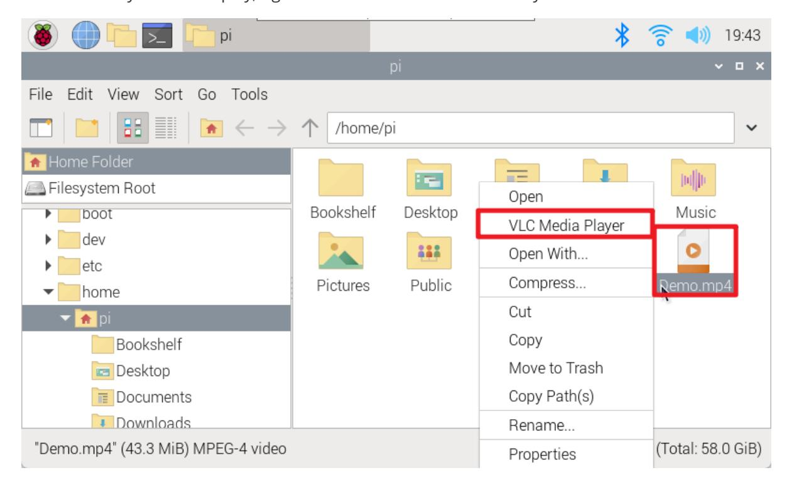

# **Play audio and video**

#### **[Play audio](#page-0-0) and video**

<span id="page-0-0"></span>[Graphical](#page-0-1) interface [Command Line](#page-0-2) Play [video](#page-0-3) Play [audio](#page-1-0)

The easiest way to play audio and video on a Raspberry Pi is to use the preinstalled VLC application;

The VLC program uses hardware acceleration and can play many popular audio and video file formats.

# <span id="page-0-1"></span>**Graphical interface**

Select the file you want to play, right-click and select "VLC Media Player"



# <span id="page-0-2"></span>**Command Line**

Note: To play audio or video from the command line, you need to enter the directory where the file is located.

### **Play video**

<span id="page-0-3"></span>vlc <video\_name>

Example: Play Test.mp4 file

vlcTest.mp4

vlc --play-and-exit <video\_name>

Example: After playing the Test.mp4 file, exit the application

```
vlc --play-and-exit Test.mp4
```

vlc --play-and-exit --fullscreen <video\_name>

Example: Play the Test.mp4 file in full screen, exit the application after playing

```
vlc --play-and-exit --fullscreen Test.mp4
```

cvlc --play-and-exit <video\_name>

Example: Play the Test.mp4 file without displaying the VLC graphical interface

```
cvlc --play-and-exit Test.mp4
```

cvlc --play-and-exit --drm-vout-display <video\_name>

Replace and <video\_name> content

Example: Video output via HDMI1

```
cvlc --play-and-exit --drm-vout-display HDMI-A-1 Test.mp4
```

Get a list of all DRM devices on the Raspberry Pi: kmsprint | grep Connector

| DRM Device            | Description                                                                                                          |
|-----------------------|----------------------------------------------------------------------------------------------------------------------|
| HDMI-A-1<br>connector | HDMI output on Raspberry Pi Zero or Raspberry Pi Model 1, 2, or 3; ** or<br>** HDMI400 output on Raspberry Pi 0 or 4 |
| HDMI-A-2<br>connector | HDMI400 output on Raspberry Pi 1 or 4                                                                                |
| DSI-1 type            | Raspberry Pi touch display                                                                                           |

### <span id="page-1-0"></span>**Play audio**

The Raspberry Pi 5 can be used normally only when an audio device is connected.

The only difference between the play audio command and the play video command is the file name: Play Test.mp3 file

```
cvlc --play-and-exit Test.mp3
```

cvlc --play-and-exit -A alsa --alsa-audio-device <video\_name>

Replace and <video\_name> content

Example: Output audio via HDMI

```
cvlc --play-and-exit -A alsa --alsa-audio-device vc4hdmi0 Test.mp3
```

Get the Raspberry Pi ALSA device: aplay -L | grep sysdefault

| ALSA Equipment                | Description                           |
|-------------------------------|---------------------------------------|
| System default: CARD=vc4hdmi0 | HDMI400 output on Raspberry Pi 0 or 4 |
| System default: CARD=vc4hdmi1 | HDMI400 output on Raspberry Pi 1 or 4 |