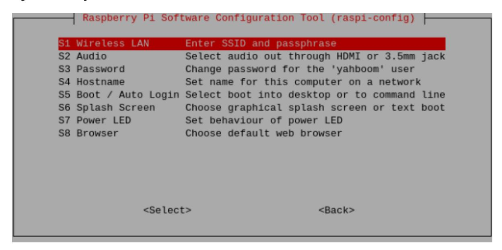
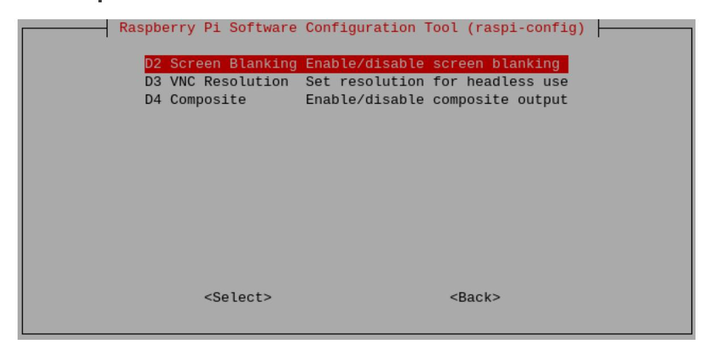
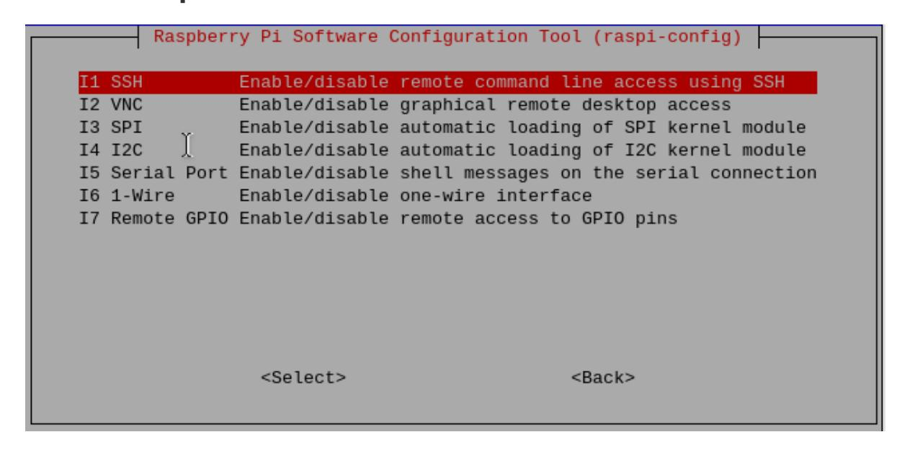
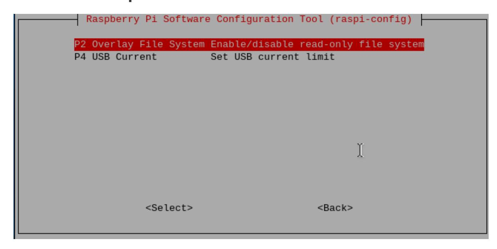
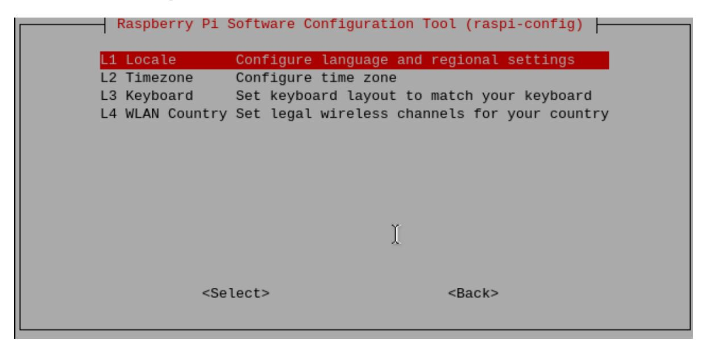
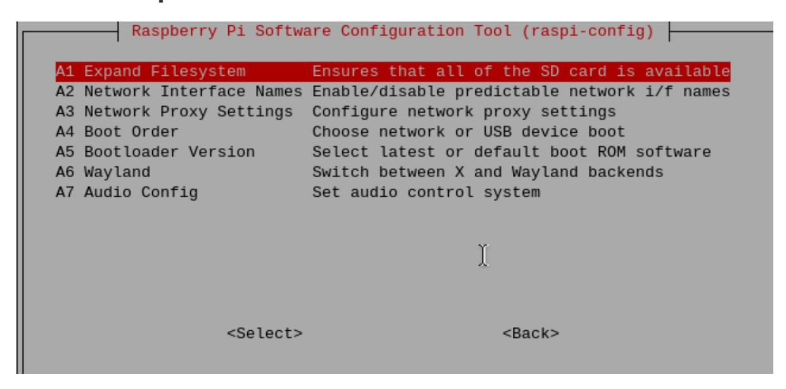
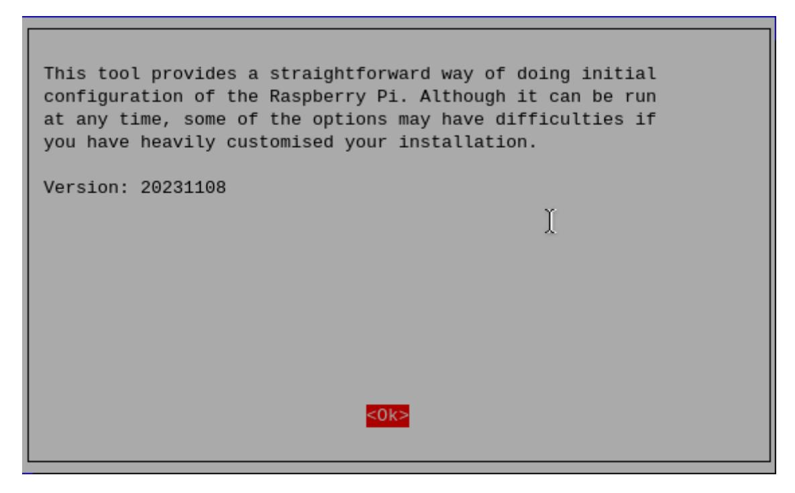

# **Introduction to raspi-config tool**

#### **[Introduction](#page-0-0) to raspi-config tool**

[Open](#page-0-1)

[Options](#page-0-2) list

[System options](#page-1-0)

Show [options](#page-2-0)

[Interface](#page-3-0) options

[Performance](#page-4-0) options

[Localization](#page-4-1) options

[advanced options](#page-5-0)

[Update](#page-5-1)

About [raspi-config](#page-6-0)

raspi-config is a pre-installed configuration tool in Raspberry Pi OS;

raspi-config provides a simple and convenient command line interface to manage the configuration of the Raspberry Pi system, allowing users to easily customize and optimize their system settings.

If you are using a Raspberry Pi desktop system, you can configure the Raspberry Pi system directly in the applications menu in the upper left corner of the desktop!

# **Open**

To open the raspi-config tool, you need to run the following command in the terminal:

sudo raspi-config

# **Options list**

Since versions of the raspi-config tool are constantly being updated, the following list of options may not be exactly the same.

| Raspberry Pi Software Configuration Tool (raspi-config) |                      |                                           |
|---------------------------------------------------------|----------------------|-------------------------------------------|
| 1                                                       | System Options       | Configure system settings                 |
| 2                                                       | Display Options      | Configure display settings                |
| 3                                                       | Interface Options    | Configure connections to peripherals      |
| 4                                                       | Performance Options  | Configure performance settings            |
| 5                                                       | Localisation Options | Configure language and regional settings  |
|                                                         | Advanced Options     |                                           |
|                                                         | Update               | Update this tool to the latest version    |
|                                                         |                      | Information about this configuration tool |
|                                                         | <select></select>    | <finish></finish>                         |

### **System options**

### **Wireless LAN**

Set wireless LAN SSID and password.

### **Audio**

Specify the audio output destination.

#### **password**

Change the "default" user password.

#### **CPU name**

Set the visible name of this Raspberry Pi on the network.

#### **Start/auto login**

Choose whether to boot to the console or desktop, and whether a login is required.

### **Initial screen**

Enable or disable the content displayed at startup. You can turn this feature on/off to observe the Raspberry Pi startup screen.

#### **Power Indicator**

Raspberry Pi 5 currently does not support changing power indicator options.

#### **Browser**

Set default browser options.

# **Show options**

#### **Screen pause**

Enable or disable screen snooze.

### **VNC Resolution**

The resolution of the remote display when there is no monitor.

#### **Compound**

Set the video output to pass through the composite video output port.

# **Interface options**

### **SSH**

Enable/disable SSH, which is remote command line access to the Raspberry Pi.

### **VNC**

Enable/disable WayVNC or RealVNC virtual network computing server.

#### **SPI**

Enable/disable automatic loading of SPI interface and SPI kernel modules.

#### **I2C**

Enable/disable automatic loading of I2C interface and I2C kernel modules.

#### **Serial port**

Enable/disable shell and kernel messages on serial connections.

### **1-Wire**

Enable/disable the Dallas 1-wire interface. This is typically used for the DS18B20 temperature sensor.

### **Remote GPIO**

Enable or disable remote access to GPIO pins.

# **Performance options**

**Overwrite file system**

Enable or disable read-only file systems.

**USB current**

Set the current output of the USB interface.

### **Localization options**

**area**

select area.

**Time zone**

Select your local time zone.

**Keyboard**

Choose a keyboard layout.

### **WLAN Country**

Set the country for your wireless network.

## **advanced options**

#### **Expand file system**

Extend SD card partition.

#### **Network interface name**

Enable or disable predictable network interface names.

#### **Network proxy settings**

Configure proxy settings for your network.

#### **Startup sequence**

Choose SD card, USB or network boot.

#### **Bootloader version**

Latest boot ROM software; revert to factory defaults if latest version causes issues.

#### **Wayland**

Use this option to switch between X11 and Wayland backends.

#### **Audio configuration**

Use this option to switch between the PulseAudio and PipeWire audio backends.

# **Update**

Update this tool to the latest version.

# **About raspi-config**

The above is an introduction to the options involved in the raspi-config tool!